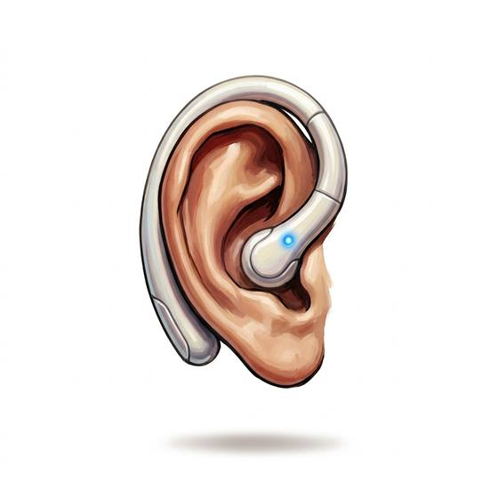

# Translation earpiece

{.illus}

*Set: Expansion*

*aka: ______________________________*

*Communication and signalling · Needs: far future · far future*

A small earpiece that listens to foreign speech and whispers a translation into the wearer's ear, then speaks the wearer's replies aloud in the other tongue through a tiny speaker. It knows every language stored in its memory and struggles with anything else. Traders, diplomats and travellers depend on it. The machine voice is flat and slightly late, which makes flattery and flirting awkward.

## Game block

- **Bonus:** +2 Language (per language) languages in its memory
- **Penalty:** −1 Charm & Seduction through a machine voice
- **Used for:** —
- **Weight:** — · **Needs:** far future · **Price:** 5 S
- **Also known as:** speech translator

## Not to be confused with

*[All-Language Translator](all-language-translator.md)*, which handles any language at all; the earpiece knows only the languages in its memory.

