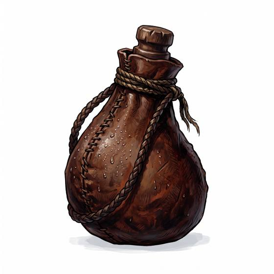

# Waterskin

{.illus}

*Set: Core*

*aka: ______________________________*

*Carrying and containers · Needs: stone tools · desert peoples*

A whole goatskin with its openings tied off, or a stitched animal bladder, holding enough water for a day or two. Desert travellers hang them from saddles, where the slow sweat through the skin keeps the water cool. It must be oiled and cared for or it cracks, and water from a new one tastes of goat.

## Game block

- **Bonus:** 0
- **Penalty:** 0
- **Used for:** —
- **Weight:** 0.8 kg · **Needs:** stone tools · **Price:** 1 S
- **Also known as:** water bag, wineskin, bota

## Not to be confused with

*[Canteen](canteen.md)*, the later hard-sided flask; a waterskin is soft, older and folds flat when empty.

