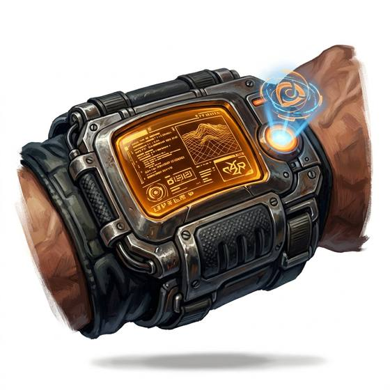

# Wrist computer

{.illus}

*Set: Expansion*

*aka: ______________________________*

*Power, electronics and computing · Needs: spaceflight · space-faring*

A tough, curved computer strapped along the forearm, its screen shining on the inner wrist or projected in the air above it. It lets soldiers, engineers and explorers check maps, messages and readings without letting go of a tool or a weapon. It survives mud, rain and hard knocks. A glance at the wrist replaces a fumble through pockets.

## Game block

- **Bonus:** +1 Computer Use hands-free use in the field
- **Penalty:** 0
- **Used for:** [Computer Use](../Skills/computer-use.md)
- **Weight:** 0.2 kg · **Needs:** spaceflight · **Price:** 20 S
- **Also known as:** wrist unit

## Not to be confused with

the *[Wrist Communicator](wrist-communicator.md)*, which is mainly for talking to others; the wrist computer is for working on the move.

