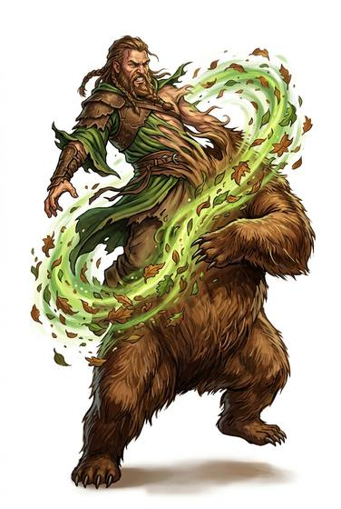

# Animal Form

{.illus}

*Set: Core*

*aka: ______________________________*

The human shape is set aside like a coat, and in its place stands a hare, a crow, a wolf or a bear. The change is the oldest of all magics and the one most told in stories. The shifter sees through animal eyes, smells what a hound smells, and has to fight to remember why they came. Some find the animal harder to leave than to enter.

A beginner has one shape, usually small, and learns it slowly. A master can be a salmon in the river, a hawk above it and a wolf on the bank. Villages have always feared the neighbour who might be the fox in the henhouse.

## Game block

- **Dice:** 3 · **Attributes:** **END**/WIS/AGI · **Mastered at:** +5 | 3
- **What it does:** take the form of animals
- **Minor → major:** one small creature → any predator
- **Cost:** 4 Energy (version I)
- **What failure looks like:** the change starts and stalls, leaving the shifter aching and unchanged. Spectacular failure: they become the wrong creature, or forget for a while that they were ever anything else.

## Not to be confused with

*[Beast Aspect](beast-aspect.md)*, which borrows one trait such as eyes or strength; and *[Monstrous Form](monstrous-form.md)*, which becomes something larger and wilder, not an ordinary animal.

## Costumes

- **Spirit:** a shaman in a pelt or feathered cloak, dancing until the animal spirit takes the body.
- **Arcane:** a studied transformation, recited from a book with a lock of fur held in the fist.
- **Mutation:** a born shapeshifter, whose change comes as naturally as sleep.
- **Curse:** an affliction that forces the change by moonlight or in anger, wanted or not.

## Relations

- **Close to:** [Beast Aspect](beast-aspect.md), [Monstrous Form](monstrous-form.md)

