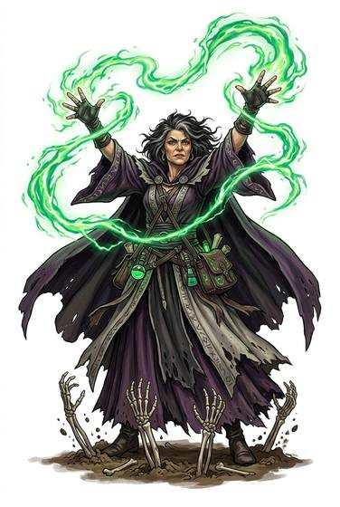

# Animate Dead

{.illus}

*Set: Expansion*

*aka: ______________________________*

The dead get up. A hand twitches, a head lifts, and the corpse climbs out of its grave to serve. At first it is only a twitch or a shuffling step. At full power whole graveyards rise, and an army of bones and rot marches behind its master.

The animated dead are mindless, slow and relentless. They feel nothing, fear nothing and obey. They also smell, draw every priest and holy warrior within miles, and turn the living against anyone who makes them. Necromancers are hated everywhere, which is why so many of them live alone in towers.

## Game block

- **Dice:** 3 · **Attributes:** **COU**/INT/WIS · **Mastered at:** +5 | 3
- **What it does:** raise corpses to serve
- **Minor → major:** a twitching hand → a horde
- **Cost:** 4 Energy (version I)
- **What failure looks like:** the corpse lies still. Spectacular failure: it rises without a master.

## Not to be confused with

*[Command Undead](command-undead.md)*, which controls undead that already exist; Animate Dead makes new ones.

## Costumes

- **Occult:** a black rite over the grave and a drop of the necromancer's blood.
- **Arcane:** a precise spell of animation drawn on the corpse in ink.

## Relations

- **Close to:** [Command Undead](command-undead.md)

