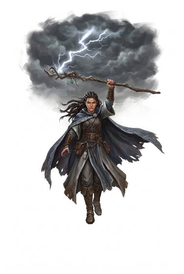

# Call Lightning

{.illus}

*Set: Expansion*

*aka: ______________________________*

A raised hand and a darkening sky. The caller summons the storm's fire and brings it down where they point: a single blinding bolt striking a tower, a tree or a charging rider. At its greatest, bolt after bolt falls across a whole battlefield, and the thunder drowns out every other sound.

It needs an open sky, and it is strongest in foul weather: a clear day gives a weak strike, a thunderstorm a terrible one. Priests of sky gods are said to have it, and so are shamans who speak with storms. Those under the bolts say the worst part is the moment before, when the hair lifts and the air smells of burning.

## Game block

- **Dice:** 3 · **Attributes:** **WIS**/COU/CHA · **Mastered at:** +5 | 3
- **What it does:** draw bolts down from the sky
- **Minor → major:** one strike → a storm of strikes
- **Cost:** 4 Energy (version I)
- **What failure looks like:** Thunder rolls, but nothing strikes. Spectacular failure: the bolt comes down near the caster instead.

## Not to be confused with

*[Lightning](lightning.md)*, which comes from the caster's own hand; and *[Weather-Working](weather-working.md)*, which brings the storm itself. Call Lightning takes the sky's bolts and aims them.

## Costumes

- **Divine:** a prayer to the sky, answered by a bolt that falls like judgement.
- **Spirit:** the thunder spirits roused by drum and song, and let loose on the enemy.

## Relations

- **Close to:** [Lightning](lightning.md), [Weather-Working](weather-working.md)

