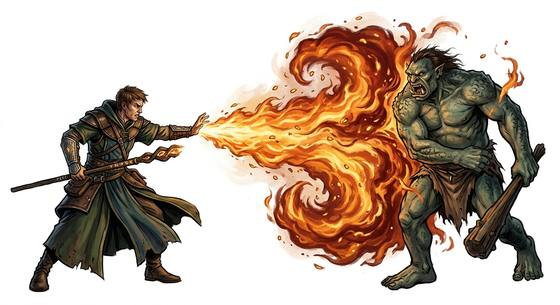

# Fire Blast

{.illus}

*Set: Core · Basic power*

*aka: ______________________________*

Flame thrown from the hand. A spark leaps to light a pipe, a jet of fire roars across a room, a ball of flame bursts among the enemy and leaves a blackened ring. At its greatest a firestorm rolls out in a wave, and whole ranks break and run from the heat.

It is the most feared of the elemental powers, and the one every child imagines. It is also the one most often regretted: fire spreads, smoke chokes, and a burning building does not care who started it. Battlefield casters learn to check the wind, and wise ones keep a bucket of water nearby.

## Game block

- **Dice:** 3 · **Attributes:** **COU**/WIS/END · **Mastered at:** +5 | 3
- **What it does:** project flame
- **Minor → major:** a spark → a firestorm
- **Cost:** 6 Energy (version I)
- **Version I, as in Basic:** A ball of flame the size of a head flies to a point in sight, up to 20 metres away, and bursts. The target takes 2d6 damage; everyone within 2 metres of it takes half, rounded down (friends too). A successful Dodge lets a person leap clear and take nothing. A shield-holder may Parry instead (half damage). Anything that burns easily (cloth, straw, dry wood) catches fire.
- **What failure looks like:** A puff of smoke and a scorch mark. Spectacular failure: the flame bursts at the caster's own hand or the wind turns it back.

## Not to be confused with

*[Fire Control](fire-control.md)*, which shapes fire already burning; Fire Blast makes its own and throws it.

## Costumes

- **Arcane:** a word and a thrust of the palm, and a ball of flame hurls forth.
- **Psionic:** a stare, and the air bursts into flame where the gaze falls.
- **Mutation:** fire breathed from the throat or spat from the palms, leaving the skin sooty.
- **Technology:** a flamethrower, plasma projector or incendiary launcher.
- **Divine:** holy fire from the sky or the upraised hands, white and gold.

## Relations

- **Close to:** [Fire Control](fire-control.md)

