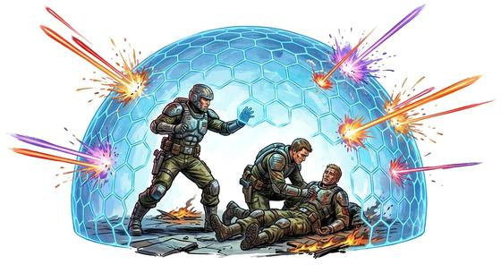

# Force Field

{.illus}

*Set: Core · Basic power*

*aka: ______________________________*

A shimmering dome or wall of force, thrown over friends or across a road. Arrows bounce, boulders stop in the air, the rain sheets down its sides. It begins as a shield for one ally and grows with mastery until it can cover a village square or a whole town under siege. Inside, people can breathe; outside, the enemy rages.

It is demanding work. Every blow against the field is felt by its maker, and a big one can bring them to their knees. Most fields keep things out in both directions, so the defenders must pick the moment to drop it and hit back.

## Game block

- **Dice:** 3 · **Attributes:** **WIS**/INT/END · **Mastered at:** +5 | 3
- **What it does:** a protective dome or wall around others
- **Minor → major:** cover one ally → a dome over a town
- **Cost:** 4 Energy (version I)
- **Version I, as in Basic:** A faint shimmer, like heat haze, around you or one person you touch. Gives Armour 3, added to any armour worn. No Dodge penalty. Lasts about ten minutes or until the fight ends. It does not help against Lightning.
- **What failure looks like:** the field forms thin and flickers out. Spectacular failure: it forms in the wrong place, trapping friends outside or enemies within.

## Not to be confused with

*[Personal Shield](personal-shield.md)*, which protects only its maker; and *[Force Constructs](force-constructs.md)*, which shapes force into objects such as ladders, bridges and hammers.

## Costumes

- **Arcane:** a circle traced in the air that swells into a dome of blue runes.
- **Psionic:** a mind pushing out, the air thickening like glass.
- **Technology:** a projector on a tripod or a vehicle, humming and flickering where things strike.
- **Divine:** a sheltering light that rises from the ground around the prayer.

## Relations

- **Close to:** [Personal Shield](personal-shield.md), [Force Constructs](force-constructs.md)

