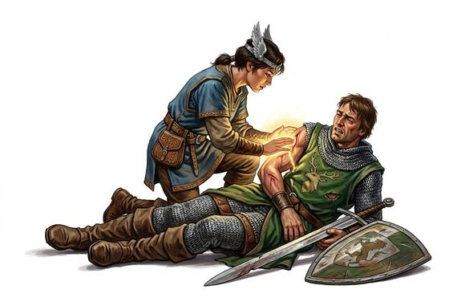

# Healing Touch

{.illus}

*Set: Core · Basic power*

*aka: ______________________________*

Wounds close beneath the hand. The healer lays a palm on a gash, breathes on a burn or speaks a prayer over a fever, and flesh draws together, colour returns, pain eases. The lightest touch stops bleeding and dulls pain. The strongest mends wounds that should have killed.

It is the most loved of powers, and the most demanded. Healers are followed by crowds, begged for miracles and blamed when they cannot give them. Temples keep their healers close, armies pay for them, and every village wishes it had one.

## Game block

- **Dice:** 3 · **Attributes:** **WIS**/CHA/END · **Mastered at:** +5 | 3
- **What it does:** heal wounds by touch, breath or prayer
- **Minor → major:** stop bleeding → mend mortal wounds
- **Cost:** 4 Energy (version I)
- **Version I, as in Basic:** Lay a hand on one living person or beast, or on yourself. Wounds close and it regains 1d6 Life, up to its Max Life. It does not cure disease or poison and cannot raise the dead. Each person can receive it only once between rests.
- **What failure looks like:** The wound stays as it was. Spectacular failure: the healing turns, and the wound worsens.

## Not to be confused with

*[Word-Healing](word-healing.md)*, which heals by spoken folk charms; and *[Healing Zone](healing-zone.md)*, which heals everyone in an area. Healing Touch works on one person, by touch.

## Costumes

- **Divine:** a prayer and a palm pressed on the wound, warm with holy light.
- **Arcane:** a spell of knitting spoken over the wound, the fingers tracing its edge.
- **Psionic:** the mind urging the body's cells to grow faster.
- **Spirit:** a healing spirit called in to breathe across the wound.
- **Technology:** a handheld device that seals flesh and speeds the body's repair.

## Relations

- **Close to:** [Word-Healing](word-healing.md), [Healing Zone](healing-zone.md)

