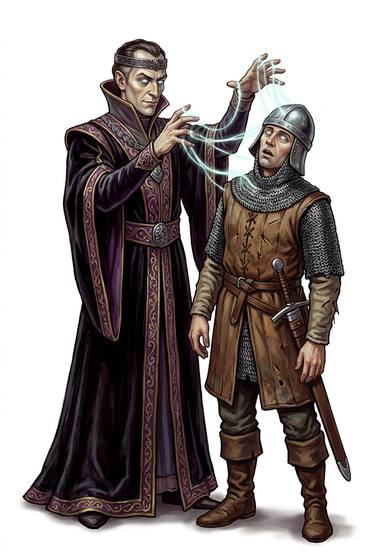

# Mind Control

{.illus}

*Set: Core*

*aka: ______________________________*

The will of another taken and held like reins. The target moves when told, speaks when told, and looks out of their own eyes as a stranger in their own body. The briefest form is a single order that is simply carried out. The deepest is a lasting puppet, walking and talking and serving for weeks without a murmur.

It is the most feared of the mind powers and the most envied. Every tyrant wants it and every court has rules against it. The controlled are not always aware, but the people who know them usually notice: a stiffness in the face, a gap in the voice, a friend who is no longer quite there.

## Game block

- **Dice:** 4 · **Attributes:** **CHA**/INT/WIS/COU · **Mastered at:** +5 | 4
- **What it does:** directly steer another's actions
- **Minor → major:** one command → a lasting puppet
- **Cost:** 6 Energy (version I)
- **What failure looks like:** The will slips free. Spectacular failure: the target knows exactly what was tried and who tried it.

## Not to be confused with

*[Commanding Voice](commanding-voice.md)*, which forces only brief obedience to a spoken order; and *[Possession](possession.md)*, where the controller leaves their own body and moves in.

## Costumes

- **Arcane:** a charm hung round the victim's neck; while it stays on, they obey.
- **Psionic:** a tightening grip of will, felt as a pressure at the back of the head.
- **Occult:** a drop of the victim's blood in a bowl of black water.
- **Technology:** a neural implant or collar through which commands are sent.

## Relations

- **Close to:** [Commanding Voice](commanding-voice.md), [Possession](possession.md)

