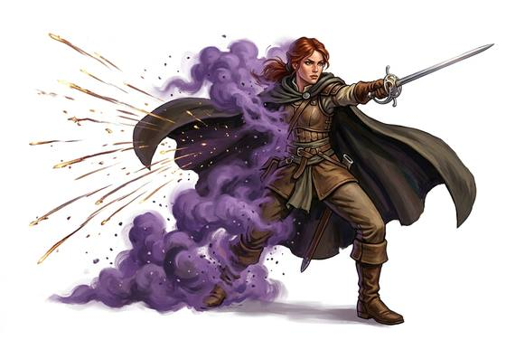

# Short Teleport

{.illus}

*Set: Core*

*aka: ______________________________*

Here, then there, with nothing in between. The teleporter blinks out of sight and appears a few paces away, or across the room, or on the other side of a battlefield. There is a soft pop of air rushing into the empty space, a smell like a struck match, and then the teleporter is somewhere else, often behind someone.

It is the favourite of duellists, escape artists and assassins. It needs a clear idea of the destination, usually a place in sight, and a poor sense of distance can leave someone in mid-air or ankle deep in a bog. Most who have it learn to glance before they go, a small habit that sharp opponents learn to watch for.

## Game block

- **Dice:** 3 · **Attributes:** **INT**/WIS/COU · **Mastered at:** +5 | 3
- **What it does:** vanish and reappear nearby
- **Minor → major:** a few paces → across a battlefield
- **Cost:** 4 Energy (version I)
- **What failure looks like:** The body flickers and stays put. Spectacular failure: the teleporter arrives somewhere other than intended, in the air, in the water, or in the middle of the enemy.

## Not to be confused with

*[Swap Places](swap-places.md)*, which trades your spot with someone else's; and *[Long Teleport](long-teleport.md)*, which reaches known places far beyond sight.

## Costumes

- **Arcane:** a snapped word, and the mage vanishes in a puff of violet smoke.
- **Psionic:** a sharp blink of will; the air ripples where the body used to be.
- **Mutation:** an inborn flicker, like a heat haze, that the teleporter barely controls when startled.
- **Occult:** a step through a sliver of somewhere else, leaving frost and a whiff of sulphur behind.

## Relations

- **Close to:** [Swap Places](swap-places.md), [Long Teleport](long-teleport.md)

