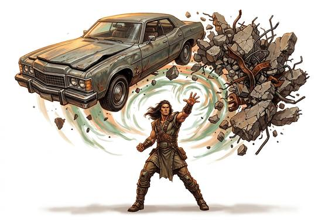

# Telekinesis

{.illus}

*Set: Core · Basic power*

*aka: ______________________________*

The power to move things without touching them. At its smallest it is a cup that slides across a table while no one watches, or a key that turns on the far side of a door. At its greatest, a boulder rises from the riverbed and goes wherever it is sent. Those who have it describe it differently: an invisible hand, a thread pulled tight, a weight they simply decide to lift. Watchers describe it the same way every time: the object moves, and it shouldn't.

It is tiring and exacting. Holding something still is harder than throwing it, and holding many small things is harder than holding one large one. Most who have the gift use it quietly, because nothing makes a crowd uneasy faster.

## Game block

- **Dice:** 3 · **Attributes:** **INT**/WIS/END · **Mastered at:** +5 | 3
- **What it does:** move objects with the mind
- **Minor → major:** nudge a cup → hurl a boulder
- **Cost:** 4 Energy (version I)
- **Version I, as in Basic:** Move one object in sight with your mind. It can weigh up to about 2 kilograms (a loaf of bread, a key ring). It moves at walking pace, up to 10 metres, while you concentrate, for about a minute. It can lift a cup, pull a lever or take a key off a hook. It cannot take something out of someone's hand and cannot be thrown as a weapon.
- **What failure looks like:** The object doesn't move, or moves wrong. Spectacular failure: it goes somewhere very inconvenient.

## Not to be confused with

*[Kinetic Push & Pull](kinetic-push-and-pull.md)*, which is one sudden shove or yank with no fine control. Telekinesis can place, hold and turn.

## Costumes

- **Psionic:** a trained mind reaching out; the forehead creases and the object trembles before it moves.
- **Arcane:** a spoken formula and a gesture; the wizard's hand mirrors the motion in the air.
- **Mutation:** an inborn gift that shows itself in a frightened child, when the crockery starts to fly.
- **Technology:** a gauntlet or implant projecting a directed field, humming faintly while it works.

## Relations

- **Close to:** [Kinetic Push & Pull](kinetic-push-and-pull.md), [Force Constructs](force-constructs.md)

