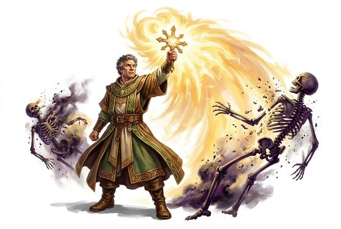

# Turn Undead

{.illus}

*Set: Core*

*aka: ______________________________*

The holy symbol comes up and the dead fall back. Skeletons shuffle away, ghouls cringe and howl, ghosts fade into the walls. At first the priest can only hold them at bay for a moment. At full power a raised hand and a word turns an entire horde to dust.

It is a power of faith and courage, and it needs both. The undead are not easily cowed, and a priest who wavers or lacks conviction will see them press forward again. In the old graveyards and haunted keeps, a good turner is worth a company of soldiers.

## Game block

- **Dice:** 2 · **Attributes:** **COU**/CHA · **Mastered at:** +5 | 2
- **What it does:** repel or destroy the undead
- **Minor → major:** push them back → destroy a horde
- **Cost:** 3 Energy (version I)
- **What failure looks like:** the undead hesitate and then come on. Spectacular failure: they are enraged rather than repelled, and the faithful is marked as a target.

## Not to be confused with

*[Radiant Smite](radiant-smite.md)*, which strikes with holy light as a weapon; Turn Undead repels and destroys only the undead.

## Costumes

- **Divine:** a raised holy symbol, a shout of faith and a wave of light that the dead cannot endure.

## Relations

- **Close to:** [Radiant Smite](radiant-smite.md)

