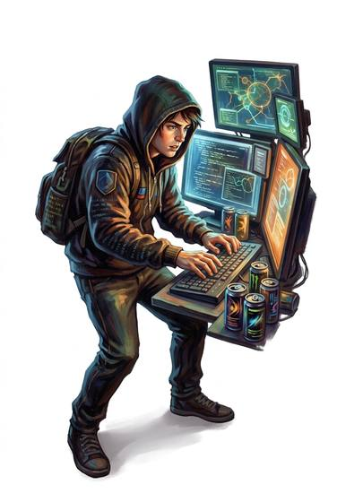

# Hacker

{.illus}

*Set: Core*

*aka: ______________________________*

A breaker into computers and networks.

## Profession lines

- **Needs:** computing
- **Life bonus:** +2
- **Core +3:** [Hacking](../Skills/hacking.md); [Programming](../Skills/programming.md); [Computer Use](../Skills/computer-use.md); [Security Systems](../Skills/security-systems.md)
- **Supporting +1:** [Cryptography](../Skills/cryptography.md); [Electronics](../Skills/electronics.md)
- **Neglected −1:** END (attribute); [Lifting & Carrying](../Skills/lifting-and-carrying.md)
- **Starting kit:** a powerful personal computer, tools and spare parts, a cheap disguise

How to use a profession: [Rules, chapter 3, step 4](../Rules/03-making-a-character.md); every profession on one page: [Professions](../professions.md).

