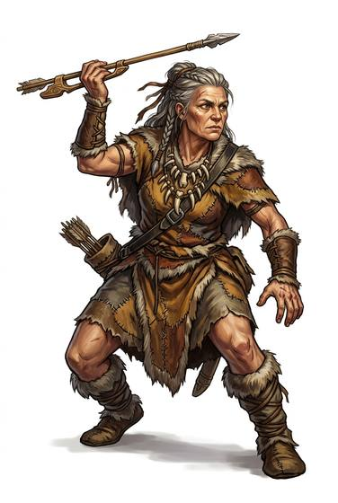

# Hunter

{.illus}

*Set: Core*

*aka: ______________________________*

Someone who feeds a family or a village by tracking and killing game.

## Profession lines

- **Needs:** stone tools
- **Life bonus:** +4
- **Core +3:** [Hunting](../Skills/hunting.md); [Tracking](../Skills/tracking.md); one of [Bows](../Weapon_Groups/bows.md), [Spears](../Weapon_Groups/spears.md), [Long Guns](../Weapon_Groups/long-guns.md), [Slings](../Weapon_Groups/slings.md); [Stealth](../Skills/stealth.md)
- **Supporting +1:** [Butchery & Preserving](../Skills/butchery-and-preserving.md); [Trapping](../Skills/trapping.md)
- **Neglected −1:** [Etiquette](../Skills/etiquette.md); [Streetwise](../Skills/streetwise.md)
- **Starting kit:** a hunting weapon, knife, snares, travel pack

How to use a profession: [Rules, chapter 3, step 4](../Rules/03-making-a-character.md); every profession on one page: [Professions](../professions.md).

