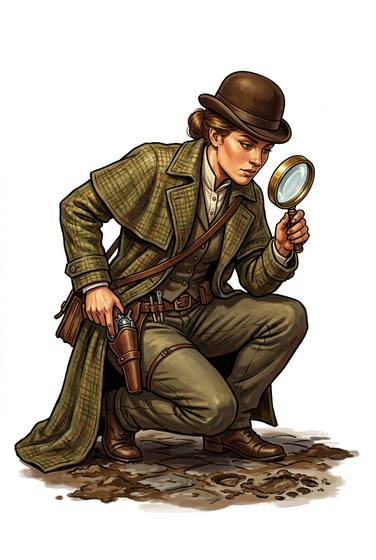

# Investigator

{.illus}

*Set: Core*

*aka: ______________________________*

A detective, inspector or inquirer who finds out what really happened.

## Profession lines

- **Needs:** writing
- **Life bonus:** +2
- **Core +3:** [Investigation](../Skills/investigation.md); [Searching](../Skills/searching.md); [Interrogation](../Skills/interrogation.md); [Insight](../Skills/insight.md)
- **Supporting +1:** one of [Knives & Daggers](../Weapon_Groups/knives-and-daggers.md), [Handguns](../Weapon_Groups/handguns.md); [Forensics](../Skills/forensics.md)
- **Neglected −1:** [Diplomacy](../Skills/diplomacy.md); [Farming](../Skills/farming.md)
- **Starting kit:** notebook, light weapon, a magnifying lens or scanner of your era

How to use a profession: [Rules, chapter 3, step 4](../Rules/03-making-a-character.md); every profession on one page: [Professions](../professions.md).

