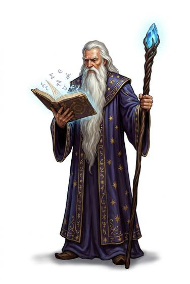

# Mage

{.illus}

*Set: Core*

*aka: ______________________________*

A wizard, witch, sorcerer or psychic: someone who studies hidden powers, where the world has them.

## Profession lines

- **Needs:** stone tools
- **Life bonus:** +2
- **Core +3:** [Arcana](../Skills/arcana.md); [Meditation & Concentration](../Skills/meditation-and-concentration.md); [Creature & Occult Lore](../Skills/creature-and-occult-lore.md); one of [Literacy (per script)](../Skills/literacy-per-script.md), [Folk Magic](../Skills/folk-magic.md)
- **Supporting +1:** [Staves](../Weapon_Groups/staves.md); [Alchemy](../Skills/alchemy.md)
- **Neglected −1:** [Brawling](../Weapon_Groups/brawling.md); [Lifting & Carrying](../Skills/lifting-and-carrying.md)
- **Starting kit:** a staff, a book or tokens of your art, robes. Starting powers: see chapter 3, step 8

How to use a profession: [Rules, chapter 3, step 4](../Rules/03-making-a-character.md); every profession on one page: [Professions](../professions.md).

