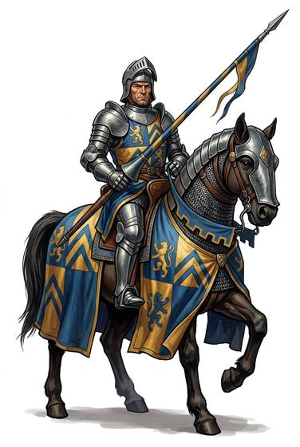

# Mounted warrior

{.illus}

*Set: Core*

*aka: ______________________________*

A fighter who lives in the saddle: knight, horse archer, cavalry trooper.

## Profession lines

- **Needs:** agriculture
- **Life bonus:** +6
- **Core +3:** [Riding](../Skills/riding.md); [Mounted Combat](../Skills/mounted-combat.md); one of [Lances](../Weapon_Groups/lances.md), [Swords](../Weapon_Groups/swords.md), [Bows](../Weapon_Groups/bows.md), [Handguns](../Weapon_Groups/handguns.md); one of [Shields](../Weapon_Groups/shields.md), [Animal Training](../Skills/animal-training.md)
- **Supporting +1:** [Animal Handling](../Skills/animal-handling.md); [Etiquette](../Skills/etiquette.md)
- **Neglected −1:** [Swimming](../Skills/swimming.md); [Hand Tools](../Skills/hand-tools.md)
- **Starting kit:** a war mount with tack, lance or bow and a sidearm, the best armour your station can pay for

How to use a profession: [Rules, chapter 3, step 4](../Rules/03-making-a-character.md); every profession on one page: [Professions](../professions.md).

