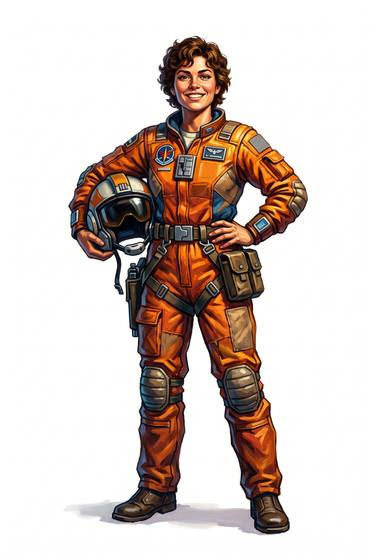

# Pilot

{.illus}

*Set: Core*

*aka: ______________________________*

A flyer of aircraft or spacecraft: airman, fighter pilot or astronaut.

## Profession lines

- **Needs:** electricity
- **Life bonus:** +2
- **Core +3:** one of [Aircraft Piloting](../Skills/aircraft-piloting.md), [Spacecraft Piloting](../Skills/spacecraft-piloting.md); [Communications & Sensors](../Skills/communications-and-sensors.md); [Weather Sense](../Skills/weather-sense.md); [Mechanics](../Skills/mechanics.md)
- **Supporting +1:** [Astrogation](../Skills/astrogation.md); [Parachuting & Gliding](../Skills/parachuting-and-gliding.md)
- **Neglected −1:** [Riding](../Skills/riding.md); [Farming](../Skills/farming.md)
- **Starting kit:** a flight suit, a sidearm, a navigation kit; access to a craft

How to use a profession: [Rules, chapter 3, step 4](../Rules/03-making-a-character.md); every profession on one page: [Professions](../professions.md).

