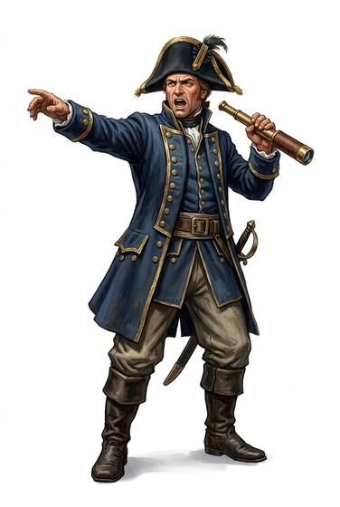

# Ship's officer

{.illus}

*Set: Core*

*aka: ______________________________*

An officer who commands, navigates and keeps discipline aboard a ship.

## Profession lines

- **Needs:** copper
- **Life bonus:** +2
- **Core +3:** [Ship Command](../Skills/ship-command.md); one of [Sea Navigation](../Skills/sea-navigation.md), [Astrogation](../Skills/astrogation.md); [Leadership](../Skills/leadership.md); one of [Sailing & Seamanship](../Skills/sailing-and-seamanship.md), [Spacecraft Piloting](../Skills/spacecraft-piloting.md)
- **Supporting +1:** [Law](../Skills/law.md); one of [Swords](../Weapon_Groups/swords.md), [Handguns](../Weapon_Groups/handguns.md), [Energy Weapons](../Weapon_Groups/energy-weapons.md)
- **Neglected −1:** [Riding](../Skills/riding.md); [Farming](../Skills/farming.md)
- **Starting kit:** an officer's uniform, a sidearm, navigation instruments of your era

How to use a profession: [Rules, chapter 3, step 4](../Rules/03-making-a-character.md); every profession on one page: [Professions](../professions.md).

