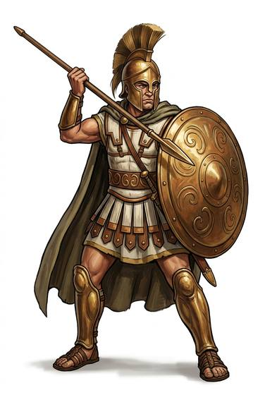
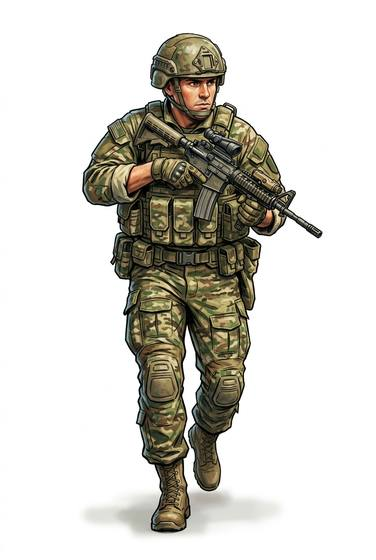

# Soldier

{.illus} {.illus}

*Set: Core*

*aka: ______________________________*

A trained fighter in an army or militia, who fights in ranks and follows orders.

## Profession lines

- **Needs:** stone tools
- **Life bonus:** +6
- **Core +3:** one of [Spears](../Weapon_Groups/spears.md), [Polearms](../Weapon_Groups/polearms.md), [Swords](../Weapon_Groups/swords.md), [Bows](../Weapon_Groups/bows.md), [Crossbows](../Weapon_Groups/crossbows.md), [Black-Powder Guns](../Weapon_Groups/black-powder-guns.md), [Long Guns](../Weapon_Groups/long-guns.md), [Automatic Weapons](../Weapon_Groups/automatic-weapons.md), [Energy Weapons](../Weapon_Groups/energy-weapons.md); [Formation Fighting](../Skills/formation-fighting.md); END (attribute); one of [Shields](../Weapon_Groups/shields.md), [Thrown Weapons](../Weapon_Groups/thrown-weapons.md)
- **Supporting +1:** [Military Tactics](../Skills/military-tactics.md); [First Aid](../Skills/first-aid.md)
- **Neglected −1:** [Research](../Skills/research.md); [Etiquette](../Skills/etiquette.md)
- **Starting kit:** your army's weapon and a sidearm, the armour your army issues, a shield if your era uses one, field pack

How to use a profession: [Rules, chapter 3, step 4](../Rules/03-making-a-character.md); every profession on one page: [Professions](../professions.md).

