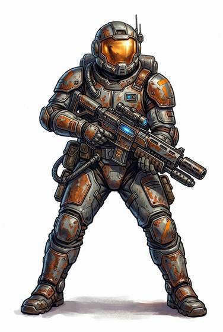

# Space trooper

{.illus}

*Set: Core*

*aka: ______________________________*

A soldier of the star age, trained to fight in armour and vacuum.

## Profession lines

- **Needs:** spaceflight
- **Life bonus:** +6
- **Core +3:** [Energy Weapons](../Weapon_Groups/energy-weapons.md); [Powered Armour](../Skills/powered-armour.md); [Low & Zero Gravity](../Skills/low-and-zero-gravity.md); [Environment Suits](../Skills/environment-suits.md)
- **Supporting +1:** [Military Tactics](../Skills/military-tactics.md); [Communications & Sensors](../Skills/communications-and-sensors.md)
- **Neglected −1:** [Diplomacy](../Skills/diplomacy.md); [Research](../Skills/research.md)
- **Starting kit:** an energy rifle and sidearm, combat armour with a sealed suit, field pack

How to use a profession: [Rules, chapter 3, step 4](../Rules/03-making-a-character.md); every profession on one page: [Professions](../professions.md).

