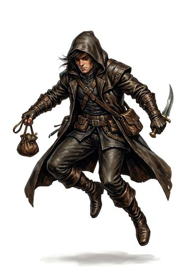

# Thief

{.illus}

*Set: Core*

*aka: ______________________________*

A burglar, pickpocket or cat burglar who takes what isn't theirs.

## Profession lines

- **Needs:** agriculture
- **Life bonus:** +4
- **Core +3:** [Stealth](../Skills/stealth.md); [Sleight of Hand](../Skills/sleight-of-hand.md); one of [Lockpicking](../Skills/lockpicking.md), [Traps](../Skills/traps.md); [Climbing](../Skills/climbing.md)
- **Supporting +1:** [Knives & Daggers](../Weapon_Groups/knives-and-daggers.md); [Streetwise](../Skills/streetwise.md)
- **Neglected −1:** [Law](../Skills/law.md); [Etiquette](../Skills/etiquette.md)
- **Starting kit:** a knife, lock picks (iron era and later), dark clothes, a grapnel and cord

How to use a profession: [Rules, chapter 3, step 4](../Rules/03-making-a-character.md); every profession on one page: [Professions](../professions.md).

