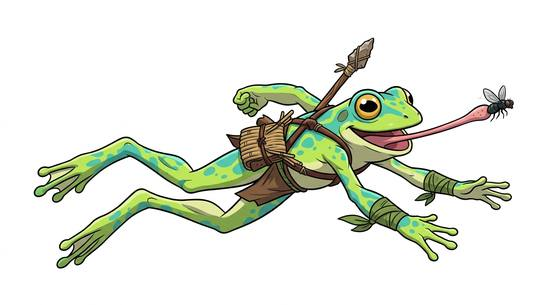

# Frog-folk

{.illus}

*Set: Core*

*aka: ______________________________*

*Family: [Amphibian](../Species_Families/amphibian.md)*

The great, croaking, leaping frog and toad peoples of marsh, riverbank and jungle. They have wide mouths, bulging eyes, moist skin that drinks water and powerful hind legs that can throw them clear over a fence or a foe. Many can snatch a fly, or a purse, with a sticky tongue. Their throats swell with song on warm evenings.

There are many kinds. Toads are squat and warty and taste foul to predators; tree-frog folk climb with sticky toes and wear bright colours; tiny, vivid, poisonous folk are best left untouched. Some are merchants and wanderers, some gourmands, some gloomy but loyal marsh-dwellers. Others see them as comic until they watch one leap.

## Not to be confused with

the *[salamander-kind](amphibian-salamander-kind.md)*, which walks and regrows limbs; frog-folk leap.

## What sets this species apart

The classic frog and toad leapers, even stronger jumpers than the family norm.

## Breeds and races

Each block below is one set of numbers; breeds that share every number share a block (Species rules, rule 9). Attributes are final modifiers, the size trade-off included. Skills, powers and weapon groups are final levels after the family, species and breed layers.

### No. 149 Frog-folk *(genres: beast-folk: scales, feathers and shells; starter)*

- **Size:** small · **Body:** biped+tailless
- **What it's like:** Small, springy frog people who leap far, swim well and snatch with tongues. (looks like: frog; good at: swimming, speed and agility, wilderness)
- **Attributes:** STR −2 AGI +2 END +1 CHA −1
- **Skills:** [Jumping](../Skills/jumping.md) +3, [Swimming](../Skills/swimming.md) +3, [Diving](../Skills/diving.md) +2, [Survival: Jungle & Swamp](../Skills/survival-jungle-and-swamp.md) +2, [Camouflage](../Skills/camouflage.md) +1, Endurance (attribute) −1, [Survival: Desert](../Skills/survival-desert.md) −3
- **Powers:** [Water Breathing](../Powers/water-breathing.md) 2
- **Natural attacks:** tongue 1d6
- **For the Game Master only, this race as an NPC guard or soldier (not your character's numbers):** Attack 14 · Parry 11 · Dodge 11 · Damage longsword 1d6+1; tongue 1d6 · Armour 2 · Life 16 · Threat 1 ([Bestiary roles](../bestiary.md))
- *Why:* Camouflaged skin and a sticky tongue strike.
- *Note:* Camouflage here is natural colouring (skill), not active colour change. The tongue strike is its tongue attack.

### No. 150 Toad-folk *(genres: beast-folk: scales, feathers and shells)*

- **Size:** medium · **Body:** biped+tailless
- **What it's like:** Warty, poison-skinned toad-folk, slower than frogs but tougher and better at burrowing. (looks like: toad; good at: toughness, swimming, wilderness)
- **Attributes:** END +2 CHA −1
- **Skills:** [Swimming](../Skills/swimming.md) +3, [Diving](../Skills/diving.md) +2, [Jumping](../Skills/jumping.md) +2, [Survival: Jungle & Swamp](../Skills/survival-jungle-and-swamp.md) +2, Endurance (attribute) −1, [Survival: Desert](../Skills/survival-desert.md) −3
- **Powers:** [Water Breathing](../Powers/water-breathing.md) 2, [Burrowing](../Powers/burrowing.md) 1, [Poison Touch](../Powers/poison-touch.md) 1
- **For the Game Master only, this race as an NPC guard or soldier (not your character's numbers):** Attack 14 · Parry 11 · Dodge 8 · Damage longsword 1d6+2 · Armour 2 · Life 19 · Threat 1 ([Bestiary roles](../bestiary.md))
- *Why:* Stockier, slower-leaping toads with mildly toxic warty skin that burrow for moisture.
- *Note:* Poison Touch is skin secretion, on contact.

### Tree frog-folk *(NPC only)*

- **Size:** small · **Body:** biped+tailless
- **Attributes:** STR −2 AGI +2 END +1 CHA −1
- **Skills:** [Jumping](../Skills/jumping.md) +3, [Swimming](../Skills/swimming.md) +3, [Diving](../Skills/diving.md) +2, [Survival: Jungle & Swamp](../Skills/survival-jungle-and-swamp.md) +2, [Climbing](../Skills/climbing.md) +1, Endurance (attribute) −1, [Survival: Desert](../Skills/survival-desert.md) −3
- **Powers:** [Wall Walking](../Powers/wall-walking.md) 2, [Water Breathing](../Powers/water-breathing.md) 2
- **For the Game Master only, this race as an NPC guard or soldier (not your character's numbers):** Attack 14 · Parry 11 · Dodge 11 · Damage longsword 1d6+1 · Armour 2 · Life 16 · Threat 1 ([Bestiary roles](../bestiary.md))
- *Why:* Sticky toe pads for canopy life.

### Poison dart frog-folk *(NPC only)*

- **Size:** small · **Body:** biped+tailless
- **Attributes:** STR −2 AGI +2 END −1 CHA −1
- **Skills:** [Jumping](../Skills/jumping.md) +3, [Swimming](../Skills/swimming.md) +3, [Diving](../Skills/diving.md) +2, [Survival: Jungle & Swamp](../Skills/survival-jungle-and-swamp.md) +2, Endurance (attribute) −1, [Survival: Desert](../Skills/survival-desert.md) −3
- **Powers:** [Poison Touch](../Powers/poison-touch.md) 2, [Water Breathing](../Powers/water-breathing.md) 2
- **For the Game Master only, this race as an NPC guard or soldier (not your character's numbers):** Attack 14 · Parry 11 · Dodge 11 · Damage longsword 1d6+1 · Armour 2 · Life 14 · Threat 1 ([Bestiary roles](../bestiary.md))
- *Why:* Skin so toxic they are dangerous to touch.
- *Note:* Poison Touch is skin secretion, on contact.

### Toad-folk wanderer *(NPC only)*

- **Size:** medium · **Body:** biped
- **Attributes:** END +2 CHA −1
- **Skills:** [Swimming](../Skills/swimming.md) +3, [Diving](../Skills/diving.md) +2, [Jumping](../Skills/jumping.md) +2, [Survival: Jungle & Swamp](../Skills/survival-jungle-and-swamp.md) +2, [Wayfinding](../Skills/wayfinding.md) +1, Endurance (attribute) −1, [Survival: Desert](../Skills/survival-desert.md) −3
- **Powers:** [Water Breathing](../Powers/water-breathing.md) 2
- **For the Game Master only, this race as an NPC guard or soldier (not your character's numbers):** Attack 14 · Parry 11 · Dodge 8 · Damage longsword 1d6+2 · Armour 2 · Life 19 · Threat 1 ([Bestiary roles](../bestiary.md))
- *Why:* Squat, slower-leaping toads with a wandering hermit-trader way.

### No. 151 Gourmand frog-folk *(genres: beast-folk: scales, feathers and shells)*

- **Size:** small · **Body:** biped
- **What it's like:** Small, food-obsessed frog-folk who hop everywhere chasing the next great meal. (looks like: frog; good at: swimming, speed and agility, making and fixing)
- **Attributes:** STR −2 AGI +2 END +1 CHA −1
- **Skills:** [Jumping](../Skills/jumping.md) +3, [Swimming](../Skills/swimming.md) +3, [Cooking](../Skills/cooking.md) +2, [Diving](../Skills/diving.md) +2, [Survival: Jungle & Swamp](../Skills/survival-jungle-and-swamp.md) +2, Endurance (attribute) −1, [Survival: Desert](../Skills/survival-desert.md) −3
- **Powers:** [Water Breathing](../Powers/water-breathing.md) 2
- **For the Game Master only, this race as an NPC guard or soldier (not your character's numbers):** Attack 14 · Parry 11 · Dodge 11 · Damage longsword 1d6+1 · Armour 2 · Life 16 · Threat 1 ([Bestiary roles](../bestiary.md))
- *Why:* A people whose whole life turns on food.

### No. 152 Warty swamp folk *(genres: space opera: beast-like aliens)*

- **Size:** medium · **Body:** biped
- **What it's like:** Warty, wide-mouthed swamp-dwellers perfectly at home in the muck and water. (looks like: toad; good at: swimming, wilderness)
- **Attributes:** AGI +1 END +1 CHA −1
- **Skills:** [Jumping](../Skills/jumping.md) +3, [Survival: Jungle & Swamp](../Skills/survival-jungle-and-swamp.md) +3, [Swimming](../Skills/swimming.md) +3, [Diving](../Skills/diving.md) +2, Endurance (attribute) −1, [Survival: Desert](../Skills/survival-desert.md) −3
- **Powers:** [Water Breathing](../Powers/water-breathing.md) 2
- **For the Game Master only, this race as an NPC guard or soldier (not your character's numbers):** Attack 14 · Parry 11 · Dodge 9 · Damage longsword 1d6+2 · Armour 2 · Life 18 · Threat 1 ([Bestiary roles](../bestiary.md))
- *Why:* Even more at home in swamps.

### No. 153 Calm toad-skinned folk *(genres: space opera: beast-like aliens)*

- **Size:** medium · **Body:** biped
- **What it's like:** Calm, patient toad-skinned folk who need to keep their skin damp to feel right. (looks like: toad; good at: swimming, wilderness)
- **Attributes:** AGI +1 END +1 WIS +1 CHA −1
- **Skills:** [Jumping](../Skills/jumping.md) +3, [Swimming](../Skills/swimming.md) +3, [Diving](../Skills/diving.md) +2, [Survival: Jungle & Swamp](../Skills/survival-jungle-and-swamp.md) +2, [Composure](../Skills/composure.md) +1, [Meditation & Concentration](../Skills/meditation-and-concentration.md) +1, Endurance (attribute) −1, [Survival: Desert](../Skills/survival-desert.md) −3
- **Powers:** [Water Breathing](../Powers/water-breathing.md) 2
- **For the Game Master only, this race as an NPC guard or soldier (not your character's numbers):** Attack 14 · Parry 11 · Dodge 9 · Damage longsword 1d6+2 · Armour 2 · Life 18 · Threat 1 ([Bestiary roles](../bestiary.md))
- *Why:* Calm, patient temperament.
- *Note:* Needing moist skin is already covered by the family's desert penalty.

### Rubbery entertainer folk *(NPC only)*

- **Size:** medium · **Body:** biped
- **Attributes:** AGI +1 END +1
- **Skills:** [Jumping](../Skills/jumping.md) +3, [Swimming](../Skills/swimming.md) +3, [Diving](../Skills/diving.md) +2, [Survival: Jungle & Swamp](../Skills/survival-jungle-and-swamp.md) +2, [Acting](../Skills/acting.md) +1, [Singing](../Skills/singing.md) +1, Endurance (attribute) −1, [Survival: Desert](../Skills/survival-desert.md) −3
- **Powers:** [Water Breathing](../Powers/water-breathing.md) 2
- **For the Game Master only, this race as an NPC guard or soldier (not your character's numbers):** Attack 14 · Parry 11 · Dodge 9 · Damage longsword 1d6+2 · Armour 2 · Life 18 · Threat 1 ([Bestiary roles](../bestiary.md))
- *Why:* Elastic faces capable of extreme expression, in an entertainer culture.

### Small green shock-trooper *(NPC only)*

- **Size:** small · **Body:** biped
- **Attributes:** STR −2 AGI +2 CHA −1
- **Skills:** [Jumping](../Skills/jumping.md) +3, [Swimming](../Skills/swimming.md) +3, [Diving](../Skills/diving.md) +2, [Survival: Jungle & Swamp](../Skills/survival-jungle-and-swamp.md) +2, [Formation Fighting](../Skills/formation-fighting.md) +1, Endurance (attribute) −1, [Survival: Desert](../Skills/survival-desert.md) −3
- **Powers:** [Water Breathing](../Powers/water-breathing.md) 2
- **For the Game Master only, this race as an NPC guard or soldier (not your character's numbers):** Attack 14 · Parry 11 · Dodge 11 · Damage longsword 1d6+1 · Armour 2 · Life 15 · Threat 1 ([Bestiary roles](../bestiary.md))
- *Why:* Bred for mass warfare; individual weakness is an attribute matter.

### Hardy frontier frog-folk *(NPC only)*

- **Size:** medium · **Body:** biped
- **Attributes:** AGI +1 END +2 CHA −1
- **Skills:** [Jumping](../Skills/jumping.md) +3, [Swimming](../Skills/swimming.md) +3, [Diving](../Skills/diving.md) +2, [Survival: Jungle & Swamp](../Skills/survival-jungle-and-swamp.md) +2, [Pain Tolerance](../Skills/pain-tolerance.md) +1, [Survival: Desert](../Skills/survival-desert.md) −3
- **Powers:** [Water Breathing](../Powers/water-breathing.md) 2
- **For the Game Master only, this race as an NPC guard or soldier (not your character's numbers):** Attack 14 · Parry 11 · Dodge 9 · Damage longsword 1d6+2 · Armour 2 · Life 19 · Threat 1 ([Bestiary roles](../bestiary.md))
- *Why:* Resilient frontier guards, tougher than the family norm.

### No. 154 Dual-cognition amphibian folk *(genres: space opera: beast-like aliens)*

- **Size:** medium · **Body:** biped
- **What it's like:** Amphibian folk with two working minds at once and a feel for the ground's tremors. (looks like: frog; good at: swimming, knowledge, keen senses)
- **Attributes:** AGI +1 END +1 INT +1 CHA −1
- **Skills:** [Jumping](../Skills/jumping.md) +3, [Swimming](../Skills/swimming.md) +3, [Diving](../Skills/diving.md) +2, [Meditation & Concentration](../Skills/meditation-and-concentration.md) +2, [Survival: Jungle & Swamp](../Skills/survival-jungle-and-swamp.md) +2, Endurance (attribute) −1, [Survival: Desert](../Skills/survival-desert.md) −3
- **Powers:** [Water Breathing](../Powers/water-breathing.md) 2, [Enhanced Senses](../Powers/enhanced-senses.md) 1
- **For the Game Master only, this race as an NPC guard or soldier (not your character's numbers):** Attack 14 · Parry 11 · Dodge 9 · Damage longsword 1d6+2 · Armour 2 · Life 18 · Threat 1 ([Bestiary roles](../bestiary.md))
- *Why:* Split-hemisphere minds that multitask, and a tremor sense.
- *Note:* Enhanced Senses is tremorsense.

### No. 155 Psychic amphibian mutant *(genres: after the fall)*

- **Size:** medium · **Body:** biped
- **What it's like:** Mutated amphibian folk who read minds as easily as they swim. (looks like: frog; good at: swimming, powers and magic)
- **Attributes:** AGI +1 END +1 CHA −1
- **Skills:** [Jumping](../Skills/jumping.md) +3, [Swimming](../Skills/swimming.md) +3, [Diving](../Skills/diving.md) +2, [Survival: Jungle & Swamp](../Skills/survival-jungle-and-swamp.md) +2, [Survival: Ruins & Wasteland](../Skills/survival-ruins-and-wasteland.md) +1, Endurance (attribute) −1, [Survival: Desert](../Skills/survival-desert.md) −3
- **Powers:** [Telepathy](../Powers/telepathy.md) 2, [Water Breathing](../Powers/water-breathing.md) 2
- **For the Game Master only, this race as an NPC guard or soldier (not your character's numbers):** Attack 14 · Parry 11 · Dodge 9 · Damage longsword 1d6+2 · Armour 2 · Life 18 · Threat 1 ([Bestiary roles](../bestiary.md))
- *Why:* Post-apocalyptic mutants with psionic ability.

### No. 156 Toxic amphibian-reptile hybrid *(genres: space opera: beast-like aliens)*

- **Size:** medium · **Body:** biped
- **What it's like:** Hardy, toxic-skinned hybrids who take any chance that comes their way. (looks like: lizard; good at: swimming, toughness, fighting)
- **Attributes:** AGI +1 END +2 CHA −1
- **Skills:** [Jumping](../Skills/jumping.md) +3, [Swimming](../Skills/swimming.md) +3, [Diving](../Skills/diving.md) +2, [Survival: Jungle & Swamp](../Skills/survival-jungle-and-swamp.md) +2, [Survival: Desert](../Skills/survival-desert.md) −3
- **Powers:** [Water Breathing](../Powers/water-breathing.md) 2, [Poison & Disease Immunity](../Powers/poison-and-disease-immunity.md) 1, [Poison Touch](../Powers/poison-touch.md) 1
- **For the Game Master only, this race as an NPC guard or soldier (not your character's numbers):** Attack 14 · Parry 11 · Dodge 9 · Damage longsword 1d6+2 · Armour 2 · Life 19 · Threat 1 ([Bestiary roles](../bestiary.md))
- *Why:* Toxic secretions and hardy, resistant bodies.

### Frozen frog-folk *(NPC only)*

- **Size:** small · **Body:** biped
- **Attributes:** STR −2 AGI +2 END +1 CHA −1
- **Skills:** [Jumping](../Skills/jumping.md) +3, [Swimming](../Skills/swimming.md) +3, [Diving](../Skills/diving.md) +2, [Survival: Arctic](../Skills/survival-arctic.md) +2, [Survival: Jungle & Swamp](../Skills/survival-jungle-and-swamp.md) +2, Endurance (attribute) −1, [Survival: Desert](../Skills/survival-desert.md) −3
- **Powers:** [Water Breathing](../Powers/water-breathing.md) 2
- **For the Game Master only, this race as an NPC guard or soldier (not your character's numbers):** Attack 14 · Parry 11 · Dodge 11 · Damage longsword 1d6+1 · Armour 2 · Life 16 · Threat 1 ([Bestiary roles](../bestiary.md))
- *Why:* Freeze-tolerant bodies that survived a thousand years frozen solid.

### No. 157 Short toad-emperor folk *(genres: space opera: beast-like aliens)*

- **Size:** small · **Body:** biped
- **What it's like:** Short toad-like folk descended from emperors, still commanding a room by presence alone. (looks like: toad; good at: swimming, people and talk)
- **Attributes:** STR −2 AGI +2 END +1
- **Skills:** [Jumping](../Skills/jumping.md) +3, [Swimming](../Skills/swimming.md) +3, [Diving](../Skills/diving.md) +2, [Survival: Jungle & Swamp](../Skills/survival-jungle-and-swamp.md) +2, [Court Etiquette & Protocol](../Skills/court-etiquette-and-protocol.md) +1, Endurance (attribute) −1, [Survival: Desert](../Skills/survival-desert.md) −3
- **Powers:** [Water Breathing](../Powers/water-breathing.md) 2, [Presence](../Powers/presence.md) 1
- **For the Game Master only, this race as an NPC guard or soldier (not your character's numbers):** Attack 14 · Parry 11 · Dodge 11 · Damage longsword 1d6+1 · Armour 2 · Life 16 · Threat 1 ([Bestiary roles](../bestiary.md))
- *Why:* Glandular pheromones that sort rank, and an old imperial bearing.
- *Note:* Presence is the dominance pheromone.

### No. 158 Gloomy wetland folk *(genres: fairy tale and folklore)*

- **Size:** medium · **Body:** biped
- **What it's like:** Tall, gloomy marsh-dwellers, famously pessimistic but fiercely loyal to their own. (looks like: frog; good at: swimming, wilderness)
- **Attributes:** AGI +1 END +1 CHA −1
- **Skills:** [Jumping](../Skills/jumping.md) +3, [Survival: Jungle & Swamp](../Skills/survival-jungle-and-swamp.md) +3, [Swimming](../Skills/swimming.md) +3, [Diving](../Skills/diving.md) +2, [Carousing](../Skills/carousing.md) −1, Endurance (attribute) −1, [Survival: Desert](../Skills/survival-desert.md) −3
- **Powers:** [Water Breathing](../Powers/water-breathing.md) 2
- **For the Game Master only, this race as an NPC guard or soldier (not your character's numbers):** Attack 14 · Parry 11 · Dodge 9 · Damage longsword 1d6+2 · Armour 2 · Life 18 · Threat 1 ([Bestiary roles](../bestiary.md))
- *Why:* Dour, loyal marsh-dwellers.

### Fish-frog hybrid coastal folk *(NPC only)*

- **Size:** medium · **Body:** biped
- **Attributes:** STR +1 AGI +1 END +1 CHA −1
- **Skills:** [Jumping](../Skills/jumping.md) +3, [Swimming](../Skills/swimming.md) +3, [Diving](../Skills/diving.md) +2, [Survival: Jungle & Swamp](../Skills/survival-jungle-and-swamp.md) +2, [Survival: Coast & Sea](../Skills/survival-coast-and-sea.md) +1, Endurance (attribute) −1, [Survival: Desert](../Skills/survival-desert.md) −3
- **Powers:** [Water Breathing](../Powers/water-breathing.md) 3
- **For the Game Master only, this race as an NPC guard or soldier (not your character's numbers):** Attack 14 · Parry 11 · Dodge 9 · Damage longsword 1d6+2 · Armour 2 · Life 18 · Threat 1 ([Bestiary roles](../bestiary.md))
- *Why:* Fully water-breathing, near-immortal sea-worshippers.
- *Note:* Their interbreeding and the slow change of hybrid offspring go on the lexicon. Lifespan (very long-lived) is a lexicon detail, not a game number.

### Aquatic frog-toad water-shapers *(NPC only)*

- **Size:** medium · **Body:** biped
- **Attributes:** AGI +1 END +1 CHA −1
- **Skills:** [Jumping](../Skills/jumping.md) +3, [Swimming](../Skills/swimming.md) +3, [Diving](../Skills/diving.md) +2, [Survival: Jungle & Swamp](../Skills/survival-jungle-and-swamp.md) +2, [Construction](../Skills/construction.md) +1, Endurance (attribute) −1, [Survival: Desert](../Skills/survival-desert.md) −3
- **Powers:** [Water Breathing](../Powers/water-breathing.md) 2, [Water Control](../Powers/water-control.md) 2
- **For the Game Master only, this race as an NPC guard or soldier (not your character's numbers):** Attack 14 · Parry 11 · Dodge 9 · Damage longsword 1d6+2 · Armour 2 · Life 18 · Threat 1 ([Bestiary roles](../bestiary.md))
- *Why:* Innately sculpt water into solid tools and structures, in a craft-guild culture.
- *Note:* Water Control here solidifies water into shapes.

### Murky bog fish-frog folk *(NPC only)*

- **Size:** small · **Body:** biped
- **Attributes:** STR −2 AGI +2 END +1 CHA −1 COU −2
- **Skills:** [Jumping](../Skills/jumping.md) +3, [Swimming](../Skills/swimming.md) +3, [Diving](../Skills/diving.md) +2, [Survival: Jungle & Swamp](../Skills/survival-jungle-and-swamp.md) +2, [Scavenging](../Skills/scavenging.md) +1, [Composure](../Skills/composure.md) −1, Endurance (attribute) −1, [Survival: Desert](../Skills/survival-desert.md) −3
- **Powers:** [Water Breathing](../Powers/water-breathing.md) 2
- **For the Game Master only, this race as an NPC guard or soldier (not your character's numbers):** Attack 13 · Parry 10 · Dodge 11 · Damage longsword 1d6+1 · Armour 2 · Life 16 · Threat 1 ([Bestiary roles](../bestiary.md))
- *Why:* Cowardly, opportunistic bog scavengers.

### No. 159 Scientist amphibian race *(genres: space opera: beast-like aliens)*

- **Size:** medium · **Body:** biped
- **What it's like:** Short-lived, brilliant amphibian scientists who think and swim equally fast. (looks like: frog; good at: swimming, knowledge)
- **Attributes:** STR −1 AGI +1 END +1 INT +2 CHA −1
- **Skills:** [Jumping](../Skills/jumping.md) +3, [Swimming](../Skills/swimming.md) +3, [Diving](../Skills/diving.md) +2, [Survival: Jungle & Swamp](../Skills/survival-jungle-and-swamp.md) +2, [Research](../Skills/research.md) +1, Endurance (attribute) −1, [Survival: Desert](../Skills/survival-desert.md) −3
- **Powers:** [Water Breathing](../Powers/water-breathing.md) 2
- **For the Game Master only, this race as an NPC guard or soldier (not your character's numbers):** Attack 14 · Parry 11 · Dodge 9 · Damage longsword 1d6+2 · Armour 2 · Life 18 · Threat 1 ([Bestiary roles](../bestiary.md))
- *Why:* An analytical people with a scientific way of life; intelligence is an attribute matter.
- *Note:* The fast metabolism and short lifespan go on the lexicon.

### No. 160 Amphibious empath *(genres: super-powered: mutants and the enhanced)*

- **Size:** medium · **Body:** biped
- **What it's like:** Gentle, gilled empaths who sense feelings as easily as they breathe water. (looks like: frog; good at: swimming, powers and magic)
- **Attributes:** AGI +1 END +1 WIS +1 CHA −1
- **Skills:** [Jumping](../Skills/jumping.md) +3, [Swimming](../Skills/swimming.md) +3, [Diving](../Skills/diving.md) +2, [Survival: Jungle & Swamp](../Skills/survival-jungle-and-swamp.md) +2, [Insight](../Skills/insight.md) +1, Endurance (attribute) −1, [Survival: Desert](../Skills/survival-desert.md) −3
- **Powers:** [Water Breathing](../Powers/water-breathing.md) 3, [Detect Intent](../Powers/detect-intent.md) 1
- **For the Game Master only, this race as an NPC guard or soldier (not your character's numbers):** Attack 14 · Parry 11 · Dodge 9 · Damage longsword 1d6+2 · Armour 2 · Life 18 · Threat 1 ([Bestiary roles](../bestiary.md))
- *Why:* Gilled, fully water-breathing, and gently empathic.
- *Note:* Detect Intent stands for minor empathy. The land hydration suit is gear.

### Cult-transformed frog hybrid *(NPC only)*

- **Size:** medium · **Body:** biped
- **Attributes:** AGI +1 END +2 INT −1 CHA −1
- **Skills:** [Jumping](../Skills/jumping.md) +3, [Swimming](../Skills/swimming.md) +3, [Diving](../Skills/diving.md) +2, [Survival: Jungle & Swamp](../Skills/survival-jungle-and-swamp.md) +2, Endurance (attribute) −1, [Survival: Desert](../Skills/survival-desert.md) −3
- **Powers:** [Water Breathing](../Powers/water-breathing.md) 2, [Mind Link](../Powers/mind-link.md) 1, [Toughness](../Powers/toughness.md) 1
- **For the Game Master only, this race as an NPC guard or soldier (not your character's numbers):** Attack 14 · Parry 11 · Dodge 9 · Damage longsword 1d6+2 · Armour 2 · Life 21 · Threat 2 ([Bestiary roles](../bestiary.md))
- *Why:* Transformed humans with amphibious toughness and a shared brood purpose.
- *Note:* Mind Link only with its own brood.

### No. 161 Noir-city amphibian citizen · Swamp/wetland alien humanoid *(genres: animal fable)*

- **Size:** medium · **Body:** biped
- **What it's like:** City-dwelling toad-folk who fit right into any working-class neighbourhood. (looks like: frog; good at: swimming, wilderness)
- **Attributes:** AGI +1 END +1 CHA −1
- **Skills:** [Jumping](../Skills/jumping.md) +3, [Swimming](../Skills/swimming.md) +3, [Diving](../Skills/diving.md) +2, [Survival: Jungle & Swamp](../Skills/survival-jungle-and-swamp.md) +2, Endurance (attribute) −1, [Survival: Desert](../Skills/survival-desert.md) −3
- **Powers:** [Water Breathing](../Powers/water-breathing.md) 2
- **For the Game Master only, this race as an NPC guard or soldier (not your character's numbers):** Attack 14 · Parry 11 · Dodge 9 · Damage longsword 1d6+2 · Armour 2 · Life 18 · Threat 1 ([Bestiary roles](../bestiary.md))
- *Note (Noir-city amphibian citizen):* Their city roles are Culture/Profession.

### No. 162 Tongue-lashing toad ancestry *(genres: beast-folk: scales, feathers and shells)*

- **Size:** small · **Body:** biped
- **What it's like:** Small toad-folk with a sticky tongue and skin that vanishes against leaves. (looks like: toad; good at: swimming, sneaking, speed and agility)
- **Attributes:** STR −2 AGI +2 END +1 CHA −1
- **Skills:** [Jumping](../Skills/jumping.md) +3, [Swimming](../Skills/swimming.md) +3, [Diving](../Skills/diving.md) +2, [Survival: Jungle & Swamp](../Skills/survival-jungle-and-swamp.md) +2, Endurance (attribute) −1, [Survival: Desert](../Skills/survival-desert.md) −3
- **Powers:** [Water Breathing](../Powers/water-breathing.md) 2, Camouflage (power) 1
- **Natural attacks:** tongue 1d6
- **For the Game Master only, this race as an NPC guard or soldier (not your character's numbers):** Attack 14 · Parry 11 · Dodge 11 · Damage longsword 1d6+1; tongue 1d6 · Armour 2 · Life 16 · Threat 1 ([Bestiary roles](../bestiary.md))
- *Why:* Innate sticky tongue lash and active camouflage skin.

### Servile tadpole-featured underclass *(NPC only)*

- **Size:** medium · **Body:** biped
- **Attributes:** STR −2 AGI +1 END +1 CHA −1 COU −1
- **Skills:** [Jumping](../Skills/jumping.md) +3, [Swimming](../Skills/swimming.md) +3, [Diving](../Skills/diving.md) +2, [Survival: Jungle & Swamp](../Skills/survival-jungle-and-swamp.md) +2, Endurance (attribute) −1, [Survival: Desert](../Skills/survival-desert.md) −3
- **Powers:** [Water Breathing](../Powers/water-breathing.md) 2
- **For the Game Master only, this race as an NPC guard or soldier (not your character's numbers):** Attack 13 · Parry 10 · Dodge 9 · Damage longsword 1d6+1 · Armour 2 · Life 18 · Threat 1 ([Bestiary roles](../bestiary.md))
- *Note:* Their servile status is social; weakness is an attribute matter.

### No. 163 Stout toad-faced brawler *(genres: space opera: beast-like aliens)*

- **Size:** medium · **Body:** biped
- **What it's like:** Squat, thick-hided toad-brawlers with a strong jaw and a gruff temper. (looks like: toad; good at: swimming, toughness, fighting)
- **Attributes:** STR +1 END +1 CHA −1
- **Skills:** [Jumping](../Skills/jumping.md) +3, [Swimming](../Skills/swimming.md) +3, [Diving](../Skills/diving.md) +2, [Survival: Jungle & Swamp](../Skills/survival-jungle-and-swamp.md) +2, Endurance (attribute) −1, [Survival: Desert](../Skills/survival-desert.md) −3
- **Powers:** [Water Breathing](../Powers/water-breathing.md) 2, [Armour Skin](../Powers/armour-skin.md) 1
- **Natural attacks:** bite 1d6+1
- **For the Game Master only, this race as an NPC guard or soldier (not your character's numbers):** Attack 14 · Parry 11 · Dodge 8 · Damage longsword 1d6+2; bite 1d6+2 · Armour 2 · Life 18 · Threat 2 ([Bestiary roles](../bestiary.md))
- *Why:* Thick hide and a strong jaw.

### Toad alien conqueror *(NPC only)*

- **Size:** medium · **Body:** biped
- **Attributes:** STR +1 AGI +1 END +1 CHA −1
- **Skills:** [Jumping](../Skills/jumping.md) +3, [Swimming](../Skills/swimming.md) +3, [Diving](../Skills/diving.md) +2, [Survival: Jungle & Swamp](../Skills/survival-jungle-and-swamp.md) +2, Endurance (attribute) −1, [Survival: Desert](../Skills/survival-desert.md) −3
- **Powers:** [Water Breathing](../Powers/water-breathing.md) 2, [Leap](../Powers/leap.md) 1
- **Natural attacks:** tongue 1d6
- **For the Game Master only, this race as an NPC guard or soldier (not your character's numbers):** Attack 14 · Parry 11 · Dodge 9 · Damage longsword 1d6+2; tongue 1d6+1 · Armour 2 · Life 18 · Threat 1 ([Bestiary roles](../bestiary.md))
- *Why:* Innate powerful leap and a sticky tongue weapon.
- *Note:* Their transformation ray is gear.

