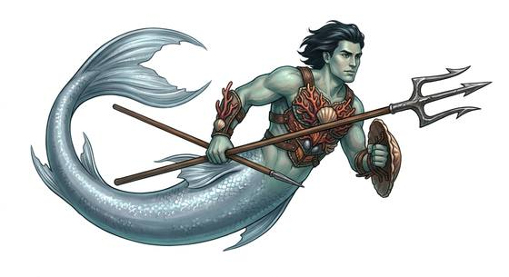

# Merfolk

{.illus}

*Set: Core*

*aka: ______________________________*

*Family: [Aquatic](../Species_Families/aquatic.md)*

The sea-folk of legend, human above the waist and fish below. They build cities in kelp forests and coral gardens, sing in voices that carry across the water, and are proud, secretive and wary of sailors. Some can never leave the sea; others gain legs when they come of age, or keep a lineage of working legs from the start. Some wear enchanted caps to return to the deep; some rise to prophesy storms, plague or good harvest.

Old stories tell of sages who came out of the waves with the arts of writing and law, and of river spirits who grant wealth to those who serve them. Sailors love them, fear them and never quite believe the stories until they hear the singing.

## Not to be confused with

the *[aquatic folk](aquatic-aquatic-folk.md)*, sea creatures given a human-like form; merfolk are part human in body.

## What sets this species apart

Classic sea-folk; tail versus legs and song vary by breed, so the family lines cover the species.

## Breeds and races

Each block below is one set of numbers; breeds that share every number share a block (Species rules, rule 9). Attributes are final modifiers, the size trade-off included. Skills, powers and weapon groups are final levels after the family, species and breed layers.

### No. 179 Classic merfolk · Lake-dwelling merfolk *(genres: sea and sky, fairy tale and folklore; starter)*

- **Size:** medium · **Body:** biped+finned
- **What it's like:** Fish-tailed sea people who swim like the tide and sing beautifully. (looks like: mermaid; good at: swimming, wilderness)
- **Attributes:** END +2
- **Skills:** [Diving](../Skills/diving.md) +3, [Swimming](../Skills/swimming.md) +3, [Survival: Coast & Sea](../Skills/survival-coast-and-sea.md) +2, [Fishing](../Skills/fishing.md) +1, [Climbing](../Skills/climbing.md) −1, [Riding](../Skills/riding.md) −2, [Survival: Desert](../Skills/survival-desert.md) −3, [Running](../Skills/running.md) Foreign Concept
- **Powers:** [Water Breathing](../Powers/water-breathing.md) 3
- **For the Game Master only, this race as an NPC guard or soldier (not your character's numbers):** Attack 14 · Parry 11 · Dodge 8 · Damage longsword 1d6+2 · Armour 2 · Life 19 · Threat 1 ([Bestiary roles](../bestiary.md))
- *Classic merfolk:* A true fish tail in place of legs: it cannot walk on land unaided.
- *Lake-dwelling merfolk:* A fish-tailed freshwater people who cannot walk on land; their own language works only underwater.
- *Note (Lake-dwelling merfolk):* Territorial customs go on the lexicon entry.

### No. 180 Tail-bearing merfolk nobility *(genres: sea and sky)*

- **Size:** medium · **Body:** aquatic
- **What it's like:** Gentle merfolk nobility who grow legs at adulthood to walk on land. (looks like: mermaid; good at: swimming, powers and magic)
- **Attributes:** END +2
- **Skills:** [Diving](../Skills/diving.md) +3, [Swimming](../Skills/swimming.md) +3, [Survival: Coast & Sea](../Skills/survival-coast-and-sea.md) +2, [Fishing](../Skills/fishing.md) +1, [Climbing](../Skills/climbing.md) −1, [Riding](../Skills/riding.md) −2, [Running](../Skills/running.md) −2, [Survival: Desert](../Skills/survival-desert.md) −3
- **Powers:** [Water Breathing](../Powers/water-breathing.md) 3, [Self-Alteration](../Powers/self-alteration.md) 1
- **For the Game Master only, this race as an NPC guard or soldier (not your character's numbers):** Attack 14 · Parry 11 · Dodge 8 · Damage longsword 1d6+2 · Armour 2 · Life 19 · Threat 1 ([Bestiary roles](../bestiary.md))
- *Why:* Fish-tailed, but gains a legged form on reaching adulthood.
- *Note:* Self-Alteration is tail-to-legs only, and only from adulthood. Royalty is a station, not a breed trait.

### No. 181 Kelp-haired merrow *(genres: fairy tale and folklore, sea and sky)*

- **Size:** medium · **Body:** biped
- **What it's like:** Kelp-haired sea-folk who don an enchanted cap to travel far out to sea. (looks like: mermaid; good at: swimming, powers and magic)
- **Attributes:** END +2
- **Skills:** [Diving](../Skills/diving.md) +3, [Swimming](../Skills/swimming.md) +3, [Survival: Coast & Sea](../Skills/survival-coast-and-sea.md) +2, [Fishing](../Skills/fishing.md) +1, [Climbing](../Skills/climbing.md) −1, [Riding](../Skills/riding.md) −2, [Running](../Skills/running.md) −2, [Survival: Desert](../Skills/survival-desert.md) −3
- **Powers:** [Water Breathing](../Powers/water-breathing.md) 3
- **For the Game Master only, this race as an NPC guard or soldier (not your character's numbers):** Attack 14 · Parry 11 · Dodge 8 · Damage longsword 1d6+2 · Armour 2 · Life 19 · Threat 1 ([Bestiary roles](../bestiary.md))
- *Why:* Differs from its species in appearance and homeland; its sea-travelling cap is gear.

### No. 182 Sea-singing sirena *(genres: sea and sky)*

- **Size:** medium · **Body:** biped+tailed
- **What it's like:** Beautiful-voiced sea guardians who sing to warn sailors of danger. (looks like: mermaid; good at: swimming, people and talk)
- **Attributes:** END +2
- **Skills:** [Diving](../Skills/diving.md) +3, [Swimming](../Skills/swimming.md) +3, [Singing](../Skills/singing.md) +2, [Survival: Coast & Sea](../Skills/survival-coast-and-sea.md) +2, [Fishing](../Skills/fishing.md) +1, [Climbing](../Skills/climbing.md) −1, [Riding](../Skills/riding.md) −2, [Running](../Skills/running.md) −2, [Survival: Desert](../Skills/survival-desert.md) −3
- **Powers:** [Water Breathing](../Powers/water-breathing.md) 3
- **For the Game Master only, this race as an NPC guard or soldier (not your character's numbers):** Attack 14 · Parry 11 · Dodge 8 · Damage longsword 1d6+2 · Armour 2 · Life 19 · Threat 1 ([Bestiary roles](../bestiary.md))
- *Why:* A sea guardian whose singing draws sailors.

### No. 183 Coastal mermaid-merman *(genres: sea and sky)*

- **Size:** medium · **Body:** biped+tailed
- **What it's like:** Fish-tailed sea-folk who sing beautifully and sometimes glimpse the future. (looks like: mermaid; good at: swimming, powers and magic)
- **Attributes:** END +2
- **Skills:** [Diving](../Skills/diving.md) +3, [Swimming](../Skills/swimming.md) +3, [Survival: Coast & Sea](../Skills/survival-coast-and-sea.md) +2, [Fishing](../Skills/fishing.md) +1, [Singing](../Skills/singing.md) +1, [Climbing](../Skills/climbing.md) −1, [Riding](../Skills/riding.md) −2, [Running](../Skills/running.md) −2, [Survival: Desert](../Skills/survival-desert.md) −3
- **Powers:** [Water Breathing](../Powers/water-breathing.md) 3, [Augury](../Powers/augury.md) 1
- **For the Game Master only, this race as an NPC guard or soldier (not your character's numbers):** Attack 14 · Parry 11 · Dodge 8 · Damage longsword 1d6+2 · Armour 2 · Life 19 · Threat 1 ([Bestiary roles](../bestiary.md))
- *Why:* A singing sea people with a gift of prophecy.

### No. 184 Fish-sage apkallu *(genres: myth and legend, sea and sky)*

- **Size:** medium · **Body:** biped+tailed
- **What it's like:** Wise, ancient fish-sages who once taught humankind the arts of civilisation. (looks like: mermaid; good at: swimming, knowledge)
- **Attributes:** STR −1 END +2 INT +1 WIS +1
- **Skills:** [Diving](../Skills/diving.md) +3, [Swimming](../Skills/swimming.md) +3, [Survival: Coast & Sea](../Skills/survival-coast-and-sea.md) +2, [Fishing](../Skills/fishing.md) +1, [Teaching](../Skills/teaching.md) +1, [Climbing](../Skills/climbing.md) −1, [Riding](../Skills/riding.md) −2, [Running](../Skills/running.md) −2, [Survival: Desert](../Skills/survival-desert.md) −3
- **Powers:** [Water Breathing](../Powers/water-breathing.md) 3
- **For the Game Master only, this race as an NPC guard or soldier (not your character's numbers):** Attack 13 · Parry 10 · Dodge 8 · Damage longsword 1d6+2 · Armour 2 · Life 19 · Threat 1 ([Bestiary roles](../bestiary.md))
- *Why:* A long-lived sage from the sea, whose way of life is teaching the arts of civilisation.
- *Note:* Lifespan (long-lived) is a lexicon detail, not a game number.

### Plague-warding amabie *(NPC only)*

- **Size:** medium · **Body:** biped+tailed
- **Attributes:** END +2
- **Skills:** [Diving](../Skills/diving.md) +3, [Swimming](../Skills/swimming.md) +3, [Survival: Coast & Sea](../Skills/survival-coast-and-sea.md) +2, [Fishing](../Skills/fishing.md) +1, [Climbing](../Skills/climbing.md) −1, [Riding](../Skills/riding.md) −2, [Running](../Skills/running.md) −2, [Survival: Desert](../Skills/survival-desert.md) −3
- **Powers:** [Water Breathing](../Powers/water-breathing.md) 3, [Augury](../Powers/augury.md) 2
- **Natural attacks:** beak 1d6
- **For the Game Master only, this race as an NPC guard or soldier (not your character's numbers):** Attack 14 · Parry 11 · Dodge 8 · Damage longsword 1d6+2; beak 1d6+1 · Armour 2 · Life 19 · Threat 1 ([Bestiary roles](../bestiary.md))
- *Why:* A beaked, three-legged sea being that rises to foretell plague and harvest.

### No. 185 River-guardian mami wata *(genres: myth and legend)*

- **Size:** medium · **Body:** biped+tailed
- **What it's like:** River spirits who grant wealth or beauty to those who show them devotion. (looks like: mermaid; good at: swimming, powers and magic)
- **Attributes:** END +2
- **Skills:** [Diving](../Skills/diving.md) +3, [Swimming](../Skills/swimming.md) +3, [Survival: Coast & Sea](../Skills/survival-coast-and-sea.md) +2, [Fishing](../Skills/fishing.md) +1, [Climbing](../Skills/climbing.md) −1, [Riding](../Skills/riding.md) −2, [Running](../Skills/running.md) −2, [Survival: Desert](../Skills/survival-desert.md) −3
- **Powers:** [Water Breathing](../Powers/water-breathing.md) 3, [Water-Spirit Allure](../Powers/water-spirit-allure.md) 2, [Luck-Granting](../Powers/luck-granting.md) 1
- **For the Game Master only, this race as an NPC guard or soldier (not your character's numbers):** Attack 14 · Parry 11 · Dodge 8 · Damage longsword 1d6+2 · Armour 2 · Life 19 · Threat 1 ([Bestiary roles](../bestiary.md))
- *Why:* An alluring river and sea spirit who grants wealth or beauty to the devoted.

### No. 186 Amphibious noble merfolk *(genres: sea and sky)*

- **Size:** medium · **Body:** biped
- **What it's like:** Long-lived merfolk who keep working legs on land, whatever their calling. (looks like: mermaid; good at: swimming, wilderness)
- **Attributes:** END +2
- **Skills:** [Diving](../Skills/diving.md) +3, [Swimming](../Skills/swimming.md) +3, [Survival: Coast & Sea](../Skills/survival-coast-and-sea.md) +2, [Fishing](../Skills/fishing.md) +1, [Climbing](../Skills/climbing.md) −1, [Riding](../Skills/riding.md) −2, [Survival: Desert](../Skills/survival-desert.md) −3
- **Powers:** [Water Breathing](../Powers/water-breathing.md) 3
- **For the Game Master only, this race as an NPC guard or soldier (not your character's numbers):** Attack 14 · Parry 11 · Dodge 8 · Damage longsword 1d6+2 · Armour 2 · Life 19 · Threat 1 ([Bestiary roles](../bestiary.md))
- *Why:* Keeps working legs on land and is long-lived.
- *Note:* Legs vary by lineage; a tail-only lineage uses the classic merfolk block. Lifespan (long-lived) is a lexicon detail, not a game number.

### No. 187 Guild-organised merfolk *(genres: sea and sky)*

- **Size:** medium · **Body:** aquatic
- **What it's like:** Industrious, guild-organised merfolk who trade and build beneath the waves. (looks like: mermaid; good at: swimming, people and talk)
- **Attributes:** END +2
- **Skills:** [Diving](../Skills/diving.md) +3, [Swimming](../Skills/swimming.md) +3, [Survival: Coast & Sea](../Skills/survival-coast-and-sea.md) +2, [Fishing](../Skills/fishing.md) +1, [Trading & Business](../Skills/trading-and-business.md) +1, [Climbing](../Skills/climbing.md) −1, [Riding](../Skills/riding.md) −2, [Running](../Skills/running.md) −2, [Survival: Desert](../Skills/survival-desert.md) −3
- **Powers:** [Water Breathing](../Powers/water-breathing.md) 3
- **For the Game Master only, this race as an NPC guard or soldier (not your character's numbers):** Attack 14 · Parry 11 · Dodge 8 · Damage longsword 1d6+2 · Armour 2 · Life 19 · Threat 1 ([Bestiary roles](../bestiary.md))
- *Why:* A merfolk people whose way of life is organised around trade guilds.

