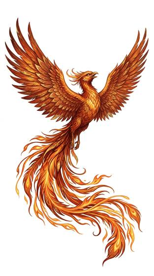

# Phoenix-kind

{.illus}

*Set: Expansion*

*aka: ______________________________*

*Family: [Avian](../Species_Families/avian.md)*

Firebirds. Phoenix-kind shine with plumage the colour of embers and sunrise, and they give off a warm light of their own, enough to read by in a dark room. They fly high and far, and where they pass, people stop and point. Most tales say they appear in times of peace and good government and vanish when things go wrong, so a sighting is taken as an omen.

The greatest of them, the true phoenix, is a thinking being tied to healing, renewal and fire, said to burn away and rise again from its own ashes. Lesser firebirds are beasts: bright, shy and hunted for a single feather, which may bring a fortune or a curse depending on who tells the story.

## Not to be confused with

*[Wise cosmic bird](avian-wise-cosmic-bird.md)*, the single ancient bird atop the world's tree, whose gift is wisdom and healing rather than flame.

## What sets this species apart

Radiant firebirds that fly and glow. Rebirth and fire powers belong to the sentient phoenix breed.

## Breeds and races

Each block below is one set of numbers; breeds that share every number share a block (Species rules, rule 9). Attributes are final modifiers, the size trade-off included. Skills, powers and weapon groups are final levels after the family, species and breed layers.

### Phoenix folk *(NPC only)*

- **Size:** medium · **Body:** biped+winged
- **Attributes:** STR −2 AGI +2 WIS +2 PER +2 CHA +2
- **Skills:** [Parachuting & Gliding](../Skills/parachuting-and-gliding.md) +2, [Wayfinding](../Skills/wayfinding.md) +2, [Balance](../Skills/balance.md) +1, [Danger Sense](../Skills/danger-sense.md) +1, [Weather Sense](../Skills/weather-sense.md) +1, [Survival: Caves & Underground](../Skills/survival-caves-and-underground.md) −1, [Lifting & Carrying](../Skills/lifting-and-carrying.md) −2, [Swimming](../Skills/swimming.md) −2
- **Powers:** [Renewal at Death](../Powers/renewal-at-death.md) 3, [Fire Control](../Powers/fire-control.md) 2, [Flight](../Powers/flight.md) 2, [Resist Element](../Powers/resist-element.md) 2, [Healing Touch](../Powers/healing-touch.md) 1, [Light](../Powers/light.md) 1
- **Natural attacks:** beak 1d6
- **For the Game Master only, this race as an NPC guard or soldier (not your character's numbers):** Attack 14 · Parry 11 · Dodge 10 · Damage longsword 1d6+1; beak 1d6+1 · Armour 2 · Life 17 · Threat 1 ([Bestiary roles](../bestiary.md))
- *Why:* The sentient phoenix: reborn from fire, master of flame and bringer of healing.
- *Note:* Resist Element is fire.

### Radiant firebird (non-sentient) *(beast)*

- **Size:** medium · **Body:** biped+winged
- **Attributes:** STR −2 AGI +2 INT −3 WIS +1 PER +2 CHA +2
- **Skills:** [Parachuting & Gliding](../Skills/parachuting-and-gliding.md) +2, [Wayfinding](../Skills/wayfinding.md) +2, [Balance](../Skills/balance.md) +1, [Danger Sense](../Skills/danger-sense.md) +1, [Weather Sense](../Skills/weather-sense.md) +1, [Survival: Caves & Underground](../Skills/survival-caves-and-underground.md) −1, [Lifting & Carrying](../Skills/lifting-and-carrying.md) −2, [Swimming](../Skills/swimming.md) −2
- **Powers:** [Flight](../Powers/flight.md) 2, [Light](../Powers/light.md) 1
- **Natural attacks:** beak 1d6
- **For the Game Master only, this race as an NPC guard or soldier (not your character's numbers):** Attack 14 · Parry — · Dodge 10 · Damage beak 1d6 · Armour 0 · Life 15 · Threat minor ([Bestiary roles](../bestiary.md))

