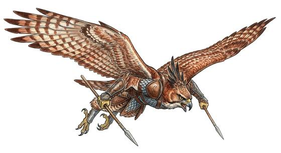

# Raptor folk

{.illus}

*Set: Core*

*aka: ______________________________*

*Family: [Avian](../Species_Families/avian.md)*

Hooked beaks, hard golden eyes and feet that close like a smith's tongs. Raptor folk are the birds of prey made into people: hawk-kin who spot a hare's ear twitching from far above, eagle-kin broad across the shoulders, and bald-headed vulture folk who eat what would sicken anyone else and rarely fall ill. Most are solitary by temper. They hunt alone, nest high and speak little, and they strike from a dive before the quarry has thought to look up.

The kind runs from ordinary hunters to things out of legend: sky-warrior clans ruled from cliff-top halls, feathered raiders, eagles large and wise enough to carry heroes, and storm-birds whose wingbeats sound like thunder. Not all of them fly well, and some barely fly at all. Ground-bound peoples tend to admire raptor folk from a distance and keep their lambs indoors.

## Not to be confused with

*[Owl folk](avian-owl-folk.md)*, the night hunters, who trade the raptor's far daylight sight for silence and eyes that work in the dark.

## What sets this species apart

Birds of prey: even keener eyes, talons and a hunter's instinct. Flight varies by breed and is Set there.

## Breeds and races

Each block below is one set of numbers; breeds that share every number share a block (Species rules, rule 9). Attributes are final modifiers, the size trade-off included. Skills, powers and weapon groups are final levels after the family, species and breed layers.

### No. 204 Hawk-eagle folk *(genres: beast-folk: scales, feathers and shells, sea and sky; starter)*

- **Size:** medium · **Body:** winged biped
- **What it's like:** Winged hunters with sharp eyes who swoop down on enemies from above. (looks like: eagle; good at: flying, keen senses, speed and agility)
- **Attributes:** STR −1 AGI +2 END −1 WIS +1 PER +3 COU +1
- **Skills:** [Parachuting & Gliding](../Skills/parachuting-and-gliding.md) +2, [Wayfinding](../Skills/wayfinding.md) +2, [Balance](../Skills/balance.md) +1, [Danger Sense](../Skills/danger-sense.md) +1, [Hunting](../Skills/hunting.md) +1, [Weather Sense](../Skills/weather-sense.md) +1, [Survival: Caves & Underground](../Skills/survival-caves-and-underground.md) −1, [Lifting & Carrying](../Skills/lifting-and-carrying.md) −2, [Swimming](../Skills/swimming.md) −2
- **Powers:** [Enhanced Senses](../Powers/enhanced-senses.md) 2, [Flight](../Powers/flight.md) 2
- **Natural attacks:** beak 1d6, talons 1d6+1
- **For the Game Master only, this race as an NPC guard or soldier (not your character's numbers):** Attack 14 · Parry 11 · Dodge 10 · Damage longsword 1d6+2; talons 1d6+2 · Armour 2 · Life 16 · Threat 1 ([Bestiary roles](../bestiary.md))
- *Why:* Winged hunters with keen distance vision and a diving strike.
- *Note:* Enhanced Senses is sight.

### Vulture folk *(NPC only)*

- **Size:** medium · **Body:** winged biped
- **Attributes:** STR −1 AGI +2 END −1 WIS +1 PER +3 CHA −1
- **Skills:** [Parachuting & Gliding](../Skills/parachuting-and-gliding.md) +2, [Scavenging](../Skills/scavenging.md) +2, [Wayfinding](../Skills/wayfinding.md) +2, [Balance](../Skills/balance.md) +1, [Danger Sense](../Skills/danger-sense.md) +1, [Hunting](../Skills/hunting.md) +1, [Weather Sense](../Skills/weather-sense.md) +1, [Survival: Caves & Underground](../Skills/survival-caves-and-underground.md) −1, [Lifting & Carrying](../Skills/lifting-and-carrying.md) −2, [Swimming](../Skills/swimming.md) −2
- **Powers:** [Flight](../Powers/flight.md) 2, [Poison & Disease Immunity](../Powers/poison-and-disease-immunity.md) 1
- **Natural attacks:** beak 1d6, talons 1d6+1
- **For the Game Master only, this race as an NPC guard or soldier (not your character's numbers):** Attack 14 · Parry 11 · Dodge 10 · Damage longsword 1d6+2; talons 1d6+2 · Armour 2 · Life 16 · Threat 1 ([Bestiary roles](../bestiary.md))
- *Why:* Soaring scavengers with disease-proof digestion.

### Giant sapient eagles *(NPC only)*

- **Size:** huge · **Body:** winged biped
- **Attributes:** STR +3 AGI −2 END −1 WIS +1 PER +3 COU +1
- **Skills:** [Parachuting & Gliding](../Skills/parachuting-and-gliding.md) +2, [Wayfinding](../Skills/wayfinding.md) +2, [Balance](../Skills/balance.md) +1, [Danger Sense](../Skills/danger-sense.md) +1, [Hunting](../Skills/hunting.md) +1, [Weather Sense](../Skills/weather-sense.md) +1, [Survival: Caves & Underground](../Skills/survival-caves-and-underground.md) −1, [Lifting & Carrying](../Skills/lifting-and-carrying.md) −2, [Swimming](../Skills/swimming.md) −2
- **Powers:** [Flight](../Powers/flight.md) 3, [Enhanced Senses](../Powers/enhanced-senses.md) 2
- **Natural attacks:** beak 1d6, talons 1d6+1
- **For the Game Master only, this race as an NPC guard or soldier (not your character's numbers):** Attack 14 · Parry — · Dodge 4 · Damage talons 2d6; beak 1d6+5 · Armour 0 · Life 22 · Threat 1 ([Bestiary roles](../bestiary.md))
- *Why:* Enormous, keen-eyed eagles who are powerful fliers.
- *Note:* Enhanced Senses is sight. No hands: held weapons unusable.

### No. 205 Divine eagle-folk *(genres: myth and legend)*

- **Size:** large · **Body:** biped+winged
- **What it's like:** Mighty eagle-headed folk of legend, astonishingly fast and powerful in flight. (looks like: eagle; good at: flying, strength, keen senses)
- **Attributes:** STR +2 END −1 WIS +1 PER +3 COU +1
- **Skills:** [Parachuting & Gliding](../Skills/parachuting-and-gliding.md) +2, [Wayfinding](../Skills/wayfinding.md) +2, [Balance](../Skills/balance.md) +1, [Danger Sense](../Skills/danger-sense.md) +1, [Hunting](../Skills/hunting.md) +1, [Weather Sense](../Skills/weather-sense.md) +1, [Survival: Caves & Underground](../Skills/survival-caves-and-underground.md) −1, [Lifting & Carrying](../Skills/lifting-and-carrying.md) −2, [Swimming](../Skills/swimming.md) −2
- **Powers:** [Flight](../Powers/flight.md) 3, [Super Speed](../Powers/super-speed.md) 1
- **Natural attacks:** beak 1d6, talons 1d6+1
- **For the Game Master only, this race as an NPC guard or soldier (not your character's numbers):** Attack 16 · Parry 13 · Dodge 7 · Damage longsword 1d6+2; talons 1d6+4 · Armour 2 · Life 20 · Threat 2 ([Bestiary roles](../bestiary.md))
- *Why:* Eagle-human hybrids of immense speed on the wing.
- *Note:* Enmity with serpent-folk is lexicon.

### No. 206 Sky warrior hawkman folk *(genres: pulp planets and lost worlds, sea and sky)*

- **Size:** medium · **Body:** winged biped
- **What it's like:** Proud, fierce hawk-winged warriors ruled from a city in the sky. (looks like: hawk; good at: flying, fighting, keen senses)
- **Attributes:** STR −1 AGI +2 END −1 WIS +1 PER +3 COU +1
- **Skills:** [Parachuting & Gliding](../Skills/parachuting-and-gliding.md) +2, [Wayfinding](../Skills/wayfinding.md) +2, [Balance](../Skills/balance.md) +1, [Danger Sense](../Skills/danger-sense.md) +1, [Hunting](../Skills/hunting.md) +1, [Weather Sense](../Skills/weather-sense.md) +1, [Survival: Caves & Underground](../Skills/survival-caves-and-underground.md) −1, [Lifting & Carrying](../Skills/lifting-and-carrying.md) −2, [Swimming](../Skills/swimming.md) −2
- **Powers:** [Flight](../Powers/flight.md) 2
- **Natural attacks:** beak 1d6, talons 1d6+1
- **For the Game Master only, this race as an NPC guard or soldier (not your character's numbers):** Attack 14 · Parry 11 · Dodge 10 · Damage longsword 1d6+2; talons 1d6+2 · Armour 2 · Life 16 · Threat 1 ([Bestiary roles](../bestiary.md))
- *Why:* Winged hawk-folk who fly.
- *Note:* Their aerial warrior culture is handled in the Culture step.

### Falconer mercenary bird-folk *(NPC only)*

- **Size:** medium · **Body:** biped
- **Attributes:** STR −1 AGI +2 END −1 WIS +2 PER +3 COU +1
- **Skills:** [Wayfinding](../Skills/wayfinding.md) +2, [Balance](../Skills/balance.md) +1, [Danger Sense](../Skills/danger-sense.md) +1, [Hunting](../Skills/hunting.md) +1, [Tracking](../Skills/tracking.md) +1, [Weather Sense](../Skills/weather-sense.md) +1, [Survival: Caves & Underground](../Skills/survival-caves-and-underground.md) −1, [Lifting & Carrying](../Skills/lifting-and-carrying.md) −2, [Swimming](../Skills/swimming.md) −2
- **Natural attacks:** beak 1d6, talons 1d6+1
- **For the Game Master only, this race as an NPC guard or soldier (not your character's numbers):** Attack 14 · Parry 11 · Dodge 10 · Damage longsword 1d6+2; talons 1d6+2 · Armour 2 · Life 16 · Threat 1 ([Bestiary roles](../bestiary.md))
- *Why:* Wingless, keen-sensed bird-folk of a tracker and scout people.

### Giant roc *(beast; NPC-scale)*

- **Size:** gigantic · **Body:** biped+winged
- **Attributes:** STR +5 AGI −4 END −1 INT −3 WIS +1 PER +3 COU +1
- **Skills:** [Parachuting & Gliding](../Skills/parachuting-and-gliding.md) +2, [Wayfinding](../Skills/wayfinding.md) +2, [Balance](../Skills/balance.md) +1, [Danger Sense](../Skills/danger-sense.md) +1, [Hunting](../Skills/hunting.md) +1, [Survival: Mountain](../Skills/survival-mountain.md) +1, [Weather Sense](../Skills/weather-sense.md) +1, [Survival: Caves & Underground](../Skills/survival-caves-and-underground.md) −1, [Lifting & Carrying](../Skills/lifting-and-carrying.md) −2, [Swimming](../Skills/swimming.md) −2
- **Powers:** [Flight](../Powers/flight.md) 3
- **Natural attacks:** beak 1d6, talons 1d6+1
- **For the Game Master only, this race as an NPC guard or soldier (not your character's numbers):** Attack 14 · Parry — · Dodge 0 · Damage talons 2d6+1; beak 1d6+7 · Armour 0 · Life 30 · Threat 2 ([Bestiary roles](../bestiary.md))
- *Why:* An enormous, powerful flier that nests on remote peaks.

### Lion-headed storm bird *(NPC only; NPC-scale)*

- **Size:** large · **Body:** biped+winged
- **Attributes:** STR +1 END −1 WIS +1 PER +3 COU +1
- **Skills:** [Parachuting & Gliding](../Skills/parachuting-and-gliding.md) +2, [Wayfinding](../Skills/wayfinding.md) +2, [Balance](../Skills/balance.md) +1, [Danger Sense](../Skills/danger-sense.md) +1, [Hunting](../Skills/hunting.md) +1, [Weather Sense](../Skills/weather-sense.md) +1, [Survival: Caves & Underground](../Skills/survival-caves-and-underground.md) −1, [Lifting & Carrying](../Skills/lifting-and-carrying.md) −2, [Swimming](../Skills/swimming.md) −2
- **Powers:** [Weather-Working](../Powers/weather-working.md) 3, [Flight](../Powers/flight.md) 2
- **Natural attacks:** talons 1d6+1, bite 1d6+1
- **For the Game Master only, this race as an NPC guard or soldier (not your character's numbers):** Attack 14 · Parry — · Dodge 7 · Damage talons 1d6+2; bite 1d6+4 · Armour 0 · Life 18 · Threat minor ([Bestiary roles](../bestiary.md))
- *Why:* A lion-headed storm-being that flies and commands wind and rain.
- *Note:* NPC-scale. Lion head: bites instead of pecking. No hands: held weapons unusable.

### Storm-lightning bird spirit *(NPC only)*

- **Size:** medium · **Body:** biped+winged
- **Attributes:** STR −1 AGI +2 END −1 WIS +1 PER +3 COU +1
- **Skills:** [Parachuting & Gliding](../Skills/parachuting-and-gliding.md) +2, [Wayfinding](../Skills/wayfinding.md) +2, [Balance](../Skills/balance.md) +1, [Danger Sense](../Skills/danger-sense.md) +1, [Hunting](../Skills/hunting.md) +1, [Weather Sense](../Skills/weather-sense.md) +1, [Survival: Caves & Underground](../Skills/survival-caves-and-underground.md) −1, [Lifting & Carrying](../Skills/lifting-and-carrying.md) −2, [Swimming](../Skills/swimming.md) −2
- **Powers:** [Animal Form](../Powers/animal-form.md) 2, [Flight](../Powers/flight.md) 2, [Lightning](../Powers/lightning.md) 2
- **Natural attacks:** beak 1d6, talons 1d6+1
- **For the Game Master only, this race as an NPC guard or soldier (not your character's numbers):** Attack 14 · Parry 11 · Dodge 10 · Damage longsword 1d6+2; talons 1d6+2 · Armour 2 · Life 16 · Threat 1 ([Bestiary roles](../bestiary.md))
- *Why:* A bird spirit whose wingbeats thunder and eyes flash lightning, able to take human or bird form.
- *Note:* Animal Form is between human and bird only.

### Sky-raptor humanoid *(NPC only)*

- **Size:** medium · **Body:** biped+tailed
- **Attributes:** STR −1 AGI +2 END −1 WIS +1 PER +3 COU +1
- **Skills:** [Wayfinding](../Skills/wayfinding.md) +2, [Balance](../Skills/balance.md) +1, [Danger Sense](../Skills/danger-sense.md) +1, [Hunting](../Skills/hunting.md) +1, [Scavenging](../Skills/scavenging.md) +1, [Weather Sense](../Skills/weather-sense.md) +1, [Survival: Caves & Underground](../Skills/survival-caves-and-underground.md) −1, [Lifting & Carrying](../Skills/lifting-and-carrying.md) −2, [Swimming](../Skills/swimming.md) −2
- **Natural attacks:** beak 1d6, talons 1d6+1
- **For the Game Master only, this race as an NPC guard or soldier (not your character's numbers):** Attack 14 · Parry 11 · Dodge 10 · Damage longsword 1d6+2; talons 1d6+2 · Armour 2 · Life 16 · Threat 1 ([Bestiary roles](../bestiary.md))
- *Why:* Wingless, tailed scavenger-mercenaries.

### Predatory bird-raider folk *(NPC only)*

- **Size:** medium · **Body:** biped+winged
- **Attributes:** STR −1 AGI +2 END −1 WIS +1 PER +3 COU +1
- **Skills:** [Parachuting & Gliding](../Skills/parachuting-and-gliding.md) +2, [Wayfinding](../Skills/wayfinding.md) +2, [Balance](../Skills/balance.md) +1, [Danger Sense](../Skills/danger-sense.md) +1, [Hunting](../Skills/hunting.md) +1, [Sailing & Seamanship](../Skills/sailing-and-seamanship.md) +1, [Weather Sense](../Skills/weather-sense.md) +1, [Survival: Caves & Underground](../Skills/survival-caves-and-underground.md) −1, [Lifting & Carrying](../Skills/lifting-and-carrying.md) −2, [Swimming](../Skills/swimming.md) −2
- **Natural attacks:** beak 1d6, talons 1d6+1
- **For the Game Master only, this race as an NPC guard or soldier (not your character's numbers):** Attack 14 · Parry 11 · Dodge 10 · Damage longsword 1d6+2; talons 1d6+2 · Armour 2 · Life 16 · Threat 1 ([Bestiary roles](../bestiary.md))
- *Why:* Gliding raiders of a pirate people.
- *Note:* Glides short distances only: no Flight.

### Raptor shaper caste *(NPC only)*

- **Size:** medium · **Body:** biped+winged
- **Attributes:** STR −2 AGI +2 END −2 WIS +3 PER +3 COU +1
- **Skills:** [Parachuting & Gliding](../Skills/parachuting-and-gliding.md) +2, [Wayfinding](../Skills/wayfinding.md) +2, [Balance](../Skills/balance.md) +1, [Danger Sense](../Skills/danger-sense.md) +1, [Hunting](../Skills/hunting.md) +1, [Life Sciences](../Skills/life-sciences.md) +1, [Weather Sense](../Skills/weather-sense.md) +1, [Survival: Caves & Underground](../Skills/survival-caves-and-underground.md) −1, [Lifting & Carrying](../Skills/lifting-and-carrying.md) −2, [Swimming](../Skills/swimming.md) −2
- **Powers:** [Self-Alteration](../Powers/self-alteration.md) 1
- **Natural attacks:** beak 1d6, talons 1d6+1
- **For the Game Master only, this race as an NPC guard or soldier (not your character's numbers):** Attack 14 · Parry 11 · Dodge 10 · Damage longsword 1d6+1; beak 1d6+1 · Armour 2 · Life 15 · Threat 1 ([Bestiary roles](../bestiary.md))
- *Why:* A frail, wise caste that reshapes its kind by eating enemies' traits.
- *Note:* Self-Alteration works only through traits absorbed by eating; frailty is an attribute matter.

### Raptor hound *(beast)*

- **Size:** medium · **Body:** quadruped
- **Attributes:** STR −1 AGI +2 END −1 INT −3 WIS +1 PER +3 COU +1
- **Skills:** [Tracking](../Skills/tracking.md) +2, [Wayfinding](../Skills/wayfinding.md) +2, [Balance](../Skills/balance.md) +1, [Danger Sense](../Skills/danger-sense.md) +1, [Hunting](../Skills/hunting.md) +1, [Weather Sense](../Skills/weather-sense.md) +1, [Survival: Caves & Underground](../Skills/survival-caves-and-underground.md) −1, [Lifting & Carrying](../Skills/lifting-and-carrying.md) −2, [Swimming](../Skills/swimming.md) −2
- **Natural attacks:** beak 1d6, talons 1d6+1
- **For the Game Master only, this race as an NPC guard or soldier (not your character's numbers):** Attack 14 · Parry — · Dodge 10 · Damage talons 1d6+1; beak 1d6+1 · Armour 0 · Life 14 · Threat minor ([Bestiary roles](../bestiary.md))
- *Why:* A four-legged, wingless pack-hunting beast.

