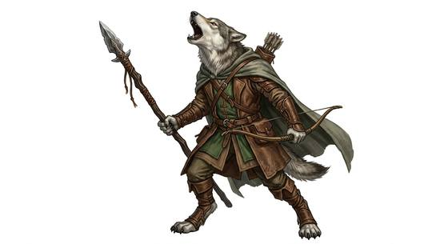
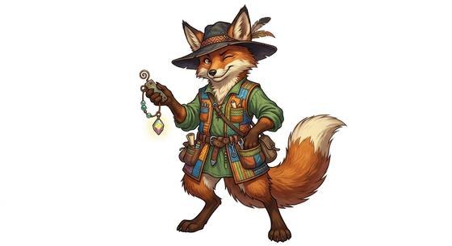

# Canine folk

{.illus} {.illus}

*Set: Core*

*aka: ______________________________*

*Family: [Canine](../Species_Families/canine.md)*

Dog-folk of every build. Canine folk walk upright with a dog's head and ears, a sharp nose and, often, a tail that gives away more than they would like. Beyond that, they vary as much as dogs do: lean wolf-folk in close-knit packs, heavy hound folk who guard and track, small quick dog folk who talk constantly and are always underestimated, clever fox-folk, desert jackals, cackling hyenas, arctic sled-pullers and tireless herders who naturally organise any group they join.

Nearly all share a keen nose, sharp ears and deep loyalty to their own. They form households like packs, with clear ranks and fierce defence of their ground. Others find them good friends, formidable guards and very bad at hiding their feelings.

## Not to be confused with

*[Beast-form canine](canine-beast-form-canine.md)*, the four-legged hounds and wolves, who share the nose but have no hands.

## What sets this species apart

No species-wide difference: this is the family template, and its breed lines carry the variation.

## Breeds and races

Each block below is one set of numbers; breeds that share every number share a block (Species rules, rule 9). Attributes are final modifiers, the size trade-off included. Skills, powers and weapon groups are final levels after the family, species and breed layers.

### No. 228 Wolf-folk *(genres: beast-folk: fur; starter)*

- **Size:** medium · **Body:** biped+tailed
- **What it's like:** Loyal pack hunters with sharp noses, keen ears and a fierce bite. (looks like: wolf; good at: keen senses, wilderness, fighting)
- **Attributes:** STR +1 AGI +1 END +1 INT −1 WIS +1 PER +1 CHA −1 COU +1
- **Skills:** [Tracking](../Skills/tracking.md) +3, [Hunting](../Skills/hunting.md) +1, [Running](../Skills/running.md) +1, [Calligraphy & Scribing](../Skills/calligraphy-and-scribing.md) −1, [Jewellery & Gem Cutting](../Skills/jewellery-and-gem-cutting.md) −1
- **Powers:** [Enhanced Senses](../Powers/enhanced-senses.md) 2, [Night & Spectrum Sight](../Powers/night-and-spectrum-sight.md) 2
- **Weapon groups:** [Brawling](../Weapon_Groups/brawling.md) +1
- **Natural attacks:** bite 1d6+1
- **For the Game Master only, this race as an NPC guard or soldier (not your character's numbers):** Attack 15 · Parry 12 · Dodge 9 · Damage longsword 1d6+2; bite 1d6+2 · Armour 2 · Life 18 · Threat 2 ([Bestiary roles](../bestiary.md))
- *Why:* Wolf line: sees in the dark and has a strong bite.

### No. 229 Large hound folk *(genres: beast-folk: fur)*

- **Size:** large · **Body:** biped+tailed
- **What it's like:** Big, loyal hound-folk with a bone-crushing bite and a nose that never fails. (looks like: dog; good at: strength, keen senses, fighting)
- **Attributes:** STR +4 AGI −2 END +2 INT −1 WIS +1 PER +1 CHA −1 COU +1
- **Skills:** [Tracking](../Skills/tracking.md) +3, [Pain Tolerance](../Skills/pain-tolerance.md) +2, [Hunting](../Skills/hunting.md) +1, [Intimidation](../Skills/intimidation.md) +1, [Running](../Skills/running.md) +1, [Calligraphy & Scribing](../Skills/calligraphy-and-scribing.md) −1, [Jewellery & Gem Cutting](../Skills/jewellery-and-gem-cutting.md) −1
- **Powers:** [Enhanced Senses](../Powers/enhanced-senses.md) 2
- **Weapon groups:** [Brawling](../Weapon_Groups/brawling.md) +1
- **Natural attacks:** bite 1d6+1
- **For the Game Master only, this race as an NPC guard or soldier (not your character's numbers):** Attack 15 · Parry 12 · Dodge 5 · Damage longsword 1d6+2; bite 1d6+4 · Armour 2 · Life 23 · Threat 2 ([Bestiary roles](../bestiary.md))
- *Why:* Large guard-hound line: shrugs off pain and has a deep, carrying bay; the heavy frame is an attribute.

### No. 230 Small dog folk *(genres: beast-folk: fur)*

- **Size:** small · **Body:** biped+tailed
- **What it's like:** Small, chatty, quick dog-folk who never stop talking or wagging their tails. (looks like: dog; good at: speed and agility, keen senses)
- **Attributes:** STR −2 AGI +2 INT −1 WIS +1 PER +1 COU +1
- **Skills:** [Tracking](../Skills/tracking.md) +3, [Acrobatics](../Skills/acrobatics.md) +1, [Hunting](../Skills/hunting.md) +1, [Running](../Skills/running.md) +1, [Storytelling & Conversation](../Skills/storytelling-and-conversation.md) +1, [Calligraphy & Scribing](../Skills/calligraphy-and-scribing.md) −1, [Jewellery & Gem Cutting](../Skills/jewellery-and-gem-cutting.md) −1
- **Powers:** [Enhanced Senses](../Powers/enhanced-senses.md) 2
- **Weapon groups:** [Brawling](../Weapon_Groups/brawling.md) +1
- **Natural attacks:** bite 1d6+1
- **For the Game Master only, this race as an NPC guard or soldier (not your character's numbers):** Attack 14 · Parry 11 · Dodge 11 · Damage longsword 1d6+1; bite 1d6-1 · Armour 2 · Life 15 · Threat 1 ([Bestiary roles](../bestiary.md))
- *Why:* Small lap-dog line: quick, nimble and chatty; the small size is an attribute.

### No. 231 Fox-folk *(genres: beast-folk: fur; starter)*

- **Size:** small · **Body:** biped+tailed
- **What it's like:** Quick, clever fox people who hear everything and talk their way out of trouble. (looks like: fox; good at: keen senses, wilderness, speed and agility)
- **Attributes:** STR −2 AGI +2 END +1 WIS +1 PER +1 CHA −1 COU +1
- **Skills:** [Tracking](../Skills/tracking.md) +3, [Balance](../Skills/balance.md) +1, [Haggling](../Skills/haggling.md) +1, [Hunting](../Skills/hunting.md) +1, [Running](../Skills/running.md) +1, [Survival: Desert](../Skills/survival-desert.md) +1, [Calligraphy & Scribing](../Skills/calligraphy-and-scribing.md) −1, [Jewellery & Gem Cutting](../Skills/jewellery-and-gem-cutting.md) −1
- **Powers:** [Enhanced Senses](../Powers/enhanced-senses.md) 2
- **Weapon groups:** [Brawling](../Weapon_Groups/brawling.md) +1
- **Natural attacks:** bite 1d6+1
- **For the Game Master only, this race as an NPC guard or soldier (not your character's numbers):** Attack 14 · Parry 11 · Dodge 11 · Damage longsword 1d6+1; bite 1d6-1 · Armour 2 · Life 16 · Threat 1 ([Bestiary roles](../bestiary.md))
- *Why:* Fox line: bushy tail for balance, heat-hardy, and a scavenger-trader way of life.

### No. 232 Jackal-folk *(genres: beast-folk: fur, myth and legend)*

- **Size:** medium · **Body:** biped+tailed
- **What it's like:** Tough desert scavengers with a keen nose and an old bond to the underworld. (looks like: jackal; good at: wilderness, keen senses, toughness)
- **Attributes:** STR −1 AGI +1 END +2 INT −1 WIS +1 PER +1 CHA −1 COU +1
- **Skills:** [Tracking](../Skills/tracking.md) +3, [Survival: Desert](../Skills/survival-desert.md) +2, [Hunting](../Skills/hunting.md) +1, [Running](../Skills/running.md) +1, [Scavenging](../Skills/scavenging.md) +1, [Calligraphy & Scribing](../Skills/calligraphy-and-scribing.md) −1, [Jewellery & Gem Cutting](../Skills/jewellery-and-gem-cutting.md) −1
- **Powers:** [Enhanced Senses](../Powers/enhanced-senses.md) 2
- **Weapon groups:** [Brawling](../Weapon_Groups/brawling.md) +1
- **Natural attacks:** bite 1d6+1
- **For the Game Master only, this race as an NPC guard or soldier (not your character's numbers):** Attack 14 · Parry 11 · Dodge 9 · Damage longsword 1d6+2; bite 1d6+2 · Armour 2 · Life 19 · Threat 1 ([Bestiary roles](../bestiary.md))
- *Why:* Jackal line: desert-hardy scavengers.

### Hyena-folk *(NPC only)*

- **Size:** medium · **Body:** biped+tailed
- **Attributes:** STR +2 END +2 INT −2 WIS +1 PER +1 CHA −1 COU +1
- **Skills:** [Tracking](../Skills/tracking.md) +3, [Hunting](../Skills/hunting.md) +1, [Intimidation](../Skills/intimidation.md) +1, [Running](../Skills/running.md) +1, [Scavenging](../Skills/scavenging.md) +1, [Calligraphy & Scribing](../Skills/calligraphy-and-scribing.md) −1, [Jewellery & Gem Cutting](../Skills/jewellery-and-gem-cutting.md) −1
- **Powers:** [Enhanced Senses](../Powers/enhanced-senses.md) 2
- **Weapon groups:** [Brawling](../Weapon_Groups/brawling.md) +1
- **Natural attacks:** bite 1d6+1
- **For the Game Master only, this race as an NPC guard or soldier (not your character's numbers):** Attack 15 · Parry 12 · Dodge 8 · Damage longsword 1d6+2; bite 1d6+2 · Armour 2 · Life 19 · Threat 2 ([Bestiary roles](../bestiary.md))
- *Why:* Hyena line: crushing bite, scavenging habits and an unnerving cackle.

### No. 233 Coyote-folk *(genres: beast-folk: fur, myth and legend)*

- **Size:** medium · **Body:** biped+tailed
- **What it's like:** Clever trickster coyote-folk who talk their way out of any tight spot. (looks like: coyote; good at: keen senses, people and talk)
- **Attributes:** STR −1 END +1 WIS +1 PER +1 COU +1
- **Skills:** [Tracking](../Skills/tracking.md) +3, [Deception](../Skills/deception.md) +1, [Hunting](../Skills/hunting.md) +1, [Running](../Skills/running.md) +1, [Survival: Plains & Steppe](../Skills/survival-plains-and-steppe.md) +1, [Calligraphy & Scribing](../Skills/calligraphy-and-scribing.md) −1, [Jewellery & Gem Cutting](../Skills/jewellery-and-gem-cutting.md) −1
- **Powers:** [Enhanced Senses](../Powers/enhanced-senses.md) 2
- **Weapon groups:** [Brawling](../Weapon_Groups/brawling.md) +1
- **Natural attacks:** bite 1d6+1
- **For the Game Master only, this race as an NPC guard or soldier (not your character's numbers):** Attack 14 · Parry 11 · Dodge 8 · Damage longsword 1d6+2; bite 1d6+2 · Armour 2 · Life 18 · Threat 1 ([Bestiary roles](../bestiary.md))
- *Why:* Coyote line: adaptable tricksters of dry plains.

### Wild dog folk *(NPC only)*

- **Size:** medium · **Body:** biped+tailed
- **Attributes:** AGI +1 END +2 INT −1 WIS +1 PER +1 CHA −1 COU +1
- **Skills:** [Tracking](../Skills/tracking.md) +3, [Hunting](../Skills/hunting.md) +2, [Running](../Skills/running.md) +1, [Survival: Plains & Steppe](../Skills/survival-plains-and-steppe.md) +1, [Calligraphy & Scribing](../Skills/calligraphy-and-scribing.md) −1, [Jewellery & Gem Cutting](../Skills/jewellery-and-gem-cutting.md) −1
- **Powers:** [Enhanced Senses](../Powers/enhanced-senses.md) 2
- **Weapon groups:** [Brawling](../Weapon_Groups/brawling.md) +1
- **Natural attacks:** bite 1d6+1
- **For the Game Master only, this race as an NPC guard or soldier (not your character's numbers):** Attack 14 · Parry 11 · Dodge 9 · Damage longsword 1d6+2; bite 1d6+2 · Armour 2 · Life 19 · Threat 1 ([Bestiary roles](../bestiary.md))
- *Why:* Painted-dog line: savanna endurance hunters that work as a tight pack.

### No. 234 Arctic dog folk *(genres: beast-folk: fur)*

- **Size:** medium · **Body:** biped+tailed
- **What it's like:** Thick-coated arctic dog-folk who can pull a sled all day through the snow. (looks like: dog; good at: toughness, wilderness, keen senses)
- **Attributes:** STR +1 AGI −1 END +2 INT −1 WIS +1 PER +1 CHA −1 COU +1
- **Skills:** [Tracking](../Skills/tracking.md) +3, [Survival: Arctic](../Skills/survival-arctic.md) +2, [Hunting](../Skills/hunting.md) +1, [Running](../Skills/running.md) +1, [Snow & Ice Travel](../Skills/snow-and-ice-travel.md) +1, [Calligraphy & Scribing](../Skills/calligraphy-and-scribing.md) −1, [Jewellery & Gem Cutting](../Skills/jewellery-and-gem-cutting.md) −1
- **Powers:** [Enhanced Senses](../Powers/enhanced-senses.md) 2
- **Weapon groups:** [Brawling](../Weapon_Groups/brawling.md) +1
- **Natural attacks:** bite 1d6+1
- **For the Game Master only, this race as an NPC guard or soldier (not your character's numbers):** Attack 14 · Parry 11 · Dodge 7 · Damage longsword 1d6+2; bite 1d6+2 · Armour 2 · Life 19 · Threat 1 ([Bestiary roles](../bestiary.md))
- *Why:* Sled-dog line: thick double coat and hauling stamina in snow.

### Desert dog folk *(NPC only)*

- **Size:** medium · **Body:** biped+tailed
- **Attributes:** STR −1 AGI +2 END +1 INT −1 WIS +1 PER +1 CHA −1 COU +1
- **Skills:** [Tracking](../Skills/tracking.md) +3, [Running](../Skills/running.md) +2, [Survival: Desert](../Skills/survival-desert.md) +2, [Hunting](../Skills/hunting.md) +1, [Calligraphy & Scribing](../Skills/calligraphy-and-scribing.md) −1, [Jewellery & Gem Cutting](../Skills/jewellery-and-gem-cutting.md) −1
- **Powers:** [Enhanced Senses](../Powers/enhanced-senses.md) 2
- **Weapon groups:** [Brawling](../Weapon_Groups/brawling.md) +1
- **Natural attacks:** bite 1d6+1
- **For the Game Master only, this race as an NPC guard or soldier (not your character's numbers):** Attack 14 · Parry 11 · Dodge 10 · Damage longsword 1d6+2; bite 1d6+2 · Armour 2 · Life 18 · Threat 1 ([Bestiary roles](../bestiary.md))
- *Why:* Sighthound line: heat-hardy, needs little water, and sprints fast.

### No. 235 Herding dog folk *(genres: beast-folk: fur)*

- **Size:** medium · **Body:** biped+tailed
- **What it's like:** Clever, hard-working herding dog-folk, born leaders of any group. (looks like: dog; good at: keen senses, people and talk)
- **Attributes:** STR −1 AGI +1 END +1 INT +1 WIS +1 PER +1 CHA −1 COU +1
- **Skills:** [Tracking](../Skills/tracking.md) +3, [Herding & Husbandry](../Skills/herding-and-husbandry.md) +2, [Animal Handling](../Skills/animal-handling.md) +1, [Hunting](../Skills/hunting.md) +1, [Running](../Skills/running.md) +1, [Calligraphy & Scribing](../Skills/calligraphy-and-scribing.md) −1, [Jewellery & Gem Cutting](../Skills/jewellery-and-gem-cutting.md) −1
- **Powers:** [Enhanced Senses](../Powers/enhanced-senses.md) 2
- **Weapon groups:** [Brawling](../Weapon_Groups/brawling.md) +1
- **Natural attacks:** bite 1d6+1
- **For the Game Master only, this race as an NPC guard or soldier (not your character's numbers):** Attack 14 · Parry 11 · Dodge 9 · Damage longsword 1d6+2; bite 1d6+2 · Armour 2 · Life 18 · Threat 1 ([Bestiary roles](../bestiary.md))
- *Why:* Herding line: a strong instinct to gather and drive groups of animals.

### Wild jackal-dog folk (dhole) *(NPC only)*

- **Size:** medium · **Body:** biped+tailed
- **Attributes:** AGI +1 END +1 INT −1 WIS +1 PER +1 CHA −1 COU +2
- **Skills:** [Tracking](../Skills/tracking.md) +3, [Hunting](../Skills/hunting.md) +2, [Running](../Skills/running.md) +1, [Signals](../Skills/signals.md) +1, [Survival: Jungle & Swamp](../Skills/survival-jungle-and-swamp.md) +1, [Calligraphy & Scribing](../Skills/calligraphy-and-scribing.md) −1, [Jewellery & Gem Cutting](../Skills/jewellery-and-gem-cutting.md) −1
- **Powers:** [Enhanced Senses](../Powers/enhanced-senses.md) 2
- **Weapon groups:** [Brawling](../Weapon_Groups/brawling.md) +1
- **Natural attacks:** bite 1d6+1
- **For the Game Master only, this race as an NPC guard or soldier (not your character's numbers):** Attack 15 · Parry 12 · Dodge 9 · Damage longsword 1d6+2; bite 1d6+2 · Armour 2 · Life 18 · Threat 2 ([Bestiary roles](../bestiary.md))
- *Why:* Dhole line: forest pack hunters of big prey that coordinate by whistling.

### Maned wolf folk *(NPC only)*

- **Size:** medium · **Body:** biped+tailed
- **Attributes:** STR −1 AGI +1 END +1 INT −1 WIS +1 PER +1 CHA −1 COU +1
- **Skills:** [Tracking](../Skills/tracking.md) +3, [Foraging](../Skills/foraging.md) +1, [Hunting](../Skills/hunting.md) +1, [Running](../Skills/running.md) +1, [Survival: Plains & Steppe](../Skills/survival-plains-and-steppe.md) +1, [Calligraphy & Scribing](../Skills/calligraphy-and-scribing.md) −1, [Jewellery & Gem Cutting](../Skills/jewellery-and-gem-cutting.md) −1
- **Powers:** [Enhanced Senses](../Powers/enhanced-senses.md) 2
- **Weapon groups:** [Brawling](../Weapon_Groups/brawling.md) +1
- **Natural attacks:** bite 1d6+1
- **For the Game Master only, this race as an NPC guard or soldier (not your character's numbers):** Attack 14 · Parry 11 · Dodge 9 · Damage longsword 1d6+2; bite 1d6+2 · Armour 2 · Life 18 · Threat 1 ([Bestiary roles](../bestiary.md))
- *Why:* Stilt-legged grassland loners that forage as much as they hunt.

### Chivalrous fox-knight folk *(NPC only)*

- **Size:** small · **Body:** biped
- **Attributes:** STR −2 AGI +2 END +1 INT −1 WIS +1 PER +1 COU +3
- **Skills:** [Tracking](../Skills/tracking.md) +3, [Composure](../Skills/composure.md) +1, [Hunting](../Skills/hunting.md) +1, [Riding](../Skills/riding.md) +1, [Running](../Skills/running.md) +1, [Calligraphy & Scribing](../Skills/calligraphy-and-scribing.md) −1, [Jewellery & Gem Cutting](../Skills/jewellery-and-gem-cutting.md) −1
- **Powers:** [Enhanced Senses](../Powers/enhanced-senses.md) 2
- **Weapon groups:** [Brawling](../Weapon_Groups/brawling.md) +1
- **Natural attacks:** bite 1d6+1
- **For the Game Master only, this race as an NPC guard or soldier (not your character's numbers):** Attack 15 · Parry 12 · Dodge 11 · Damage longsword 1d6+1; bite 1d6-1 · Armour 2 · Life 16 · Threat 1 ([Bestiary roles](../bestiary.md))
- *Why:* Tiny fox knights: mounted and fearless by way of life.

### No. 236 Shadow-coated folk *(genres: space opera: beast-like aliens)*

- **Size:** medium · **Body:** biped
- **What it's like:** Dark-furred hound-folk who all but vanish into shadow in dim light. (looks like: dog; good at: sneaking, keen senses)
- **Attributes:** END +1 INT −1 WIS +1 PER +1 CHA −1 COU +1
- **Skills:** [Tracking](../Skills/tracking.md) +3, [Hunting](../Skills/hunting.md) +1, [Running](../Skills/running.md) +1, [Calligraphy & Scribing](../Skills/calligraphy-and-scribing.md) −1, [Jewellery & Gem Cutting](../Skills/jewellery-and-gem-cutting.md) −1
- **Powers:** [Enhanced Senses](../Powers/enhanced-senses.md) 2, [Invisibility](../Powers/invisibility.md) 2
- **Weapon groups:** [Brawling](../Weapon_Groups/brawling.md) +1
- **Natural attacks:** bite 1d6+1
- **For the Game Master only, this race as an NPC guard or soldier (not your character's numbers):** Attack 14 · Parry 11 · Dodge 8 · Damage longsword 1d6+2; bite 1d6+2 · Armour 2 · Life 18 · Threat 1 ([Bestiary roles](../bestiary.md))
- *Why:* Dark coats make them near-invisible living shadows in dim light.
- *Note:* Invisibility works only in dim light or darkness; bright light dazzles them (a flaw).

### No. 237 Jowled tracker folk *(genres: space opera: beast-like aliens)*

- **Size:** medium · **Body:** biped
- **What it's like:** Loyal, jowly-faced trackers with an unbeatable sense of smell. (looks like: dog; good at: keen senses, wilderness)
- **Attributes:** END +1 INT −1 WIS +1 PER +1 CHA −1 COU +1
- **Skills:** [Tracking](../Skills/tracking.md) +3, [Hunting](../Skills/hunting.md) +1, [Running](../Skills/running.md) +1, [Calligraphy & Scribing](../Skills/calligraphy-and-scribing.md) −1, [Jewellery & Gem Cutting](../Skills/jewellery-and-gem-cutting.md) −1
- **Powers:** [Enhanced Senses](../Powers/enhanced-senses.md) 2
- **Weapon groups:** [Brawling](../Weapon_Groups/brawling.md) +1
- **Natural attacks:** bite 1d6+1
- **For the Game Master only, this race as an NPC guard or soldier (not your character's numbers):** Attack 14 · Parry 11 · Dodge 8 · Damage longsword 1d6+2; bite 1d6+2 · Armour 2 · Life 18 · Threat 1 ([Bestiary roles](../bestiary.md))
- *Note:* The keen nose is already the family's; the steadfast temperament is personality.

### No. 238 Civic canine folk *(genres: animal fable)*

- **Size:** medium · **Body:** biped+tailed
- **What it's like:** Fully civilised dog-folk who walk upright and use tools like anyone else. (looks like: dog; good at: keen senses, wilderness)
- **Attributes:** END +1 WIS +1 PER +1 CHA −1 COU +1
- **Skills:** [Tracking](../Skills/tracking.md) +3, [Hunting](../Skills/hunting.md) +1, [Running](../Skills/running.md) +1, [Calligraphy & Scribing](../Skills/calligraphy-and-scribing.md) −1, [Jewellery & Gem Cutting](../Skills/jewellery-and-gem-cutting.md) −1
- **Powers:** [Enhanced Senses](../Powers/enhanced-senses.md) 2
- **Weapon groups:** [Brawling](../Weapon_Groups/brawling.md) +1
- **Natural attacks:** bite 1d6+1
- **For the Game Master only, this race as an NPC guard or soldier (not your character's numbers):** Attack 14 · Parry 11 · Dodge 8 · Damage longsword 1d6+2; bite 1d6+2 · Armour 2 · Life 18 · Threat 1 ([Bestiary roles](../bestiary.md))
- *Note:* Fully civilised city canines; their modern mixed-species life is handled in the Culture step.

### Reclusive fox-eared folk *(NPC only)*

- **Size:** medium · **Body:** biped
- **Attributes:** AGI +1 END +1 INT −1 WIS +1 PER +1 CHA −2 COU +1
- **Skills:** [Tracking](../Skills/tracking.md) +3, [Hunting](../Skills/hunting.md) +1, [Running](../Skills/running.md) +1, [Stealth](../Skills/stealth.md) +1, [Wayfinding](../Skills/wayfinding.md) +1, [Calligraphy & Scribing](../Skills/calligraphy-and-scribing.md) −1, [Jewellery & Gem Cutting](../Skills/jewellery-and-gem-cutting.md) −1
- **Powers:** [Enhanced Senses](../Powers/enhanced-senses.md) 2
- **Weapon groups:** [Brawling](../Weapon_Groups/brawling.md) +1
- **Natural attacks:** bite 1d6+1
- **For the Game Master only, this race as an NPC guard or soldier (not your character's numbers):** Attack 14 · Parry 11 · Dodge 9 · Damage longsword 1d6+2; bite 1d6+2 · Armour 2 · Life 18 · Threat 1 ([Bestiary roles](../bestiary.md))
- *Why:* Reclusive nomads who keep out of sight and on the move.

### No. 239 Large wolf-blooded warrior folk *(genres: beast-folk: fur, space opera: beast-like aliens)*

- **Size:** large · **Body:** biped
- **What it's like:** Honour-bound wolf-warriors who fight in packs and never break rank. (looks like: wolf; good at: strength, fighting, keen senses)
- **Attributes:** STR +3 AGI −2 END +1 INT −1 WIS +1 PER +1 CHA −1 COU +2
- **Skills:** [Tracking](../Skills/tracking.md) +3, [Hunting](../Skills/hunting.md) +1, [Running](../Skills/running.md) +1, [Survival: Arctic](../Skills/survival-arctic.md) +1, [Calligraphy & Scribing](../Skills/calligraphy-and-scribing.md) −1, [Jewellery & Gem Cutting](../Skills/jewellery-and-gem-cutting.md) −1
- **Powers:** [Enhanced Senses](../Powers/enhanced-senses.md) 2
- **Weapon groups:** [Brawling](../Weapon_Groups/brawling.md) +1
- **Natural attacks:** bite 1d6+1
- **For the Game Master only, this race as an NPC guard or soldier (not your character's numbers):** Attack 15 · Parry 12 · Dodge 5 · Damage longsword 1d6+2; bite 1d6+4 · Armour 2 · Life 22 · Threat 2 ([Bestiary roles](../bestiary.md))
- *Why:* Large wolf-warriors with a strong bite, adapted to cold country.

### No. 240 Opportunist wolf-spacer folk *(genres: space opera: beast-like aliens)*

- **Size:** medium · **Body:** biped
- **What it's like:** Charismatic wolf-folk leaders, sharp-sensed but sometimes reckless in charge. (looks like: wolf; good at: keen senses, people and talk)
- **Attributes:** END +1 INT −1 PER +1 CHA +1 COU +1
- **Skills:** [Tracking](../Skills/tracking.md) +3, [Hunting](../Skills/hunting.md) +1, [Leadership](../Skills/leadership.md) +1, [Running](../Skills/running.md) +1, [Calligraphy & Scribing](../Skills/calligraphy-and-scribing.md) −1, [Jewellery & Gem Cutting](../Skills/jewellery-and-gem-cutting.md) −1
- **Powers:** [Enhanced Senses](../Powers/enhanced-senses.md) 2
- **Weapon groups:** [Brawling](../Weapon_Groups/brawling.md) +1
- **Natural attacks:** bite 1d6+1
- **For the Game Master only, this race as an NPC guard or soldier (not your character's numbers):** Attack 14 · Parry 11 · Dodge 8 · Damage longsword 1d6+2; bite 1d6+2 · Armour 2 · Life 18 · Threat 1 ([Bestiary roles](../bestiary.md))
- *Why:* Pack-driven spacers who follow whoever can rally them.

### No. 241 Predator-caste wolf-folk *(genres: beast-folk: fur)*

- **Size:** large · **Body:** biped
- **What it's like:** Powerful predator-caste wolves who must keep their hunting instincts in check. (looks like: wolf; good at: strength, keen senses, fighting)
- **Attributes:** STR +4 AGI −2 END +1 INT −1 WIS +1 PER +1 CHA −1 COU +1
- **Skills:** [Tracking](../Skills/tracking.md) +3, [Hunting](../Skills/hunting.md) +1, [Running](../Skills/running.md) +1, [Calligraphy & Scribing](../Skills/calligraphy-and-scribing.md) −1, [Jewellery & Gem Cutting](../Skills/jewellery-and-gem-cutting.md) −1
- **Powers:** [Enhanced Senses](../Powers/enhanced-senses.md) 3
- **Weapon groups:** [Brawling](../Weapon_Groups/brawling.md) +1
- **Natural attacks:** bite 1d6+1
- **For the Game Master only, this race as an NPC guard or soldier (not your character's numbers):** Attack 15 · Parry 12 · Dodge 5 · Damage longsword 1d6+2; bite 1d6+4 · Armour 2 · Life 22 · Threat 2 ([Bestiary roles](../bestiary.md))
- *Why:* Wolves whose senses outstrip even other canines; their great strength is an attribute.

### No. 242 Domesticated carnivore-caste dog-folk *(genres: beast-folk: fur)*

- **Size:** medium · **Body:** biped
- **What it's like:** Gentle, well-domesticated dog-folk in every shape, size and role. (looks like: dog; good at: keen senses, wilderness)
- **Attributes:** END +1 INT −1 WIS +1 PER +1
- **Skills:** [Tracking](../Skills/tracking.md) +3, [Running](../Skills/running.md) +1, [Calligraphy & Scribing](../Skills/calligraphy-and-scribing.md) −1, [Jewellery & Gem Cutting](../Skills/jewellery-and-gem-cutting.md) −1
- **Powers:** [Enhanced Senses](../Powers/enhanced-senses.md) 2
- **Weapon groups:** [Brawling](../Weapon_Groups/brawling.md) +1
- **Natural attacks:** bite 1d6+1
- **For the Game Master only, this race as an NPC guard or soldier (not your character's numbers):** Attack 14 · Parry 11 · Dodge 8 · Damage longsword 1d6+2; bite 1d6+2 · Armour 2 · Life 18 · Threat 1 ([Bestiary roles](../bestiary.md))
- *Why:* Domestication has bred the hunting drive out of them.

