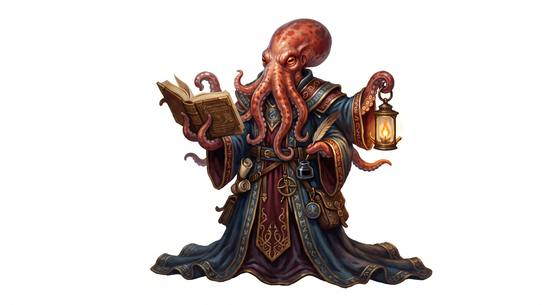

# Cephalopod folk

{.illus}

*Set: Core*

*aka: ______________________________*

*Family: [Cephalopod and mollusc](../Species_Families/cephalopod-and-mollusc.md)*

Soft-bodied, many-armed and much cleverer than they look. Cephalopod folk are octopus, squid, cuttlefish and nautilus people. Octopus-folk have eight strong, sucker-lined arms, no bones to speak of and skin that shifts colour and texture to match whatever they rest against. Squid-folk are fast, jet-driven swimmers, some glowing faintly in the deep. Cuttlefish-folk ripple with patterns as they talk; nautilus-folk drift in coiled shells, ancient and slow.

Almost all breathe water, squirt ink when frightened and pour themselves through gaps a finger wide. They are curious, solitary and dangerously intelligent, solving locks and puzzles for fun. Surface peoples find them unsettling: those eyes are too thoughtful for something with no proper face.

## Not to be confused with

*[Tentacle-faced folk](cephalopod-and-mollusc-tentacle-faced-folk.md)*, boned humanoids who walk on land and carry tentacles only about the face.

## What sets this species apart

No species-wide difference: this is the family template, and its breed lines carry the variation.

## Breeds and races

Each block below is one set of numbers; breeds that share every number share a block (Species rules, rule 9). Attributes are final modifiers, the size trade-off included. Skills, powers and weapon groups are final levels after the family, species and breed layers.

### No. 252 Octopus-folk *(genres: beast-folk: scales, feathers and shells, sea and sky; starter)*

- **Size:** medium · **Body:** other+tentacled
- **What it's like:** A clever, boneless swimmer with eight arms, colour-changing skin and ink clouds. (looks like: octopus; good at: sneaking, swimming, knowledge)
- **Attributes:** AGI +1 END −2 INT +3
- **Skills:** [Escape Artistry](../Skills/escape-artistry.md) +3, [Camouflage](../Skills/camouflage.md) +2, [Swimming](../Skills/swimming.md) +2, [Diving](../Skills/diving.md) +1, [Sleight of Hand](../Skills/sleight-of-hand.md) +1, [Lifting & Carrying](../Skills/lifting-and-carrying.md) −1, [Running](../Skills/running.md) −3, [Survival: Desert](../Skills/survival-desert.md) Foreign Concept
- **Powers:** Camouflage (power) 2, [Water Breathing](../Powers/water-breathing.md) 2, [Darkness](../Powers/darkness.md) 1
- **Weapon groups:** [Wrestling & Grappling](../Weapon_Groups/wrestling-and-grappling.md) +3
- **Natural attacks:** beak 1d6
- **For the Game Master only, this race as an NPC guard or soldier (not your character's numbers):** Attack 14 · Parry 11 · Dodge 9 · Damage longsword 1d6+2; beak 1d6+1 · Armour 2 · Life 15 · Threat 1 ([Bestiary roles](../bestiary.md))
- *Why:* Hides behind a cloud of ink.
- *Note:* Darkness stands for the ink cloud; underwater only. Intelligence is an attribute matter.

### Squid-folk *(NPC only)*

- **Size:** medium · **Body:** other+tentacled
- **Attributes:** AGI +1 END −2 INT +2
- **Skills:** [Escape Artistry](../Skills/escape-artistry.md) +3, [Swimming](../Skills/swimming.md) +3, [Camouflage](../Skills/camouflage.md) +2, [Diving](../Skills/diving.md) +1, [Sleight of Hand](../Skills/sleight-of-hand.md) +1, [Lifting & Carrying](../Skills/lifting-and-carrying.md) −1, [Running](../Skills/running.md) −3, [Survival: Desert](../Skills/survival-desert.md) Foreign Concept
- **Powers:** Camouflage (power) 2, [Water Breathing](../Powers/water-breathing.md) 2, [Darkness](../Powers/darkness.md) 1
- **Weapon groups:** [Wrestling & Grappling](../Weapon_Groups/wrestling-and-grappling.md) +3
- **Natural attacks:** beak 1d6
- **For the Game Master only, this race as an NPC guard or soldier (not your character's numbers):** Attack 14 · Parry 11 · Dodge 9 · Damage longsword 1d6+2; beak 1d6+1 · Armour 2 · Life 15 · Threat 1 ([Bestiary roles](../bestiary.md))
- *Why:* Jet-propelled swimmers that squirt ink.
- *Note:* Darkness stands for the ink cloud; underwater only. Deep variants may add Light Set 1 (bioluminescence).

### Cuttlefish-folk *(NPC only)*

- **Size:** small · **Body:** other+tentacled
- **Attributes:** STR −2 AGI +2 END −2 INT +2
- **Skills:** [Camouflage](../Skills/camouflage.md) +3, [Escape Artistry](../Skills/escape-artistry.md) +3, [Swimming](../Skills/swimming.md) +2, [Diving](../Skills/diving.md) +1, [Signals](../Skills/signals.md) +1, [Sleight of Hand](../Skills/sleight-of-hand.md) +1, [Lifting & Carrying](../Skills/lifting-and-carrying.md) −1, [Running](../Skills/running.md) −3, [Survival: Desert](../Skills/survival-desert.md) Foreign Concept
- **Powers:** Camouflage (power) 2, [Water Breathing](../Powers/water-breathing.md) 2
- **Weapon groups:** [Wrestling & Grappling](../Weapon_Groups/wrestling-and-grappling.md) +3
- **Natural attacks:** beak 1d6
- **For the Game Master only, this race as an NPC guard or soldier (not your character's numbers):** Attack 14 · Parry 11 · Dodge 11 · Damage longsword 1d6+1; beak 1d6 · Armour 2 · Life 13 · Threat minor ([Bestiary roles](../bestiary.md))
- *Why:* Masters of rapid colour and pattern change, used both to hide and to signal.

### Nautilus-folk *(NPC only)*

- **Size:** medium · **Body:** other+shelled
- **Attributes:** AGI +1 END −1 INT +1
- **Skills:** [Diving](../Skills/diving.md) +3, [Escape Artistry](../Skills/escape-artistry.md) +3, [Camouflage](../Skills/camouflage.md) +2, [Swimming](../Skills/swimming.md) +2, [Sleight of Hand](../Skills/sleight-of-hand.md) +1, [Lifting & Carrying](../Skills/lifting-and-carrying.md) −1, [Running](../Skills/running.md) −3, [Survival: Desert](../Skills/survival-desert.md) Foreign Concept
- **Powers:** [Water Breathing](../Powers/water-breathing.md) 2, [Armour Skin](../Powers/armour-skin.md) 1
- **Weapon groups:** [Wrestling & Grappling](../Weapon_Groups/wrestling-and-grappling.md) +3
- **Natural attacks:** beak 1d6
- **For the Game Master only, this race as an NPC guard or soldier (not your character's numbers):** Attack 14 · Parry 11 · Dodge 9 · Damage longsword 1d6+2; beak 1d6+1 · Armour 2 · Life 16 · Threat 1 ([Bestiary roles](../bestiary.md))
- *Why:* Shelled deep-sea drifters with no colour-changing skin.

