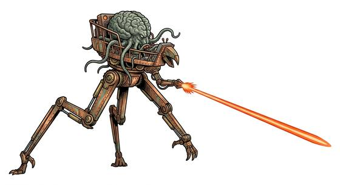

# Invader kind

{.illus}

*Set: Expansion*

*aka: ______________________________*

*Family: [Cephalopod and mollusc](../Species_Families/cephalopod-and-mollusc.md)*

Great bulging brains on small, soft, tentacled bodies. Invader kind come from a world lighter than most, and in heavier places they sag, pant and can barely lift themselves. They do not need to. Their science is far beyond that of the peoples they invade, and they cross the land in towering striding machines, sweeping cities with rays of heat and clouds of poisoned smoke.

They have no colour-changing skin and cannot breathe water; they are land dwellers through and through. They are cold, methodical and utterly confident. Their undoing, when it comes, is usually something small and humble that their clever minds forgot to consider.

## Not to be confused with

*[Tentacled overlord kind](cephalopod-and-mollusc-tentacled-overlord-kind.md)*, who conquer by seizing minds, where invader kind rely on machines and weapons.

## What sets this species apart

Large-brained land aliens with no colour-changing skin or water breathing, weak in heavier gravity.

## Breeds and races

Each block below is one set of numbers; breeds that share every number share a block (Species rules, rule 9). Attributes are final modifiers, the size trade-off included. Skills, powers and weapon groups are final levels after the family, species and breed layers.

### Tentacled invader war-machine pilots *(NPC only)*

- **Size:** large · **Body:** other
- **Attributes:** AGI −1 END −2 INT +4
- **Skills:** [Escape Artistry](../Skills/escape-artistry.md) +3, [Camouflage](../Skills/camouflage.md) +2, [Swimming](../Skills/swimming.md) +2, [Diving](../Skills/diving.md) +1, [Sleight of Hand](../Skills/sleight-of-hand.md) +1, [Lifting & Carrying](../Skills/lifting-and-carrying.md) −1, [High-Gravity Conditioning](../Skills/high-gravity-conditioning.md) −2, [Running](../Skills/running.md) −3, [Survival: Desert](../Skills/survival-desert.md) Foreign Concept
- **Weapon groups:** [Wrestling & Grappling](../Weapon_Groups/wrestling-and-grappling.md) +3
- **Natural attacks:** beak 1d6
- **For the Game Master only, this race as an NPC guard or soldier (not your character's numbers):** Attack 13 · Parry 10 · Dodge 6 · Damage longsword 1d6+2; beak 1d6+3 · Armour 2 · Life 19 · Threat 1 ([Bestiary roles](../bestiary.md))
- *Note:* Heat-rays and war machines are gear; vulnerability to microbes is a flaw.

