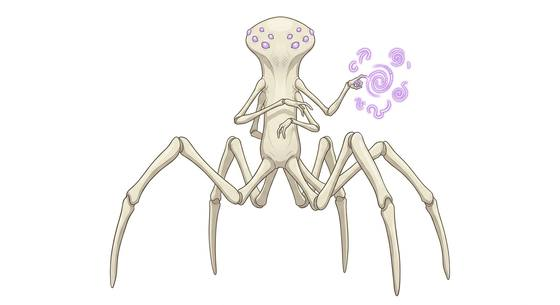

# Radial alien kind

{.illus}

*Set: Expansion*

*aka: ______________________________*

*Family: [Cephalopod and mollusc](../Species_Families/cephalopod-and-mollusc.md)*

Nothing about them is shaped like a person. Radial aliens stand on seven limbs spaced evenly around a central body, with no front, no back and no face to look at. They move in any direction without turning, see all around themselves at once and speak, when they speak to others at all, by drawing intricate circular symbols that carry a whole thought in a single ring of ink.

Strangest of all, they seem to experience time as a landscape rather than a road, knowing the end of a conversation before it begins. They are calm, courteous and deeply puzzling. Those who learn their writing say it changes how they think, and not only about language.

## Not to be confused with

*[Cephalopod folk](cephalopod-and-mollusc-cephalopod-folk.md)*, whose many arms belong to a body with a front and a back, and who meet time one moment after another like everyone else.

## What sets this species apart

Radially symmetric aliens who perceive time non-linearly and have no colour-changing skin.

## Breeds and races

Each block below is one set of numbers; breeds that share every number share a block (Species rules, rule 9). Attributes are final modifiers, the size trade-off included. Skills, powers and weapon groups are final levels after the family, species and breed layers.

### Seven-limbed radial being *(NPC only)*

- **Size:** huge · **Body:** other
- **Attributes:** STR +4 AGI −3 END −2 INT +4 WIS +3
- **Skills:** [Escape Artistry](../Skills/escape-artistry.md) +3, [Camouflage](../Skills/camouflage.md) +2, [Swimming](../Skills/swimming.md) +2, [Diving](../Skills/diving.md) +1, [Sleight of Hand](../Skills/sleight-of-hand.md) +1, [Lifting & Carrying](../Skills/lifting-and-carrying.md) −1, [Running](../Skills/running.md) −3, [Survival: Desert](../Skills/survival-desert.md) Foreign Concept
- **Powers:** [Future Seeing (Precognition)](../Powers/future-seeing-precognition.md) 2, [Water Breathing](../Powers/water-breathing.md) 2
- **Weapon groups:** [Wrestling & Grappling](../Weapon_Groups/wrestling-and-grappling.md) +3
- **For the Game Master only, this race as an NPC guard or soldier (not your character's numbers):** Attack 14 · Parry 11 · Dodge 3 · Damage longsword 1d6+2 · Armour 2 · Life 23 · Threat 2 ([Bestiary roles](../bestiary.md))
- *Note:* Its circular written language is lexicon detail.

