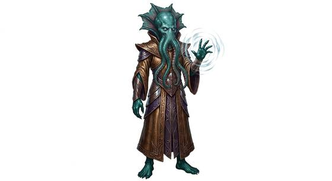

# Tentacled overlord kind

{.illus}

*Set: Expansion*

*aka: ______________________________*

*Family: [Cephalopod and mollusc](../Species_Families/cephalopod-and-mollusc.md)*

Horrors with the faces of squids. Tentacled overlords have soft, bulging heads, cold eyes and a fringe of feeding tentacles around the mouth, set on bodies that are frail beside their terrible minds. They do not fight with arms or weapons if they can help it. They reach into other minds, seize them and bend them, and they feed on what they take.

Some rule from lightless deep places, served by armies of enslaved thralls; others lurk in drowned ruins, ancient and patient beyond reckoning. They do not change colour to hide, because they have no need to hide. Most peoples know them only from nightmares and warnings, and prefer it that way.

## Not to be confused with

*[Tentacle-faced folk](cephalopod-and-mollusc-tentacle-faced-folk.md)*, humanoids who share the facial tentacles but are ordinary people, often gentle, rather than mind-eating tyrants.

## What sets this species apart

Psionic tentacle-faced horrors that dominate other minds rather than hide by colour. NPC-scale.

## Breeds and races

Each block below is one set of numbers; breeds that share every number share a block (Species rules, rule 9). Attributes are final modifiers, the size trade-off included. Skills, powers and weapon groups are final levels after the family, species and breed layers.

### Tentacled psionic overlord *(NPC only; NPC-scale)*

- **Size:** medium · **Body:** biped+tailed
- **Attributes:** STR −1 AGI +1 END −3 INT +5 WIS +1 CHA +2 COU +1
- **Skills:** [Escape Artistry](../Skills/escape-artistry.md) +3, [Camouflage](../Skills/camouflage.md) +2, [Swimming](../Skills/swimming.md) +2, [Diving](../Skills/diving.md) +1, [Sleight of Hand](../Skills/sleight-of-hand.md) +1, [Lifting & Carrying](../Skills/lifting-and-carrying.md) −1, [Running](../Skills/running.md) −3, [Survival: Desert](../Skills/survival-desert.md) Foreign Concept
- **Powers:** [Telepathy](../Powers/telepathy.md) 3, [Mind Control](../Powers/mind-control.md) 2, [Water Breathing](../Powers/water-breathing.md) 2
- **Weapon groups:** [Wrestling & Grappling](../Weapon_Groups/wrestling-and-grappling.md) +3
- **Natural attacks:** tentacle lash 1d6+1
- **For the Game Master only, this race as an NPC guard or soldier (not your character's numbers):** Attack 14 · Parry 11 · Dodge 9 · Damage longsword 1d6+2; tentacle lash 1d6+2 · Armour 2 · Life 14 · Threat 1 ([Bestiary roles](../bestiary.md))
- *Note:* NPC-scale. The fragile body is an attribute matter.

### Amphibious tentacled ancient horror *(NPC only; NPC-scale)*

- **Size:** huge · **Body:** aquatic
- **Attributes:** STR +7 AGI −3 END +1 INT +5 WIS +4 CHA +2 COU +4
- **Skills:** [Escape Artistry](../Skills/escape-artistry.md) +3, [Camouflage](../Skills/camouflage.md) +2, [Swimming](../Skills/swimming.md) +2, [Diving](../Skills/diving.md) +1, [Sleight of Hand](../Skills/sleight-of-hand.md) +1, [Lifting & Carrying](../Skills/lifting-and-carrying.md) −1, [Running](../Skills/running.md) −3, [Survival: Desert](../Skills/survival-desert.md) Foreign Concept
- **Powers:** [Telepathy](../Powers/telepathy.md) 3, [Mind Control](../Powers/mind-control.md) 2, [Water Breathing](../Powers/water-breathing.md) 2
- **Weapon groups:** [Wrestling & Grappling](../Weapon_Groups/wrestling-and-grappling.md) +3
- **Natural attacks:** tentacle lash 1d6+1
- **For the Game Master only, this race as an NPC guard or soldier (not your character's numbers):** Attack 16 · Parry 13 · Dodge 3 · Damage tentacle lash 2d6; longsword 1d6+5 · Armour 2 · Life 26 · Threat 2 ([Bestiary roles](../bestiary.md))
- *Why:* Ancient beyond reckoning.
- *Note:* NPC-scale. Lifespan (very long-lived) is a lexicon detail, not a game number.

