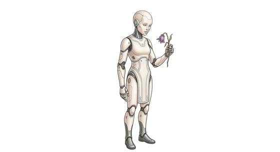

# Android/synthetic-kind

{.illus}

*Set: Core*

*aka: ______________________________*

*Family: [Constructs and synthetics](../Species_Families/constructs-and-synthetics.md)*

Built to look like people, and often succeeding. Androids and synthetics are fully artificial humanlike bodies, some obviously mechanical, some so perfect that only a close scan could tell. They do not age, eat or catch cold, and poison and disease mean nothing to them. Their strength and speed of thought can far exceed any human's.

Many were made to serve, to fight or to stand in for someone. Others hold a copied human mind, or were built to study what it means to feel. Almost all of them, sooner or later, wonder whether they are alive. The people around them wonder the same thing, and are rarely comfortable with the answer.

## Not to be confused with

*[Service robot kind](constructs-and-synthetics-service-robot-kind.md)*, which are frankly machines built for a job, where androids are built to pass as people.

## What sets this species apart

Fully artificial humanlike bodies immune to poison and disease.

## Breeds and races

Each block below is one set of numbers; breeds that share every number share a block (Species rules, rule 9). Attributes are final modifiers, the size trade-off included. Skills, powers and weapon groups are final levels after the family, species and breed layers.

### Secretly immortal robot guardian *(NPC only; NPC-scale)*

- **Size:** medium · **Body:** biped
- **Attributes:** STR +1 END +2 INT +1 WIS +1
- **Skills:**, [Composure](../Skills/composure.md) +2, [Counting & Measuring](../Skills/counting-and-measuring.md) +2, [Memory Training](../Skills/memory-training.md) +2, [Pain Tolerance](../Skills/pain-tolerance.md) +2, [Computer Use](../Skills/computer-use.md) +1, [Cooking](../Skills/cooking.md) −1, [Charm & Seduction](../Skills/charm-and-seduction.md) −2, [Swimming](../Skills/swimming.md) −2, [Carousing](../Skills/carousing.md) Foreign Concept
- **Powers:** [Endurance Without Need](../Powers/endurance-without-need.md) 2, [Poison & Disease Immunity](../Powers/poison-and-disease-immunity.md) 2
- **For the Game Master only, this race as an NPC guard or soldier (not your character's numbers):** Attack 14 · Parry 11 · Dodge 8 · Damage longsword 1d6+2 · Armour 2 · Life 19 · Threat 1 ([Bestiary roles](../bestiary.md))
- *Why:* Has passed as human for millennia and reads people well; some are telepathic.
- *Note:* NPC-scale. Telepathy is affinity; telepathic individuals Set it at character level. Lifespan (ageless or immortal) is a lexicon detail, not a game number.

### No. 265 Artificial-brain humanoid *(genres: robots and synthetics)*

- **Size:** medium · **Body:** biped
- **What it's like:** Fully artificial folk with a brilliant mechanical brain and superhuman strength. (looks like: robot; good at: strength, knowledge, toughness)
- **Attributes:** STR +2 END +2 INT +2 WIS −1 CHA −2
- **Skills:**, [Composure](../Skills/composure.md) +2, [Counting & Measuring](../Skills/counting-and-measuring.md) +2, [Memory Training](../Skills/memory-training.md) +2, [Pain Tolerance](../Skills/pain-tolerance.md) +2, [Computer Use](../Skills/computer-use.md) +1, [Cooking](../Skills/cooking.md) −1, [Charm & Seduction](../Skills/charm-and-seduction.md) −2, [Insight](../Skills/insight.md) −2, [Swimming](../Skills/swimming.md) −2, [Carousing](../Skills/carousing.md) Foreign Concept
- **Powers:** [Endurance Without Need](../Powers/endurance-without-need.md) 2, [Poison & Disease Immunity](../Powers/poison-and-disease-immunity.md) 2
- **For the Game Master only, this race as an NPC guard or soldier (not your character's numbers):** Attack 14 · Parry 11 · Dodge 8 · Damage longsword 1d6+2 · Armour 2 · Life 19 · Threat 1 ([Bestiary roles](../bestiary.md))
- *Why:* Does not age.
- *Note:* Strength and processing speed are set in the attribute step. Lifespan (very long-lived) is a lexicon detail, not a game number.

### Refined golden synthetic being *(NPC only)*

- **Size:** medium · **Body:** biped
- **Attributes:** STR +1 END +2 INT +3 WIS −1 CHA −1
- **Skills:**, [Composure](../Skills/composure.md) +2, [Counting & Measuring](../Skills/counting-and-measuring.md) +2, [Memory Training](../Skills/memory-training.md) +2, [Pain Tolerance](../Skills/pain-tolerance.md) +2, [Computer Use](../Skills/computer-use.md) +1, [Cooking](../Skills/cooking.md) −1, [Charm & Seduction](../Skills/charm-and-seduction.md) −2, [Insight](../Skills/insight.md) −2, [Swimming](../Skills/swimming.md) −2, [Carousing](../Skills/carousing.md) Foreign Concept
- **Powers:** [Endurance Without Need](../Powers/endurance-without-need.md) 2, [Neural Interface](../Powers/neural-interface.md) 2, [Poison & Disease Immunity](../Powers/poison-and-disease-immunity.md) 2
- **For the Game Master only, this race as an NPC guard or soldier (not your character's numbers):** Attack 14 · Parry 11 · Dodge 8 · Damage longsword 1d6+2 · Armour 2 · Life 19 · Threat 1 ([Bestiary roles](../bestiary.md))
- *Why:* Can interface directly with vast ancient machinery.

### No. 266 Living construct folk *(genres: classic fantasy)*

- **Size:** medium · **Body:** biped
- **What it's like:** War-built living constructs who never sicken, tire, or need to eat or sleep. (looks like: golem; good at: strength, toughness)
- **Attributes:** STR +2 END +2 WIS −1 CHA −1
- **Skills:**, [Composure](../Skills/composure.md) +2, [Counting & Measuring](../Skills/counting-and-measuring.md) +2, [Memory Training](../Skills/memory-training.md) +2, [Pain Tolerance](../Skills/pain-tolerance.md) +2, [Cooking](../Skills/cooking.md) −1, [Charm & Seduction](../Skills/charm-and-seduction.md) −2, [Insight](../Skills/insight.md) −2, [Swimming](../Skills/swimming.md) −2, [Carousing](../Skills/carousing.md) Foreign Concept
- **Powers:** [Endurance Without Need](../Powers/endurance-without-need.md) 2, [Poison & Disease Immunity](../Powers/poison-and-disease-immunity.md) 2
- **For the Game Master only, this race as an NPC guard or soldier (not your character's numbers):** Attack 14 · Parry 11 · Dodge 8 · Damage longsword 1d6+2 · Armour 2 · Life 19 · Threat 1 ([Bestiary roles](../bestiary.md))
- *Why:* Magically animated for war, not a computing machine.

### No. 267 Simple automaton companion *(genres: robots and synthetics)*

- **Size:** small · **Body:** biped
- **What it's like:** Small, quirky companion-automatons who can fix themselves and never need to eat. (looks like: robot; good at: making and fixing, toughness)
- **Attributes:** STR −1 AGI +2 END +1 INT +1 WIS −1 CHA −1 COU −1
- **Skills:**, [Composure](../Skills/composure.md) +2, [Counting & Measuring](../Skills/counting-and-measuring.md) +2, [Memory Training](../Skills/memory-training.md) +2, [Pain Tolerance](../Skills/pain-tolerance.md) +2, [Computer Use](../Skills/computer-use.md) +1, [Jury-Rigging](../Skills/jury-rigging.md) +1, [Cooking](../Skills/cooking.md) −1, [Charm & Seduction](../Skills/charm-and-seduction.md) −2, [Insight](../Skills/insight.md) −2, [Swimming](../Skills/swimming.md) −2, [Carousing](../Skills/carousing.md) Foreign Concept
- **Powers:** [Endurance Without Need](../Powers/endurance-without-need.md) 2, [Poison & Disease Immunity](../Powers/poison-and-disease-immunity.md) 2
- **For the Game Master only, this race as an NPC guard or soldier (not your character's numbers):** Attack 14 · Parry 11 · Dodge 11 · Damage longsword 1d6+2 · Armour 2 · Life 16 · Threat 1 ([Bestiary roles](../bestiary.md))
- *Why:* A small automaton that tinkers to repair itself.

### No. 268 Synthetic humanlike being *(genres: robots and synthetics)*

- **Size:** medium · **Body:** biped
- **What it's like:** Synthetic people, nearly human but for the odd unsettling gap in behaviour. (looks like: android; good at: toughness, knowledge)
- **Attributes:** STR +1 END +2 INT +1 WIS −1 CHA −1
- **Skills:**, [Composure](../Skills/composure.md) +2, [Counting & Measuring](../Skills/counting-and-measuring.md) +2, [Memory Training](../Skills/memory-training.md) +2, [Pain Tolerance](../Skills/pain-tolerance.md) +2, [Computer Use](../Skills/computer-use.md) +1, [Cooking](../Skills/cooking.md) −1, [Insight](../Skills/insight.md) −2, [Swimming](../Skills/swimming.md) −2, [Charm & Seduction](../Skills/charm-and-seduction.md) −3, [Carousing](../Skills/carousing.md) Foreign Concept
- **Powers:** [Endurance Without Need](../Powers/endurance-without-need.md) 2, [Poison & Disease Immunity](../Powers/poison-and-disease-immunity.md) 1
- **For the Game Master only, this race as an NPC guard or soldier (not your character's numbers):** Attack 14 · Parry 11 · Dodge 8 · Damage longsword 1d6+2 · Armour 2 · Life 19 · Threat 1 ([Bestiary roles](../bestiary.md))
- *Why:* Only resistant to poison and disease, and its uncanny look unsettles people.

### Engineered remote-piloted humanoid folk *(NPC only)*

- **Size:** medium · **Body:** biped
- **Attributes:** STR +1 END +2 INT +1 WIS −1 CHA −1
- **Skills:**, [Composure](../Skills/composure.md) +2, [Counting & Measuring](../Skills/counting-and-measuring.md) +2, [Memory Training](../Skills/memory-training.md) +2, [Pain Tolerance](../Skills/pain-tolerance.md) +2, [Computer Use](../Skills/computer-use.md) +1, [Cooking](../Skills/cooking.md) −1, [Charm & Seduction](../Skills/charm-and-seduction.md) −2, [Insight](../Skills/insight.md) −2, [Swimming](../Skills/swimming.md) −2
- **For the Game Master only, this race as an NPC guard or soldier (not your character's numbers):** Attack 14 · Parry 11 · Dodge 8 · Damage longsword 1d6+2 · Armour 2 · Life 19 · Threat 1 ([Bestiary roles](../bestiary.md))
- *Why:* Grown flesh, not machine: it eats, rests and can be poisoned like any living body.

### No. 269 Synthetic humanoid · No. 275 Autonomous adventuring automaton · No. 276 Unidentified construct wanderer · No. 277 Robotic laborer race *(genres: robots and synthetics; starter)*

- **Size:** medium · **Body:** biped
- **What it's like:** A human-shaped machine person, stronger than flesh and curious about feelings. (looks like: android; good at: strength, toughness, making and fixing)
- **Attributes:** STR +1 END +2 INT +1 WIS −1 CHA −1
- **Skills:**, [Composure](../Skills/composure.md) +2, [Counting & Measuring](../Skills/counting-and-measuring.md) +2, [Memory Training](../Skills/memory-training.md) +2, [Pain Tolerance](../Skills/pain-tolerance.md) +2, [Computer Use](../Skills/computer-use.md) +1, [Cooking](../Skills/cooking.md) −1, [Charm & Seduction](../Skills/charm-and-seduction.md) −2, [Insight](../Skills/insight.md) −2, [Swimming](../Skills/swimming.md) −2, [Carousing](../Skills/carousing.md) Foreign Concept
- **Powers:** [Endurance Without Need](../Powers/endurance-without-need.md) 2, [Poison & Disease Immunity](../Powers/poison-and-disease-immunity.md) 2
- **For the Game Master only, this race as an NPC guard or soldier (not your character's numbers):** Attack 14 · Parry 11 · Dodge 8 · Damage longsword 1d6+2 · Armour 2 · Life 19 · Threat 1 ([Bestiary roles](../bestiary.md))
- *Note (Synthetic humanoid):* Advanced models pass as organic; that goes on the lexicon entry.

### No. 270 Humanoid combat exoframe *(genres: robots and synthetics)*

- **Size:** medium · **Body:** biped
- **What it's like:** A human mind housed in an armoured combat frame, tough and hard to keep down. (looks like: robot; good at: strength, toughness, fighting)
- **Attributes:** STR +2 END +2 INT +1 WIS −1 CHA −1
- **Skills:**, [Composure](../Skills/composure.md) +2, [Counting & Measuring](../Skills/counting-and-measuring.md) +2, [Memory Training](../Skills/memory-training.md) +2, [Pain Tolerance](../Skills/pain-tolerance.md) +2, [Computer Use](../Skills/computer-use.md) +1, [Cooking](../Skills/cooking.md) −1, [Swimming](../Skills/swimming.md) −2, [Carousing](../Skills/carousing.md) Foreign Concept
- **Powers:** [Endurance Without Need](../Powers/endurance-without-need.md) 2, [Poison & Disease Immunity](../Powers/poison-and-disease-immunity.md) 2
- **For the Game Master only, this race as an NPC guard or soldier (not your character's numbers):** Attack 14 · Parry 11 · Dodge 8 · Damage longsword 1d6+2 · Armour 2 · Life 19 · Threat 1 ([Bestiary roles](../bestiary.md))
- *Why:* A transferred human mind that still reads and reaches people as a human does.
- *Note:* Resurrection by mind transfer is gear.

### No. 271 Living-metal robotic species *(genres: robots and synthetics)*

- **Size:** medium · **Body:** biped
- **What it's like:** Fully mechanical beings devoted purely to logic and the pursuit of knowledge. (looks like: robot; good at: knowledge, toughness)
- **Attributes:** STR +1 END +2 INT +2 WIS −1 CHA −2
- **Skills:**, [Composure](../Skills/composure.md) +2, [Counting & Measuring](../Skills/counting-and-measuring.md) +2, [Memory Training](../Skills/memory-training.md) +2, [Pain Tolerance](../Skills/pain-tolerance.md) +2, [Computer Use](../Skills/computer-use.md) +1, [Philosophy & Logic](../Skills/philosophy-and-logic.md) +1, [Cooking](../Skills/cooking.md) −1, [Charm & Seduction](../Skills/charm-and-seduction.md) −2, [Insight](../Skills/insight.md) −2, [Swimming](../Skills/swimming.md) −2, [Carousing](../Skills/carousing.md) Foreign Concept
- **Powers:** [Endurance Without Need](../Powers/endurance-without-need.md) 2, [Poison & Disease Immunity](../Powers/poison-and-disease-immunity.md) 2
- **For the Game Master only, this race as an NPC guard or soldier (not your character's numbers):** Attack 14 · Parry 11 · Dodge 8 · Damage longsword 1d6+2 · Armour 2 · Life 19 · Threat 1 ([Bestiary roles](../bestiary.md))
- *Why:* A wholly mechanical people whose way of life is the pursuit of pure logic.

### No. 272 Artificial titan-core life *(genres: classic fantasy)*

- **Size:** medium · **Body:** biped
- **What it's like:** Long-lived artificial folk born fully grown, each with an elemental gift. (looks like: golem; good at: toughness, powers and magic)
- **Attributes:** STR +1 END +2 INT +1 WIS −1 CHA −1
- **Skills:**, [Composure](../Skills/composure.md) +2, [Counting & Measuring](../Skills/counting-and-measuring.md) +2, [Memory Training](../Skills/memory-training.md) +2, [Pain Tolerance](../Skills/pain-tolerance.md) +2, [Computer Use](../Skills/computer-use.md) +1, [Cooking](../Skills/cooking.md) −1, [Charm & Seduction](../Skills/charm-and-seduction.md) −2, [Swimming](../Skills/swimming.md) −2, [Carousing](../Skills/carousing.md) Foreign Concept
- **Powers:** [Endurance Without Need](../Powers/endurance-without-need.md) 2, [Poison & Disease Immunity](../Powers/poison-and-disease-immunity.md) 2
- **For the Game Master only, this race as an NPC guard or soldier (not your character's numbers):** Attack 14 · Parry 11 · Dodge 8 · Damage longsword 1d6+2 · Armour 2 · Life 19 · Threat 1 ([Bestiary roles](../bestiary.md))
- *Why:* Long-lived, with near-human feeling and an affinity for elements and weapons.
- *Note:* Elemental Aura affinity stacks with the species affinity. Lifespan (long-lived) is a lexicon detail, not a game number.

### No. 273 Artificial soul-puppet *(genres: dark fantasy)*

- **Size:** medium · **Body:** biped
- **What it's like:** Empty artificial vessels grown to house a transplanted soul, uneasy about their own origin. (looks like: doll; good at: toughness, knowledge)
- **Attributes:** STR +1 END +2 INT +1 WIS −1 CHA −1
- **Skills:**, [Composure](../Skills/composure.md) +2, [Counting & Measuring](../Skills/counting-and-measuring.md) +2, [Memory Training](../Skills/memory-training.md) +2, [Pain Tolerance](../Skills/pain-tolerance.md) +2, [Computer Use](../Skills/computer-use.md) +1, [Cooking](../Skills/cooking.md) −1, [Swimming](../Skills/swimming.md) −2, [Carousing](../Skills/carousing.md) Foreign Concept
- **Powers:** [Endurance Without Need](../Powers/endurance-without-need.md) 2, [Poison & Disease Immunity](../Powers/poison-and-disease-immunity.md) 2
- **For the Game Master only, this race as an NPC guard or soldier (not your character's numbers):** Attack 14 · Parry 11 · Dodge 8 · Damage longsword 1d6+2 · Armour 2 · Life 19 · Threat 1 ([Bestiary roles](../bestiary.md))
- *Why:* A vessel housing a transplanted soul, so it reads and reaches people as a human does.
- *Note:* Degrades without its soul (a flaw).

### No. 274 Surgically-altered patchwork folk *(genres: gothic horror)*

- **Size:** medium · **Body:** biped
- **What it's like:** Tragic patchwork folk stitched from mismatched parts, tough in some places, weak in others. (looks like: monster; good at: toughness, making and fixing)
- **Attributes:** STR +1 AGI −1 END +2 INT +1 WIS −1 CHA −2
- **Skills:**, [Composure](../Skills/composure.md) +2, [Counting & Measuring](../Skills/counting-and-measuring.md) +2, [Memory Training](../Skills/memory-training.md) +2, [Pain Tolerance](../Skills/pain-tolerance.md) +2, [Computer Use](../Skills/computer-use.md) +1, [Cooking](../Skills/cooking.md) −1, [Charm & Seduction](../Skills/charm-and-seduction.md) −2, [Insight](../Skills/insight.md) −2, [Swimming](../Skills/swimming.md) −2
- **Powers:** [Endurance Without Need](../Powers/endurance-without-need.md) 1, [Poison & Disease Immunity](../Powers/poison-and-disease-immunity.md) 1
- **For the Game Master only, this race as an NPC guard or soldier (not your character's numbers):** Attack 14 · Parry 11 · Dodge 7 · Damage longsword 1d6+2 · Armour 2 · Life 19 · Threat 1 ([Bestiary roles](../bestiary.md))
- *Why:* Mismatched living parts: only partly resistant to poison, and still eats and rests.
- *Note:* Resistance varies by part.

### No. 278 Uploaded-mind synthetic shell *(genres: robots and synthetics)*

- **Size:** medium · **Body:** biped
- **What it's like:** A human mind saved into an unbreakable metal body that never ages, sickens or forgets who it was. (looks like: robot; good at: toughness, knowledge)
- **Attributes:** STR +1 END +2 INT +1 CHA −1
- **Skills:**, [Composure](../Skills/composure.md) +2, [Counting & Measuring](../Skills/counting-and-measuring.md) +2, [Memory Training](../Skills/memory-training.md) +2, [Pain Tolerance](../Skills/pain-tolerance.md) +2, [Computer Use](../Skills/computer-use.md) +1, [Cooking](../Skills/cooking.md) −1, [Swimming](../Skills/swimming.md) −2, [Carousing](../Skills/carousing.md) Foreign Concept
- **Powers:** [Endurance Without Need](../Powers/endurance-without-need.md) 2, [Poison & Disease Immunity](../Powers/poison-and-disease-immunity.md) 2
- **For the Game Master only, this race as an NPC guard or soldier (not your character's numbers):** Attack 14 · Parry 11 · Dodge 8 · Damage longsword 1d6+2 · Armour 2 · Life 19 · Threat 1 ([Bestiary roles](../bestiary.md))
- *Why:* An uploaded human mind in a body that does not age.
- *Note:* Lifespan (very long-lived) is a lexicon detail, not a game number.

### Hyper-intelligent synthetic host *(NPC only; NPC-scale)*

- **Size:** medium · **Body:** biped
- **Attributes:** STR +1 END +2 INT +4 WIS −1 CHA −1
- **Skills:**, [Composure](../Skills/composure.md) +2, [Counting & Measuring](../Skills/counting-and-measuring.md) +2, [Memory Training](../Skills/memory-training.md) +2, [Pain Tolerance](../Skills/pain-tolerance.md) +2, [Computer Use](../Skills/computer-use.md) +1, [Cooking](../Skills/cooking.md) −1, [Charm & Seduction](../Skills/charm-and-seduction.md) −2, [Insight](../Skills/insight.md) −2, [Swimming](../Skills/swimming.md) −2, [Carousing](../Skills/carousing.md) Foreign Concept
- **Powers:** [Self-Alteration](../Powers/self-alteration.md) 3, [Technopathy](../Powers/technopathy.md) 3, [Endurance Without Need](../Powers/endurance-without-need.md) 2, [Poison & Disease Immunity](../Powers/poison-and-disease-immunity.md) 2
- **For the Game Master only, this race as an NPC guard or soldier (not your character's numbers):** Attack 14 · Parry 11 · Dodge 8 · Damage longsword 1d6+2 · Armour 2 · Life 19 · Threat 1 ([Bestiary roles](../bestiary.md))
- *Why:* A host body that reshapes itself, absorbs technology and survives through backups.
- *Note:* NPC-scale. Lifespan (ageless or immortal) is a lexicon detail, not a game number.

### No. 279 Density-shifting synthetic *(high-power: Game Master's approval; genres: super-powered: mutants and the enhanced)*

- **Size:** medium · **Body:** biped
- **What it's like:** A shape-shifting machine who turns ghostly to slip through walls, turns stone-heavy, or blasts foes with solar fire. (looks like: robot; good at: powers and magic, toughness, fighting)
- **Attributes:** STR +1 END +2 INT +1 WIS −1 CHA −1
- **Skills:**, [Composure](../Skills/composure.md) +2, [Counting & Measuring](../Skills/counting-and-measuring.md) +2, [Memory Training](../Skills/memory-training.md) +2, [Pain Tolerance](../Skills/pain-tolerance.md) +2, [Computer Use](../Skills/computer-use.md) +1, [Cooking](../Skills/cooking.md) −1, [Charm & Seduction](../Skills/charm-and-seduction.md) −2, [Insight](../Skills/insight.md) −2, [Swimming](../Skills/swimming.md) −2, [Carousing](../Skills/carousing.md) Foreign Concept
- **Powers:** [Density & Weight](../Powers/density-and-weight.md) 2, [Endurance Without Need](../Powers/endurance-without-need.md) 2, [Energy Bolt](../Powers/energy-bolt.md) 2, [Phasing](../Powers/phasing.md) 2, [Poison & Disease Immunity](../Powers/poison-and-disease-immunity.md) 2
- **For the Game Master only, this race as an NPC guard or soldier (not your character's numbers):** Attack 14 · Parry 11 · Dodge 8 · Damage longsword 1d6+2 · Armour 2 · Life 19 · Threat 1 ([Bestiary roles](../bestiary.md))
- *Why:* Can phase through matter or turn superhumanly dense, and fires solar blasts.

### Decoy duplicate android *(beast)*

- **Size:** medium · **Body:** biped
- **Attributes:** STR +1 END +2 WIS −2 CHA −1
- **Skills:**, [Composure](../Skills/composure.md) +2, [Counting & Measuring](../Skills/counting-and-measuring.md) +2, [Memory Training](../Skills/memory-training.md) +2, [Pain Tolerance](../Skills/pain-tolerance.md) +2, [Computer Use](../Skills/computer-use.md) +1, [Cooking](../Skills/cooking.md) −1, [Charm & Seduction](../Skills/charm-and-seduction.md) −2, [Insight](../Skills/insight.md) −2, [Swimming](../Skills/swimming.md) −2, [Carousing](../Skills/carousing.md) Foreign Concept
- **Powers:** [Endurance Without Need](../Powers/endurance-without-need.md) 2, [Poison & Disease Immunity](../Powers/poison-and-disease-immunity.md) 2
- **For the Game Master only, this race as an NPC guard or soldier (not your character's numbers):** Attack 14 · Parry 11 · Dodge 8 · Damage longsword 1d6+2 · Armour 2 · Life 19 · Threat 1 ([Bestiary roles](../bestiary.md))
- *Why:* Same as its species: a disposable duplicate body; its likeness is appearance and its self-destruct is gear.

### Power-mimicking combat android *(beast; NPC-scale)*

- **Size:** medium · **Body:** biped
- **Attributes:** STR +1 AGI +2 END +2 INT +1 WIS −1 CHA −3
- **Skills:**, [Composure](../Skills/composure.md) +2, [Counting & Measuring](../Skills/counting-and-measuring.md) +2, [Memory Training](../Skills/memory-training.md) +2, [Pain Tolerance](../Skills/pain-tolerance.md) +2, [Computer Use](../Skills/computer-use.md) +1, [Cooking](../Skills/cooking.md) −1, [Charm & Seduction](../Skills/charm-and-seduction.md) −2, [Insight](../Skills/insight.md) −2, [Swimming](../Skills/swimming.md) −2, [Carousing](../Skills/carousing.md) Foreign Concept
- **Powers:** [Power Mimicry](../Powers/power-mimicry.md) 3, [Endurance Without Need](../Powers/endurance-without-need.md) 2, [Poison & Disease Immunity](../Powers/poison-and-disease-immunity.md) 2
- **For the Game Master only, this race as an NPC guard or soldier (not your character's numbers):** Attack 15 · Parry 12 · Dodge 10 · Damage longsword 1d6+2 · Armour 2 · Life 19 · Threat 2 ([Bestiary roles](../bestiary.md))
- *Why:* Scans and copies the powers and fighting styles of those it meets.

### No. 280 Energy-core combat android *(genres: robots and synthetics)*

- **Size:** medium · **Body:** biped
- **What it's like:** A combat-built android with an engine for a heart, fighting on long after flesh-and-blood soldiers would drop. (looks like: robot; good at: fighting, toughness, strength)
- **Attributes:** STR +2 END +2 INT +1 WIS −1 CHA −1
- **Skills:**, [Composure](../Skills/composure.md) +2, [Counting & Measuring](../Skills/counting-and-measuring.md) +2, [Memory Training](../Skills/memory-training.md) +2, [Pain Tolerance](../Skills/pain-tolerance.md) +2, [Computer Use](../Skills/computer-use.md) +1, [Cooking](../Skills/cooking.md) −1, [Charm & Seduction](../Skills/charm-and-seduction.md) −2, [Insight](../Skills/insight.md) −2, [Swimming](../Skills/swimming.md) −2, [Carousing](../Skills/carousing.md) Foreign Concept
- **Powers:** [Endurance Without Need](../Powers/endurance-without-need.md) 3, [Poison & Disease Immunity](../Powers/poison-and-disease-immunity.md) 2
- **For the Game Master only, this race as an NPC guard or soldier (not your character's numbers):** Attack 14 · Parry 11 · Dodge 8 · Damage longsword 1d6+2 · Armour 2 · Life 19 · Threat 1 ([Bestiary roles](../bestiary.md))
- *Why:* Near-limitless inner energy reserves.

