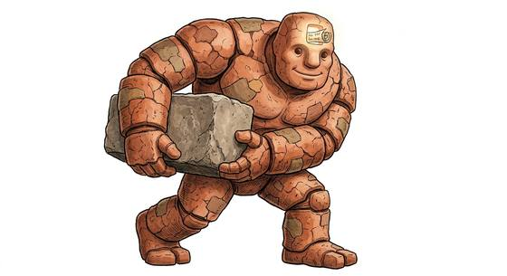

# Construct-kind

{.illus}

*Set: Core*

*aka: ______________________________*

*Family: [Constructs and synthetics](../Species_Families/constructs-and-synthetics.md)*

Made things that move. Construct-kind are bodies of clay, stone, bronze, wood, bone or stitched parts, brought to life by magic, ritual or a sacred word written on a slip and placed in the head. Some are great golems that dig, carry and guard without tiring; some are bronze giants that pace a shoreline; some are tiny homunculi grown in a flask; some are cobbled from animal bones by a vengeful shaman, and may turn on their maker.

Most obey their creator literally and have little will of their own, though a few learn to want things. They are strong, tireless and patient. Poison troubles the stone and metal ones not at all; the flesh-built ones are less lucky.

## Not to be confused with

*[Android/synthetic-kind](constructs-and-synthetics-android-synthetic-kind.md)*, bodies built by engineering and science rather than animated by spell or ritual.

## What sets this species apart

Magically or ritually animated matter rather than computing machines. Poison immunity varies (golems yes, flesh homunculi no) and is left to the Breed/Race layer.

## Breeds and races

Each block below is one set of numbers; breeds that share every number share a block (Species rules, rule 9). Attributes are final modifiers, the size trade-off included. Skills, powers and weapon groups are final levels after the family, species and breed layers.

### Bone-and-spirit animated servant *(NPC only)*

- **Size:** varies · **Body:** other
- **Attributes:** STR +2 AGI −1 END +2 WIS −1 CHA −2
- **Skills:**, [Composure](../Skills/composure.md) +2, [Counting & Measuring](../Skills/counting-and-measuring.md) +2, [Memory Training](../Skills/memory-training.md) +2, [Pain Tolerance](../Skills/pain-tolerance.md) +2, [Cooking](../Skills/cooking.md) −1, [Charm & Seduction](../Skills/charm-and-seduction.md) −2, [Insight](../Skills/insight.md) −2, [Swimming](../Skills/swimming.md) −2, [Carousing](../Skills/carousing.md) Foreign Concept
- **Powers:** [Endurance Without Need](../Powers/endurance-without-need.md) 2, [Poison & Disease Immunity](../Powers/poison-and-disease-immunity.md) 2
- **For the Game Master only, this race as an NPC guard or soldier (not your character's numbers):** Attack 14 · Parry 11 · Dodge 7 · Damage longsword 1d6+2 · Armour 2 · Life 19 · Threat 1 ([Bestiary roles](../bestiary.md))
- *Why:* Animated bone, immune to poison and disease, but it needs periodic spiritual feeding.
- *Note:* Keeps the family's Endurance Without Need, but must be spiritually fed now and then (a flaw). Its body can be reshaped by its maker.

### No. 263 Clay-bodied labor golem *(genres: classic fantasy; starter)*

- **Size:** large · **Body:** biped
- **What it's like:** A huge, tireless clay giant brought to life by magic words. (looks like: statue; good at: strength, toughness, making and fixing)
- **Attributes:** STR +6 AGI −2 END +2 WIS −1 CHA −2
- **Skills:**, [Composure](../Skills/composure.md) +2, [Counting & Measuring](../Skills/counting-and-measuring.md) +2, [Memory Training](../Skills/memory-training.md) +2, [Pain Tolerance](../Skills/pain-tolerance.md) +2, [Cooking](../Skills/cooking.md) −1, [Charm & Seduction](../Skills/charm-and-seduction.md) −2, [Insight](../Skills/insight.md) −2, [Carousing](../Skills/carousing.md) Foreign Concept, [Swimming](../Skills/swimming.md) Foreign Concept
- **Powers:** [Endurance Without Need](../Powers/endurance-without-need.md) 2, [Poison & Disease Immunity](../Powers/poison-and-disease-immunity.md) 2
- **Natural attacks:** slam 1d6+1
- **For the Game Master only, this race as an NPC guard or soldier (not your character's numbers):** Attack 15 · Parry 12 · Dodge 5 · Damage longsword 1d6+2; slam 1d6+4 · Armour 2 · Life 23 · Threat 2 ([Bestiary roles](../bestiary.md))
- *Why:* Fired clay, immune to poison and disease; water ruins it.
- *Note:* Strength is set in the attribute step.

### Sentient living-wood ship *(NPC only)*

- **Size:** huge · **Body:** other
- **Attributes:** STR +6 AGI −4 END +2 CHA −2
- **Skills:**, [Composure](../Skills/composure.md) +2, [Counting & Measuring](../Skills/counting-and-measuring.md) +2, [Memory Training](../Skills/memory-training.md) +2, [Pain Tolerance](../Skills/pain-tolerance.md) +2, [Sea Navigation](../Skills/sea-navigation.md) +2, [Cooking](../Skills/cooking.md) −1, [Charm & Seduction](../Skills/charm-and-seduction.md) −2, [Insight](../Skills/insight.md) −2, [Swimming](../Skills/swimming.md) −2, [Carousing](../Skills/carousing.md) Foreign Concept, [Running](../Skills/running.md) Foreign Concept
- **Powers:** [Endurance Without Need](../Powers/endurance-without-need.md) 2
- **For the Game Master only, this race as an NPC guard or soldier (not your character's numbers):** Attack 14 · Parry — · Dodge 2 · Damage slam 1d6+1 · Armour 0 · Life 25 · Threat minor ([Bestiary roles](../bestiary.md))
- *Why:* A living-wood ship: it sails but cannot walk, remembers its crews, and lives very long.
- *Note:* Huge size is set in the attribute step. Lifespan (very long-lived) is a lexicon detail, not a game number. No hands: held weapons unusable.

### Guardian automaton (bronze) *(NPC only; NPC-scale)*

- **Size:** huge · **Body:** biped
- **Attributes:** STR +8 AGI −4 END +4 WIS −1 CHA −2
- **Skills:**, [Composure](../Skills/composure.md) +2, [Counting & Measuring](../Skills/counting-and-measuring.md) +2, [Memory Training](../Skills/memory-training.md) +2, [Pain Tolerance](../Skills/pain-tolerance.md) +2, [Cooking](../Skills/cooking.md) −1, [Charm & Seduction](../Skills/charm-and-seduction.md) −2, [Insight](../Skills/insight.md) −2, [Carousing](../Skills/carousing.md) Foreign Concept, [Swimming](../Skills/swimming.md) Foreign Concept
- **Powers:** [Endurance Without Need](../Powers/endurance-without-need.md) 2, [Poison & Disease Immunity](../Powers/poison-and-disease-immunity.md) 2
- **Natural attacks:** slam 1d6+1
- **For the Game Master only, this race as an NPC guard or soldier (not your character's numbers):** Attack 15 · Parry 12 · Dodge 2 · Damage slam 2d6; longsword 1d6+5 · Armour 2 · Life 29 · Threat 2 ([Bestiary roles](../bestiary.md))
- *Why:* A bronze giant, immune to poison and disease, too heavy to swim.
- *Note:* NPC-scale. Its single vein of ichor is a flaw.

### Animated clay/stone golem *(NPC only; NPC-scale)*

- **Size:** large · **Body:** biped
- **Attributes:** STR +7 AGI −2 END +4 INT −2 WIS −1 CHA −4
- **Skills:**, [Composure](../Skills/composure.md) +2, [Counting & Measuring](../Skills/counting-and-measuring.md) +2, [Memory Training](../Skills/memory-training.md) +2, [Pain Tolerance](../Skills/pain-tolerance.md) +2, [Cooking](../Skills/cooking.md) −1, [Charm & Seduction](../Skills/charm-and-seduction.md) −2, [Insight](../Skills/insight.md) −2, [Storytelling & Conversation](../Skills/storytelling-and-conversation.md) −3, [Carousing](../Skills/carousing.md) Foreign Concept, [Swimming](../Skills/swimming.md) Foreign Concept
- **Powers:** [Endurance Without Need](../Powers/endurance-without-need.md) 2, [Poison & Disease Immunity](../Powers/poison-and-disease-immunity.md) 2
- **Natural attacks:** slam 1d6+1
- **For the Game Master only, this race as an NPC guard or soldier (not your character's numbers):** Attack 15 · Parry 12 · Dodge 5 · Damage longsword 1d6+2; slam 1d6+4 · Armour 2 · Life 25 · Threat 2 ([Bestiary roles](../bestiary.md))
- *Why:* Clay or stone, immune to poison, largely mute and too heavy to swim.
- *Note:* Its resistance to most magic is an NPC-scale trait for the GM.

### Bone-and-sinew tupilaq *(NPC only)*

- **Size:** small · **Body:** varies
- **Attributes:** AGI +2 END +2 CHA −2
- **Skills:**, [Composure](../Skills/composure.md) +2, [Counting & Measuring](../Skills/counting-and-measuring.md) +2, [Memory Training](../Skills/memory-training.md) +2, [Pain Tolerance](../Skills/pain-tolerance.md) +2, [Tracking](../Skills/tracking.md) +1, [Cooking](../Skills/cooking.md) −1, [Charm & Seduction](../Skills/charm-and-seduction.md) −2, [Insight](../Skills/insight.md) −2, [Swimming](../Skills/swimming.md) −2, [Carousing](../Skills/carousing.md) Foreign Concept
- **Powers:** [Endurance Without Need](../Powers/endurance-without-need.md) 2
- **Natural attacks:** bite 1d6+1
- **For the Game Master only, this race as an NPC guard or soldier (not your character's numbers):** Attack 14 · Parry 11 · Dodge 11 · Damage longsword 1d6+2; bite 1d6+1 · Armour 2 · Life 17 · Threat 1 ([Bestiary roles](../bestiary.md))
- *Why:* Animal parts bound into a creature sent to hunt down one enemy.
- *Note:* May turn on its maker.

### Alchemical homunculus *(NPC only)*

- **Size:** tiny · **Body:** biped
- **Attributes:** STR −3 AGI +2 END −1 INT +3 WIS −1 CHA −2
- **Skills:**, [Composure](../Skills/composure.md) +2, [Counting & Measuring](../Skills/counting-and-measuring.md) +2, [Memory Training](../Skills/memory-training.md) +2, [Pain Tolerance](../Skills/pain-tolerance.md) +2, [Cooking](../Skills/cooking.md) −1, [Charm & Seduction](../Skills/charm-and-seduction.md) −2, [Insight](../Skills/insight.md) −2, [Swimming](../Skills/swimming.md) −2, [Carousing](../Skills/carousing.md) Foreign Concept
- **Powers:** [Endurance Without Need](../Powers/endurance-without-need.md) 2
- **For the Game Master only, this race as an NPC guard or soldier (not your character's numbers):** Attack 13 · Parry 10 · Dodge 12 · Damage longsword 1d6+1 · Armour 2 · Life 12 · Threat 1 ([Bestiary roles](../bestiary.md))
- *Why:* Differs from its species only in tiny, fragile size; flesh, so not immune to poison.

### Stone/metal automaton sentry *(NPC only)*

- **Size:** large · **Body:** biped
- **Attributes:** STR +5 AGI −2 END +3 WIS −1 CHA −2
- **Skills:** [Composure](../Skills/composure.md) +4, [Counting & Measuring](../Skills/counting-and-measuring.md) +2, [Memory Training](../Skills/memory-training.md) +2, [Pain Tolerance](../Skills/pain-tolerance.md) +2, [Cooking](../Skills/cooking.md) −1, [Charm & Seduction](../Skills/charm-and-seduction.md) −2, [Insight](../Skills/insight.md) −2, [Carousing](../Skills/carousing.md) Foreign Concept, [Swimming](../Skills/swimming.md) Foreign Concept
- **Powers:** [Endurance Without Need](../Powers/endurance-without-need.md) 2, [Poison & Disease Immunity](../Powers/poison-and-disease-immunity.md) 2
- **Natural attacks:** slam 1d6+1
- **For the Game Master only, this race as an NPC guard or soldier (not your character's numbers):** Attack 15 · Parry 12 · Dodge 5 · Damage longsword 1d6+2; slam 1d6+4 · Armour 2 · Life 24 · Threat 2 ([Bestiary roles](../bestiary.md))
- *Why:* Stone or metal: immune to poison, disease and fear, and too heavy to swim.
- *Note:* Composure covers its immunity to fear. Some take a rolling armoured-sphere form.

### Armored crab-warrior construct *(beast)*

- **Size:** large · **Body:** biped
- **Attributes:** STR +5 AGI −2 END +2 INT −3 WIS −2 CHA −2
- **Skills:**, [Composure](../Skills/composure.md) +2, [Counting & Measuring](../Skills/counting-and-measuring.md) +2, [Memory Training](../Skills/memory-training.md) +2, [Pain Tolerance](../Skills/pain-tolerance.md) +2, [Cooking](../Skills/cooking.md) −1, [Charm & Seduction](../Skills/charm-and-seduction.md) −2, [Insight](../Skills/insight.md) −2, [Swimming](../Skills/swimming.md) −2, [Carousing](../Skills/carousing.md) Foreign Concept
- **Powers:** [Armour Skin](../Powers/armour-skin.md) 2, [Endurance Without Need](../Powers/endurance-without-need.md) 2, [Poison & Disease Immunity](../Powers/poison-and-disease-immunity.md) 2
- **Weapon groups:** [Wrestling & Grappling](../Weapon_Groups/wrestling-and-grappling.md) +1
- **Natural attacks:** pincers 1d6+2
- **For the Game Master only, this race as an NPC guard or soldier (not your character's numbers):** Attack 15 · Parry 12 · Dodge 5 · Damage longsword 1d6+2; pincers 1d6+5 · Armour 2 · Life 23 · Threat 2 ([Bestiary roles](../bestiary.md))
- *Why:* An armoured, clawed war-golem that feels no poison or disease.

### Luggage-chest servant *(NPC only; NPC-scale)*

- **Size:** medium · **Body:** other
- **Attributes:** STR +2 AGI −1 END +2 INT −2 WIS −1 CHA −2 COU +3
- **Skills:**, [Composure](../Skills/composure.md) +2, [Counting & Measuring](../Skills/counting-and-measuring.md) +2, [Memory Training](../Skills/memory-training.md) +2, [Pain Tolerance](../Skills/pain-tolerance.md) +2, [Cooking](../Skills/cooking.md) −1, [Charm & Seduction](../Skills/charm-and-seduction.md) −2, [Insight](../Skills/insight.md) −2, [Swimming](../Skills/swimming.md) −2, [Carousing](../Skills/carousing.md) Foreign Concept
- **Powers:** [Toughness](../Powers/toughness.md) 3, [Endurance Without Need](../Powers/endurance-without-need.md) 2
- **Natural attacks:** bite 1d6+1
- **For the Game Master only, this race as an NPC guard or soldier (not your character's numbers):** Attack 15 · Parry — · Dodge 7 · Damage bite 1d6+1 · Armour 0 · Life 23 · Threat minor ([Bestiary roles](../bestiary.md))
- *Why:* A near-indestructible wooden chest on many legs that bites its master's enemies.
- *Note:* NPC-scale. The bite is its snapping lid. No hands: held weapons unusable.

### Punitively grafted hybrid convict *(NPC only)*

- **Size:** varies · **Body:** other
- **Attributes:** STR +2 AGI −1 END +2 WIS −1 CHA −2
- **Skills:**, [Composure](../Skills/composure.md) +2, [Counting & Measuring](../Skills/counting-and-measuring.md) +2, [Memory Training](../Skills/memory-training.md) +2, [Pain Tolerance](../Skills/pain-tolerance.md) +2, [Cooking](../Skills/cooking.md) −1, [Charm & Seduction](../Skills/charm-and-seduction.md) −2, [Insight](../Skills/insight.md) −2, [Swimming](../Skills/swimming.md) −2
- **For the Game Master only, this race as an NPC guard or soldier (not your character's numbers):** Attack 14 · Parry 11 · Dodge 7 · Damage longsword 1d6+2 · Armour 2 · Life 19 · Threat 1 ([Bestiary roles](../bestiary.md))
- *Why:* A living person with grafted parts: still eats, drinks and needs rest.
- *Note:* Grafted animal, plant or machine parts add their own lines per character (GM's choice).

### Time-displaced killing machine *(NPC only; NPC-scale)*

- **Size:** large · **Body:** biped
- **Attributes:** STR +6 AGI −1 END +2 WIS −1 CHA −2 COU +3
- **Skills:**, [Composure](../Skills/composure.md) +2, [Counting & Measuring](../Skills/counting-and-measuring.md) +2, [Intimidation](../Skills/intimidation.md) +2, [Memory Training](../Skills/memory-training.md) +2, [Pain Tolerance](../Skills/pain-tolerance.md) +2, [Cooking](../Skills/cooking.md) −1, [Charm & Seduction](../Skills/charm-and-seduction.md) −2, [Insight](../Skills/insight.md) −2, [Swimming](../Skills/swimming.md) −2, [Carousing](../Skills/carousing.md) Foreign Concept
- **Powers:** [Endurance Without Need](../Powers/endurance-without-need.md) 2, [Haste & Slow](../Powers/haste-and-slow.md) 2, [Poison & Disease Immunity](../Powers/poison-and-disease-immunity.md) 2
- **Natural attacks:** blades 1d6+2
- **For the Game Master only, this race as an NPC guard or soldier (not your character's numbers):** Attack 16 · Parry 13 · Dodge 6 · Damage longsword 1d6+2; blades 1d6+5 · Armour 2 · Life 23 · Threat 2 ([Bestiary roles](../bestiary.md))
- *Why:* A bladed chrome body that bends time around itself and inspires terror.
- *Note:* NPC-scale.

### Soul-bound homunculus *(NPC only)*

- **Size:** medium · **Body:** biped
- **Attributes:** STR +2 AGI −1 END +2 INT +1 WIS −1 COU +1
- **Skills:**, [Composure](../Skills/composure.md) +2, [Counting & Measuring](../Skills/counting-and-measuring.md) +2, [Memory Training](../Skills/memory-training.md) +2, [Pain Tolerance](../Skills/pain-tolerance.md) +2, [Cooking](../Skills/cooking.md) −1, [Charm & Seduction](../Skills/charm-and-seduction.md) −2, [Insight](../Skills/insight.md) −2, [Swimming](../Skills/swimming.md) −2, [Carousing](../Skills/carousing.md) Foreign Concept
- **Powers:** [Healing Factor](../Powers/healing-factor.md) 3, [Endurance Without Need](../Powers/endurance-without-need.md) 2
- **For the Game Master only, this race as an NPC guard or soldier (not your character's numbers):** Attack 14 · Parry 11 · Dodge 7 · Damage longsword 1d6+2 · Armour 2 · Life 19 · Threat 1 ([Bestiary roles](../bestiary.md))
- *Why:* Regenerates from almost any wound by burning stored souls, and barely ages.
- *Note:* Healing Factor spends a stored soul each time it saves the body. Lifespan (very long-lived) is a lexicon detail, not a game number.

### No. 264 Living-metal automaton champion *(genres: myth and legend)*

- **Size:** medium · **Body:** biped
- **What it's like:** An exalted soul housed in a living metal-and-jade body, immune to poison and disease. (looks like: statue; good at: strength, toughness)
- **Attributes:** STR +2 AGI −1 END +2 CHA −2 COU +1
- **Skills:**, [Composure](../Skills/composure.md) +2, [Counting & Measuring](../Skills/counting-and-measuring.md) +2, [Memory Training](../Skills/memory-training.md) +2, [Pain Tolerance](../Skills/pain-tolerance.md) +2, [Cooking](../Skills/cooking.md) −1, [Charm & Seduction](../Skills/charm-and-seduction.md) −2, [Insight](../Skills/insight.md) −2, [Swimming](../Skills/swimming.md) −2, [Carousing](../Skills/carousing.md) Foreign Concept
- **Powers:** [Endurance Without Need](../Powers/endurance-without-need.md) 2, [Poison & Disease Immunity](../Powers/poison-and-disease-immunity.md) 2
- **For the Game Master only, this race as an NPC guard or soldier (not your character's numbers):** Attack 14 · Parry 11 · Dodge 7 · Damage longsword 1d6+2 · Armour 2 · Life 19 · Threat 1 ([Bestiary roles](../bestiary.md))
- *Why:* A living-metal body immune to poison and disease, run by an inner soul-gem.

### Mindless brute construct *(beast)*

- **Size:** huge · **Body:** biped
- **Attributes:** STR +9 AGI −4 END +4 INT −3 WIS −4 CHA −5
- **Skills:**, [Composure](../Skills/composure.md) +2, [Counting & Measuring](../Skills/counting-and-measuring.md) +2, [Memory Training](../Skills/memory-training.md) +2, [Pain Tolerance](../Skills/pain-tolerance.md) +2, [Cooking](../Skills/cooking.md) −1, [Charm & Seduction](../Skills/charm-and-seduction.md) −2, [Insight](../Skills/insight.md) −2, [Swimming](../Skills/swimming.md) −2, [Carousing](../Skills/carousing.md) Foreign Concept
- **Powers:** [Endurance Without Need](../Powers/endurance-without-need.md) 2, [Poison & Disease Immunity](../Powers/poison-and-disease-immunity.md) 2, [Toughness](../Powers/toughness.md) 2
- **Natural attacks:** slam 1d6+1
- **For the Game Master only, this race as an NPC guard or soldier (not your character's numbers):** Attack 15 · Parry 12 · Dodge 2 · Damage slam 2d6; longsword 1d6+5 · Armour 2 · Life 33 · Threat 2 ([Bestiary roles](../bestiary.md))
- *Why:* A faceless, will-less brute that is almost impossible to stop.

### Dream-logic object servant *(NPC only)*

- **Size:** small · **Body:** other
- **Attributes:** STR −2 AGI +1 END +2 WIS −1 CHA −2
- **Skills:**, [Composure](../Skills/composure.md) +2, [Counting & Measuring](../Skills/counting-and-measuring.md) +2, [Memory Training](../Skills/memory-training.md) +2, [Pain Tolerance](../Skills/pain-tolerance.md) +2, [Cooking](../Skills/cooking.md) −1, [Charm & Seduction](../Skills/charm-and-seduction.md) −2, [Insight](../Skills/insight.md) −2, [Swimming](../Skills/swimming.md) −2, [Carousing](../Skills/carousing.md) Foreign Concept
- **Powers:** [Endurance Without Need](../Powers/endurance-without-need.md) 2, [Poison & Disease Immunity](../Powers/poison-and-disease-immunity.md) 2
- **For the Game Master only, this race as an NPC guard or soldier (not your character's numbers):** Attack 13 · Parry — · Dodge 10 · Damage slam 1d4 · Armour 0 · Life 15 · Threat minor ([Bestiary roles](../bestiary.md))
- *Why:* An everyday object that thinks only because a dream realm lets it; poison and disease mean nothing to it.
- *Note:* Unmade if permanently removed from the dream realm (a flaw). No hands: held weapons unusable.

