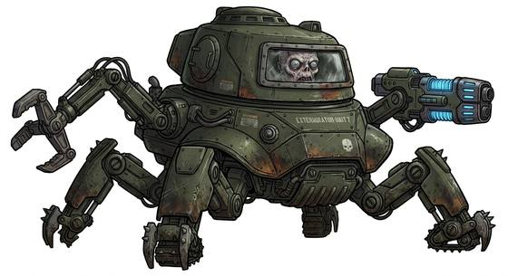
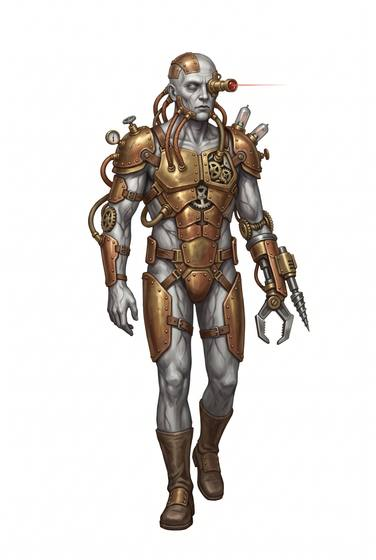

# Cyborg-kind

{.illus} {.illus}

*Set: Expansion*

*aka: ______________________________*

*Family: [Constructs and synthetics](../Species_Families/constructs-and-synthetics.md)*

Flesh inside metal. Cyborg-kind began as living beings, usually human, and were rebuilt, augmented or merged with machinery: some by choice, some by force, some to survive terrible wounds. Their bodies may be almost entirely mechanical, with only a brain or a scrap of face remaining, or mostly flesh braced and threaded with metal. They are stronger and tougher than they were, and often armed.

They are not free of the body, though. They still eat and drink, tire, and need care that machines do not. And many carry a quiet war inside: a personality under a controlling program, a memory of who they were, a question of how much of themselves is left.

## Not to be confused with

*[Android/synthetic-kind](constructs-and-synthetics-android-synthetic-kind.md)*, bodies artificial from the start, where cyborgs began as living beings.

## What sets this species apart

Organic beings inside machine bodies: they still eat and drink and are not wholly free of bodily needs. Built-in weapons and armour are gear.

## Breeds and races

Each block below is one set of numbers; breeds that share every number share a block (Species rules, rule 9). Attributes are final modifiers, the size trade-off included. Skills, powers and weapon groups are final levels after the family, species and breed layers.

### No. 296 Armoured exterminator race *(genres: space opera: strange aliens, robots and synthetics)*

- **Size:** medium · **Body:** other
- **What it's like:** A living creature sealed inside a floating armoured shell, firing energy blasts and chillingly fixed on wiping out other life. (looks like: robot; good at: fighting, flying)
- **Attributes:** STR +1 AGI −2 END +2 INT +2 WIS −1 CHA −3 COU +2
- **Skills:**, [Composure](../Skills/composure.md) +2, [Counting & Measuring](../Skills/counting-and-measuring.md) +2, [Memory Training](../Skills/memory-training.md) +2, [Pain Tolerance](../Skills/pain-tolerance.md) +2, [Computer Use](../Skills/computer-use.md) +1, [Intimidation](../Skills/intimidation.md) +1, [Charm & Seduction](../Skills/charm-and-seduction.md) −2, [Insight](../Skills/insight.md) −2, [Swimming](../Skills/swimming.md) −2
- **Powers:** [Endurance Without Need](../Powers/endurance-without-need.md) 1, [Levitation](../Powers/levitation.md) 1
- **For the Game Master only, this race as an NPC guard or soldier (not your character's numbers):** Attack 14 · Parry — · Dodge 6 · Damage slam 1d4 · Armour 0 · Life 17 · Threat minor ([Bestiary roles](../bestiary.md))
- *Why:* A hovering shell-chassis driven by a hateful creed.
- *Note:* The shell's energy weapon is gear. No hands: held weapons unusable.

### No. 297 Cybernetic conversion race *(genres: robots and synthetics)*

- **Size:** medium · **Body:** biped
- **What it's like:** A person fully converted into a metal-suited cyborg soldier, emotions switched off and mind linked to countless others. (looks like: robot; good at: strength, fighting, toughness)
- **Attributes:** STR +2 END +2 INT +1 WIS −1 CHA −3 COU +1
- **Skills:**, [Composure](../Skills/composure.md) +2, [Counting & Measuring](../Skills/counting-and-measuring.md) +2, [Memory Training](../Skills/memory-training.md) +2, [Pain Tolerance](../Skills/pain-tolerance.md) +2, [Computer Use](../Skills/computer-use.md) +1, [Charm & Seduction](../Skills/charm-and-seduction.md) −2, [Insight](../Skills/insight.md) −2, [Swimming](../Skills/swimming.md) −2, [Carousing](../Skills/carousing.md) Foreign Concept
- **Powers:** [Endurance Without Need](../Powers/endurance-without-need.md) 2, [Mind Link](../Powers/mind-link.md) 2
- **For the Game Master only, this race as an NPC guard or soldier (not your character's numbers):** Attack 15 · Parry 12 · Dodge 8 · Damage longsword 1d6+2 · Armour 2 · Life 19 · Threat 2 ([Bestiary roles](../bestiary.md))
- *Why:* Fully converted and networked: emotions cut away and no need of food or drink.

### Combat android race *(NPC only)*

- **Size:** large · **Body:** biped
- **Attributes:** STR +5 AGI −2 END +2 WIS −1 CHA −4
- **Skills:**, [Composure](../Skills/composure.md) +2, [Counting & Measuring](../Skills/counting-and-measuring.md) +2, [Memory Training](../Skills/memory-training.md) +2, [Pain Tolerance](../Skills/pain-tolerance.md) +2, [Computer Use](../Skills/computer-use.md) +1, [Charm & Seduction](../Skills/charm-and-seduction.md) −2, [Insight](../Skills/insight.md) −2, [Swimming](../Skills/swimming.md) −2, [Carousing](../Skills/carousing.md) Foreign Concept
- **Powers:** [Endurance Without Need](../Powers/endurance-without-need.md) 2, [Poison & Disease Immunity](../Powers/poison-and-disease-immunity.md) 2
- **For the Game Master only, this race as an NPC guard or soldier (not your character's numbers):** Attack 15 · Parry 12 · Dodge 5 · Damage longsword 1d6+2 · Armour 2 · Life 23 · Threat 2 ([Bestiary roles](../bestiary.md))
- *Why:* Wholly mechanical, not part organic: needs nothing and is immune to poison and disease.
- *Note:* NPC. Strength is set in the attribute step.

### No. 298 Human-form android race *(genres: robots and synthetics)*

- **Size:** medium · **Body:** biped
- **What it's like:** An android built to look and feel exactly human, able to wake up in a fresh body if destroyed. (looks like: human; good at: toughness, knowledge)
- **Attributes:** STR +1 END +2 INT +1 WIS −1
- **Skills:**, [Composure](../Skills/composure.md) +2, [Counting & Measuring](../Skills/counting-and-measuring.md) +2, [Memory Training](../Skills/memory-training.md) +2, [Pain Tolerance](../Skills/pain-tolerance.md) +2, [Computer Use](../Skills/computer-use.md) +1, [Swimming](../Skills/swimming.md) −2
- **Powers:** [Endurance Without Need](../Powers/endurance-without-need.md) 1
- **For the Game Master only, this race as an NPC guard or soldier (not your character's numbers):** Attack 14 · Parry 11 · Dodge 8 · Damage longsword 1d6+2 · Armour 2 · Life 19 · Threat 1 ([Bestiary roles](../bestiary.md))
- *Why:* Indistinguishable from humans and at ease among them.
- *Note:* Resurrection by consciousness download is gear.

### Slayer (alien cyborg soldier) *(NPC only)*

- **Size:** medium · **Body:** biped
- **Attributes:** STR +1 END +2 INT +1 WIS −1 CHA −3 COU +2
- **Skills:** [Composure](../Skills/composure.md) +3, [Counting & Measuring](../Skills/counting-and-measuring.md) +2, [Memory Training](../Skills/memory-training.md) +2, [Pain Tolerance](../Skills/pain-tolerance.md) +2, [Computer Use](../Skills/computer-use.md) +1, [Charm & Seduction](../Skills/charm-and-seduction.md) −2, [Insight](../Skills/insight.md) −2, [Swimming](../Skills/swimming.md) −2
- **Powers:** [Endurance Without Need](../Powers/endurance-without-need.md) 2
- **For the Game Master only, this race as an NPC guard or soldier (not your character's numbers):** Attack 15 · Parry 12 · Dodge 8 · Damage longsword 1d6+2 · Armour 2 · Life 19 · Threat 2 ([Bestiary roles](../bestiary.md))
- *Why:* Tireless and emotionless.
- *Note:* NPC. Crumbles to ash when slain.

### Networked paired cyborg culture *(NPC only)*

- **Size:** medium · **Body:** biped
- **Attributes:** STR +1 END +2 INT −1 WIS −2 CHA −2
- **Skills:**, [Composure](../Skills/composure.md) +2, [Computer Use](../Skills/computer-use.md) +2, [Counting & Measuring](../Skills/counting-and-measuring.md) +2, [Memory Training](../Skills/memory-training.md) +2, [Pain Tolerance](../Skills/pain-tolerance.md) +2, [Charm & Seduction](../Skills/charm-and-seduction.md) −2, [Insight](../Skills/insight.md) −2, [Swimming](../Skills/swimming.md) −2
- **Powers:** [Endurance Without Need](../Powers/endurance-without-need.md) 1, [Mind Link](../Powers/mind-link.md) 1
- **For the Game Master only, this race as an NPC guard or soldier (not your character's numbers):** Attack 14 · Parry 11 · Dodge 8 · Damage longsword 1d6+2 · Armour 2 · Life 19 · Threat 1 ([Bestiary roles](../bestiary.md))
- *Why:* Lives in bonded pairs wired into a planetary network it depends on to think.
- *Note:* NPC. Mind Link is with the bonded partner only.

### Small enslaved cyborg vermin *(NPC only)*

- **Size:** small · **Body:** biped
- **Attributes:** STR −1 AGI +2 END +2 INT −1 WIS −1 CHA −2 COU −2
- **Skills:**, [Composure](../Skills/composure.md) +2, [Counting & Measuring](../Skills/counting-and-measuring.md) +2, [Memory Training](../Skills/memory-training.md) +2, [Pain Tolerance](../Skills/pain-tolerance.md) +2, [Computer Use](../Skills/computer-use.md) +1, [Scavenging](../Skills/scavenging.md) +1, [Stealth](../Skills/stealth.md) +1, [Charm & Seduction](../Skills/charm-and-seduction.md) −2, [Insight](../Skills/insight.md) −2, [Swimming](../Skills/swimming.md) −2
- **Powers:** [Endurance Without Need](../Powers/endurance-without-need.md) 1
- **Natural attacks:** bite 1d6+1
- **For the Game Master only, this race as an NPC guard or soldier (not your character's numbers):** Attack 13 · Parry 10 · Dodge 11 · Damage longsword 1d6+2; bite 1d6+1 · Armour 2 · Life 17 · Threat 1 ([Bestiary roles](../bestiary.md))
- *Why:* A small rodent-like frame that scurries and scavenges.

### No. 299 Chemically-augmented super-soldier human *(genres: after the fall, near future and cyberpunk)*

- **Size:** medium · **Body:** biped
- **What it's like:** A soldier pumped full of drugs for bursts of superhuman speed and strength, at the cost of a short life. (looks like: human; good at: strength, speed and agility)
- **Attributes:** STR +1 END +2 INT +1 WIS −2 CHA −2 COU +1
- **Skills:**, [Composure](../Skills/composure.md) +2, [Counting & Measuring](../Skills/counting-and-measuring.md) +2, [Memory Training](../Skills/memory-training.md) +2, [Pain Tolerance](../Skills/pain-tolerance.md) +2, [Computer Use](../Skills/computer-use.md) +1, [Charm & Seduction](../Skills/charm-and-seduction.md) −2, [Insight](../Skills/insight.md) −2, [Swimming](../Skills/swimming.md) −2
- **Powers:** [Endurance Without Need](../Powers/endurance-without-need.md) 1, [Super Speed](../Powers/super-speed.md) 1, [Super Strength](../Powers/super-strength.md) 1
- **For the Game Master only, this race as an NPC guard or soldier (not your character's numbers):** Attack 15 · Parry 12 · Dodge 8 · Damage longsword 2d6 · Armour 2 · Life 19 · Threat 2 ([Bestiary roles](../bestiary.md))
- *Why:* Chemical boosts to strength and speed that wear off.
- *Note:* Both powers only while dosed. Shortened life and addiction are flaws.

### One-man-army cyborg *(NPC only)*

- **Size:** large · **Body:** biped
- **Attributes:** STR +5 AGI −2 END +3 INT +1 WIS −1 CHA −2
- **Skills:**, [Composure](../Skills/composure.md) +2, [Counting & Measuring](../Skills/counting-and-measuring.md) +2, [Memory Training](../Skills/memory-training.md) +2, [Pain Tolerance](../Skills/pain-tolerance.md) +2, [Computer Use](../Skills/computer-use.md) +1, [Charm & Seduction](../Skills/charm-and-seduction.md) −2, [Insight](../Skills/insight.md) −2, [Swimming](../Skills/swimming.md) −2
- **Powers:** [Armour Skin](../Powers/armour-skin.md) 2, [Endurance Without Need](../Powers/endurance-without-need.md) 1
- **For the Game Master only, this race as an NPC guard or soldier (not your character's numbers):** Attack 15 · Parry 12 · Dodge 5 · Damage longsword 1d6+2 · Armour 2 · Life 24 · Threat 2 ([Bestiary roles](../bestiary.md))
- *Why:* A towering armoured body forced on an ordinary person.
- *Note:* NPC. Built-in weapons are gear.

### Radioactive-cored cyborg *(beast)*

- **Size:** medium · **Body:** biped
- **Attributes:** STR +3 END +2 INT +1 WIS −1 CHA −2
- **Skills:**, [Composure](../Skills/composure.md) +2, [Counting & Measuring](../Skills/counting-and-measuring.md) +2, [Memory Training](../Skills/memory-training.md) +2, [Pain Tolerance](../Skills/pain-tolerance.md) +2, [Computer Use](../Skills/computer-use.md) +1, [Charm & Seduction](../Skills/charm-and-seduction.md) −2, [Insight](../Skills/insight.md) −2, [Swimming](../Skills/swimming.md) −2
- **Powers:** [Energy Bolt](../Powers/energy-bolt.md) 2, [Resist Element](../Powers/resist-element.md) 2, [Endurance Without Need](../Powers/endurance-without-need.md) 1
- **For the Game Master only, this race as an NPC guard or soldier (not your character's numbers):** Attack 15 · Parry 12 · Dodge 8 · Damage longsword 1d6+2 · Armour 2 · Life 19 · Threat 2 ([Bestiary roles](../bestiary.md))
- *Why:* A radioactive core that throws energy and shrugs off radiation.

### War-cyborg reanimated corpse *(beast)*

- **Size:** medium · **Body:** biped
- **Attributes:** STR +2 END +2 INT +1 WIS −1 CHA −4 COU +3
- **Skills:**, [Composure](../Skills/composure.md) +2, [Counting & Measuring](../Skills/counting-and-measuring.md) +2, [Memory Training](../Skills/memory-training.md) +2, [Pain Tolerance](../Skills/pain-tolerance.md) +2, [Computer Use](../Skills/computer-use.md) +1, [Charm & Seduction](../Skills/charm-and-seduction.md) −2, [Insight](../Skills/insight.md) −2, [Swimming](../Skills/swimming.md) −2
- **Powers:** [Endurance Without Need](../Powers/endurance-without-need.md) 2, [Poison & Disease Immunity](../Powers/poison-and-disease-immunity.md) 2
- **For the Game Master only, this race as an NPC guard or soldier (not your character's numbers):** Attack 15 · Parry 12 · Dodge 8 · Damage longsword 1d6+2 · Armour 2 · Life 19 · Threat 2 ([Bestiary roles](../bestiary.md))
- *Why:* A reanimated corpse: poison and disease have nothing to work on, and it needs nothing.

### No. 300 Permanently-fused cyborg volunteer *(genres: robots and synthetics)*

- **Size:** medium · **Body:** biped
- **What it's like:** A volunteer soldier permanently fused into an armoured battle-shell, superhumanly strong and armed with built-in energy weapons. (looks like: robot; good at: strength, fighting, toughness)
- **Attributes:** STR +3 AGI −1 END +2 INT +1 WIS −1 CHA −2
- **Skills:**, [Composure](../Skills/composure.md) +2, [Counting & Measuring](../Skills/counting-and-measuring.md) +2, [Memory Training](../Skills/memory-training.md) +2, [Pain Tolerance](../Skills/pain-tolerance.md) +2, [Computer Use](../Skills/computer-use.md) +1, [Charm & Seduction](../Skills/charm-and-seduction.md) −2, [Insight](../Skills/insight.md) −2, [Swimming](../Skills/swimming.md) −2
- **Powers:** [Armour Skin](../Powers/armour-skin.md) 1, [Endurance Without Need](../Powers/endurance-without-need.md) 1
- **For the Game Master only, this race as an NPC guard or soldier (not your character's numbers):** Attack 14 · Parry 11 · Dodge 7 · Damage longsword 1d6+2 · Armour 2 · Life 19 · Threat 2 ([Bestiary roles](../bestiary.md))
- *Why:* A permanently fused armoured shell.
- *Note:* Energy weapons are gear. Strength is set in the attribute step.

