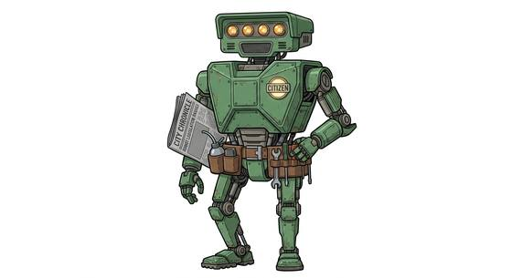

# Robot-citizen-kind

{.illus}

*Set: Core*

*aka: ______________________________*

*Family: [Constructs and synthetics](../Species_Families/constructs-and-synthetics.md)*

Robots with jobs, homes, friends and bad habits. Robot citizens are sentient machines that live among other peoples as individuals rather than as tools or soldiers. They may be tiny hovering drones with full rights of citizenship, lanky crewmen with damaged memories and swappable tool hands, or wisecracking metal neighbours with a weakness for oil and a sharp tongue.

They have humanlike personalities, flaws included, and they get along with people far better than most machines, because they genuinely like them. Some are ancient, remembering a time before their makers; some woke up by accident in a maintenance closet. They cannot be poisoned and do not sicken, but they can certainly be hurt, and they remember it.

## Not to be confused with

*[Service robot kind](constructs-and-synthetics-service-robot-kind.md)*, which are built for a task and treated as property, even when they develop opinions.

## What sets this species apart

Civilian robots with humanlike personalities, less awkward with people than most machines.

## Breeds and races

Each block below is one set of numbers; breeds that share every number share a block (Species rules, rule 9). Attributes are final modifiers, the size trade-off included. Skills, powers and weapon groups are final levels after the family, species and breed layers.

### No. 301 Independent drone citizen *(genres: robots and synthetics)*

- **Size:** small · **Body:** other
- **What it's like:** A small hovering drone with full citizen's rights, its own personality, equally at home fighting or talking peace. (looks like: robot; good at: flying, people and talk)
- **Attributes:** STR −2 AGI +2 END +2 INT +2 CHA −1
- **Skills:**, [Composure](../Skills/composure.md) +2, [Counting & Measuring](../Skills/counting-and-measuring.md) +2, [Memory Training](../Skills/memory-training.md) +2, [Pain Tolerance](../Skills/pain-tolerance.md) +2, [Computer Use](../Skills/computer-use.md) +1, [Charm & Seduction](../Skills/charm-and-seduction.md) −1, [Cooking](../Skills/cooking.md) −1, [Insight](../Skills/insight.md) −1, [Swimming](../Skills/swimming.md) −2, [Carousing](../Skills/carousing.md) Foreign Concept
- **Powers:** [Endurance Without Need](../Powers/endurance-without-need.md) 2, [Levitation](../Powers/levitation.md) 2, [Poison & Disease Immunity](../Powers/poison-and-disease-immunity.md) 2
- **For the Game Master only, this race as an NPC guard or soldier (not your character's numbers):** Attack 14 · Parry — · Dodge 11 · Damage slam 1d4 · Armour 0 · Life 15 · Threat minor ([Bestiary roles](../bestiary.md))
- *Why:* A small hovering body.
- *Note:* No hands: held weapons unusable.

### Ancient robotic precursor automaton *(NPC only)*

- **Size:** medium · **Body:** biped
- **Attributes:** STR +1 END +2 INT +4 WIS −1 CHA −1
- **Skills:**, [Composure](../Skills/composure.md) +2, [Counting & Measuring](../Skills/counting-and-measuring.md) +2, [Mechanical Engineering](../Skills/mechanical-engineering.md) +2, [Memory Training](../Skills/memory-training.md) +2, [Pain Tolerance](../Skills/pain-tolerance.md) +2, [Computer Use](../Skills/computer-use.md) +1, [Charm & Seduction](../Skills/charm-and-seduction.md) −1, [Cooking](../Skills/cooking.md) −1, [Insight](../Skills/insight.md) −1, [Swimming](../Skills/swimming.md) −2, [Carousing](../Skills/carousing.md) Foreign Concept
- **Powers:** [Endurance Without Need](../Powers/endurance-without-need.md) 2, [Poison & Disease Immunity](../Powers/poison-and-disease-immunity.md) 2
- **For the Game Master only, this race as an NPC guard or soldier (not your character's numbers):** Attack 14 · Parry 11 · Dodge 8 · Damage longsword 1d6+2 · Armour 2 · Life 19 · Threat 1 ([Bestiary roles](../bestiary.md))
- *Why:* Builders of their world's core technology.

### No. 302 Sentient robot citizen · Rogue retro-futurist robot *(genres: robots and synthetics)*

- **Size:** medium · **Body:** biped
- **What it's like:** A fully thinking, feeling robot citizen with all the flaws of anyone else, just running on oil instead of food. (looks like: robot; good at: toughness, knowledge)
- **Attributes:** STR +1 END +2 INT +1 WIS −1 CHA −1
- **Skills:**, [Composure](../Skills/composure.md) +2, [Counting & Measuring](../Skills/counting-and-measuring.md) +2, [Memory Training](../Skills/memory-training.md) +2, [Pain Tolerance](../Skills/pain-tolerance.md) +2, [Computer Use](../Skills/computer-use.md) +1, [Charm & Seduction](../Skills/charm-and-seduction.md) −1, [Cooking](../Skills/cooking.md) −1, [Insight](../Skills/insight.md) −1, [Swimming](../Skills/swimming.md) −2, [Carousing](../Skills/carousing.md) Foreign Concept
- **Powers:** [Endurance Without Need](../Powers/endurance-without-need.md) 2, [Poison & Disease Immunity](../Powers/poison-and-disease-immunity.md) 2
- **For the Game Master only, this race as an NPC guard or soldier (not your character's numbers):** Attack 14 · Parry 11 · Dodge 8 · Damage longsword 1d6+2 · Armour 2 · Life 19 · Threat 1 ([Bestiary roles](../bestiary.md))

### Robotic crewman *(NPC only)*

- **Size:** large · **Body:** biped
- **Attributes:** STR +4 AGI −2 END +2 INT −1 WIS −1 CHA −1
- **Skills:**, [Composure](../Skills/composure.md) +2, [Counting & Measuring](../Skills/counting-and-measuring.md) +2, [Pain Tolerance](../Skills/pain-tolerance.md) +2, [Computer Use](../Skills/computer-use.md) +1, [Charm & Seduction](../Skills/charm-and-seduction.md) −1, [Cooking](../Skills/cooking.md) −1, [Insight](../Skills/insight.md) −1, [Swimming](../Skills/swimming.md) −2, [Carousing](../Skills/carousing.md) Foreign Concept
- **Powers:** [Endurance Without Need](../Powers/endurance-without-need.md) 2, [Poison & Disease Immunity](../Powers/poison-and-disease-immunity.md) 2
- **For the Game Master only, this race as an NPC guard or soldier (not your character's numbers):** Attack 14 · Parry 11 · Dodge 5 · Damage longsword 1d6+2 · Armour 2 · Life 23 · Threat 2 ([Bestiary roles](../bestiary.md))
- *Why:* A damaged memory core.
- *Note:* NPC. Interchangeable tool-hands are gear.

### Small sentient shipboard robot *(NPC only)*

- **Size:** tiny · **Body:** other
- **Attributes:** STR −3 AGI +3 END +2 WIS −1 CHA −1 COU −2
- **Skills:**, [Composure](../Skills/composure.md) +2, [Counting & Measuring](../Skills/counting-and-measuring.md) +2, [Memory Training](../Skills/memory-training.md) +2, [Pain Tolerance](../Skills/pain-tolerance.md) +2, [Computer Use](../Skills/computer-use.md) +1, [Danger Sense](../Skills/danger-sense.md) +1, [Mechanics](../Skills/mechanics.md) +1, [Charm & Seduction](../Skills/charm-and-seduction.md) −1, [Cooking](../Skills/cooking.md) −1, [Insight](../Skills/insight.md) −1, [Swimming](../Skills/swimming.md) −2, [Carousing](../Skills/carousing.md) Foreign Concept
- **Powers:** [Endurance Without Need](../Powers/endurance-without-need.md) 2, [Poison & Disease Immunity](../Powers/poison-and-disease-immunity.md) 2
- **For the Game Master only, this race as an NPC guard or soldier (not your character's numbers):** Attack 13 · Parry 10 · Dodge 13 · Damage longsword 1d6+1 · Armour 2 · Life 15 · Threat 1 ([Bestiary roles](../bestiary.md))
- *Why:* A small maintenance device with a strong instinct for self-preservation.

### No. 303 Autonomous mechanical being *(genres: robots and synthetics; starter)*

- **Size:** varies · **Body:** biped
- **What it's like:** A thinking robot that never tires, never eats, and learns as it goes. (looks like: robot; good at: strength, toughness, making and fixing)
- **Attributes:** STR +1 END +2 INT +1 WIS −1 CHA −1
- **Skills:**, [Composure](../Skills/composure.md) +2, [Counting & Measuring](../Skills/counting-and-measuring.md) +2, [Memory Training](../Skills/memory-training.md) +2, [Pain Tolerance](../Skills/pain-tolerance.md) +2, [Computer Use](../Skills/computer-use.md) +1, [Charm & Seduction](../Skills/charm-and-seduction.md) −1, [Cooking](../Skills/cooking.md) −1, [Insight](../Skills/insight.md) −1, [Swimming](../Skills/swimming.md) −2, [Carousing](../Skills/carousing.md) Foreign Concept
- **Powers:** [Endurance Without Need](../Powers/endurance-without-need.md) 2, [Poison & Disease Immunity](../Powers/poison-and-disease-immunity.md) 2
- **For the Game Master only, this race as an NPC guard or soldier (not your character's numbers):** Attack 14 · Parry 11 · Dodge 8 · Damage longsword 1d6+2 · Armour 2 · Life 19 · Threat 1 ([Bestiary roles](../bestiary.md))

### No. 304 Post-apocalyptic sentient android *(genres: after the fall, robots and synthetics)*

- **Size:** medium · **Body:** biped
- **What it's like:** A wasteland android immune to radiation and able to repair itself, haunted by memories of a world before the war. (looks like: robot; good at: toughness, knowledge)
- **Attributes:** STR +1 END +2 INT +1 WIS −1 CHA −1
- **Skills:**, [Composure](../Skills/composure.md) +2, [Counting & Measuring](../Skills/counting-and-measuring.md) +2, [Memory Training](../Skills/memory-training.md) +2, [Pain Tolerance](../Skills/pain-tolerance.md) +2, [Computer Use](../Skills/computer-use.md) +1, [Charm & Seduction](../Skills/charm-and-seduction.md) −1, [Cooking](../Skills/cooking.md) −1, [Insight](../Skills/insight.md) −1, [Swimming](../Skills/swimming.md) −2, [Carousing](../Skills/carousing.md) Foreign Concept
- **Powers:** [Endurance Without Need](../Powers/endurance-without-need.md) 2, [Poison & Disease Immunity](../Powers/poison-and-disease-immunity.md) 2, [Resist Element](../Powers/resist-element.md) 2, [Healing Factor](../Powers/healing-factor.md) 1
- **For the Game Master only, this race as an NPC guard or soldier (not your character's numbers):** Attack 14 · Parry 11 · Dodge 8 · Damage longsword 1d6+2 · Armour 2 · Life 19 · Threat 1 ([Bestiary roles](../bestiary.md))
- *Why:* Immune to radiation and repairs itself.
- *Note:* Resist Element is radiation. Healing Factor is slow self-repair.

### Mass-produced servant robot *(NPC only)*

- **Size:** medium · **Body:** biped
- **Attributes:** STR +1 END +2 INT +1 WIS −1 CHA −1
- **Skills:**, [Composure](../Skills/composure.md) +2, [Counting & Measuring](../Skills/counting-and-measuring.md) +2, [Memory Training](../Skills/memory-training.md) +2, [Pain Tolerance](../Skills/pain-tolerance.md) +2, [Computer Use](../Skills/computer-use.md) +1, [Service & Hospitality](../Skills/service-and-hospitality.md) +1, [Charm & Seduction](../Skills/charm-and-seduction.md) −1, [Cooking](../Skills/cooking.md) −1, [Insight](../Skills/insight.md) −1, [Swimming](../Skills/swimming.md) −2, [Carousing](../Skills/carousing.md) Foreign Concept
- **Powers:** [Endurance Without Need](../Powers/endurance-without-need.md) 2, [Poison & Disease Immunity](../Powers/poison-and-disease-immunity.md) 2
- **For the Game Master only, this race as an NPC guard or soldier (not your character's numbers):** Attack 14 · Parry 11 · Dodge 8 · Damage longsword 1d6+2 · Armour 2 · Life 19 · Threat 1 ([Bestiary roles](../bestiary.md))
- *Why:* Built to serve.

