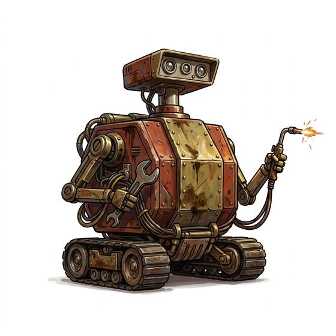
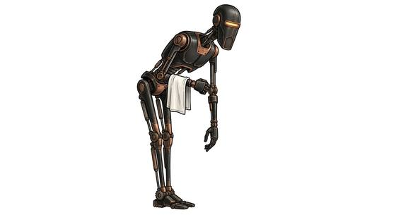
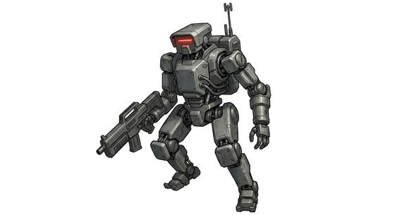
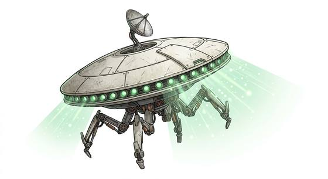

# Service robot kind

{.illus} {.illus} {.illus} {.illus}

*Set: Expansion*

*aka: ______________________________*

*Family: [Constructs and synthetics](../Species_Families/constructs-and-synthetics.md)*

Machines built for a job, and shaped by it. Service robot kind cover a whole ecosystem of mechanical helpers: humanoid etiquette machines fluent in countless tongues, squat repair units on wheels that chirp and whistle, rolling spheres, hovering probes, surgeons with many tool arms, courier boxes that skitter along corridors, walkers, sentries, soldiers and the occasional murderous assassin with a sarcastic voice.

They do not eat, breathe or sicken. Most were built to follow orders, and many do exactly that. But a machine left running long enough tends to develop quirks, habits and opinions, and some grow whole personalities, complete with loyalty, cowardice and a fondness for their owners. Owners who wipe their memories rarely get the same robot back.

## Not to be confused with

*[Robot-citizen-kind](constructs-and-synthetics-robot-citizen-kind.md)*, machines with full personhood and rights, where service robots are property built for a task.

## What sets this species apart

Purpose-built mechanical chassis immune to poison and disease.

## Breeds and races

Each block below is one set of numbers; breeds that share every number share a block (Species rules, rule 9). Attributes are final modifiers, the size trade-off included. Skills, powers and weapon groups are final levels after the family, species and breed layers.

### No. 281 Medium humanoid etiquette robot *(genres: robots and synthetics)*

- **Size:** medium · **Body:** biped
- **What it's like:** A polished protocol robot fluent in every language and custom, quietly growing a mind and manners of its own. (looks like: robot; good at: knowledge, people and talk)
- **Attributes:** AGI −1 END +2 INT +2 WIS −1 CHA −2
- **Skills:**, [Composure](../Skills/composure.md) +2, [Counting & Measuring](../Skills/counting-and-measuring.md) +2, [Court Etiquette & Protocol](../Skills/court-etiquette-and-protocol.md) +2, [Linguistics](../Skills/linguistics.md) +2, [Memory Training](../Skills/memory-training.md) +2, [Pain Tolerance](../Skills/pain-tolerance.md) +2, [Computer Use](../Skills/computer-use.md) +1, [Cooking](../Skills/cooking.md) −1, [Charm & Seduction](../Skills/charm-and-seduction.md) −2, [Insight](../Skills/insight.md) −2, [Swimming](../Skills/swimming.md) −2, [Carousing](../Skills/carousing.md) Foreign Concept
- **Powers:** [Endurance Without Need](../Powers/endurance-without-need.md) 2, [Poison & Disease Immunity](../Powers/poison-and-disease-immunity.md) 2
- **For the Game Master only, this race as an NPC guard or soldier (not your character's numbers):** Attack 13 · Parry 10 · Dodge 7 · Damage longsword 1d6+2 · Armour 2 · Life 19 · Threat 1 ([Bestiary roles](../bestiary.md))
- *Why:* Built for languages and protocol.

### No. 282 Small cylindrical repair-nav robotic familiar · No. 283 Small cylindrical support robot *(genres: robots and synthetics)*

- **Size:** small · **Body:** other
- **What it's like:** A small barrel-shaped robot bristling with tool-arms, brilliant at fixing ships and finding the way, chattering in beeps and whistles. (looks like: robot; good at: making and fixing, knowledge)
- **Attributes:** STR −1 AGI +2 END +2 INT +2 WIS −1 CHA −2
- **Skills:**, [Astrogation](../Skills/astrogation.md) +2, [Composure](../Skills/composure.md) +2, [Counting & Measuring](../Skills/counting-and-measuring.md) +2, [Memory Training](../Skills/memory-training.md) +2, [Pain Tolerance](../Skills/pain-tolerance.md) +2, [Starship Engineering](../Skills/starship-engineering.md) +2, [Computer Use](../Skills/computer-use.md) +1, [Cooking](../Skills/cooking.md) −1, [Charm & Seduction](../Skills/charm-and-seduction.md) −2, [Insight](../Skills/insight.md) −2, [Swimming](../Skills/swimming.md) −2, [Carousing](../Skills/carousing.md) Foreign Concept
- **Powers:** [Endurance Without Need](../Powers/endurance-without-need.md) 2, [Poison & Disease Immunity](../Powers/poison-and-disease-immunity.md) 2
- **For the Game Master only, this race as an NPC guard or soldier (not your character's numbers):** Attack 14 · Parry — · Dodge 11 · Damage slam 1d4 · Armour 0 · Life 15 · Threat minor ([Bestiary roles](../bestiary.md))
- *Small cylindrical repair-nav robotic familiar:* Built for starship repair and navigation.
- *Note (Small cylindrical repair-nav robotic familiar):* Speaks in beeps and whistles; tool arms are gear. No hands: held weapons unusable.
- *Small cylindrical support robot:* The same repair-and-navigation build as newer lines.
- *Note (Small cylindrical support robot):* Quirky malfunctions are a flaw. No hands: held weapons unusable.

### No. 284 Small spherical robotic familiar *(genres: robots and synthetics)*

- **Size:** small · **Body:** other
- **What it's like:** A rolling ball-shaped robot with a free-floating head, quick and nimble even over the roughest ground. (looks like: robot; good at: speed and agility, making and fixing)
- **Attributes:** STR −1 AGI +2 END +2 INT +2 WIS −1 CHA −2
- **Skills:**, [Astrogation](../Skills/astrogation.md) +2, [Composure](../Skills/composure.md) +2, [Counting & Measuring](../Skills/counting-and-measuring.md) +2, [Memory Training](../Skills/memory-training.md) +2, [Pain Tolerance](../Skills/pain-tolerance.md) +2, [Starship Engineering](../Skills/starship-engineering.md) +2, [Computer Use](../Skills/computer-use.md) +1, [Cooking](../Skills/cooking.md) −1, [Charm & Seduction](../Skills/charm-and-seduction.md) −2, [Insight](../Skills/insight.md) −2, [Swimming](../Skills/swimming.md) −2, [Carousing](../Skills/carousing.md) Foreign Concept, [Climbing](../Skills/climbing.md) Foreign Concept
- **Powers:** [Endurance Without Need](../Powers/endurance-without-need.md) 2, [Poison & Disease Immunity](../Powers/poison-and-disease-immunity.md) 2
- **For the Game Master only, this race as an NPC guard or soldier (not your character's numbers):** Attack 14 · Parry — · Dodge 11 · Damage slam 1d4 · Armour 0 · Life 15 · Threat minor ([Bestiary roles](../bestiary.md))
- *Why:* A rolling sphere with the repair-and-navigation build; cannot climb.
- *Note:* No hands: held weapons unusable.

### No. 285 Small single-wheel robotic familiar *(genres: robots and synthetics)*

- **Size:** small · **Body:** other
- **What it's like:** A tiny one-wheeled robot companion, endlessly capable but twitchy and anxious about absolutely everything. (looks like: robot; good at: making and fixing, knowledge)
- **Attributes:** STR −1 AGI +2 END +2 INT +1 WIS −1 CHA −2 COU −1
- **Skills:**, [Composure](../Skills/composure.md) +2, [Counting & Measuring](../Skills/counting-and-measuring.md) +2, [Memory Training](../Skills/memory-training.md) +2, [Pain Tolerance](../Skills/pain-tolerance.md) +2, [Computer Use](../Skills/computer-use.md) +1, [Cooking](../Skills/cooking.md) −1, [Charm & Seduction](../Skills/charm-and-seduction.md) −2, [Insight](../Skills/insight.md) −2, [Swimming](../Skills/swimming.md) −2, [Carousing](../Skills/carousing.md) Foreign Concept, [Climbing](../Skills/climbing.md) Foreign Concept
- **Powers:** [Endurance Without Need](../Powers/endurance-without-need.md) 2, [Poison & Disease Immunity](../Powers/poison-and-disease-immunity.md) 2
- **For the Game Master only, this race as an NPC guard or soldier (not your character's numbers):** Attack 14 · Parry — · Dodge 11 · Damage slam 1d4 · Armour 0 · Life 15 · Threat minor ([Bestiary roles](../bestiary.md))
- *Why:* A single wheel: it cannot climb.
- *Note:* No hands: held weapons unusable.

### Medium skeletal combat robot · Medium skeletal command robot *(beast)*

- **Size:** medium · **Body:** biped
- **Attributes:** STR +1 INT −1 WIS −1 CHA −2
- **Skills:**, [Composure](../Skills/composure.md) +2, [Counting & Measuring](../Skills/counting-and-measuring.md) +2, [Memory Training](../Skills/memory-training.md) +2, [Pain Tolerance](../Skills/pain-tolerance.md) +2, [Computer Use](../Skills/computer-use.md) +1, [Cooking](../Skills/cooking.md) −1, [Charm & Seduction](../Skills/charm-and-seduction.md) −2, [Insight](../Skills/insight.md) −2, [Swimming](../Skills/swimming.md) −2, [Carousing](../Skills/carousing.md) Foreign Concept
- **Powers:** [Endurance Without Need](../Powers/endurance-without-need.md) 2, [Poison & Disease Immunity](../Powers/poison-and-disease-immunity.md) 2
- **For the Game Master only, this race as an NPC guard or soldier (not your character's numbers):** Attack 14 · Parry 11 · Dodge 8 · Damage longsword 1d6+2 · Armour 2 · Life 17 · Threat 1 ([Bestiary roles](../bestiary.md))
- *Medium skeletal combat robot:* Same as its species: a thin mass-produced combat frame; its network link is gear.
- *Medium skeletal command robot:* Same as its species: differs from the basic frame only in paint and tactical processors (gear).

### Large armoured combat robot *(beast)*

- **Size:** large · **Body:** biped
- **Attributes:** STR +4 AGI −2 END +3 INT +1 WIS −1 CHA −2
- **Skills:**, [Composure](../Skills/composure.md) +2, [Counting & Measuring](../Skills/counting-and-measuring.md) +2, [Memory Training](../Skills/memory-training.md) +2, [Pain Tolerance](../Skills/pain-tolerance.md) +2, [Computer Use](../Skills/computer-use.md) +1, [Cooking](../Skills/cooking.md) −1, [Charm & Seduction](../Skills/charm-and-seduction.md) −2, [Insight](../Skills/insight.md) −2, [Swimming](../Skills/swimming.md) −2, [Carousing](../Skills/carousing.md) Foreign Concept
- **Powers:** [Endurance Without Need](../Powers/endurance-without-need.md) 2, [Poison & Disease Immunity](../Powers/poison-and-disease-immunity.md) 2, [Armour Skin](../Powers/armour-skin.md) 1
- **For the Game Master only, this race as an NPC guard or soldier (not your character's numbers):** Attack 14 · Parry 11 · Dodge 5 · Damage longsword 1d6+2 · Armour 2 · Life 24 · Threat 2 ([Bestiary roles](../bestiary.md))
- *Why:* A heavier armoured frame.

### Medium rolling shielded combat robot *(beast)*

- **Size:** medium · **Body:** other
- **Attributes:** STR +1 END +2 INT +1 WIS −1 CHA −2 COU +2
- **Skills:**, [Composure](../Skills/composure.md) +2, [Counting & Measuring](../Skills/counting-and-measuring.md) +2, [Memory Training](../Skills/memory-training.md) +2, [Pain Tolerance](../Skills/pain-tolerance.md) +2, [Running](../Skills/running.md) +2, [Computer Use](../Skills/computer-use.md) +1, [Cooking](../Skills/cooking.md) −1, [Charm & Seduction](../Skills/charm-and-seduction.md) −2, [Insight](../Skills/insight.md) −2, [Swimming](../Skills/swimming.md) −2, [Carousing](../Skills/carousing.md) Foreign Concept, [Climbing](../Skills/climbing.md) Foreign Concept
- **Powers:** [Endurance Without Need](../Powers/endurance-without-need.md) 2, [Poison & Disease Immunity](../Powers/poison-and-disease-immunity.md) 2
- **For the Game Master only, this race as an NPC guard or soldier (not your character's numbers):** Attack 15 · Parry — · Dodge 8 · Damage slam 1d4 · Armour 0 · Life 17 · Threat minor ([Bestiary roles](../bestiary.md))
- *Why:* Rolls fast as a wheel but cannot climb.

### Large armoured bodyguard robot *(beast)*

- **Size:** large · **Body:** biped
- **Attributes:** STR +4 END +2 INT +1 WIS −1 CHA −2
- **Skills:**, [Composure](../Skills/composure.md) +2, [Counting & Measuring](../Skills/counting-and-measuring.md) +2, [Memory Training](../Skills/memory-training.md) +2, [Pain Tolerance](../Skills/pain-tolerance.md) +2, [Computer Use](../Skills/computer-use.md) +1, [Cooking](../Skills/cooking.md) −1, [Charm & Seduction](../Skills/charm-and-seduction.md) −2, [Insight](../Skills/insight.md) −2, [Swimming](../Skills/swimming.md) −2, [Carousing](../Skills/carousing.md) Foreign Concept
- **Powers:** [Endurance Without Need](../Powers/endurance-without-need.md) 2, [Poison & Disease Immunity](../Powers/poison-and-disease-immunity.md) 2, [Armour Skin](../Powers/armour-skin.md) 1
- **Weapon groups:** [Staves](../Weapon_Groups/staves.md) +2
- **For the Game Master only, this race as an NPC guard or soldier (not your character's numbers):** Attack 15 · Parry 12 · Dodge 7 · Damage longsword 1d6+2 · Armour 2 · Life 23 · Threat 2 ([Bestiary roles](../bestiary.md))
- *Why:* An armoured guard frame.

### No. 286 Medium spindly assassin robot *(genres: robots and synthetics)*

- **Size:** medium · **Body:** biped
- **What it's like:** A tall, spindly robot bristling with hidden weapons, built to kill coldly, though some start thinking for themselves. (looks like: robot; good at: fighting, sneaking)
- **Attributes:** STR +1 AGI +1 END +2 INT +1 WIS −1 CHA −3
- **Skills:**, [Composure](../Skills/composure.md) +2, [Counting & Measuring](../Skills/counting-and-measuring.md) +2, [Memory Training](../Skills/memory-training.md) +2, [Pain Tolerance](../Skills/pain-tolerance.md) +2, [Computer Use](../Skills/computer-use.md) +1, [Shadowing & Surveillance](../Skills/shadowing-and-surveillance.md) +1, [Cooking](../Skills/cooking.md) −1, [Charm & Seduction](../Skills/charm-and-seduction.md) −2, [Insight](../Skills/insight.md) −2, [Swimming](../Skills/swimming.md) −2, [Carousing](../Skills/carousing.md) Foreign Concept
- **Powers:** [Endurance Without Need](../Powers/endurance-without-need.md) 2, [Poison & Disease Immunity](../Powers/poison-and-disease-immunity.md) 2
- **For the Game Master only, this race as an NPC guard or soldier (not your character's numbers):** Attack 14 · Parry 11 · Dodge 9 · Damage longsword 1d6+2 · Armour 2 · Life 19 · Threat 1 ([Bestiary roles](../bestiary.md))
- *Why:* Cold assassin programming.
- *Note:* Weapon mounts are gear.

### No. 287 Medium humanoid assassin robot *(genres: robots and synthetics)*

- **Size:** medium · **Body:** biped
- **What it's like:** A humanoid killer-robot with a sharp, sarcastic tongue and a low opinion of the soft creatures it's built to hunt. (looks like: robot; good at: fighting, sneaking)
- **Attributes:** STR +1 AGI +1 END +2 INT +1 WIS −1 CHA −2
- **Skills:**, [Composure](../Skills/composure.md) +2, [Counting & Measuring](../Skills/counting-and-measuring.md) +2, [Memory Training](../Skills/memory-training.md) +2, [Pain Tolerance](../Skills/pain-tolerance.md) +2, [Computer Use](../Skills/computer-use.md) +1, [Shadowing & Surveillance](../Skills/shadowing-and-surveillance.md) +1, [Wit & Mockery](../Skills/wit-and-mockery.md) +1, [Cooking](../Skills/cooking.md) −1, [Charm & Seduction](../Skills/charm-and-seduction.md) −2, [Insight](../Skills/insight.md) −2, [Swimming](../Skills/swimming.md) −2, [Carousing](../Skills/carousing.md) Foreign Concept
- **Powers:** [Endurance Without Need](../Powers/endurance-without-need.md) 2, [Poison & Disease Immunity](../Powers/poison-and-disease-immunity.md) 2
- **For the Game Master only, this race as an NPC guard or soldier (not your character's numbers):** Attack 14 · Parry 11 · Dodge 9 · Damage longsword 1d6+2 · Armour 2 · Life 19 · Threat 1 ([Bestiary roles](../bestiary.md))
- *Why:* Assassin programming and a sardonic manner.

### No. 288 Medium humanoid torturer robot *(genres: robots and synthetics)*

- **Size:** medium · **Body:** biped
- **What it's like:** A protocol robot rebuilt for interrogation, unnervingly patient and precise at getting answers out of anyone. (looks like: robot; good at: people and talk, knowledge)
- **Attributes:** END +2 INT +2 WIS −1 CHA −2
- **Skills:**, [Composure](../Skills/composure.md) +2, [Counting & Measuring](../Skills/counting-and-measuring.md) +2, [Interrogation](../Skills/interrogation.md) +2, [Memory Training](../Skills/memory-training.md) +2, [Pain Tolerance](../Skills/pain-tolerance.md) +2, [Computer Use](../Skills/computer-use.md) +1, [Linguistics](../Skills/linguistics.md) +1, [Cooking](../Skills/cooking.md) −1, [Charm & Seduction](../Skills/charm-and-seduction.md) −2, [Insight](../Skills/insight.md) −2, [Swimming](../Skills/swimming.md) −2, [Carousing](../Skills/carousing.md) Foreign Concept
- **Powers:** [Endurance Without Need](../Powers/endurance-without-need.md) 2, [Poison & Disease Immunity](../Powers/poison-and-disease-immunity.md) 2
- **For the Game Master only, this race as an NPC guard or soldier (not your character's numbers):** Attack 14 · Parry 11 · Dodge 8 · Damage longsword 1d6+2 · Armour 2 · Life 19 · Threat 1 ([Bestiary roles](../bestiary.md))
- *Why:* A protocol frame rebuilt for interrogation.

### No. 289 Large humanoid security robot *(genres: robots and synthetics)*

- **Size:** large · **Body:** biped
- **What it's like:** A hulking former security robot, blunt and sarcastic, still built like a tank and ready for a fight. (looks like: robot; good at: fighting, strength, toughness)
- **Attributes:** STR +4 AGI −2 END +2 INT +1 WIS −1 CHA −3
- **Skills:**, [Composure](../Skills/composure.md) +2, [Counting & Measuring](../Skills/counting-and-measuring.md) +2, [Memory Training](../Skills/memory-training.md) +2, [Pain Tolerance](../Skills/pain-tolerance.md) +2, [Computer Use](../Skills/computer-use.md) +1, [Intimidation](../Skills/intimidation.md) +1, [Cooking](../Skills/cooking.md) −1, [Etiquette](../Skills/etiquette.md) −1, [Charm & Seduction](../Skills/charm-and-seduction.md) −2, [Insight](../Skills/insight.md) −2, [Swimming](../Skills/swimming.md) −2, [Carousing](../Skills/carousing.md) Foreign Concept
- **Powers:** [Endurance Without Need](../Powers/endurance-without-need.md) 2, [Poison & Disease Immunity](../Powers/poison-and-disease-immunity.md) 2
- **For the Game Master only, this race as an NPC guard or soldier (not your character's numbers):** Attack 14 · Parry 11 · Dodge 5 · Damage longsword 1d6+2 · Armour 2 · Life 23 · Threat 2 ([Bestiary roles](../bestiary.md))
- *Why:* A blunt, intimidating security frame.

### No. 290 Medium humanoid pilot robot *(genres: robots and synthetics)*

- **Size:** medium · **Body:** biped
- **What it's like:** A cool-headed pilot robot who flies ships like an expert and speaks up loudly for robot rights. (looks like: robot; good at: knowledge, people and talk)
- **Attributes:** AGI +1 END +2 INT +1 WIS −1 CHA −2 COU +1
- **Skills:**, [Composure](../Skills/composure.md) +2, [Counting & Measuring](../Skills/counting-and-measuring.md) +2, [Memory Training](../Skills/memory-training.md) +2, [Pain Tolerance](../Skills/pain-tolerance.md) +2, [Spacecraft Piloting](../Skills/spacecraft-piloting.md) +2, [Computer Use](../Skills/computer-use.md) +1, [Linguistics](../Skills/linguistics.md) +1, [Cooking](../Skills/cooking.md) −1, [Charm & Seduction](../Skills/charm-and-seduction.md) −2, [Insight](../Skills/insight.md) −2, [Swimming](../Skills/swimming.md) −2, [Carousing](../Skills/carousing.md) Foreign Concept
- **Powers:** [Endurance Without Need](../Powers/endurance-without-need.md) 2, [Poison & Disease Immunity](../Powers/poison-and-disease-immunity.md) 2
- **For the Game Master only, this race as an NPC guard or soldier (not your character's numbers):** Attack 14 · Parry 11 · Dodge 9 · Damage longsword 1d6+2 · Armour 2 · Life 19 · Threat 1 ([Bestiary roles](../bestiary.md))
- *Why:* A protocol frame rebuilt for piloting.

### No. 291 Small explorer robotic familiar *(genres: robots and synthetics)*

- **Size:** small · **Body:** biped
- **What it's like:** A small, loyal explorer robot with one big expressive eye, always first to scout ahead for its friends. (looks like: robot; good at: keen senses, making and fixing)
- **Attributes:** STR −1 AGI +2 END +2 INT +1 WIS −1 CHA −2
- **Skills:**, [Composure](../Skills/composure.md) +2, [Counting & Measuring](../Skills/counting-and-measuring.md) +2, [Memory Training](../Skills/memory-training.md) +2, [Pain Tolerance](../Skills/pain-tolerance.md) +2, [Computer Use](../Skills/computer-use.md) +1, [Cooking](../Skills/cooking.md) −1, [Insight](../Skills/insight.md) −2, [Swimming](../Skills/swimming.md) −2, [Carousing](../Skills/carousing.md) Foreign Concept
- **Powers:** [Endurance Without Need](../Powers/endurance-without-need.md) 2, [Poison & Disease Immunity](../Powers/poison-and-disease-immunity.md) 2
- **For the Game Master only, this race as an NPC guard or soldier (not your character's numbers):** Attack 14 · Parry 11 · Dodge 11 · Damage longsword 1d6+2 · Armour 2 · Life 17 · Threat 1 ([Bestiary roles](../bestiary.md))
- *Why:* An expressive optical sensor makes it easy to warm to.

### Tiny boxy courier robot *(beast)*

- **Size:** tiny · **Body:** other
- **Attributes:** STR −3 AGI +3 END +2 INT −2 WIS −1 CHA −2
- **Skills:**, [Composure](../Skills/composure.md) +2, [Counting & Measuring](../Skills/counting-and-measuring.md) +2, [Memory Training](../Skills/memory-training.md) +2, [Pain Tolerance](../Skills/pain-tolerance.md) +2, [Computer Use](../Skills/computer-use.md) +1, [Cooking](../Skills/cooking.md) −1, [Charm & Seduction](../Skills/charm-and-seduction.md) −2, [Insight](../Skills/insight.md) −2, [Swimming](../Skills/swimming.md) −2, [Carousing](../Skills/carousing.md) Foreign Concept
- **Powers:** [Endurance Without Need](../Powers/endurance-without-need.md) 2, [Poison & Disease Immunity](../Powers/poison-and-disease-immunity.md) 2
- **For the Game Master only, this race as an NPC guard or soldier (not your character's numbers):** Attack 14 · Parry — · Dodge 13 · Damage slam 1d4 · Armour 0 · Life 13 · Threat minor ([Bestiary roles](../bestiary.md))
- *Why:* Same as its species: a tiny courier box of minimal intelligence.

### Small boxy power robot *(beast)*

- **Size:** small · **Body:** biped
- **Attributes:** STR −1 END +3 INT −2 WIS −1 CHA −2
- **Skills:**, [Composure](../Skills/composure.md) +2, [Counting & Measuring](../Skills/counting-and-measuring.md) +2, [Memory Training](../Skills/memory-training.md) +2, [Pain Tolerance](../Skills/pain-tolerance.md) +2, [Computer Use](../Skills/computer-use.md) +1, [Cooking](../Skills/cooking.md) −1, [Charm & Seduction](../Skills/charm-and-seduction.md) −2, [Insight](../Skills/insight.md) −2, [Swimming](../Skills/swimming.md) −2, [Carousing](../Skills/carousing.md) Foreign Concept
- **Powers:** [Endurance Without Need](../Powers/endurance-without-need.md) 2, [Poison & Disease Immunity](../Powers/poison-and-disease-immunity.md) 2, [Overcharge](../Powers/overcharge.md) 1
- **For the Game Master only, this race as an NPC guard or soldier (not your character's numbers):** Attack 13 · Parry — · Dodge 9 · Damage slam 1d4 · Armour 0 · Life 16 · Threat minor ([Bestiary roles](../bestiary.md))
- *Why:* Generates power and feeds it to other machines.

### Small folding labour robot *(NPC only)*

- **Size:** small · **Body:** biped
- **Attributes:** STR −1 END +2 INT −1 WIS −1 CHA −2
- **Skills:**, [Composure](../Skills/composure.md) +2, [Counting & Measuring](../Skills/counting-and-measuring.md) +2, [Memory Training](../Skills/memory-training.md) +2, [Pain Tolerance](../Skills/pain-tolerance.md) +2, [Computer Use](../Skills/computer-use.md) +1, [Mechanics](../Skills/mechanics.md) +1, [Balance](../Skills/balance.md) −1, [Cooking](../Skills/cooking.md) −1, [Charm & Seduction](../Skills/charm-and-seduction.md) −2, [Insight](../Skills/insight.md) −2, [Swimming](../Skills/swimming.md) −2, [Carousing](../Skills/carousing.md) Foreign Concept
- **Powers:** [Endurance Without Need](../Powers/endurance-without-need.md) 2, [Poison & Disease Immunity](../Powers/poison-and-disease-immunity.md) 2
- **For the Game Master only, this race as an NPC guard or soldier (not your character's numbers):** Attack 13 · Parry 10 · Dodge 9 · Damage longsword 1d6+2 · Armour 2 · Life 17 · Threat 1 ([Bestiary roles](../bestiary.md))
- *Why:* Simple pit-crew labour programming and a clumsy gait.

### Medium floating probe robot *(beast)*

- **Size:** medium · **Body:** other
- **Attributes:** STR +1 END +2 INT +1 WIS +1 CHA −2
- **Skills:**, [Composure](../Skills/composure.md) +2, [Counting & Measuring](../Skills/counting-and-measuring.md) +2, [Memory Training](../Skills/memory-training.md) +2, [Pain Tolerance](../Skills/pain-tolerance.md) +2, [Tracking](../Skills/tracking.md) +2, [Computer Use](../Skills/computer-use.md) +1, [Cooking](../Skills/cooking.md) −1, [Charm & Seduction](../Skills/charm-and-seduction.md) −2, [Insight](../Skills/insight.md) −2, [Swimming](../Skills/swimming.md) −2, [Carousing](../Skills/carousing.md) Foreign Concept
- **Powers:** [Endurance Without Need](../Powers/endurance-without-need.md) 2, [Levitation](../Powers/levitation.md) 2, [Poison & Disease Immunity](../Powers/poison-and-disease-immunity.md) 2
- **For the Game Master only, this race as an NPC guard or soldier (not your character's numbers):** Attack 14 · Parry — · Dodge 8 · Damage slam 1d4 · Armour 0 · Life 17 · Threat minor ([Bestiary roles](../bestiary.md))
- *Why:* A floating hunter-probe with sensor tentacles.

### Small floating interrogation robot *(beast)*

- **Size:** small · **Body:** other
- **Attributes:** STR −2 AGI +2 END +2 INT +1 WIS −1 CHA −2
- **Skills:**, [Composure](../Skills/composure.md) +2, [Counting & Measuring](../Skills/counting-and-measuring.md) +2, [Memory Training](../Skills/memory-training.md) +2, [Pain Tolerance](../Skills/pain-tolerance.md) +2, [Computer Use](../Skills/computer-use.md) +1, [Cooking](../Skills/cooking.md) −1, [Charm & Seduction](../Skills/charm-and-seduction.md) −2, [Insight](../Skills/insight.md) −2, [Swimming](../Skills/swimming.md) −2, [Carousing](../Skills/carousing.md) Foreign Concept
- **Powers:** [Endurance Without Need](../Powers/endurance-without-need.md) 2, [Levitation](../Powers/levitation.md) 2, [Poison & Disease Immunity](../Powers/poison-and-disease-immunity.md) 2
- **For the Game Master only, this race as an NPC guard or soldier (not your character's numbers):** Attack 14 · Parry — · Dodge 11 · Damage slam 1d4 · Armour 0 · Life 15 · Threat minor ([Bestiary roles](../bestiary.md))
- *Why:* A floating orb.

### No. 292 Medium surgical support robot *(genres: robots and synthetics)*

- **Size:** medium · **Body:** biped
- **What it's like:** A calm, steady-handed medical robot with surgical tool-arms and a soothing bedside manner. (looks like: robot; good at: healing, making and fixing)
- **Attributes:** AGI +1 END +2 INT +1 WIS −1 CHA −2
- **Skills:**, [Composure](../Skills/composure.md) +2, [Counting & Measuring](../Skills/counting-and-measuring.md) +2, [Memory Training](../Skills/memory-training.md) +2, [Pain Tolerance](../Skills/pain-tolerance.md) +2, [Surgery](../Skills/surgery.md) +2, [Bedside Manner](../Skills/bedside-manner.md) +1, [Computer Use](../Skills/computer-use.md) +1, [Cooking](../Skills/cooking.md) −1, [Charm & Seduction](../Skills/charm-and-seduction.md) −2, [Insight](../Skills/insight.md) −2, [Swimming](../Skills/swimming.md) −2, [Carousing](../Skills/carousing.md) Foreign Concept
- **Powers:** [Endurance Without Need](../Powers/endurance-without-need.md) 2, [Poison & Disease Immunity](../Powers/poison-and-disease-immunity.md) 2
- **For the Game Master only, this race as an NPC guard or soldier (not your character's numbers):** Attack 14 · Parry 11 · Dodge 9 · Damage longsword 1d6+2 · Armour 2 · Life 19 · Threat 1 ([Bestiary roles](../bestiary.md))
- *Why:* Built for surgery, with calm bedside programming.

### Large multi-legged walker robot *(beast)*

- **Size:** large · **Body:** other
- **Attributes:** STR +5 AGI −2 END +4 INT +1 WIS −1 CHA −2
- **Skills:**, [Composure](../Skills/composure.md) +2, [Counting & Measuring](../Skills/counting-and-measuring.md) +2, [Memory Training](../Skills/memory-training.md) +2, [Pain Tolerance](../Skills/pain-tolerance.md) +2, [Computer Use](../Skills/computer-use.md) +1, [Cooking](../Skills/cooking.md) −1, [Charm & Seduction](../Skills/charm-and-seduction.md) −2, [Insight](../Skills/insight.md) −2, [Swimming](../Skills/swimming.md) −2, [Carousing](../Skills/carousing.md) Foreign Concept
- **Powers:** [Armour Skin](../Powers/armour-skin.md) 2, [Endurance Without Need](../Powers/endurance-without-need.md) 2, [Poison & Disease Immunity](../Powers/poison-and-disease-immunity.md) 2
- **For the Game Master only, this race as an NPC guard or soldier (not your character's numbers):** Attack 15 · Parry — · Dodge 5 · Damage slam 1d6 · Armour 1 · Life 23 · Threat minor ([Bestiary roles](../bestiary.md))
- *Why:* A heavily armoured walking platform.

### Small tracked maintenance robot *(beast)*

- **Size:** small · **Body:** other
- **Attributes:** STR −1 AGI +1 END +2 INT −1 WIS −1 CHA −2
- **Skills:**, [Composure](../Skills/composure.md) +2, [Counting & Measuring](../Skills/counting-and-measuring.md) +2, [Memory Training](../Skills/memory-training.md) +2, [Pain Tolerance](../Skills/pain-tolerance.md) +2, [Computer Use](../Skills/computer-use.md) +1, [Cooking](../Skills/cooking.md) −1, [Charm & Seduction](../Skills/charm-and-seduction.md) −2, [Insight](../Skills/insight.md) −2, [Swimming](../Skills/swimming.md) −2, [Carousing](../Skills/carousing.md) Foreign Concept, [Climbing](../Skills/climbing.md) Foreign Concept
- **Powers:** [Endurance Without Need](../Powers/endurance-without-need.md) 2, [Poison & Disease Immunity](../Powers/poison-and-disease-immunity.md) 2
- **For the Game Master only, this race as an NPC guard or soldier (not your character's numbers):** Attack 14 · Parry — · Dodge 10 · Damage slam 1d4 · Armour 0 · Life 15 · Threat minor ([Bestiary roles](../bestiary.md))
- *Why:* Moves on tracks and cannot climb.

### Tiny saw-limbed sabotage robot *(beast)*

- **Size:** tiny · **Body:** other
- **Attributes:** STR −2 AGI +3 END +2 INT −1 WIS −1 CHA −2
- **Skills:**, [Composure](../Skills/composure.md) +2, [Counting & Measuring](../Skills/counting-and-measuring.md) +2, [Low & Zero Gravity](../Skills/low-and-zero-gravity.md) +2, [Memory Training](../Skills/memory-training.md) +2, [Pain Tolerance](../Skills/pain-tolerance.md) +2, [Computer Use](../Skills/computer-use.md) +1, [Cooking](../Skills/cooking.md) −1, [Charm & Seduction](../Skills/charm-and-seduction.md) −2, [Insight](../Skills/insight.md) −2, [Swimming](../Skills/swimming.md) −2, [Carousing](../Skills/carousing.md) Foreign Concept
- **Powers:** [Endurance Without Need](../Powers/endurance-without-need.md) 2, [Poison & Disease Immunity](../Powers/poison-and-disease-immunity.md) 2
- **Natural attacks:** saws 1d6+1
- **For the Game Master only, this race as an NPC guard or soldier (not your character's numbers):** Attack 14 · Parry — · Dodge 13 · Damage saws 1d4 · Armour 0 · Life 13 · Threat minor ([Bestiary roles](../bestiary.md))
- *Why:* Saw limbs, made to clamp onto ships in open space.

### Tiny floating training robot *(beast)*

- **Size:** tiny · **Body:** other
- **Attributes:** STR −3 AGI +3 END +2 INT −2 WIS −1 CHA −2
- **Skills:**, [Composure](../Skills/composure.md) +2, [Counting & Measuring](../Skills/counting-and-measuring.md) +2, [Memory Training](../Skills/memory-training.md) +2, [Pain Tolerance](../Skills/pain-tolerance.md) +2, [Computer Use](../Skills/computer-use.md) +1, [Cooking](../Skills/cooking.md) −1, [Charm & Seduction](../Skills/charm-and-seduction.md) −2, [Insight](../Skills/insight.md) −2, [Swimming](../Skills/swimming.md) −2, [Carousing](../Skills/carousing.md) Foreign Concept
- **Powers:** [Endurance Without Need](../Powers/endurance-without-need.md) 2, [Levitation](../Powers/levitation.md) 2, [Poison & Disease Immunity](../Powers/poison-and-disease-immunity.md) 2, [Energy Bolt](../Powers/energy-bolt.md) 1
- **For the Game Master only, this race as an NPC guard or soldier (not your character's numbers):** Attack 14 · Parry — · Dodge 13 · Damage slam 1d4 · Armour 0 · Life 13 · Threat minor ([Bestiary roles](../bestiary.md))
- *Why:* A floating drone that fires weak stings.

### Medium walking starfighter robot *(beast)*

- **Size:** medium · **Body:** other
- **Attributes:** STR +1 AGI +2 END +2 INT −2 WIS −1 CHA −2
- **Skills:**, [Composure](../Skills/composure.md) +2, [Counting & Measuring](../Skills/counting-and-measuring.md) +2, [Low & Zero Gravity](../Skills/low-and-zero-gravity.md) +2, [Memory Training](../Skills/memory-training.md) +2, [Pain Tolerance](../Skills/pain-tolerance.md) +2, [Computer Use](../Skills/computer-use.md) +1, [Cooking](../Skills/cooking.md) −1, [Charm & Seduction](../Skills/charm-and-seduction.md) −2, [Insight](../Skills/insight.md) −2, [Swimming](../Skills/swimming.md) −2, [Carousing](../Skills/carousing.md) Foreign Concept
- **Powers:** [Endurance Without Need](../Powers/endurance-without-need.md) 2, [Flight](../Powers/flight.md) 2, [Poison & Disease Immunity](../Powers/poison-and-disease-immunity.md) 2
- **For the Game Master only, this race as an NPC guard or soldier (not your character's numbers):** Attack 15 · Parry — · Dodge 10 · Damage slam 1d4 · Armour 0 · Life 17 · Threat minor ([Bestiary roles](../bestiary.md))
- *Why:* A fighter-craft body that flies and fights in space.

### No. 293 Medium insect-headed interrogation robot *(genres: robots and synthetics)*

- **Size:** medium · **Body:** biped
- **What it's like:** An insect-headed robot favoured by bounty hunters, unnervingly good at getting people to talk. (looks like: robot; good at: people and talk, knowledge)
- **Attributes:** STR +1 END +2 INT +2 WIS −1 CHA −2
- **Skills:**, [Composure](../Skills/composure.md) +2, [Counting & Measuring](../Skills/counting-and-measuring.md) +2, [Interrogation](../Skills/interrogation.md) +2, [Memory Training](../Skills/memory-training.md) +2, [Pain Tolerance](../Skills/pain-tolerance.md) +2, [Computer Use](../Skills/computer-use.md) +1, [Cooking](../Skills/cooking.md) −1, [Charm & Seduction](../Skills/charm-and-seduction.md) −2, [Insight](../Skills/insight.md) −2, [Swimming](../Skills/swimming.md) −2, [Carousing](../Skills/carousing.md) Foreign Concept
- **Powers:** [Endurance Without Need](../Powers/endurance-without-need.md) 2, [Poison & Disease Immunity](../Powers/poison-and-disease-immunity.md) 2
- **For the Game Master only, this race as an NPC guard or soldier (not your character's numbers):** Attack 14 · Parry 11 · Dodge 8 · Damage longsword 1d6+2 · Armour 2 · Life 19 · Threat 1 ([Bestiary roles](../bestiary.md))
- *Why:* A protocol frame favoured for interrogation.

### Relentless site-guardian construct *(beast)*

- **Size:** medium · **Body:** biped
- **Attributes:** STR +3 END +2 INT −1 WIS −1 CHA −2 COU +3
- **Skills:**, [Composure](../Skills/composure.md) +2, [Counting & Measuring](../Skills/counting-and-measuring.md) +2, [Memory Training](../Skills/memory-training.md) +2, [Pain Tolerance](../Skills/pain-tolerance.md) +2, [Computer Use](../Skills/computer-use.md) +1, [Cooking](../Skills/cooking.md) −1, [Charm & Seduction](../Skills/charm-and-seduction.md) −2, [Insight](../Skills/insight.md) −2, [Carousing](../Skills/carousing.md) Foreign Concept, [Swimming](../Skills/swimming.md) Foreign Concept
- **Powers:** [Endurance Without Need](../Powers/endurance-without-need.md) 2, [Poison & Disease Immunity](../Powers/poison-and-disease-immunity.md) 2
- **Natural attacks:** slam 1d6+1
- **For the Game Master only, this race as an NPC guard or soldier (not your character's numbers):** Attack 16 · Parry 13 · Dodge 8 · Damage longsword 1d6+2; slam 1d6+2 · Armour 2 · Life 19 · Threat 2 ([Bestiary roles](../bestiary.md))
- *Why:* Ancient stone and metal, too heavy to swim.

### No. 294 Medium humanoid supervisor robot *(genres: robots and synthetics)*

- **Size:** medium · **Body:** biped
- **What it's like:** A tall supervisor robot with a rasping voice and a dry, sarcastic streak, always keeping an eye on the job. (looks like: robot; good at: knowledge, people and talk)
- **Attributes:** STR +1 END +2 INT +2 WIS −1 CHA −2
- **Skills:**, [Composure](../Skills/composure.md) +2, [Counting & Measuring](../Skills/counting-and-measuring.md) +2, [Memory Training](../Skills/memory-training.md) +2, [Pain Tolerance](../Skills/pain-tolerance.md) +2, [Administration](../Skills/administration.md) +1, [Computer Use](../Skills/computer-use.md) +1, [Wit & Mockery](../Skills/wit-and-mockery.md) +1, [Cooking](../Skills/cooking.md) −1, [Charm & Seduction](../Skills/charm-and-seduction.md) −2, [Insight](../Skills/insight.md) −2, [Swimming](../Skills/swimming.md) −2, [Carousing](../Skills/carousing.md) Foreign Concept
- **Powers:** [Endurance Without Need](../Powers/endurance-without-need.md) 2, [Poison & Disease Immunity](../Powers/poison-and-disease-immunity.md) 2
- **For the Game Master only, this race as an NPC guard or soldier (not your character's numbers):** Attack 14 · Parry 11 · Dodge 8 · Damage longsword 1d6+2 · Armour 2 · Life 19 · Threat 1 ([Bestiary roles](../bestiary.md))
- *Why:* A supervisory frame with a dry, sardonic manner.

