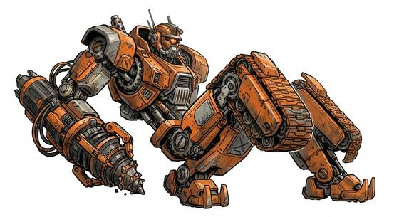

# Transforming robot kind

{.illus}

*Set: Expansion*

*aka: ______________________________*

*Family: [Constructs and synthetics](../Species_Families/constructs-and-synthetics.md)*

Living machines that fold into something else. Transforming robots are sentient, self-repairing beings of metal, driven by an inner source of energy, and each can shift between an upright robot form and a second shape: a vehicle, a beast, an aircraft, an insect. Plates slide, wheels drop, limbs fold away, and in moments a striding giant becomes a truck on the road.

Their society is organised around what each was built to do. Beast-shaped castes are brutish, strong and simple; insect-shaped castes swarm and eat metal; the rarest are titans the size of cities, with others living inside them. They make loyal allies, cunning spies and dreadful enemies, since any parked machine might be one.

## Not to be confused with

*[War-robot folk](constructs-and-synthetics-war-robot-folk.md)*, which are built only for battle and cannot become anything but what they are.

## What sets this species apart

Robotic lifeforms that shift between a robot mode and an alternate mode.

## Breeds and races

Each block below is one set of numbers; breeds that share every number share a block (Species rules, rule 9). Attributes are final modifiers, the size trade-off included. Skills, powers and weapon groups are final levels after the family, species and breed layers.

### No. 309 Generic transforming robot *(genres: robots and synthetics)*

- **Size:** varies · **Body:** biped
- **What it's like:** A transforming robot that shifts between its walking form and a vehicle or beast shape, powered by its own engine. (looks like: robot; good at: making and fixing, toughness)
- **Attributes:** STR +1 END +2 INT +1 WIS −1 CHA −2
- **Skills:**, [Composure](../Skills/composure.md) +2, [Counting & Measuring](../Skills/counting-and-measuring.md) +2, [Memory Training](../Skills/memory-training.md) +2, [Pain Tolerance](../Skills/pain-tolerance.md) +2, [Computer Use](../Skills/computer-use.md) +1, [Cooking](../Skills/cooking.md) −1, [Charm & Seduction](../Skills/charm-and-seduction.md) −2, [Insight](../Skills/insight.md) −2, [Swimming](../Skills/swimming.md) −2, [Carousing](../Skills/carousing.md) Foreign Concept
- **Powers:** [Endurance Without Need](../Powers/endurance-without-need.md) 2, [Poison & Disease Immunity](../Powers/poison-and-disease-immunity.md) 2, [Self-Alteration](../Powers/self-alteration.md) 2, [Healing Factor](../Powers/healing-factor.md) 1
- **For the Game Master only, this race as an NPC guard or soldier (not your character's numbers):** Attack 14 · Parry 11 · Dodge 8 · Damage longsword 1d6+2 · Armour 2 · Life 19 · Threat 1 ([Bestiary roles](../bestiary.md))
- *Why:* Repairs itself.
- *Note:* Healing Factor is slow self-repair.

### No. 310 Beast-mode caste robot *(genres: robots and synthetics)*

- **Size:** huge · **Body:** quadruped
- **What it's like:** A hulking robot built to transform into a dinosaur-like beast, immensely strong and simple-minded but built to smash. (looks like: robot; good at: strength, fighting)
- **Attributes:** STR +6 AGI −4 END +2 INT −1 WIS −1 CHA −2
- **Skills:**, [Composure](../Skills/composure.md) +2, [Counting & Measuring](../Skills/counting-and-measuring.md) +2, [Memory Training](../Skills/memory-training.md) +2, [Pain Tolerance](../Skills/pain-tolerance.md) +2, [Computer Use](../Skills/computer-use.md) +1, [Cooking](../Skills/cooking.md) −1, [Etiquette](../Skills/etiquette.md) −1, [Charm & Seduction](../Skills/charm-and-seduction.md) −2, [Insight](../Skills/insight.md) −2, [Swimming](../Skills/swimming.md) −2, [Carousing](../Skills/carousing.md) Foreign Concept
- **Powers:** [Endurance Without Need](../Powers/endurance-without-need.md) 2, [Poison & Disease Immunity](../Powers/poison-and-disease-immunity.md) 2, [Self-Alteration](../Powers/self-alteration.md) 2
- **Natural attacks:** bite 1d6+1
- **For the Game Master only, this race as an NPC guard or soldier (not your character's numbers):** Attack 14 · Parry 11 · Dodge 2 · Damage bite 2d6; longsword 1d6+5 · Armour 2 · Life 27 · Threat 2 ([Bestiary roles](../bestiary.md))
- *Why:* A brutish beast mode with great jaws, and a blunter mind.
- *Note:* Huge size is set in the attribute step. The bite is in beast mode.

### Insect-mode caste robot *(NPC only)*

- **Size:** medium · **Body:** biped
- **Attributes:** STR +1 AGI +1 END +2 WIS −1 CHA −2
- **Skills:**, [Composure](../Skills/composure.md) +2, [Counting & Measuring](../Skills/counting-and-measuring.md) +2, [Memory Training](../Skills/memory-training.md) +2, [Pain Tolerance](../Skills/pain-tolerance.md) +2, [Computer Use](../Skills/computer-use.md) +1, [Cooking](../Skills/cooking.md) −1, [Charm & Seduction](../Skills/charm-and-seduction.md) −2, [Insight](../Skills/insight.md) −2, [Swimming](../Skills/swimming.md) −2, [Carousing](../Skills/carousing.md) Foreign Concept
- **Powers:** [Endurance Without Need](../Powers/endurance-without-need.md) 2, [Poison & Disease Immunity](../Powers/poison-and-disease-immunity.md) 2, [Self-Alteration](../Powers/self-alteration.md) 2
- **Natural attacks:** mandibles 1d6+1
- **For the Game Master only, this race as an NPC guard or soldier (not your character's numbers):** Attack 14 · Parry 11 · Dodge 9 · Damage longsword 1d6+2; mandibles 1d6+2 · Armour 2 · Life 19 · Threat 1 ([Bestiary roles](../bestiary.md))
- *Why:* An insect mode with biting mandibles.
- *Note:* NPC. Some swarm or self-replicate (narrative). Mandibles are in insect mode.

### Titan-class robot *(NPC only; NPC-scale)*

- **Size:** gigantic · **Body:** biped
- **Attributes:** STR +10 AGI −6 END +5 INT +1 WIS +1 CHA −2
- **Skills:**, [Composure](../Skills/composure.md) +2, [Counting & Measuring](../Skills/counting-and-measuring.md) +2, [Memory Training](../Skills/memory-training.md) +2, [Pain Tolerance](../Skills/pain-tolerance.md) +2, [Computer Use](../Skills/computer-use.md) +1, [Cooking](../Skills/cooking.md) −1, [Charm & Seduction](../Skills/charm-and-seduction.md) −2, [Insight](../Skills/insight.md) −2, [Swimming](../Skills/swimming.md) −2, [Carousing](../Skills/carousing.md) Foreign Concept
- **Powers:** [Toughness](../Powers/toughness.md) 3, [Endurance Without Need](../Powers/endurance-without-need.md) 2, [Poison & Disease Immunity](../Powers/poison-and-disease-immunity.md) 2, [Self-Alteration](../Powers/self-alteration.md) 2
- **Natural attacks:** slam 1d6+1
- **For the Game Master only, this race as an NPC guard or soldier (not your character's numbers):** Attack 15 · Parry 12 · Dodge -2 · Damage slam 2d6+1; longsword 1d6+5 · Armour 2 · Life 44 · Threat 3 ([Bestiary roles](../bestiary.md))
- *Why:* City-sized and near-godlike in scale.

