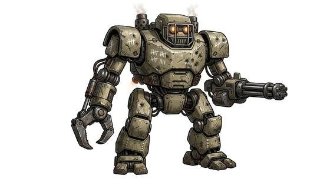

# War-robot folk

{.illus}

*Set: Expansion*

*aka: ______________________________*

*Family: [Constructs and synthetics](../Species_Families/constructs-and-synthetics.md)*

Built for war, and shaped to look it. War-robot folk are armoured machines designed to fight, to survive and to frighten: heavy front-line units sealed against poison and fire, living-metal fighters that reshape and repair themselves, towering hunter-killers built to seek out a single kind of prey, stone-and-metal sentries following orders older than any kingdom, and aerial drones with steel talons.

Some have no more mind than a loaded weapon. Others are fully aware and bitterly individual, carrying battle scars as proudly as any veteran, or struggling to understand the feelings they were given. Ordinary people find them terrifying on sight, which is exactly what their builders intended.

## Not to be confused with

*[Service robot kind](constructs-and-synthetics-service-robot-kind.md)*, built to help rather than to fight, though a few of its models carry weapons too.

## What sets this species apart

Armoured robots built for battle and built to intimidate. Integrated weaponry is gear.

## Breeds and races

Each block below is one set of numbers; breeds that share every number share a block (Species rules, rule 9). Attributes are final modifiers, the size trade-off included. Skills, powers and weapon groups are final levels after the family, species and breed layers.

### No. 306 ABC-proof combat robot *(genres: robots and synthetics)*

- **Size:** large · **Body:** biped
- **What it's like:** A war robot built to shrug off fire, poison and plague alike, tough as anything and full of personality. (looks like: robot; good at: toughness, fighting)
- **Attributes:** STR +4 AGI −2 END +3 WIS −1 CHA −3 COU +1
- **Skills:**, [Composure](../Skills/composure.md) +2, [Counting & Measuring](../Skills/counting-and-measuring.md) +2, [Memory Training](../Skills/memory-training.md) +2, [Pain Tolerance](../Skills/pain-tolerance.md) +2, [Computer Use](../Skills/computer-use.md) +1, [Intimidation](../Skills/intimidation.md) +1, [Cooking](../Skills/cooking.md) −1, [Charm & Seduction](../Skills/charm-and-seduction.md) −2, [Insight](../Skills/insight.md) −2, [Swimming](../Skills/swimming.md) −2, [Carousing](../Skills/carousing.md) Foreign Concept
- **Powers:** [Endurance Without Need](../Powers/endurance-without-need.md) 2, [Environmental Immunity](../Powers/environmental-immunity.md) 2, [Poison & Disease Immunity](../Powers/poison-and-disease-immunity.md) 2, [Armour Skin](../Powers/armour-skin.md) 1
- **For the Game Master only, this race as an NPC guard or soldier (not your character's numbers):** Attack 15 · Parry 12 · Dodge 5 · Damage longsword 1d6+2 · Armour 2 · Life 24 · Threat 2 ([Bestiary roles](../bestiary.md))
- *Why:* Proofed against atomic, biological and chemical attack.

### No. 307 Living-metal war-robot *(genres: robots and synthetics)*

- **Size:** medium · **Body:** biped
- **What it's like:** A robot made of living metal that flows and repairs itself, all but impossible to kill, unpredictable in temperament. (looks like: robot; good at: toughness, making and fixing)
- **Attributes:** STR +2 AGI +1 END +2 WIS −2 CHA −3 COU +1
- **Skills:**, [Composure](../Skills/composure.md) +2, [Counting & Measuring](../Skills/counting-and-measuring.md) +2, [Memory Training](../Skills/memory-training.md) +2, [Pain Tolerance](../Skills/pain-tolerance.md) +2, [Computer Use](../Skills/computer-use.md) +1, [Intimidation](../Skills/intimidation.md) +1, [Cooking](../Skills/cooking.md) −1, [Charm & Seduction](../Skills/charm-and-seduction.md) −2, [Insight](../Skills/insight.md) −2, [Swimming](../Skills/swimming.md) −2, [Carousing](../Skills/carousing.md) Foreign Concept
- **Powers:** [Endurance Without Need](../Powers/endurance-without-need.md) 2, [Healing Factor](../Powers/healing-factor.md) 2, [Poison & Disease Immunity](../Powers/poison-and-disease-immunity.md) 2, [Self-Alteration](../Powers/self-alteration.md) 2, [Armour Skin](../Powers/armour-skin.md) 1
- **For the Game Master only, this race as an NPC guard or soldier (not your character's numbers):** Attack 15 · Parry 12 · Dodge 9 · Damage longsword 1d6+2 · Armour 2 · Life 19 · Threat 2 ([Bestiary roles](../bestiary.md))
- *Why:* Living metal that reshapes and repairs itself and is near-immortal.
- *Note:* Lifespan (very long-lived) is a lexicon detail, not a game number.

### Mass mutant-hunter robot *(beast)*

- **Size:** huge · **Body:** biped
- **Attributes:** STR +8 AGI −4 END +2 CHA −3 COU +1
- **Skills:**, [Composure](../Skills/composure.md) +2, [Counting & Measuring](../Skills/counting-and-measuring.md) +2, [Memory Training](../Skills/memory-training.md) +2, [Pain Tolerance](../Skills/pain-tolerance.md) +2, [Computer Use](../Skills/computer-use.md) +1, [Intimidation](../Skills/intimidation.md) +1, [Cooking](../Skills/cooking.md) −1, [Charm & Seduction](../Skills/charm-and-seduction.md) −2, [Insight](../Skills/insight.md) −2, [Swimming](../Skills/swimming.md) −2, [Carousing](../Skills/carousing.md) Foreign Concept
- **Powers:** [Detect Life & Minds](../Powers/detect-life-and-minds.md) 2, [Endurance Without Need](../Powers/endurance-without-need.md) 2, [Flight](../Powers/flight.md) 2, [Poison & Disease Immunity](../Powers/poison-and-disease-immunity.md) 2, [Armour Skin](../Powers/armour-skin.md) 1
- **For the Game Master only, this race as an NPC guard or soldier (not your character's numbers):** Attack 15 · Parry 12 · Dodge 2 · Damage longsword 1d6+2 · Armour 2 · Life 27 · Threat 2 ([Bestiary roles](../bestiary.md))
- *Why:* A flying hunter-killer built to detect one target population.

### Ancient robotic guardian sentry *(beast)*

- **Size:** huge · **Body:** biped
- **Attributes:** STR +8 AGI −4 END +5 WIS −1 CHA −3 COU +1
- **Skills:**, [Composure](../Skills/composure.md) +2, [Counting & Measuring](../Skills/counting-and-measuring.md) +2, [Memory Training](../Skills/memory-training.md) +2, [Pain Tolerance](../Skills/pain-tolerance.md) +2, [Computer Use](../Skills/computer-use.md) +1, [Intimidation](../Skills/intimidation.md) +1, [Cooking](../Skills/cooking.md) −1, [Charm & Seduction](../Skills/charm-and-seduction.md) −2, [Insight](../Skills/insight.md) −2, [Carousing](../Skills/carousing.md) Foreign Concept, [Swimming](../Skills/swimming.md) Foreign Concept
- **Powers:** [Armour Skin](../Powers/armour-skin.md) 3, [Endurance Without Need](../Powers/endurance-without-need.md) 2, [Poison & Disease Immunity](../Powers/poison-and-disease-immunity.md) 2
- **Natural attacks:** slam 1d6+1
- **For the Game Master only, this race as an NPC guard or soldier (not your character's numbers):** Attack 15 · Parry 12 · Dodge 2 · Damage slam 2d6; longsword 1d6+5 · Armour 2 · Life 30 · Threat 2 ([Bestiary roles](../bestiary.md))
- *Why:* Massive stone and metal: near-indestructible and too heavy to swim.

### Hive-controlled combat drone *(beast)*

- **Size:** medium · **Body:** biped
- **Attributes:** STR +2 END +2 WIS −1 CHA −3 COU +1
- **Skills:**, [Composure](../Skills/composure.md) +2, [Counting & Measuring](../Skills/counting-and-measuring.md) +2, [Memory Training](../Skills/memory-training.md) +2, [Pain Tolerance](../Skills/pain-tolerance.md) +2, [Computer Use](../Skills/computer-use.md) +1, [Intimidation](../Skills/intimidation.md) +1, [Cooking](../Skills/cooking.md) −1, [Charm & Seduction](../Skills/charm-and-seduction.md) −2, [Insight](../Skills/insight.md) −2, [Swimming](../Skills/swimming.md) −2, [Carousing](../Skills/carousing.md) Foreign Concept
- **Powers:** [Endurance Without Need](../Powers/endurance-without-need.md) 2, [Poison & Disease Immunity](../Powers/poison-and-disease-immunity.md) 2, [Armour Skin](../Powers/armour-skin.md) 1
- **For the Game Master only, this race as an NPC guard or soldier (not your character's numbers):** Attack 15 · Parry 12 · Dodge 8 · Damage longsword 1d6+2 · Armour 2 · Life 19 · Threat 2 ([Bestiary roles](../bestiary.md))
- *Why:* Same as its species: an expendable armoured body run by a hostile hive AI.

### Arena-bred cyborg gladiator *(NPC only)*

- **Size:** large · **Body:** biped
- **Attributes:** STR +6 AGI −2 END +2 WIS −1 CHA −3 COU +1
- **Skills:**, [Composure](../Skills/composure.md) +2, [Counting & Measuring](../Skills/counting-and-measuring.md) +2, [Memory Training](../Skills/memory-training.md) +2, [Pain Tolerance](../Skills/pain-tolerance.md) +2, [Computer Use](../Skills/computer-use.md) +1, [Intimidation](../Skills/intimidation.md) +1, [Cooking](../Skills/cooking.md) −1, [Charm & Seduction](../Skills/charm-and-seduction.md) −2, [Insight](../Skills/insight.md) −2, [Swimming](../Skills/swimming.md) −2
- **Powers:** [Armour Skin](../Powers/armour-skin.md) 1, [Endurance Without Need](../Powers/endurance-without-need.md) 1
- **For the Game Master only, this race as an NPC guard or soldier (not your character's numbers):** Attack 15 · Parry 12 · Dodge 5 · Damage longsword 1d6+2 · Armour 2 · Life 23 · Threat 2 ([Bestiary roles](../bestiary.md))
- *Why:* A living native augmented for the arena: still eats, rests and can be poisoned.
- *Note:* NPC. Built-in weapons are gear.

### No. 308 Developing-emotion super-soldier robot *(genres: robots and synthetics, super-powered: mutants and the enhanced)*

- **Size:** medium · **Body:** biped
- **What it's like:** A military super-soldier robot built with weapons and superhuman strength, slowly learning to feel and judge for itself. (looks like: robot; good at: strength, fighting)
- **Attributes:** STR +3 END +2 WIS −1 CHA −3 COU +1
- **Skills:**, [Composure](../Skills/composure.md) +2, [Counting & Measuring](../Skills/counting-and-measuring.md) +2, [Memory Training](../Skills/memory-training.md) +2, [Pain Tolerance](../Skills/pain-tolerance.md) +2, [Computer Use](../Skills/computer-use.md) +1, [Intimidation](../Skills/intimidation.md) +1, [Cooking](../Skills/cooking.md) −1, [Charm & Seduction](../Skills/charm-and-seduction.md) −2, [Insight](../Skills/insight.md) −2, [Swimming](../Skills/swimming.md) −2, [Carousing](../Skills/carousing.md) Foreign Concept
- **Powers:** [Endurance Without Need](../Powers/endurance-without-need.md) 2, [Poison & Disease Immunity](../Powers/poison-and-disease-immunity.md) 2, [Armour Skin](../Powers/armour-skin.md) 1
- **For the Game Master only, this race as an NPC guard or soldier (not your character's numbers):** Attack 15 · Parry 12 · Dodge 8 · Damage longsword 1d6+2 · Armour 2 · Life 19 · Threat 2 ([Bestiary roles](../bestiary.md))
- *Why:* Same as its species: its strength is an attribute and its weapons are gear.

### Obsolete peacekeeper enforcer *(beast)*

- **Size:** medium · **Body:** biped
- **Attributes:** STR +2 END +2 WIS −3 CHA −3 COU +1
- **Skills:**, [Composure](../Skills/composure.md) +2, [Counting & Measuring](../Skills/counting-and-measuring.md) +2, [Memory Training](../Skills/memory-training.md) +2, [Pain Tolerance](../Skills/pain-tolerance.md) +2, [Computer Use](../Skills/computer-use.md) +1, [Intimidation](../Skills/intimidation.md) +1, [Cooking](../Skills/cooking.md) −1, [Charm & Seduction](../Skills/charm-and-seduction.md) −2, [Insight](../Skills/insight.md) −2, [Swimming](../Skills/swimming.md) −2, [Carousing](../Skills/carousing.md) Foreign Concept
- **Powers:** [Endurance Without Need](../Powers/endurance-without-need.md) 2, [Poison & Disease Immunity](../Powers/poison-and-disease-immunity.md) 2, [Armour Skin](../Powers/armour-skin.md) 1
- **For the Game Master only, this race as an NPC guard or soldier (not your character's numbers):** Attack 15 · Parry 12 · Dodge 8 · Damage longsword 1d6+2 · Armour 2 · Life 19 · Threat 2 ([Bestiary roles](../bestiary.md))
- *Why:* Same as its species: an armoured former law-enforcement android.

### Aerial enforcer drone *(beast)*

- **Size:** medium · **Body:** winged biped
- **Attributes:** STR +2 AGI +2 END +2 INT −2 CHA −3 COU +1
- **Skills:**, [Composure](../Skills/composure.md) +2, [Counting & Measuring](../Skills/counting-and-measuring.md) +2, [Memory Training](../Skills/memory-training.md) +2, [Pain Tolerance](../Skills/pain-tolerance.md) +2, [Computer Use](../Skills/computer-use.md) +1, [Intimidation](../Skills/intimidation.md) +1, [Cooking](../Skills/cooking.md) −1, [Charm & Seduction](../Skills/charm-and-seduction.md) −2, [Insight](../Skills/insight.md) −2, [Swimming](../Skills/swimming.md) −2, [Carousing](../Skills/carousing.md) Foreign Concept
- **Powers:** [Endurance Without Need](../Powers/endurance-without-need.md) 2, [Flight](../Powers/flight.md) 2, [Poison & Disease Immunity](../Powers/poison-and-disease-immunity.md) 2, [Armour Skin](../Powers/armour-skin.md) 1
- **Natural attacks:** talons 1d6+1
- **For the Game Master only, this race as an NPC guard or soldier (not your character's numbers):** Attack 15 · Parry — · Dodge 10 · Damage talons 1d6+1 · Armour 0 · Life 17 · Threat minor ([Bestiary roles](../bestiary.md))
- *Why:* A flying, bird-shaped drone with metal talons.

