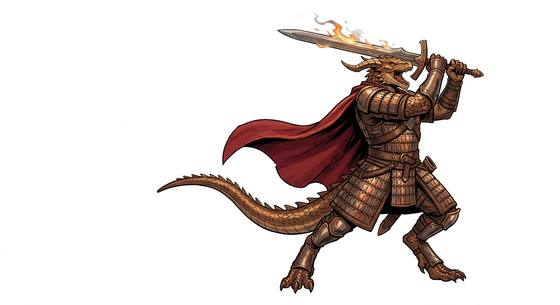

# Dragon-blooded folk

{.illus}

*Set: Core*

*aka: ______________________________*

*Family: [Draconic](../Species_Families/draconic.md)*

People with a dragon somewhere in the family tree. Dragon-blooded folk are humanoids whose ancestry, blessing or creation marks them with draconic traits: scales along the cheek or down the spine, eyes with slit pupils, a warmth in the blood, sometimes horns. Some can breathe a small gout of flame or frost, some shrug off the element of their ancestor, and some can take a full dragon's shape when need or ritual allows.

They range from proud warrior clans and disciplined scholars to small scaly tinkerers who set traps in their tunnels. Most are fiercely conscious of their lineage and quick to take offence. Others find them impressive, touchy and very hard to impress in return.

## Not to be confused with

*[Dragon-blooded ascendant](elemental-kind-dragon-blooded-ascendant.md)*, the imperial scions of the elemental dragons, who belong to elemental-kind rather than to the dragons proper.

## What sets this species apart

No species-wide difference: the family lines describe dragon-blooded humanoids; breath, wings and shapeshifting vary by Breed/Race. Humanoid dragon-kin have no natural attacks unless the Breed/Race says so.

## Breeds and races

Each block below is one set of numbers; breeds that share every number share a block (Species rules, rule 9). Attributes are final modifiers, the size trade-off included. Skills, powers and weapon groups are final levels after the family, species and breed layers.

### No. 321 Dragon-blooded warrior folk *(genres: classic fantasy; starter)*

- **Size:** medium · **Body:** biped+tailed
- **What it's like:** Proud scaled warriors with dragon ancestry who can breathe fire or frost. (looks like: dragon; good at: strength, powers and magic, fighting)
- **Attributes:** STR +2 AGI −1 WIS −1 CHA +1 COU +1
- **Skills:** [Intimidation](../Skills/intimidation.md) +3, [Appraisal](../Skills/appraisal.md) +2, [Composure](../Skills/composure.md) +1, [Creature & Occult Lore](../Skills/creature-and-occult-lore.md) +1, [Disguise](../Skills/disguise.md) −2, [Stealth](../Skills/stealth.md) −2
- **Powers:** [Resist Element](../Powers/resist-element.md) 2, [Fire Blast](../Powers/fire-blast.md) 1
- **For the Game Master only, this race as an NPC guard or soldier (not your character's numbers):** Attack 14 · Parry 11 · Dodge 7 · Damage longsword 1d6+2 · Armour 2 · Life 17 · Threat 1 ([Bestiary roles](../bestiary.md))
- *Why:* A lesser breath weapon and a long life.
- *Note:* Fire Blast stands for the breath; swap for Cold Blast, Lightning or Acid & Corrosion to match the element. Lifespan (long-lived) is a lexicon detail, not a game number.

### No. 322 Half-dragon noble *(genres: classic fantasy)*

- **Size:** medium · **Body:** winged biped
- **What it's like:** A noble with dragon blood in their veins: scaled skin, a little breath weapon, and sometimes the gift of flight. (looks like: dragon; good at: fighting, powers and magic)
- **Attributes:** STR +2 AGI −1 END +1 WIS −1 COU +1
- **Skills:** [Intimidation](../Skills/intimidation.md) +3, [Appraisal](../Skills/appraisal.md) +2, [Composure](../Skills/composure.md) +1, [Creature & Occult Lore](../Skills/creature-and-occult-lore.md) +1, [Disguise](../Skills/disguise.md) −2, [Stealth](../Skills/stealth.md) −2
- **Powers:** [Resist Element](../Powers/resist-element.md) 2, [Fire Blast](../Powers/fire-blast.md) 1, [Flight](../Powers/flight.md) 1
- **Weapon groups:** [Brawling](../Weapon_Groups/brawling.md) +1
- **Natural attacks:** claws 1d6+1, bite 1d6+1
- **For the Game Master only, this race as an NPC guard or soldier (not your character's numbers):** Attack 14 · Parry 11 · Dodge 7 · Damage longsword 1d6+2; claws 1d6+2 · Armour 2 · Life 18 · Threat 1 ([Bestiary roles](../bestiary.md))
- *Why:* A minor breath and, in some, wings that can fly.
- *Note:* Fire Blast stands for the breath; swap for Cold Blast, Lightning or Acid & Corrosion to match the element. Flight only for those born with working wings.

### No. 323 Dragon-form shapeshifter folk *(genres: classic fantasy)*

- **Size:** medium · **Body:** biped
- **What it's like:** Someone who looks entirely human until the moment they transform into a true dragon, carrying an ancient, long-lived bloodline. (looks like: human; good at: powers and magic, fighting)
- **Attributes:** STR +1 COU +1
- **Skills:** [Intimidation](../Skills/intimidation.md) +3, [Appraisal](../Skills/appraisal.md) +2, [Composure](../Skills/composure.md) +1, [Creature & Occult Lore](../Skills/creature-and-occult-lore.md) +1, [Stealth](../Skills/stealth.md) −2
- **Powers:** [Monstrous Form](../Powers/monstrous-form.md) 2, [Resist Element](../Powers/resist-element.md) 2
- **For the Game Master only, this race as an NPC guard or soldier (not your character's numbers):** Attack 14 · Parry 11 · Dodge 8 · Damage longsword 1d6+2 · Armour 2 · Life 17 · Threat 1 ([Bestiary roles](../bestiary.md))
- *Why:* Pass as human until they take full dragon form; immensely long-lived.
- *Note:* Monstrous Form is the full dragon form. Lifespan (very long-lived) is a lexicon detail, not a game number.

### No. 324 Dragon-aspect servitor folk *(genres: classic fantasy)*

- **Size:** medium · **Body:** biped+winged
- **What it's like:** A long-lived servant folk who can shift between a human shape and a full winged dragon form at will. (looks like: dragon; good at: powers and magic, flying)
- **Attributes:** STR +2 AGI −1 WIS −1 COU +1
- **Skills:** [Intimidation](../Skills/intimidation.md) +3, [Appraisal](../Skills/appraisal.md) +2, [Composure](../Skills/composure.md) +1, [Creature & Occult Lore](../Skills/creature-and-occult-lore.md) +1, [Disguise](../Skills/disguise.md) −2, [Stealth](../Skills/stealth.md) −2
- **Powers:** [Flight](../Powers/flight.md) 2, [Monstrous Form](../Powers/monstrous-form.md) 2, [Resist Element](../Powers/resist-element.md) 2
- **For the Game Master only, this race as an NPC guard or soldier (not your character's numbers):** Attack 14 · Parry 11 · Dodge 7 · Damage longsword 1d6+2 · Armour 2 · Life 17 · Threat 1 ([Bestiary roles](../bestiary.md))
- *Why:* Created servitors that shift between humanoid and winged dragon form.
- *Note:* Flight only in dragon form. Lifespan (long-lived) is a lexicon detail, not a game number.

### No. 325 Dragon-touched mythic folk *(genres: myth and legend)*

- **Size:** medium · **Body:** biped+tailed
- **What it's like:** Folk touched by dragon-blessing, with a few scales and a proud culture of mythic heroes. (looks like: human with scales; good at: fighting, powers and magic)
- **Attributes:** STR +1 WIS −1 COU +1
- **Skills:** [Intimidation](../Skills/intimidation.md) +3, [Appraisal](../Skills/appraisal.md) +2, [Composure](../Skills/composure.md) +1, [Creature & Occult Lore](../Skills/creature-and-occult-lore.md) +1, [Disguise](../Skills/disguise.md) −2, [Stealth](../Skills/stealth.md) −2
- **Powers:** [Resist Element](../Powers/resist-element.md) 2
- **For the Game Master only, this race as an NPC guard or soldier (not your character's numbers):** Attack 14 · Parry 11 · Dodge 8 · Damage longsword 1d6+2 · Armour 2 · Life 17 · Threat 1 ([Bestiary roles](../bestiary.md))
- *Note:* A minor blessing, not ancestry; the hero culture is handled in the Culture step.

### No. 326 Scholarly dragon-descended folk *(genres: classic fantasy)*

- **Size:** medium · **Body:** biped
- **What it's like:** Scaled descendants of dragons who prize discipline and scholarship, building a great and expanding civilisation. (looks like: human with scales; good at: knowledge, fighting)
- **Attributes:** STR +1 AGI −1 INT +2 WIS −1 COU +1
- **Skills:** [Intimidation](../Skills/intimidation.md) +3, [Appraisal](../Skills/appraisal.md) +2, [Composure](../Skills/composure.md) +1, [Creature & Occult Lore](../Skills/creature-and-occult-lore.md) +1, [Research](../Skills/research.md) +1, [Disguise](../Skills/disguise.md) −2, [Stealth](../Skills/stealth.md) −2
- **Powers:** [Resist Element](../Powers/resist-element.md) 2
- **For the Game Master only, this race as an NPC guard or soldier (not your character's numbers):** Attack 14 · Parry 11 · Dodge 7 · Damage longsword 1d6+2 · Armour 2 · Life 17 · Threat 1 ([Bestiary roles](../bestiary.md))
- *Why:* A disciplined scholarly people.

### No. 327 Kobold-kin tinkerer folk *(genres: classic fantasy)*

- **Size:** small · **Body:** biped
- **What it's like:** Small dragon-kin who see in the dark and love building clever traps, living in tribes with scales of every colour. (looks like: lizard; good at: making and fixing, keen senses)
- **Attributes:** STR −2 AGI +2 COU −1
- **Skills:** [Appraisal](../Skills/appraisal.md) +2, [Traps](../Skills/traps.md) +2, [Composure](../Skills/composure.md) +1, [Creature & Occult Lore](../Skills/creature-and-occult-lore.md) +1, [Intimidation](../Skills/intimidation.md) +1, [Disguise](../Skills/disguise.md) −2, [Stealth](../Skills/stealth.md) −2
- **Powers:** [Night & Spectrum Sight](../Powers/night-and-spectrum-sight.md) 2, [Resist Element](../Powers/resist-element.md) 2
- **For the Game Master only, this race as an NPC guard or soldier (not your character's numbers):** Attack 13 · Parry 10 · Dodge 11 · Damage longsword 1d6+1 · Armour 2 · Life 15 · Threat 1 ([Bestiary roles](../bestiary.md))
- *Why:* Small, dark-sighted trap-makers without a dragon's menace.

