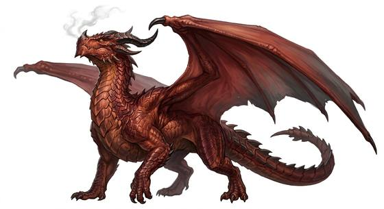

# True dragons

{.illus}

*Set: Expansion*

*aka: ______________________________*

*Family: [Draconic](../Species_Families/draconic.md)*

The great dragons. Huge, scaled, horned and winged, with claws like ploughshares and jaws that can bite a horse in two, true dragons are the oldest and proudest of living things. They live for many human lifetimes, gather wisdom, magic and treasure, and breathe fire, frost, lightning or poison according to their kind.

Some are cruel, greedy tyrants who rule a territory by terror. Others are wise guardians who take human shape to walk among mortals. The serpentine dragons of the east have no wings and fly all the same, bringing rain and ruling rivers. Rarer lines bond for life with a single rider, or remember everything their ancestors knew. None of them take kindly to being disturbed.

## Not to be confused with

*[Wyverns and drakes](draconic-wyverns-and-drakes.md)*, the smaller feral cousins, who have the teeth and sometimes the breath but none of the mind.

## What sets this species apart

Huge, long-lived flying dragons with formidable claws and bite. Breath weapons vary by type and are Set at the Breed/Race layer; wingless eastern dragons still fly. Lifespan (long-lived) is a lexicon detail, not a game number. No hands: held weapons unusable. (in dragon form)

## Breeds and races

Each block below is one set of numbers; breeds that share every number share a block (Species rules, rule 9). Attributes are final modifiers, the size trade-off included. Skills, powers and weapon groups are final levels after the family, species and breed layers.

### No. 317 Elemental breath dragon-folk *(genres: classic fantasy)*

- **Size:** huge · **Body:** winged biped
- **What it's like:** Vast, ancient dragon-folk with sharp minds and a hoarding streak, breathing fire, frost or lightning on those who cross them. (looks like: dragon; good at: powers and magic, fighting, flying)
- **Attributes:** STR +6 AGI −4 END +1 INT +2 WIS −1 COU +1
- **Skills:** [Intimidation](../Skills/intimidation.md) +3, [Appraisal](../Skills/appraisal.md) +2, [Arcana](../Skills/arcana.md) +1, [Composure](../Skills/composure.md) +1, [Creature & Occult Lore](../Skills/creature-and-occult-lore.md) +1, [Disguise](../Skills/disguise.md) −2, [Stealth](../Skills/stealth.md) −2
- **Powers:** [Fire Blast](../Powers/fire-blast.md) 2, [Flight](../Powers/flight.md) 2, [Resist Element](../Powers/resist-element.md) 2
- **Weapon groups:** [Brawling](../Weapon_Groups/brawling.md) +1
- **Natural attacks:** claws 1d6+1, bite 1d6+1, tail 1d6+1
- **For the Game Master only, this race as an NPC guard or soldier (not your character's numbers):** Attack 16 · Parry — · Dodge 2 · Damage claws 2d6; bite 1d6+6 · Armour 0 · Life 24 · Threat 1 ([Bestiary roles](../bestiary.md))
- *Why:* Magic-attuned, extremely long-lived dragons with an elemental breath.
- *Note:* Fire Blast stands for the breath; swap for Cold Blast, Lightning or Acid & Corrosion to match the element. Lifespan (very long-lived) is a lexicon detail, not a game number.

### Malevolent elemental dragons *(NPC only)*

- **Size:** huge · **Body:** winged biped
- **Attributes:** STR +8 AGI −4 END +3 INT +3 WIS −1 CHA +2 COU +1
- **Skills:** [Intimidation](../Skills/intimidation.md) +3, [Appraisal](../Skills/appraisal.md) +2, [Composure](../Skills/composure.md) +1, [Creature & Occult Lore](../Skills/creature-and-occult-lore.md) +1, [Deception](../Skills/deception.md) +1, [Disguise](../Skills/disguise.md) −2, [Stealth](../Skills/stealth.md) −2
- **Powers:** [Fire Blast](../Powers/fire-blast.md) 2, [Flight](../Powers/flight.md) 2, [Resist Element](../Powers/resist-element.md) 2
- **Weapon groups:** [Brawling](../Weapon_Groups/brawling.md) +1
- **Natural attacks:** claws 1d6+1, bite 1d6+1, tail 1d6+1
- **For the Game Master only, this race as an NPC guard or soldier (not your character's numbers):** Attack 16 · Parry — · Dodge 2 · Damage claws 2d6; bite 1d6+6 · Armour 0 · Life 26 · Threat 1 ([Bestiary roles](../bestiary.md))
- *Why:* Manipulative chromatic dragons with elemental breath.
- *Note:* Fire Blast stands for the breath; swap for Cold Blast, Lightning or Acid & Corrosion to match the element.

### Benevolent elemental dragons *(NPC only)*

- **Size:** huge · **Body:** winged biped
- **Attributes:** STR +8 AGI −4 END +3 INT +2 WIS +2 CHA +2 COU +1
- **Skills:** [Intimidation](../Skills/intimidation.md) +3, [Appraisal](../Skills/appraisal.md) +2, [Composure](../Skills/composure.md) +1, [Creature & Occult Lore](../Skills/creature-and-occult-lore.md) +1, [Disguise](../Skills/disguise.md) −2, [Stealth](../Skills/stealth.md) −2
- **Powers:** [Fire Blast](../Powers/fire-blast.md) 2, [Flight](../Powers/flight.md) 2, [Resist Element](../Powers/resist-element.md) 2, [Self-Alteration](../Powers/self-alteration.md) 2
- **Weapon groups:** [Brawling](../Weapon_Groups/brawling.md) +1
- **Natural attacks:** claws 1d6+1, bite 1d6+1, tail 1d6+1
- **For the Game Master only, this race as an NPC guard or soldier (not your character's numbers):** Attack 16 · Parry — · Dodge 2 · Damage claws 2d6; bite 1d6+6 · Armour 0 · Life 26 · Threat 1 ([Bestiary roles](../bestiary.md))
- *Why:* Metallic dragons with elemental breath who take mortal shape to help.
- *Note:* Fire Blast stands for the breath; swap for Cold Blast, Lightning or Acid & Corrosion to match the element.

### No. 318 Eastern weather dragon-folk *(genres: myth and legend)*

- **Size:** huge · **Body:** serpentine+winged
- **What it's like:** Long, whiskered serpent-dragons who fly without wings and command the weather and rivers, wise and kindly when shown respect. (looks like: dragon; good at: powers and magic, flying)
- **Attributes:** STR +5 AGI −4 INT +2 WIS +1 COU +1
- **Skills:** [Intimidation](../Skills/intimidation.md) +3, [Appraisal](../Skills/appraisal.md) +2, [Composure](../Skills/composure.md) +1, [Creature & Occult Lore](../Skills/creature-and-occult-lore.md) +1, [Disguise](../Skills/disguise.md) −2, [Stealth](../Skills/stealth.md) −2
- **Powers:** [Flight](../Powers/flight.md) 2, [Resist Element](../Powers/resist-element.md) 2, [Weather-Working](../Powers/weather-working.md) 2, [Water Control](../Powers/water-control.md) 1
- **Weapon groups:** [Brawling](../Weapon_Groups/brawling.md) +1
- **Natural attacks:** claws 1d6+1, bite 1d6+1, tail 1d6+1
- **For the Game Master only, this race as an NPC guard or soldier (not your character's numbers):** Attack 15 · Parry — · Dodge 2 · Damage claws 2d6; bite 1d6+6 · Armour 0 · Life 23 · Threat 1 ([Bestiary roles](../bestiary.md))
- *Why:* Wingless river dragons who rule weather and water; no breath.

### Ancient sage dragon-folk *(NPC only)*

- **Size:** large · **Body:** serpentine
- **Attributes:** STR +4 AGI −2 END +1 INT +4 WIS +2 COU +1
- **Skills:** [Intimidation](../Skills/intimidation.md) +3, [Appraisal](../Skills/appraisal.md) +2, [Composure](../Skills/composure.md) +1, [Creature & Occult Lore](../Skills/creature-and-occult-lore.md) +1, [Disguise](../Skills/disguise.md) −2, [Stealth](../Skills/stealth.md) −2
- **Powers:** [Flight](../Powers/flight.md) 2, [Resist Element](../Powers/resist-element.md) 2, [Self-Alteration](../Powers/self-alteration.md) 1, [Tongues](../Powers/tongues.md) 1
- **Weapon groups:** [Brawling](../Weapon_Groups/brawling.md) +1
- **Natural attacks:** claws 1d6+1, bite 1d6+1, tail 1d6+1
- **For the Game Master only, this race as an NPC guard or soldier (not your character's numbers):** Attack 16 · Parry — · Dodge 5 · Damage claws 1d6+2; bite 1d6+4 · Armour 0 · Life 20 · Threat minor ([Bestiary roles](../bestiary.md))
- *Why:* Near-immortal serpentine sages; some speak local tongues or take human form.
- *Note:* Lifespan (very long-lived) is a lexicon detail, not a game number.

### No. 319 Bio-engineered rider-bonded dragons *(high-power: Game Master's approval; genres: pulp planets and lost worlds)*

- **Size:** huge · **Body:** winged biped
- **What it's like:** A huge bonded dragon that breathes fire for the one rider it's linked to for life, and blinks short distances. (looks like: dragon; good at: flying, fighting, powers and magic)
- **Attributes:** STR +6 AGI −4 END +1 WIS −1 COU +1
- **Skills:** [Intimidation](../Skills/intimidation.md) +3, [Appraisal](../Skills/appraisal.md) +2, [Composure](../Skills/composure.md) +1, [Creature & Occult Lore](../Skills/creature-and-occult-lore.md) +1, [Disguise](../Skills/disguise.md) −2, [Stealth](../Skills/stealth.md) −2
- **Powers:** [Fire Blast](../Powers/fire-blast.md) 2, [Flight](../Powers/flight.md) 2, [Mind Link](../Powers/mind-link.md) 2, [Resist Element](../Powers/resist-element.md) 2, [Short Teleport](../Powers/short-teleport.md) 2
- **Weapon groups:** [Brawling](../Weapon_Groups/brawling.md) +1
- **Natural attacks:** claws 1d6+1, bite 1d6+1, tail 1d6+1
- **For the Game Master only, this race as an NPC guard or soldier (not your character's numbers):** Attack 16 · Parry — · Dodge 2 · Damage claws 2d6; bite 1d6+6 · Armour 0 · Life 24 · Threat 1 ([Bestiary roles](../bestiary.md))
- *Why:* Mind-bonded to one rider; breathe fire from chewed stone and blink short distances.
- *Note:* Mind Link is with its one rider; Fire Blast needs a meal of fire-stone first. High-power (Game Master's approval): suits super-powered or mythic campaigns.

### Memory-keeping cocoon dragons *(NPC only)*

- **Size:** huge · **Body:** winged biped
- **Attributes:** STR +6 AGI −4 END +1 INT +4 WIS −1 CHA −1 COU +2
- **Skills:** [Intimidation](../Skills/intimidation.md) +3, [Appraisal](../Skills/appraisal.md) +2, [History](../Skills/history.md) +2, [Composure](../Skills/composure.md) +1, [Creature & Occult Lore](../Skills/creature-and-occult-lore.md) +1, [Disguise](../Skills/disguise.md) −2, [Stealth](../Skills/stealth.md) −2
- **Powers:** [Flight](../Powers/flight.md) 2, [Resist Element](../Powers/resist-element.md) 2
- **Weapon groups:** [Brawling](../Weapon_Groups/brawling.md) +1
- **Natural attacks:** claws 1d6+1, bite 1d6+1, tail 1d6+1
- **For the Game Master only, this race as an NPC guard or soldier (not your character's numbers):** Attack 16 · Parry — · Dodge 2 · Damage claws 2d6; bite 1d6+6 · Armour 0 · Life 24 · Threat 1 ([Bestiary roles](../bestiary.md))
- *Why:* Hatch carrying their ancestors' memories.

