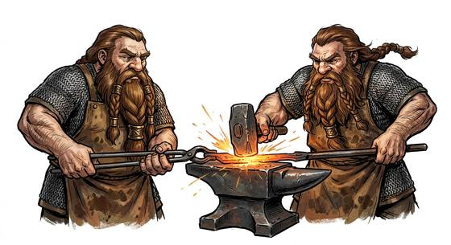

# Dwarf

{.illus}

*Set: Core*

*aka: ______________________________*

*Family: [Dwarf-kind](../Species_Families/dwarf-kind.md)*

Short, broad and dense as the stone they love. Dwarves are the classic mountain folk: strong for their size, hard to poison, harder to sicken and famously stubborn. They mine, smith and build, and they are very good at it. Their halls are carved deep in the rock, lit by forges and full of the noise of hammers.

Dwarf lines are many. Mountain clans value craft and grudges in equal measure; deep dwarves see in the dark and resent the sun; desert and arctic clans have made peace with their climates; wild hill dwarves raid and ride; dark dwarves serve fire and shadow; exiles and ferals live outside the clans; and some lines carry their ancestors' memory in machines among the stars. All of them remember a slight forever.

## Not to be confused with

*[Mountain-folk](dwarf-kind-mountain-folk.md)*, the ancient stone-singing artificers, a vanished people older than the dwarves and far longer-lived.

## What sets this species apart

No species-wide difference: this is the family template, and its breed lines carry the variation.

## Breeds and races

Each block below is one set of numbers; breeds that share every number share a block (Species rules, rule 9). Attributes are final modifiers, the size trade-off included. Skills, powers and weapon groups are final levels after the family, species and breed layers.

### No. 328 Mountain dwarf folk *(genres: classic fantasy; starter)*

- **Size:** medium · **Body:** biped
- **What it's like:** Short, sturdy, stubborn miners and smiths who never forget a grudge. (looks like: dwarf; good at: toughness, making and fixing, keen senses)
- **Attributes:** AGI −1 END +2 CHA −1 COU +1
- **Skills:** [Survival: Caves & Underground](../Skills/survival-caves-and-underground.md) +3, [Mining & Quarrying](../Skills/mining-and-quarrying.md) +2, [Stonemasonry](../Skills/stonemasonry.md) +2, [Blacksmithing](../Skills/blacksmithing.md) +1, [Riding](../Skills/riding.md) −1, [Running](../Skills/running.md) −1, [Swimming](../Skills/swimming.md) −2
- **Powers:** [Night & Spectrum Sight](../Powers/night-and-spectrum-sight.md) 2, [Poison & Disease Immunity](../Powers/poison-and-disease-immunity.md) 1
- **For the Game Master only, this race as an NPC guard or soldier (not your character's numbers):** Attack 14 · Parry 11 · Dodge 7 · Damage longsword 1d6+2 · Armour 2 · Life 19 · Threat 1 ([Bestiary roles](../bestiary.md))
- *Why:* Master smiths who live two to three human lifetimes.
- *Note:* Blacksmithing is a culture line. Lifespan (long-lived) is a lexicon detail, not a game number.

### No. 329 Small hardy dwarf folk · No. 336 Casteless outcast dwarf folk *(genres: classic fantasy)*

- **Size:** small · **Body:** biped
- **What it's like:** Stocky, gruff dwarves who make fine smiths, fighters or handymen, fiercely loyal to their own but wary of strangers. (looks like: dwarf; good at: making and fixing, fighting)
- **Attributes:** STR −2 AGI +1 END +2 CHA −1 COU +1
- **Skills:** [Survival: Caves & Underground](../Skills/survival-caves-and-underground.md) +3, [Mining & Quarrying](../Skills/mining-and-quarrying.md) +2, [Stonemasonry](../Skills/stonemasonry.md) +2, [Riding](../Skills/riding.md) −1, [Running](../Skills/running.md) −1, [Swimming](../Skills/swimming.md) −2
- **Powers:** [Night & Spectrum Sight](../Powers/night-and-spectrum-sight.md) 2, [Poison & Disease Immunity](../Powers/poison-and-disease-immunity.md) 1
- **For the Game Master only, this race as an NPC guard or soldier (not your character's numbers):** Attack 14 · Parry 11 · Dodge 10 · Damage longsword 1d6+1 · Armour 2 · Life 17 · Threat 1 ([Bestiary roles](../bestiary.md))
- *Small hardy dwarf folk:* Same as its species; it is smaller, which is an attribute matter.
- *Casteless outcast dwarf folk:* Same as its species; surface exile is homeland and culture.

### No. 330 Deep dwarf folk *(genres: underworld and wild places, classic fantasy)*

- **Size:** medium · **Body:** biped
- **What it's like:** Grim underground dwarves who see in the dark, resist mind-magic, can grow giant-sized, and turn to stone in sunlight. (looks like: dwarf; good at: making and fixing, toughness)
- **Attributes:** AGI −1 END +2 CHA −1 COU +1
- **Skills:** [Survival: Caves & Underground](../Skills/survival-caves-and-underground.md) +3, [Mining & Quarrying](../Skills/mining-and-quarrying.md) +2, [Stonemasonry](../Skills/stonemasonry.md) +2, [Riding](../Skills/riding.md) −1, [Running](../Skills/running.md) −1, [Swimming](../Skills/swimming.md) −2
- **Powers:** [Night & Spectrum Sight](../Powers/night-and-spectrum-sight.md) 2, [Growing](../Powers/growing.md) 1, [Mind Shield](../Powers/mind-shield.md) 1, [Poison & Disease Immunity](../Powers/poison-and-disease-immunity.md) 1
- **For the Game Master only, this race as an NPC guard or soldier (not your character's numbers):** Attack 14 · Parry 11 · Dodge 7 · Damage longsword 1d6+2 · Armour 2 · Life 19 · Threat 1 ([Bestiary roles](../bestiary.md))
- *Why:* Resists psionics and can enlarge itself.
- *Note:* Sunlight turns some to stone (a flaw).

### No. 331 Desert dwarf folk *(genres: dark fantasy)*

- **Size:** medium · **Body:** biped
- **What it's like:** Desert-dwelling dwarves at home in the worst heat, with a taste for psychic and mind-bending traditions. (looks like: dwarf; good at: wilderness, making and fixing)
- **Attributes:** AGI −1 END +2 CHA −1 COU +1
- **Skills:** [Survival: Caves & Underground](../Skills/survival-caves-and-underground.md) +3, [Mining & Quarrying](../Skills/mining-and-quarrying.md) +2, [Stonemasonry](../Skills/stonemasonry.md) +2, [Survival: Desert](../Skills/survival-desert.md) +2, [Riding](../Skills/riding.md) −1, [Running](../Skills/running.md) −1, [Swimming](../Skills/swimming.md) −2
- **Powers:** [Night & Spectrum Sight](../Powers/night-and-spectrum-sight.md) 2, [Poison & Disease Immunity](../Powers/poison-and-disease-immunity.md) 1, [Resist Element](../Powers/resist-element.md) 1
- **For the Game Master only, this race as an NPC guard or soldier (not your character's numbers):** Attack 14 · Parry 11 · Dodge 7 · Damage longsword 1d6+2 · Armour 2 · Life 19 · Threat 1 ([Bestiary roles](../bestiary.md))
- *Why:* Heat-resistant desert dwellers.
- *Note:* Element is heat. The psionic-leaning culture is a Culture matter.

### No. 332 Arctic clan dwarf folk *(genres: classic fantasy)*

- **Size:** medium · **Body:** biped
- **What it's like:** Cold-hardy dwarf clans of the frozen north, keeping mostly to themselves and their own frost-proof halls. (looks like: dwarf; good at: wilderness, toughness)
- **Attributes:** AGI −1 END +2 CHA −1 COU +1
- **Skills:** [Survival: Caves & Underground](../Skills/survival-caves-and-underground.md) +3, [Mining & Quarrying](../Skills/mining-and-quarrying.md) +2, [Stonemasonry](../Skills/stonemasonry.md) +2, [Survival: Arctic](../Skills/survival-arctic.md) +2, [Riding](../Skills/riding.md) −1, [Running](../Skills/running.md) −1, [Swimming](../Skills/swimming.md) −2
- **Powers:** [Night & Spectrum Sight](../Powers/night-and-spectrum-sight.md) 2, [Poison & Disease Immunity](../Powers/poison-and-disease-immunity.md) 1, [Resist Element](../Powers/resist-element.md) 1
- **For the Game Master only, this race as an NPC guard or soldier (not your character's numbers):** Attack 14 · Parry 11 · Dodge 7 · Damage longsword 1d6+2 · Armour 2 · Life 19 · Threat 1 ([Bestiary roles](../bestiary.md))
- *Why:* Cold-resistant clans of the ice.
- *Note:* Element is cold.

### No. 333 Slayer cult dwarf folk *(genres: classic fantasy)*

- **Size:** medium · **Body:** biped
- **What it's like:** Tattooed dwarf warriors with wild orange crests, seeking a glorious death in battle above all else. (looks like: dwarf; good at: fighting, toughness)
- **Attributes:** AGI −1 END +2 CHA −1 COU +1
- **Skills:** [Survival: Caves & Underground](../Skills/survival-caves-and-underground.md) +3, [Mining & Quarrying](../Skills/mining-and-quarrying.md) +2, [Stonemasonry](../Skills/stonemasonry.md) +2, [Composure](../Skills/composure.md) +1, [Pain Tolerance](../Skills/pain-tolerance.md) +1, [Riding](../Skills/riding.md) −1, [Running](../Skills/running.md) −1, [Swimming](../Skills/swimming.md) −2
- **Powers:** [Night & Spectrum Sight](../Powers/night-and-spectrum-sight.md) 2, [Poison & Disease Immunity](../Powers/poison-and-disease-immunity.md) 1
- **For the Game Master only, this race as an NPC guard or soldier (not your character's numbers):** Attack 14 · Parry 11 · Dodge 7 · Damage longsword 1d6+2 · Armour 2 · Life 19 · Threat 1 ([Bestiary roles](../bestiary.md))
- *Why:* A death-seeking warrior people who fear nothing and ignore wounds.
- *Note:* Culture lines, inseparable from this people.

### No. 334 Hill/wild dwarf folk *(genres: classic fantasy)*

- **Size:** small · **Body:** biped
- **What it's like:** Rugged hill dwarves who ride the storms and tame great flying beasts, fierce raiders far from their kin's forges. (looks like: dwarf; good at: fighting, wilderness)
- **Attributes:** STR −2 AGI +1 END +2 CHA −1 COU +1
- **Skills:** [Survival: Caves & Underground](../Skills/survival-caves-and-underground.md) +3, [Mining & Quarrying](../Skills/mining-and-quarrying.md) +2, [Stonemasonry](../Skills/stonemasonry.md) +2, [Exotic Beasts](../Skills/exotic-beasts.md) +1, [Survival: Mountain](../Skills/survival-mountain.md) +1, [Riding](../Skills/riding.md) −1, [Running](../Skills/running.md) −1, [Swimming](../Skills/swimming.md) −2
- **Powers:** [Night & Spectrum Sight](../Powers/night-and-spectrum-sight.md) 2, [Poison & Disease Immunity](../Powers/poison-and-disease-immunity.md) 1
- **For the Game Master only, this race as an NPC guard or soldier (not your character's numbers):** Attack 14 · Parry 11 · Dodge 10 · Damage longsword 1d6+1 · Armour 2 · Life 17 · Threat 1 ([Bestiary roles](../bestiary.md))
- *Why:* Less industrial mountain raiders with a storm-and-gryphon culture.
- *Note:* Culture lines.

### No. 335 Dark/subterranean dwarf folk *(genres: classic fantasy)*

- **Size:** small · **Body:** biped
- **What it's like:** Dark dwarves of fire and shadow, isolated and elemental-worshipping, with a reputation for treachery. (looks like: dwarf; good at: making and fixing, powers and magic)
- **Attributes:** STR −2 AGI +1 END +2 CHA −1 COU +1
- **Skills:** [Survival: Caves & Underground](../Skills/survival-caves-and-underground.md) +3, [Mining & Quarrying](../Skills/mining-and-quarrying.md) +2, [Stonemasonry](../Skills/stonemasonry.md) +2, [Riding](../Skills/riding.md) −1, [Running](../Skills/running.md) −1, [Swimming](../Skills/swimming.md) −2
- **Powers:** [Night & Spectrum Sight](../Powers/night-and-spectrum-sight.md) 2, [Poison & Disease Immunity](../Powers/poison-and-disease-immunity.md) 1, [Resist Element](../Powers/resist-element.md) 1
- **For the Game Master only, this race as an NPC guard or soldier (not your character's numbers):** Attack 14 · Parry 11 · Dodge 10 · Damage longsword 1d6+1 · Armour 2 · Life 17 · Threat 1 ([Bestiary roles](../bestiary.md))
- *Why:* Carries an affinity for fire and shadow.
- *Note:* Resist Element is fire. Shadow Shaping is affinity only.

### No. 337 Void-league dwarf folk *(genres: space opera: near-humans)*

- **Size:** small · **Body:** biped
- **What it's like:** Cybernetic dwarves who fly between the stars, honouring ancestor-machines while keeping their old miners' toughness. (looks like: robot; good at: making and fixing, toughness)
- **Attributes:** STR −2 AGI +1 END +2 CHA −1 COU +1
- **Skills:** [Survival: Caves & Underground](../Skills/survival-caves-and-underground.md) +3, [Mining & Quarrying](../Skills/mining-and-quarrying.md) +2, [Stonemasonry](../Skills/stonemasonry.md) +2, [Low & Zero Gravity](../Skills/low-and-zero-gravity.md) +1, [Riding](../Skills/riding.md) −1, [Running](../Skills/running.md) −1, [Swimming](../Skills/swimming.md) −2
- **Powers:** [Night & Spectrum Sight](../Powers/night-and-spectrum-sight.md) 2, [Poison & Disease Immunity](../Powers/poison-and-disease-immunity.md) 1
- **For the Game Master only, this race as an NPC guard or soldier (not your character's numbers):** Attack 14 · Parry 11 · Dodge 10 · Damage longsword 1d6+1 · Armour 2 · Life 17 · Threat 1 ([Bestiary roles](../bestiary.md))
- *Why:* A void-faring people at home in weightlessness.
- *Note:* Culture line. Cybernetics are gear.

### No. 338 Shifted metahuman dwarf folk *(genres: near future and cyberpunk)*

- **Size:** medium · **Body:** biped
- **What it's like:** Tough, mutated dwarf-kin immune to poisons and able to see the heat of living things in the dark. (looks like: dwarf; good at: toughness, keen senses)
- **Attributes:** AGI −1 END +2 CHA −1 COU +1
- **Skills:** [Survival: Caves & Underground](../Skills/survival-caves-and-underground.md) +3, [Riding](../Skills/riding.md) −1, [Running](../Skills/running.md) −1, [Swimming](../Skills/swimming.md) −2
- **Powers:** [Night & Spectrum Sight](../Powers/night-and-spectrum-sight.md) 2, [Poison & Disease Immunity](../Powers/poison-and-disease-immunity.md) 1
- **For the Game Master only, this race as an NPC guard or soldier (not your character's numbers):** Attack 14 · Parry 11 · Dodge 7 · Damage longsword 1d6+2 · Armour 2 · Life 19 · Threat 1 ([Bestiary roles](../bestiary.md))
- *Why:* Transformed humans with the dwarf body but no stoneworking or mining heritage.
- *Note:* Toxin resistance and thermographic vision are already the family's powers.

### Stone-carving trader alien *(NPC only)*

- **Size:** medium · **Body:** biped
- **Attributes:** AGI −1 END +2 CHA −1 COU +1
- **Skills:** [Survival: Caves & Underground](../Skills/survival-caves-and-underground.md) +3, [Mining & Quarrying](../Skills/mining-and-quarrying.md) +2, [Stonemasonry](../Skills/stonemasonry.md) +2, [Trading & Business](../Skills/trading-and-business.md) +1, [Riding](../Skills/riding.md) −1, [Running](../Skills/running.md) −1, [Swimming](../Skills/swimming.md) −2
- **Powers:** [Night & Spectrum Sight](../Powers/night-and-spectrum-sight.md) 2, [Poison & Disease Immunity](../Powers/poison-and-disease-immunity.md) 1
- **For the Game Master only, this race as an NPC guard or soldier (not your character's numbers):** Attack 14 · Parry 11 · Dodge 7 · Damage longsword 1d6+2 · Armour 2 · Life 19 · Threat 1 ([Bestiary roles](../bestiary.md))
- *Why:* A mercantile guild people.
- *Note:* Culture line.

### No. 339 Dark industrial dwarf-folk *(genres: dark fantasy)*

- **Size:** medium · **Body:** biped
- **What it's like:** Bearded, brutal dwarf-smiths who serve dark gods and build fearsome war-engines, each ritually branded to their trade. (looks like: dwarf; good at: making and fixing, fighting)
- **Attributes:** AGI −1 END +2 CHA −1 COU +1
- **Skills:** [Survival: Caves & Underground](../Skills/survival-caves-and-underground.md) +3, [Mining & Quarrying](../Skills/mining-and-quarrying.md) +2, [Stonemasonry](../Skills/stonemasonry.md) +2, [Blacksmithing](../Skills/blacksmithing.md) +1, [Fortification & Siegecraft](../Skills/fortification-and-siegecraft.md) +1, [Riding](../Skills/riding.md) −1, [Running](../Skills/running.md) −1, [Swimming](../Skills/swimming.md) −2
- **Powers:** [Night & Spectrum Sight](../Powers/night-and-spectrum-sight.md) 2, [Poison & Disease Immunity](../Powers/poison-and-disease-immunity.md) 1
- **For the Game Master only, this race as an NPC guard or soldier (not your character's numbers):** Attack 14 · Parry 11 · Dodge 7 · Damage longsword 1d6+2 · Armour 2 · Life 19 · Threat 1 ([Bestiary roles](../bestiary.md))
- *Why:* Corrupted master smiths and artillery engineers.
- *Note:* Culture lines.

### No. 340 Guild-clan artisan dwarf *(genres: classic fantasy)*

- **Size:** medium · **Body:** biped
- **What it's like:** Proud, meticulous dwarves of a craft guild, famous for their gemcutting, metalwork or mining, generation after generation. (looks like: dwarf; good at: making and fixing, knowledge)
- **Attributes:** AGI −1 END +2 CHA −1 COU +1
- **Skills:** [Survival: Caves & Underground](../Skills/survival-caves-and-underground.md) +3, [Jewellery & Gem Cutting](../Skills/jewellery-and-gem-cutting.md) +2, [Mining & Quarrying](../Skills/mining-and-quarrying.md) +2, [Stonemasonry](../Skills/stonemasonry.md) +2, [Riding](../Skills/riding.md) −1, [Running](../Skills/running.md) −1, [Swimming](../Skills/swimming.md) −2
- **Powers:** [Night & Spectrum Sight](../Powers/night-and-spectrum-sight.md) 2, [Poison & Disease Immunity](../Powers/poison-and-disease-immunity.md) 1
- **For the Game Master only, this race as an NPC guard or soldier (not your character's numbers):** Attack 14 · Parry 11 · Dodge 7 · Damage longsword 1d6+2 · Armour 2 · Life 19 · Threat 1 ([Bestiary roles](../bestiary.md))
- *Why:* Each clan is renowned for one craft.
- *Note:* Choice line: the clan may move this to Metallurgy or Mining & Quarrying instead.

### Feral unclanned dwarf *(NPC only)*

- **Size:** medium · **Body:** biped
- **Attributes:** AGI −1 END +2 CHA −1 COU +1
- **Skills:** [Survival: Caves & Underground](../Skills/survival-caves-and-underground.md) +3, [Mining & Quarrying](../Skills/mining-and-quarrying.md) +2, [Stonemasonry](../Skills/stonemasonry.md) +2, [Foraging](../Skills/foraging.md) +1, [Hunting](../Skills/hunting.md) +1, [Riding](../Skills/riding.md) −1, [Running](../Skills/running.md) −1, [Swimming](../Skills/swimming.md) −2
- **Powers:** [Night & Spectrum Sight](../Powers/night-and-spectrum-sight.md) 2, [Poison & Disease Immunity](../Powers/poison-and-disease-immunity.md) 1
- **For the Game Master only, this race as an NPC guard or soldier (not your character's numbers):** Attack 14 · Parry 11 · Dodge 7 · Damage longsword 1d6+2 · Armour 2 · Life 19 · Threat 1 ([Bestiary roles](../bestiary.md))
- *Why:* Clanless dwarves living wild in remote country.

