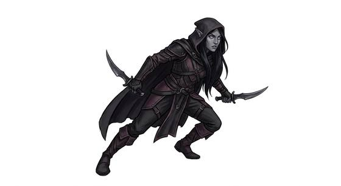

# Dark elf

{.illus}

*Set: Core*

*aka: ______________________________*

*Family: [Elf-kind](../Species_Families/elf-kind.md)*

Elves of the deep places. Generations below ground have remade them: their eyes see in total darkness, their bodies shrug off the poisons that cave life is full of, and they move through tunnels and vaults as surely as their surface cousins move through trees. Their skin is often dark, their hair pale, and their stillness unnerving.

Daylight is their enemy. Sun on the surface dazzles and pains them, so they come up by night if they come up at all. Their cities are carved into cavern walls and lit, when lit at all, by glowing fungus and cold fire. Many of their societies are insular and ruthless, ruled by matriarchs and priestesses, and poisons and plots are as common as bread. Surface peoples tell stories of them to frighten children. Some dark elves leave that life behind, and find the surface just as unfriendly, only brighter.

## Not to be confused with

*[elf-kin](elf-kind-elf-kin.md)*, the pairing of light and underground branches from the old tales; the dark elf is wholly a creature of the caverns.

## What sets this species apart

Built for life underground: full darkvision, resistance to poison, and at home in caves. Sunlight sensitivity is a flaw, taken in the flaw step.

## Breeds and races

Each block below is one set of numbers; breeds that share every number share a block (Species rules, rule 9). Attributes are final modifiers, the size trade-off included. Skills, powers and weapon groups are final levels after the family, species and breed layers.

### No. 367 Dark/subterranean folk *(genres: underworld and wild places, classic fantasy; starter)*

- **Size:** medium · **Body:** biped
- **What it's like:** Grey-skinned elves from the deep underground who see in the dark. (looks like: elf; good at: sneaking, keen senses, wilderness)
- **Attributes:** STR −1 AGI +2 END −1 WIS +1 PER +2
- **Skills:** [Survival: Caves & Underground](../Skills/survival-caves-and-underground.md) +2, [Balance](../Skills/balance.md) +1, [Legends & Folklore](../Skills/legends-and-folklore.md) +1, [Meditation & Concentration](../Skills/meditation-and-concentration.md) +1, [Stealth](../Skills/stealth.md) +1, [Carousing](../Skills/carousing.md) −1, [Intimidation](../Skills/intimidation.md) −1, [Lifting & Carrying](../Skills/lifting-and-carrying.md) −1
- **Powers:** [Night & Spectrum Sight](../Powers/night-and-spectrum-sight.md) 2, [Mind Shield](../Powers/mind-shield.md) 1, [Poison & Disease Immunity](../Powers/poison-and-disease-immunity.md) 1
- **For the Game Master only, this race as an NPC guard or soldier (not your character's numbers):** Attack 14 · Parry 11 · Dodge 10 · Damage longsword 1d6+2 · Armour 2 · Life 16 · Threat 1 ([Bestiary roles](../bestiary.md))

