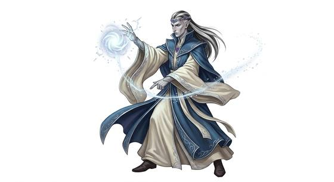

# High elf

{.illus}

*Set: Core*

*aka: ______________________________*

*Family: [Elf-kind](../Species_Families/elf-kind.md)*

Proud, gifted and very old, the high elves are what happens when a long-lived people spends its centuries on art and sorcery. The arcane comes to them more readily than to any other elf-kind, almost as a birthright. Their smiths make blades that sing and jewels that hold light. Their loremasters remember wars the rest of the world has forgotten.

They tend toward noble houses, oaths sworn for eternity and feuds that outlast kingdoms. Some lines love the sea and build white ships; others sing in halls of light or tend silver forests with a strong green magic. The longest-lived of them grow detached from shorter races, watching friends age and die the way others watch seasons turn. To humans they can seem arrogant, and often they are. Yet their towers are where the rarest knowledge is kept, and a traveller who earns their respect earns a patron for life.

## Not to be confused with

*[elder-kin](elf-kind-elder-kin.md)*, a hidden remnant branch even older and more deeply gifted, who rarely show themselves at all.

## What sets this species apart

An inborn gift for the arcane beyond other elf-kind.

## Breeds and races

Each block below is one set of numbers; breeds that share every number share a block (Species rules, rule 9). Attributes are final modifiers, the size trade-off included. Skills, powers and weapon groups are final levels after the family, species and breed layers.

### No. 360 High society folk *(genres: classic fantasy; starter)*

- **Size:** medium · **Body:** biped
- **What it's like:** Tall, proud, long-lived folk gifted in magic, lore and fine craft. (looks like: elf; good at: keen senses, powers and magic, knowledge)
- **Attributes:** STR −1 AGI +2 END −1 INT +1 WIS +1 PER +2
- **Skills:** [Arcana](../Skills/arcana.md) +1, [Balance](../Skills/balance.md) +1, [Legends & Folklore](../Skills/legends-and-folklore.md) +1, [Meditation & Concentration](../Skills/meditation-and-concentration.md) +1, [Carousing](../Skills/carousing.md) −1, [Intimidation](../Skills/intimidation.md) −1, [Lifting & Carrying](../Skills/lifting-and-carrying.md) −1
- **Powers:** [Mind Shield](../Powers/mind-shield.md) 1, [Night & Spectrum Sight](../Powers/night-and-spectrum-sight.md) 1
- **For the Game Master only, this race as an NPC guard or soldier (not your character's numbers):** Attack 14 · Parry 11 · Dodge 10 · Damage longsword 1d6+2 · Armour 2 · Life 16 · Threat 1 ([Bestiary roles](../bestiary.md))

### No. 361 Sea-loving high folk *(genres: classic fantasy, sea and sky)*

- **Size:** medium · **Body:** biped
- **What it's like:** Immortal seafaring elves, master shipwrights and beautiful singers who never tire of the sea and shore. (looks like: elf; good at: swimming, people and talk)
- **Attributes:** STR −1 AGI +2 END −1 INT +1 WIS +1 PER +2
- **Skills:** [Arcana](../Skills/arcana.md) +1, [Balance](../Skills/balance.md) +1, [Legends & Folklore](../Skills/legends-and-folklore.md) +1, [Meditation & Concentration](../Skills/meditation-and-concentration.md) +1, [Sailing & Seamanship](../Skills/sailing-and-seamanship.md) +1, [Survival: Coast & Sea](../Skills/survival-coast-and-sea.md) +1, [Carousing](../Skills/carousing.md) −1, [Intimidation](../Skills/intimidation.md) −1, [Lifting & Carrying](../Skills/lifting-and-carrying.md) −1
- **Powers:** [Mind Shield](../Powers/mind-shield.md) 1, [Night & Spectrum Sight](../Powers/night-and-spectrum-sight.md) 1
- **For the Game Master only, this race as an NPC guard or soldier (not your character's numbers):** Attack 14 · Parry 11 · Dodge 10 · Damage longsword 1d6+2 · Armour 2 · Life 16 · Threat 1 ([Bestiary roles](../bestiary.md))
- *Why:* Shipwrights and mariners whose way of life is bound to the sea and shore.

### No. 362 Unfallen light-folk *(genres: classic fantasy)*

- **Size:** medium · **Body:** biped
- **What it's like:** Radiant, immortal elves who once saw a legendary holy light, skilled crafters and singers untouched by cold or disease. (looks like: elf; good at: making and fixing, people and talk)
- **Attributes:** STR −1 AGI +2 END −1 INT +1 WIS +1 PER +2
- **Skills:** [Arcana](../Skills/arcana.md) +1, [Balance](../Skills/balance.md) +1, [Legends & Folklore](../Skills/legends-and-folklore.md) +1, [Meditation & Concentration](../Skills/meditation-and-concentration.md) +1, [Carousing](../Skills/carousing.md) −1, [Intimidation](../Skills/intimidation.md) −1, [Lifting & Carrying](../Skills/lifting-and-carrying.md) −1
- **Powers:** [Mind Shield](../Powers/mind-shield.md) 1, [Night & Spectrum Sight](../Powers/night-and-spectrum-sight.md) 1, [Poison & Disease Immunity](../Powers/poison-and-disease-immunity.md) 1, [Resist Element](../Powers/resist-element.md) 1
- **For the Game Master only, this race as an NPC guard or soldier (not your character's numbers):** Attack 14 · Parry 11 · Dodge 10 · Damage longsword 1d6+2 · Armour 2 · Life 16 · Threat 1 ([Bestiary roles](../bestiary.md))
- *Why:* Bodies that shrug off disease and cold.
- *Note:* Resist Element is cold.

### No. 363 Noble silver-forest folk *(genres: classic fantasy)*

- **Size:** medium · **Body:** biped
- **What it's like:** Graceful, long-lived elves of proud noble houses, steeped in nature magic and famed as keen archers. (looks like: elf; good at: powers and magic, fighting)
- **Attributes:** STR −1 AGI +2 END −1 INT +1 WIS +1 PER +2
- **Skills:** [Arcana](../Skills/arcana.md) +1, [Balance](../Skills/balance.md) +1, [Legends & Folklore](../Skills/legends-and-folklore.md) +1, [Meditation & Concentration](../Skills/meditation-and-concentration.md) +1, [Nature Lore](../Skills/nature-lore.md) +1, [Survival: Forest (Woodcraft)](../Skills/survival-forest-woodcraft.md) +1, [Carousing](../Skills/carousing.md) −1, [Intimidation](../Skills/intimidation.md) −1, [Lifting & Carrying](../Skills/lifting-and-carrying.md) −1
- **Powers:** [Mind Shield](../Powers/mind-shield.md) 1, [Night & Spectrum Sight](../Powers/night-and-spectrum-sight.md) 1
- **For the Game Master only, this race as an NPC guard or soldier (not your character's numbers):** Attack 14 · Parry 11 · Dodge 10 · Damage longsword 1d6+2 · Armour 2 · Life 16 · Threat 1 ([Bestiary roles](../bestiary.md))
- *Why:* A forest people with a strong nature-magic tradition.

### No. 364 Near-immortal mage folk *(genres: classic fantasy)*

- **Size:** medium · **Body:** biped
- **What it's like:** Near-immortal elf mages who age at a crawl and wield powerful arcane magic, growing distant from short-lived folk. (looks like: elf; good at: powers and magic, knowledge)
- **Attributes:** STR −1 AGI +2 END −1 INT +2 WIS +1 PER +2
- **Skills:** [Arcana](../Skills/arcana.md) +2, [Balance](../Skills/balance.md) +1, [Legends & Folklore](../Skills/legends-and-folklore.md) +1, [Meditation & Concentration](../Skills/meditation-and-concentration.md) +1, [Carousing](../Skills/carousing.md) −1, [Intimidation](../Skills/intimidation.md) −1, [Lifting & Carrying](../Skills/lifting-and-carrying.md) −1
- **Powers:** [Mind Shield](../Powers/mind-shield.md) 1, [Night & Spectrum Sight](../Powers/night-and-spectrum-sight.md) 1
- **For the Game Master only, this race as an NPC guard or soldier (not your character's numbers):** Attack 14 · Parry 11 · Dodge 10 · Damage longsword 1d6+2 · Armour 2 · Life 16 · Threat 1 ([Bestiary roles](../bestiary.md))
- *Why:* An even deeper arcane gift than other high elves.
- *Note:* Their very long lifespan and slow ageing go on the lexicon entry.

