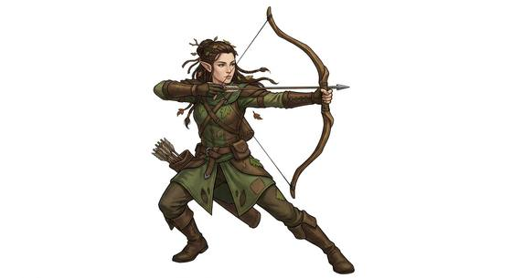

# Woodland folk

{.illus}

*Set: Core*

*aka: ______________________________*

*Family: [Elf-kind](../Species_Families/elf-kind.md)*

The elves most travellers mean when they say the word. Slight, long-lived and sharp-eyed, they are at home under a forest canopy in a way no other people quite are. They hear a snapped twig a long way off, see well in the dim green light, and cross leaf litter without a sound. Many are archers and trackers, since the forest feeds those who can read it.

Their ways vary widely. Some live openly in treetop halls. Some are exiles, driven from ancestral woods by the axes of shorter-lived neighbours and grown bitter or wary. Some tribes bond with wolves in a silent, mind-to-mind kinship, some dwell in swamps and have gone half-wild, and one line glides between cliff-top homes on membranes of skin. Outsiders find them aloof, beautiful and slow to trust. In old stories, cold iron is said to trouble them.

## Not to be confused with

*[high elf](elf-kind-high-elf.md)*, the refined, magic-steeped courtly branch; woodland folk are the hunters and wardens of the trees.

## What sets this species apart

At home under the trees: sure in forest country and quiet on its floor.

## Breeds and races

Each block below is one set of numbers; breeds that share every number share a block (Species rules, rule 9). Attributes are final modifiers, the size trade-off included. Skills, powers and weapon groups are final levels after the family, species and breed layers.

### No. 353 Woodland folk · No. 354 Displaced/exiled forest folk · No. 355 Twilight woodland folk · Unsummoned wandering folk · No. 356 Forest-dwelling elf folk *(genres: classic fantasy; starter)*

- **Size:** medium · **Body:** biped
- **What it's like:** Swift, sharp-eyed forest folk who live for centuries and shoot true. (looks like: elf; good at: sneaking, keen senses, wilderness)
- **Attributes:** STR −1 AGI +2 END −1 WIS +1 PER +2
- **Skills:** [Balance](../Skills/balance.md) +1, [Legends & Folklore](../Skills/legends-and-folklore.md) +1, [Meditation & Concentration](../Skills/meditation-and-concentration.md) +1, [Stealth](../Skills/stealth.md) +1, [Survival: Forest (Woodcraft)](../Skills/survival-forest-woodcraft.md) +1, [Carousing](../Skills/carousing.md) −1, [Intimidation](../Skills/intimidation.md) −1, [Lifting & Carrying](../Skills/lifting-and-carrying.md) −1
- **Powers:** [Mind Shield](../Powers/mind-shield.md) 1, [Night & Spectrum Sight](../Powers/night-and-spectrum-sight.md) 1
- **For the Game Master only, this race as an NPC guard or soldier (not your character's numbers):** Attack 14 · Parry 11 · Dodge 10 · Damage longsword 1d6+2 · Armour 2 · Life 16 · Threat 1 ([Bestiary roles](../bestiary.md))
- *Displaced/exiled forest folk:* Same as its species; exile from ancestral lands is homeland and history, not a stat difference.
- *Twilight woodland folk:* Same as its species; their longer lifespan goes on the lexicon entry.
- *Unsummoned wandering folk:* Same as its species; their wariness and remoteness are homeland and lifespan matters for the lexicon entry.

### No. 357 Wolf-bonded tribal elf *(genres: classic fantasy)*

- **Size:** small · **Body:** biped
- **What it's like:** Small, long-lived tribal elves who bond telepathically with a wolf companion for life, hunting and gathering through the forest. (looks like: elf; good at: wilderness, powers and magic)
- **Attributes:** STR −2 AGI +2 END −1 WIS +1 PER +2
- **Skills:** [Balance](../Skills/balance.md) +1, [Hunting](../Skills/hunting.md) +1, [Legends & Folklore](../Skills/legends-and-folklore.md) +1, [Meditation & Concentration](../Skills/meditation-and-concentration.md) +1, [Stealth](../Skills/stealth.md) +1, [Survival: Forest (Woodcraft)](../Skills/survival-forest-woodcraft.md) +1, [Carousing](../Skills/carousing.md) −1, [Intimidation](../Skills/intimidation.md) −1, [Lifting & Carrying](../Skills/lifting-and-carrying.md) −1
- **Powers:** [Beast Bonding](../Powers/beast-bonding.md) 2, [Mind Shield](../Powers/mind-shield.md) 1, [Night & Spectrum Sight](../Powers/night-and-spectrum-sight.md) 1
- **For the Game Master only, this race as an NPC guard or soldier (not your character's numbers):** Attack 14 · Parry 11 · Dodge 11 · Damage longsword 1d6+1 · Armour 2 · Life 14 · Threat 1 ([Bestiary roles](../bestiary.md))
- *Why:* Bonded mind to mind with their wolves, and raised as forest hunters.
- *Note:* Beast Bonding is with the elf's own bonded wolf. Smaller size is a size-class matter.

### No. 358 Savage swamp elf-kin *(genres: underworld and wild places)*

- **Size:** medium · **Body:** biped
- **What it's like:** Swamp-dwelling elf-kin gone half-wild after mixing with trolls, mistrustful of strangers and at home in the mire. (looks like: elf; good at: wilderness, swimming)
- **Attributes:** AGI +2 END +1 INT −1 WIS +1 PER +2 CHA −1
- **Skills:** [Survival: Jungle & Swamp](../Skills/survival-jungle-and-swamp.md) +2, [Balance](../Skills/balance.md) +1, [Legends & Folklore](../Skills/legends-and-folklore.md) +1, [Meditation & Concentration](../Skills/meditation-and-concentration.md) +1, [Stealth](../Skills/stealth.md) +1, [Survival: Forest (Woodcraft)](../Skills/survival-forest-woodcraft.md) +1, [Carousing](../Skills/carousing.md) −1, [Intimidation](../Skills/intimidation.md) −1, [Lifting & Carrying](../Skills/lifting-and-carrying.md) −1
- **Powers:** [Mind Shield](../Powers/mind-shield.md) 1, [Night & Spectrum Sight](../Powers/night-and-spectrum-sight.md) 1
- **For the Game Master only, this race as an NPC guard or soldier (not your character's numbers):** Attack 14 · Parry 11 · Dodge 10 · Damage longsword 1d6+2 · Armour 2 · Life 18 · Threat 1 ([Bestiary roles](../bestiary.md))
- *Why:* Elves who went back to the swamps and live wild in them.
- *Note:* Partly trollish ancestry shows in attributes, not here.

### No. 359 Cliff-dwelling glider elf *(genres: classic fantasy, sea and sky)*

- **Size:** medium · **Body:** biped+winged
- **What it's like:** Cliff-dwelling elves with skin membranes between arm and body, gliding from their hidden city under a strict caste system. (looks like: elf; good at: flying, keen senses)
- **Attributes:** STR −1 AGI +2 END −1 WIS +1 PER +2
- **Skills:** [Parachuting & Gliding](../Skills/parachuting-and-gliding.md) +3, [Balance](../Skills/balance.md) +1, [Legends & Folklore](../Skills/legends-and-folklore.md) +1, [Meditation & Concentration](../Skills/meditation-and-concentration.md) +1, [Stealth](../Skills/stealth.md) +1, [Survival: Forest (Woodcraft)](../Skills/survival-forest-woodcraft.md) +1, [Survival: Mountain](../Skills/survival-mountain.md) +1, [Carousing](../Skills/carousing.md) −1, [Intimidation](../Skills/intimidation.md) −1, [Lifting & Carrying](../Skills/lifting-and-carrying.md) −1
- **Powers:** [Feather Fall](../Powers/feather-fall.md) 1, [Mind Shield](../Powers/mind-shield.md) 1, [Night & Spectrum Sight](../Powers/night-and-spectrum-sight.md) 1
- **For the Game Master only, this race as an NPC guard or soldier (not your character's numbers):** Attack 14 · Parry 11 · Dodge 10 · Damage longsword 1d6+2 · Armour 2 · Life 16 · Threat 1 ([Bestiary roles](../bestiary.md))
- *Why:* Skin membranes let them glide from their cliff city, and cliffs are home.
- *Note:* Gliding only: no powered flight. Feather Fall is the membranes breaking a fall.

