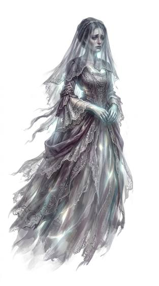

# Incorporeal spirit

{.illus}

*Set: Expansion*

*aka: ______________________________*

*Family: [Energy and incorporeal](../Species_Families/energy-and-incorporeal.md)*

The dead who did not leave. A ghost may be a faint outline in an old mirror, a pale figure on the stairs, or nothing at all but the sudden chill that follows it through the house. Walls and doors are nothing to it. It drifts through them as though they were fog. Some people see ghosts plainly; others walk straight past them and only shiver.

Most ghosts are bound by something left undone: a murder unsolved, a promise unkept, a grave unmarked, a loved one never told the truth. Some are sorrowful and want only to be heard. Some are angry and have had centuries to grow angrier. A few have forgotten why they remain and simply repeat the last hour of their lives, again and again. The living who help a ghost finish its business may earn a strange blessing. Those who disturb one without care often wish they had not.

## Not to be confused with

*[ghost/spirit-kind](undead-and-deathless-ghost-spirit-kind.md)*, the broader undead family of hauntings and wraiths; the incorporeal spirit is the classic lingering ghost of the dead.

## What sets this species apart

Ghosts of the dead: unseen by some and wrapped in a cold aura. Elemental Aura is cold.

## Breeds and races

Each block below is one set of numbers; breeds that share every number share a block (Species rules, rule 9). Attributes are final modifiers, the size trade-off included. Skills, powers and weapon groups are final levels after the family, species and breed layers.

### Ghostly wandering spirit *(NPC only)*

- **Size:** medium · **Body:** incorporeal
- **Attributes:** STR −3 INT +1 WIS +2
- **Skills:** [Stealth](../Skills/stealth.md) +3, [Meditation & Concentration](../Skills/meditation-and-concentration.md) +2, [Mending & Sewing](../Skills/mending-and-sewing.md) −2, [Hand Tools](../Skills/hand-tools.md) −3, [Lifting & Carrying](../Skills/lifting-and-carrying.md) Foreign Concept
- **Powers:** [Endurance Without Need](../Powers/endurance-without-need.md) 2, [Levitation](../Powers/levitation.md) 2, [Phasing](../Powers/phasing.md) 2, [Elemental Aura](../Powers/elemental-aura.md) 1, [Invisibility](../Powers/invisibility.md) 1
- **For the Game Master only, this race as an NPC guard or soldier (not your character's numbers):** Attack 13 · Parry 10 · Dodge 8 · Damage longsword 1d6+1 · Armour 2 · Life 17 · Threat 1 ([Bestiary roles](../bestiary.md))

