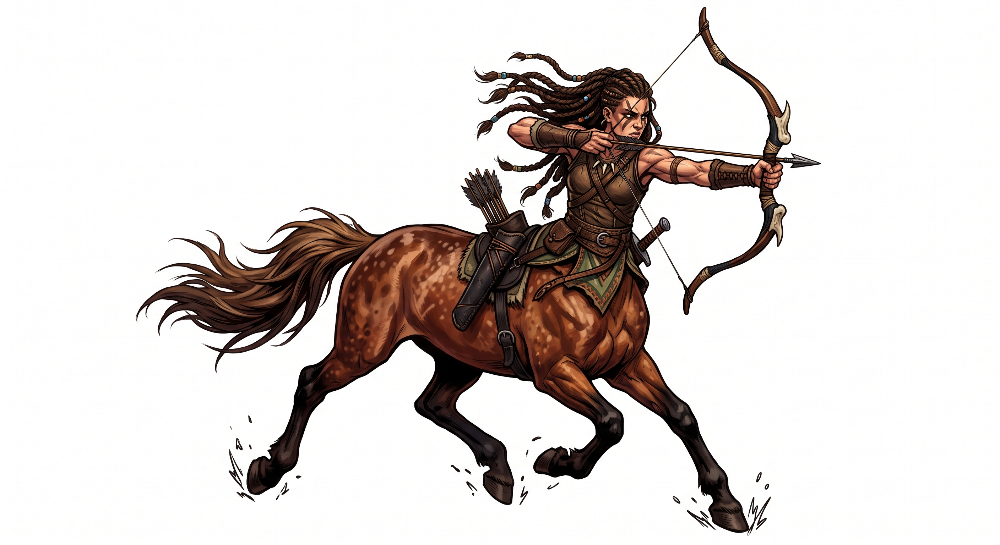

# Centaur

{.illus}

*Set: Core*

*aka: ______________________________*

*Family: [Equine and centauroid](../Species_Families/equine-and-centauroid.md)*

From the waist up, a person; from the waist down, a horse. The join is seamless, and the whole creature moves with a horse's speed and a warrior's hands. A centaur can run down a deer, carry a load that would stagger a mule, and loose arrows at a full gallop. Tents, boats and narrow stairs are another matter.

There are two great traditions among them. The wild tribes roam the plains and hills in raiding bands and seasonal camps, fierce fighters and superb archers, loud at their feasts and sometimes dangerous in their cups. The wise lineages are rarer: solemn, reclusive scholars who watch the stars, read omens in the planets, know the healing herbs and the old lore, and have taught heroes in legend. Both kinds are proud, and neither takes kindly to being treated as a mount. That mistake is only ever made once.

## Not to be confused with

*[four-armed centauroid](equine-and-centauroid-four-armed-centauroid.md)*, a warrior kind with a second pair of arms; the centaur has the classic human torso on a horse's body.

## What sets this species apart

No difference from the family: the family template is the centaur body. Archery and nomadic or scholarly ways are weapon-group and culture matters.

## Breeds and races

Each block below is one set of numbers; breeds that share every number share a block (Species rules, rule 9). Attributes are final modifiers, the size trade-off included. Skills, powers and weapon groups are final levels after the family, species and breed layers.

### No. 396 Wild centaur *(genres: myth and legend; starter)*

- **Size:** large · **Body:** centauroid
- **What it's like:** Half horse, half human: fast runners, strong carriers and skilled archers. (looks like: centaur; good at: strength, speed and agility, wilderness)
- **Attributes:** STR +4 AGI −2 END +1
- **Skills:** [Running](../Skills/running.md) +3, [Lifting & Carrying](../Skills/lifting-and-carrying.md) +2, [Survival: Plains & Steppe](../Skills/survival-plains-and-steppe.md) +2, [Formation Fighting](../Skills/formation-fighting.md) +1, [Herding & Husbandry](../Skills/herding-and-husbandry.md) +1, [Jumping](../Skills/jumping.md) +1, [Acrobatics](../Skills/acrobatics.md) −1, [Stealth](../Skills/stealth.md) −2, [Climbing](../Skills/climbing.md) −3, [Riding](../Skills/riding.md) Foreign Concept
- **Weapon groups:** [Lances](../Weapon_Groups/lances.md) +1
- **Natural attacks:** hooves 1d6+2
- **For the Game Master only, this race as an NPC guard or soldier (not your character's numbers):** Attack 14 · Parry 11 · Dodge 5 · Damage longsword 1d6+2; hooves 1d6+5 · Armour 2 · Life 22 · Threat 2 ([Bestiary roles](../bestiary.md))
- *Why:* Same as its species; archery and tribal ways are weapon-group and Culture matters.

### No. 397 Wise centaur *(genres: myth and legend)*

- **Size:** large · **Body:** centauroid
- **What it's like:** Wise, scholarly centaurs who once taught heroes medicine and swordplay, gifted stargazers, archers and nature-mages. (looks like: horse; good at: knowledge, fighting)
- **Attributes:** STR +4 AGI −2 END +1 WIS +1
- **Skills:** [Running](../Skills/running.md) +3, [Lifting & Carrying](../Skills/lifting-and-carrying.md) +2, [Survival: Plains & Steppe](../Skills/survival-plains-and-steppe.md) +2, [Astronomy & Calendars](../Skills/astronomy-and-calendars.md) +1, [Formation Fighting](../Skills/formation-fighting.md) +1, [Herding & Husbandry](../Skills/herding-and-husbandry.md) +1, [Jumping](../Skills/jumping.md) +1, [Medicine](../Skills/medicine.md) +1, [Acrobatics](../Skills/acrobatics.md) −1, [Stealth](../Skills/stealth.md) −2, [Climbing](../Skills/climbing.md) −3, [Riding](../Skills/riding.md) Foreign Concept
- **Weapon groups:** [Lances](../Weapon_Groups/lances.md) +1
- **Natural attacks:** hooves 1d6+2
- **For the Game Master only, this race as an NPC guard or soldier (not your character's numbers):** Attack 14 · Parry 11 · Dodge 5 · Damage longsword 1d6+2; hooves 1d6+5 · Armour 2 · Life 22 · Threat 2 ([Bestiary roles](../bestiary.md))
- *Why:* A long-lived scholarly lineage of stargazers and healers with a feel for nature magic.
- *Note:* Green Mending is affinity. Some lines have minor healing magic: Healing Touch Set 1 for those lines. Lifespan (long-lived) is a lexicon detail, not a game number.

