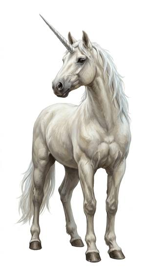

# Unicorn-kin

{.illus}

*Set: Expansion*

*aka: ______________________________*

*Family: [Equine and centauroid](../Species_Families/equine-and-centauroid.md)*

A white horse with a single spiralled horn, or so the stories say, though some are dappled, silver or black as night. They are rare and elusive creatures of deep forests, fleet beyond any horse and gone before most hunters raise a bow. Their horn is the heart of their magic. A touch of it heals wounds, purges poison and cools fever. The same gift lets them sense malice, so the cruel and the treacherous never get close.

They are wise and proud, but not people in the ordinary sense. They have no hands, carry no tools, and live by their own laws. Hunters prize the horn and kings pay fortunes for a sliver of it, which is why so few remain. Legends say they come willingly only to the pure of heart. Those who have met one say that is not quite true, but that they do not come to liars.

## Not to be confused with

*[pegasus-kin](equine-and-centauroid-pegasus-kin.md)*, winged horses of the sky; the unicorn is earthbound, horned and gifted with healing.

## What sets this species apart

Magical horned equines with a healing touch and a sense for ill intent. No hands: held weapons unusable.

## Breeds and races

Each block below is one set of numbers; breeds that share every number share a block (Species rules, rule 9). Attributes are final modifiers, the size trade-off included. Skills, powers and weapon groups are final levels after the family, species and breed layers.

### Horned healer equine *(NPC only)*

- **Size:** medium · **Body:** centauroid
- **Attributes:** STR +2 AGI −1 END +1 WIS +2 CHA +2
- **Skills:** [Running](../Skills/running.md) +3, [Lifting & Carrying](../Skills/lifting-and-carrying.md) +2, [Survival: Plains & Steppe](../Skills/survival-plains-and-steppe.md) +2, [Formation Fighting](../Skills/formation-fighting.md) +1, [Herding & Husbandry](../Skills/herding-and-husbandry.md) +1, [Jumping](../Skills/jumping.md) +1, [Acrobatics](../Skills/acrobatics.md) −1, [Stealth](../Skills/stealth.md) −2, [Climbing](../Skills/climbing.md) −3, [Riding](../Skills/riding.md) Foreign Concept
- **Powers:** [Healing Touch](../Powers/healing-touch.md) 2, [Detect Intent](../Powers/detect-intent.md) 1
- **Weapon groups:** [Lances](../Weapon_Groups/lances.md) +1
- **Natural attacks:** hooves 1d6+2, horns 1d6+3
- **For the Game Master only, this race as an NPC guard or soldier (not your character's numbers):** Attack 14 · Parry — · Dodge 7 · Damage hooves 1d6+1; horns 1d6+2 · Armour 0 · Life 16 · Threat minor ([Bestiary roles](../bestiary.md))
- *Why:* Long-lived.
- *Note:* Lifespan (long-lived) is a lexicon detail, not a game number.

