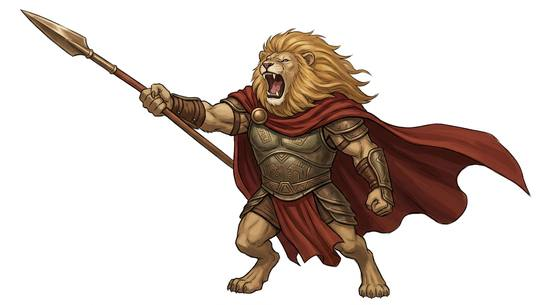
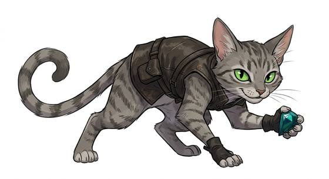

# Feline folk

{.illus} {.illus}

*Set: Core*

*aka: ______________________________*

*Family: [Feline](../Species_Families/feline.md)*

People with the bodies and bearing of the great and small cats, standing upright with fur, tails, whiskers and claws. Each kind carries the gifts of its wild cousin. Lion-folk are big and social, with booming voices and a taste for leadership. Tiger-folk are solitary and fierce, and happy in water. Leopard-folk climb anything, cheetah-folk sprint like the wind but tire quickly, and lynx-folk hear a mouse under the snow. House-cat folk are small, independent and always land on their feet.

There are desert cats with huge ears, jungle cats who ambush from rivers, dark panther-folk who vanish at night, mountain cats who leap across ravines and sabre-toothed brutes from a colder age. Whatever the breed, they share a hunter's eye, fast reflexes and a streak of pride. Other peoples find them graceful, aloof and a little unnerving when they go very still.

## Not to be confused with

*[civic feline folk](feline-civic-feline-folk.md)*, city-bred cat people who have lost their wild gifts; feline folk keep the hunting instincts of their animal kin.

## What sets this species apart

Real-animal cat peoples; the family lines already describe them, and each breed's own specialty (swimming, sprinting, leaping) belongs to the breed.

## Breeds and races

Each block below is one set of numbers; breeds that share every number share a block (Species rules, rule 9). Attributes are final modifiers, the size trade-off included. Skills, powers and weapon groups are final levels after the family, species and breed layers.

### No. 400 Lion-folk *(genres: beast-folk: fur; starter)*

- **Size:** large · **Body:** biped+tailed
- **What it's like:** Proud, powerful lion people who lead with a mighty roar and a brave heart. (looks like: lion; good at: fighting, sneaking, climbing)
- **Attributes:** STR +1 AGI −1 END −1 WIS +1 CHA +1 COU +1
- **Skills:** [Balance](../Skills/balance.md) +2, [Intimidation](../Skills/intimidation.md) +2, [Stealth](../Skills/stealth.md) +2, [Acrobatics](../Skills/acrobatics.md) +1, [Climbing](../Skills/climbing.md) +1, [Hunting](../Skills/hunting.md) +1, [Jumping](../Skills/jumping.md) +1, [Leadership](../Skills/leadership.md) +1, Endurance (attribute) −1, [Formation Fighting](../Skills/formation-fighting.md) −1, [Swimming](../Skills/swimming.md) −2
- **Powers:** [Night & Spectrum Sight](../Powers/night-and-spectrum-sight.md) 2
- **Weapon groups:** [Brawling](../Weapon_Groups/brawling.md) +1
- **Natural attacks:** claws 1d6+1, bite 1d6+1
- **For the Game Master only, this race as an NPC guard or soldier (not your character's numbers):** Attack 14 · Parry 11 · Dodge 6 · Damage longsword 1d6+2; claws 1d6+4 · Armour 2 · Life 20 · Threat 1 ([Bestiary roles](../bestiary.md))
- *Why:* Pride leaders with a powerful roar.

### No. 401 Tiger-folk *(genres: beast-folk: fur)*

- **Size:** large · **Body:** biped+tailed
- **What it's like:** Striped, powerful tiger-folk who hunt alone in the jungle, ferocious in a fight and strong swimmers besides. (looks like: cat; good at: fighting, swimming)
- **Attributes:** STR +2 AGI −1 WIS +1
- **Skills:** [Balance](../Skills/balance.md) +2, [Stealth](../Skills/stealth.md) +2, [Acrobatics](../Skills/acrobatics.md) +1, [Camouflage](../Skills/camouflage.md) +1, [Climbing](../Skills/climbing.md) +1, [Hunting](../Skills/hunting.md) +1, [Jumping](../Skills/jumping.md) +1, [Swimming](../Skills/swimming.md) +1, Endurance (attribute) −1, [Formation Fighting](../Skills/formation-fighting.md) −1
- **Powers:** [Night & Spectrum Sight](../Powers/night-and-spectrum-sight.md) 2
- **Weapon groups:** [Brawling](../Weapon_Groups/brawling.md) +1
- **Natural attacks:** claws 1d6+1, bite 1d6+1
- **For the Game Master only, this race as an NPC guard or soldier (not your character's numbers):** Attack 14 · Parry 11 · Dodge 6 · Damage longsword 1d6+2; claws 1d6+4 · Armour 2 · Life 21 · Threat 2 ([Bestiary roles](../bestiary.md))
- *Why:* Powerful swimmers, unlike most cats, with striped camouflage.

### No. 402 Leopard-folk *(genres: beast-folk: fur)*

- **Size:** medium · **Body:** biped+tailed
- **What it's like:** Spotted leopard-folk, superb climbers who stalk alone and can drag prey twice their weight up into the trees. (looks like: cat; good at: climbing, sneaking)
- **Attributes:** AGI +2 END −1 WIS +1
- **Skills:** [Climbing](../Skills/climbing.md) +3, [Balance](../Skills/balance.md) +2, [Stealth](../Skills/stealth.md) +2, [Acrobatics](../Skills/acrobatics.md) +1, [Camouflage](../Skills/camouflage.md) +1, [Hunting](../Skills/hunting.md) +1, [Jumping](../Skills/jumping.md) +1, Endurance (attribute) −1, [Formation Fighting](../Skills/formation-fighting.md) −1, [Swimming](../Skills/swimming.md) −2
- **Powers:** [Night & Spectrum Sight](../Powers/night-and-spectrum-sight.md) 2
- **Weapon groups:** [Brawling](../Weapon_Groups/brawling.md) +1
- **Natural attacks:** claws 1d6+1, bite 1d6+1
- **For the Game Master only, this race as an NPC guard or soldier (not your character's numbers):** Attack 14 · Parry 11 · Dodge 10 · Damage longsword 1d6+2; claws 1d6+2 · Armour 2 · Life 16 · Threat 1 ([Bestiary roles](../bestiary.md))
- *Why:* Excellent climbers with rosette camouflage.

### No. 403 Snow cat folk *(genres: beast-folk: fur)*

- **Size:** medium · **Body:** biped+tailed
- **What it's like:** Thick-furred snow cat-folk who balance along mountain cliffs with a long tail, elusive as ghosts in the high cold. (looks like: cat; good at: climbing, sneaking)
- **Attributes:** STR −1 AGI +2 WIS +1
- **Skills:** [Balance](../Skills/balance.md) +2, [Stealth](../Skills/stealth.md) +2, [Survival: Mountain](../Skills/survival-mountain.md) +2, [Acrobatics](../Skills/acrobatics.md) +1, [Climbing](../Skills/climbing.md) +1, [Hunting](../Skills/hunting.md) +1, [Jumping](../Skills/jumping.md) +1, [Survival: Arctic](../Skills/survival-arctic.md) +1, Endurance (attribute) −1, [Formation Fighting](../Skills/formation-fighting.md) −1, [Swimming](../Skills/swimming.md) −2
- **Powers:** [Night & Spectrum Sight](../Powers/night-and-spectrum-sight.md) 2
- **Weapon groups:** [Brawling](../Weapon_Groups/brawling.md) +1
- **Natural attacks:** claws 1d6+1, bite 1d6+1
- **For the Game Master only, this race as an NPC guard or soldier (not your character's numbers):** Attack 14 · Parry 11 · Dodge 10 · Damage longsword 1d6+2; claws 1d6+2 · Armour 2 · Life 17 · Threat 1 ([Bestiary roles](../bestiary.md))
- *Why:* Adapted to cold, high mountain country.

### No. 404 Cheetah-folk *(genres: beast-folk: fur)*

- **Size:** medium · **Body:** biped+tailed
- **What it's like:** Lean, savanna-born cheetah-folk built for blistering short sprints, though they tire fast if the chase runs long. (looks like: cat; good at: speed and agility, wilderness)
- **Attributes:** STR −2 AGI +3 END −1 WIS +1
- **Skills:** [Running](../Skills/running.md) +3, [Balance](../Skills/balance.md) +2, [Stealth](../Skills/stealth.md) +2, [Acrobatics](../Skills/acrobatics.md) +1, [Climbing](../Skills/climbing.md) +1, [Hunting](../Skills/hunting.md) +1, [Jumping](../Skills/jumping.md) +1, [Formation Fighting](../Skills/formation-fighting.md) −1, Endurance (attribute) −2, [Swimming](../Skills/swimming.md) −2
- **Powers:** [Night & Spectrum Sight](../Powers/night-and-spectrum-sight.md) 2
- **Weapon groups:** [Brawling](../Weapon_Groups/brawling.md) +1
- **Natural attacks:** claws 1d6+1, bite 1d6+1
- **For the Game Master only, this race as an NPC guard or soldier (not your character's numbers):** Attack 14 · Parry 11 · Dodge 11 · Damage longsword 1d6+1; claws 1d6 · Armour 2 · Life 16 · Threat 1 ([Bestiary roles](../bestiary.md))
- *Why:* Exceptional sprinters with even less stamina than other cats.

### No. 405 Lynx/bobcat folk *(genres: beast-folk: fur)*

- **Size:** small · **Body:** biped+tailed
- **What it's like:** Tufted-eared lynx-folk with astonishing hearing, ambushing prey through cold forests on short, quiet paws. (looks like: cat; good at: keen senses, sneaking)
- **Attributes:** STR −2 AGI +2 END −1 WIS +1
- **Skills:** [Balance](../Skills/balance.md) +2, [Stealth](../Skills/stealth.md) +2, [Acrobatics](../Skills/acrobatics.md) +1, [Climbing](../Skills/climbing.md) +1, [Hunting](../Skills/hunting.md) +1, [Jumping](../Skills/jumping.md) +1, [Survival: Forest (Woodcraft)](../Skills/survival-forest-woodcraft.md) +1, Endurance (attribute) −1, [Formation Fighting](../Skills/formation-fighting.md) −1, [Swimming](../Skills/swimming.md) −2
- **Powers:** [Enhanced Senses](../Powers/enhanced-senses.md) 2, [Night & Spectrum Sight](../Powers/night-and-spectrum-sight.md) 2
- **Weapon groups:** [Brawling](../Weapon_Groups/brawling.md) +1
- **Natural attacks:** claws 1d6+1, bite 1d6+1
- **For the Game Master only, this race as an NPC guard or soldier (not your character's numbers):** Attack 14 · Parry 11 · Dodge 11 · Damage longsword 1d6+1; claws 1d6-1 · Armour 2 · Life 14 · Threat 1 ([Bestiary roles](../bestiary.md))
- *Why:* Tufted ears and acute hearing; forest ambushers.
- *Note:* Enhanced Senses is hearing.

### No. 406 House-cat folk *(genres: beast-folk: fur; starter)*

- **Size:** small · **Body:** biped+tailed
- **What it's like:** Quick, curious cat people with sharp reflexes and a proudly independent streak. (looks like: cat; good at: sneaking, climbing, speed and agility)
- **Attributes:** STR −2 AGI +2 END −1 WIS +1
- **Skills:** [Balance](../Skills/balance.md) +2, [Stealth](../Skills/stealth.md) +2, [Acrobatics](../Skills/acrobatics.md) +1, [Climbing](../Skills/climbing.md) +1, [Hunting](../Skills/hunting.md) +1, [Jumping](../Skills/jumping.md) +1, Endurance (attribute) −1, [Formation Fighting](../Skills/formation-fighting.md) −1, [Swimming](../Skills/swimming.md) −2
- **Powers:** [Night & Spectrum Sight](../Powers/night-and-spectrum-sight.md) 2
- **Weapon groups:** [Brawling](../Weapon_Groups/brawling.md) +1
- **Natural attacks:** claws 1d6+1, bite 1d6+1
- **For the Game Master only, this race as an NPC guard or soldier (not your character's numbers):** Attack 14 · Parry 11 · Dodge 11 · Damage longsword 1d6+1; claws 1d6-1 · Armour 2 · Life 14 · Threat 1 ([Bestiary roles](../bestiary.md))
- *Why:* Same as its species; coat, size and culture go on the lexicon entry.

### No. 407 Desert cat folk *(genres: beast-folk: fur)*

- **Size:** small · **Body:** biped+tailed
- **What it's like:** Big-eared desert cat-folk who hunt by night, cool-headed in the worst heat and fiercely independent. (looks like: cat; good at: sneaking, wilderness)
- **Attributes:** STR −2 AGI +2 END −1 WIS +1
- **Skills:** [Balance](../Skills/balance.md) +2, [Stealth](../Skills/stealth.md) +2, [Survival: Desert](../Skills/survival-desert.md) +2, [Acrobatics](../Skills/acrobatics.md) +1, [Climbing](../Skills/climbing.md) +1, [Hunting](../Skills/hunting.md) +1, [Jumping](../Skills/jumping.md) +1, Endurance (attribute) −1, [Formation Fighting](../Skills/formation-fighting.md) −1, [Swimming](../Skills/swimming.md) −2
- **Powers:** [Night & Spectrum Sight](../Powers/night-and-spectrum-sight.md) 2
- **Weapon groups:** [Brawling](../Weapon_Groups/brawling.md) +1
- **Natural attacks:** claws 1d6+1, bite 1d6+1
- **For the Game Master only, this race as an NPC guard or soldier (not your character's numbers):** Attack 14 · Parry 11 · Dodge 11 · Damage longsword 1d6+1; claws 1d6-1 · Armour 2 · Life 14 · Threat 1 ([Bestiary roles](../bestiary.md))
- *Why:* At home in heat and sand.

### No. 408 Jungle cat folk *(genres: beast-folk: fur)*

- **Size:** large · **Body:** biped+tailed
- **What it's like:** Powerful, rosette-marked jungle cat-folk who swim strongly and ambush prey from the water with a bone-crushing bite. (looks like: cat; good at: swimming, fighting)
- **Attributes:** STR +2 END −1 WIS +1
- **Skills:** [Balance](../Skills/balance.md) +2, [Stealth](../Skills/stealth.md) +2, [Acrobatics](../Skills/acrobatics.md) +1, [Climbing](../Skills/climbing.md) +1, [Hunting](../Skills/hunting.md) +1, [Jumping](../Skills/jumping.md) +1, [Survival: Jungle & Swamp](../Skills/survival-jungle-and-swamp.md) +1, [Swimming](../Skills/swimming.md) +1, Endurance (attribute) −1, [Formation Fighting](../Skills/formation-fighting.md) −1
- **Powers:** [Night & Spectrum Sight](../Powers/night-and-spectrum-sight.md) 2
- **Weapon groups:** [Brawling](../Weapon_Groups/brawling.md) +1
- **Natural attacks:** claws 1d6+1, bite 1d6+1
- **For the Game Master only, this race as an NPC guard or soldier (not your character's numbers):** Attack 14 · Parry 11 · Dodge 7 · Damage longsword 1d6+2; claws 1d6+4 · Armour 2 · Life 20 · Threat 1 ([Bestiary roles](../bestiary.md))
- *Why:* Strong swimmers with a skull-crushing bite who ambush from water.

### No. 409 Black panther/melanistic folk *(genres: beast-folk: fur)*

- **Size:** large · **Body:** biped+tailed
- **What it's like:** Dark-coated panther-folk who vanish into the night, solitary hunters with a quiet jungle tribal culture. (looks like: cat; good at: sneaking, fighting)
- **Attributes:** STR +1 END −1 WIS +1
- **Skills:** [Stealth](../Skills/stealth.md) +3, [Balance](../Skills/balance.md) +2, [Acrobatics](../Skills/acrobatics.md) +1, [Climbing](../Skills/climbing.md) +1, [Hunting](../Skills/hunting.md) +1, [Jumping](../Skills/jumping.md) +1, [Survival: Jungle & Swamp](../Skills/survival-jungle-and-swamp.md) +1, Endurance (attribute) −1, [Formation Fighting](../Skills/formation-fighting.md) −1, [Swimming](../Skills/swimming.md) −2
- **Powers:** [Night & Spectrum Sight](../Powers/night-and-spectrum-sight.md) 2
- **Weapon groups:** [Brawling](../Weapon_Groups/brawling.md) +1
- **Natural attacks:** claws 1d6+1, bite 1d6+1
- **For the Game Master only, this race as an NPC guard or soldier (not your character's numbers):** Attack 14 · Parry 11 · Dodge 7 · Damage longsword 1d6+2; claws 1d6+4 · Armour 2 · Life 20 · Threat 1 ([Bestiary roles](../bestiary.md))
- *Why:* Even stealthier in darkness, and at home in jungle.

### Saber-tooth folk *(beast)*

- **Size:** large · **Body:** biped+tailed
- **Attributes:** STR +3 INT −3 WIS +1 CHA −2
- **Skills:** [Balance](../Skills/balance.md) +2, [Stealth](../Skills/stealth.md) +2, [Acrobatics](../Skills/acrobatics.md) +1, [Climbing](../Skills/climbing.md) +1, [Hunting](../Skills/hunting.md) +1, [Jumping](../Skills/jumping.md) +1, Endurance (attribute) −1, [Formation Fighting](../Skills/formation-fighting.md) −1, [Swimming](../Skills/swimming.md) −2
- **Powers:** [Night & Spectrum Sight](../Powers/night-and-spectrum-sight.md) 2
- **Weapon groups:** [Brawling](../Weapon_Groups/brawling.md) +1, [Wrestling & Grappling](../Weapon_Groups/wrestling-and-grappling.md) +1
- **Natural attacks:** claws 1d6+1, bite 1d6+1
- **For the Game Master only, this race as an NPC guard or soldier (not your character's numbers):** Attack 16 · Parry — · Dodge 7 · Damage claws 1d6+2; bite 1d6+4 · Armour 0 · Life 19 · Threat minor ([Bestiary roles](../bestiary.md))
- *Why:* Huge fangs and a powerful forelimb grapple.

### No. 410 Cougar/puma folk *(genres: beast-folk: fur)*

- **Size:** large · **Body:** biped+tailed
- **What it's like:** Powerful-legged cougar-folk who leap enormous distances, hunting alone across almost any mountain terrain. (looks like: cat; good at: speed and agility, climbing)
- **Attributes:** STR +1 END −1 WIS +1
- **Skills:** [Jumping](../Skills/jumping.md) +3, [Balance](../Skills/balance.md) +2, [Stealth](../Skills/stealth.md) +2, [Acrobatics](../Skills/acrobatics.md) +1, [Climbing](../Skills/climbing.md) +1, [Hunting](../Skills/hunting.md) +1, [Survival: Mountain](../Skills/survival-mountain.md) +1, Endurance (attribute) −1, [Formation Fighting](../Skills/formation-fighting.md) −1, [Swimming](../Skills/swimming.md) −2
- **Powers:** [Night & Spectrum Sight](../Powers/night-and-spectrum-sight.md) 2
- **Weapon groups:** [Brawling](../Weapon_Groups/brawling.md) +1
- **Natural attacks:** claws 1d6+1, bite 1d6+1
- **For the Game Master only, this race as an NPC guard or soldier (not your character's numbers):** Attack 14 · Parry 11 · Dodge 7 · Damage longsword 1d6+2; claws 1d6+4 · Armour 2 · Life 20 · Threat 1 ([Bestiary roles](../bestiary.md))
- *Why:* Powerful leapers and mountain-range hunters.

### Serval-folk *(NPC only)*

- **Size:** small · **Body:** biped+tailed
- **Attributes:** STR −2 AGI +2 END −1 WIS +1
- **Skills:** [Jumping](../Skills/jumping.md) +3, [Balance](../Skills/balance.md) +2, [Stealth](../Skills/stealth.md) +2, [Acrobatics](../Skills/acrobatics.md) +1, [Climbing](../Skills/climbing.md) +1, [Hunting](../Skills/hunting.md) +1, Endurance (attribute) −1, [Formation Fighting](../Skills/formation-fighting.md) −1, [Swimming](../Skills/swimming.md) −2
- **Powers:** [Enhanced Senses](../Powers/enhanced-senses.md) 2, [Night & Spectrum Sight](../Powers/night-and-spectrum-sight.md) 2
- **Weapon groups:** [Brawling](../Weapon_Groups/brawling.md) +1
- **Natural attacks:** claws 1d6+1, bite 1d6+1
- **For the Game Master only, this race as an NPC guard or soldier (not your character's numbers):** Attack 14 · Parry 11 · Dodge 11 · Damage longsword 1d6+1; claws 1d6-1 · Armour 2 · Life 14 · Threat 1 ([Bestiary roles](../bestiary.md))
- *Why:* Huge ears, fine hearing and a high vertical pounce.
- *Note:* Enhanced Senses is hearing.

### No. 411 Climbing scout cat-folk *(genres: beast-folk: fur)*

- **Size:** medium · **Body:** biped+tailed
- **What it's like:** Curious, sharp-clawed cat-folk scouts who climb anything and see clearly in the dark, some with a knack for small illusions. (looks like: cat; good at: climbing, keen senses)
- **Attributes:** STR −1 AGI +2 END −1 WIS +1
- **Skills:** [Climbing](../Skills/climbing.md) +3, [Balance](../Skills/balance.md) +2, [Stealth](../Skills/stealth.md) +2, [Acrobatics](../Skills/acrobatics.md) +1, [Hunting](../Skills/hunting.md) +1, [Jumping](../Skills/jumping.md) +1, Endurance (attribute) −1, [Formation Fighting](../Skills/formation-fighting.md) −1, [Swimming](../Skills/swimming.md) −2
- **Powers:** [Night & Spectrum Sight](../Powers/night-and-spectrum-sight.md) 2
- **Weapon groups:** [Brawling](../Weapon_Groups/brawling.md) +1
- **Natural attacks:** claws 1d6+1, bite 1d6+1
- **For the Game Master only, this race as an NPC guard or soldier (not your character's numbers):** Attack 14 · Parry 11 · Dodge 10 · Damage longsword 1d6+2; claws 1d6+2 · Armour 2 · Life 16 · Threat 1 ([Bestiary roles](../bestiary.md))
- *Why:* Climbing claws that double as weapons.
- *Note:* Minor illusion tricks of some lines are a Power choice, not a breed line.

