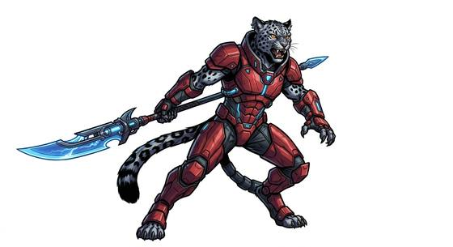

# Warrior cat-folk

{.illus}

*Set: Core*

*aka: ______________________________*

*Family: [Feline](../Species_Families/feline.md)*

Across many worlds and many ages, cat-like peoples have built warrior cultures of their own. Some are tall and powerful, others small and quick; some have claws that slide out when angry, some have tails and some have none. What they share is fighting spirit. There are proud clans who were nearly wiped out by slavers and have never forgotten it, and slaving empires of their own that once spanned the stars. There are honour-bound lion-lords, mercenaries for hire and monk-guardians who can turn fully into beasts.

There are merchant kin with twitching ears, inventors who drift between dimensions, disciplined officers in orderly fleets, matriarchal clans where males are kept out of trade, and fallen conquerors humbled by defeat. Their neighbours learn to respect their pride and never to insult their honour. A slight forgotten by anyone else is remembered by a warrior cat for generations.

## Not to be confused with

*[shifting-form cat-folk](feline-shifting-form-cat-folk.md)*, a single people born into many bodies; warrior cat-folk are many different peoples joined by a fighting culture.

## What sets this species apart

A grouping of feline warrior and trading peoples whose differences are cultural and handled in the Culture step. Bodies vary (some tailless, some clawed); those differences sit at Breed/Race level.

## Breeds and races

Each block below is one set of numbers; breeds that share every number share a block (Species rules, rule 9). Attributes are final modifiers, the size trade-off included. Skills, powers and weapon groups are final levels after the family, species and breed layers.

### No. 413 Fierce clawed warrior folk · No. 422 Territorial lion-warrior folk (medium) · No. 423 Maned clan warrior folk *(genres: space opera: beast-like aliens)*

- **Size:** medium · **Body:** biped+furred+tailed
- **What it's like:** Fierce, clawed cat-folk warriors from a people nearly destroyed by slavers, now fighting fiercely to protect their own. (looks like: cat; good at: fighting, climbing)
- **Attributes:** STR −1 AGI +2 END −1 WIS +1 COU +1
- **Skills:** [Balance](../Skills/balance.md) +2, [Stealth](../Skills/stealth.md) +2, [Acrobatics](../Skills/acrobatics.md) +1, [Climbing](../Skills/climbing.md) +1, [Hunting](../Skills/hunting.md) +1, [Jumping](../Skills/jumping.md) +1, Endurance (attribute) −1, [Formation Fighting](../Skills/formation-fighting.md) −1, [Swimming](../Skills/swimming.md) −2
- **Powers:** [Night & Spectrum Sight](../Powers/night-and-spectrum-sight.md) 2
- **Weapon groups:** [Brawling](../Weapon_Groups/brawling.md) +1
- **Natural attacks:** claws 1d6+1, bite 1d6+1
- **For the Game Master only, this race as an NPC guard or soldier (not your character's numbers):** Attack 14 · Parry 11 · Dodge 10 · Damage longsword 1d6+2; claws 1d6+2 · Armour 2 · Life 16 · Threat 1 ([Bestiary roles](../bestiary.md))
- *Fierce clawed warrior folk:* Retractable claws and fangs.
- *Territorial lion-warrior folk (medium):* Clawed warrior folk.
- *Maned clan warrior folk:* Clawed warrior folk.

### No. 414 Towering strong feline warrior folk *(genres: space opera: beast-like aliens)*

- **Size:** large · **Body:** biped+furred
- **What it's like:** Towering, powerfully built cat-folk warriors trained from birth in a proud fighting tradition. (looks like: cat; good at: strength, fighting)
- **Attributes:** STR +2 AGI −1 END +1 WIS +1
- **Skills:** [Balance](../Skills/balance.md) +2, [Stealth](../Skills/stealth.md) +2, [Acrobatics](../Skills/acrobatics.md) +1, [Climbing](../Skills/climbing.md) +1, [Hunting](../Skills/hunting.md) +1, [Jumping](../Skills/jumping.md) +1, Endurance (attribute) −1, [Formation Fighting](../Skills/formation-fighting.md) −1, [Swimming](../Skills/swimming.md) −2
- **Powers:** [Night & Spectrum Sight](../Powers/night-and-spectrum-sight.md) 2
- **Weapon groups:** [Brawling](../Weapon_Groups/brawling.md) +1
- **Natural attacks:** claws 1d6+1, bite 1d6+1
- **For the Game Master only, this race as an NPC guard or soldier (not your character's numbers):** Attack 14 · Parry 11 · Dodge 6 · Damage longsword 1d6+2; claws 1d6+4 · Armour 2 · Life 22 · Threat 2 ([Bestiary roles](../bestiary.md))
- *Why:* Same as its species; they differ in size and strength, which are attributes.

### Agile raider cat-folk *(NPC only)*

- **Size:** medium · **Body:** biped+furred+tailed
- **Attributes:** STR −1 AGI +3 END −1 WIS +1
- **Skills:** [Acrobatics](../Skills/acrobatics.md) +2, [Balance](../Skills/balance.md) +2, [Stealth](../Skills/stealth.md) +2, [Climbing](../Skills/climbing.md) +1, [Hunting](../Skills/hunting.md) +1, [Jumping](../Skills/jumping.md) +1, Endurance (attribute) −1, [Formation Fighting](../Skills/formation-fighting.md) −1, [Swimming](../Skills/swimming.md) −2
- **Powers:** [Night & Spectrum Sight](../Powers/night-and-spectrum-sight.md) 2
- **Weapon groups:** [Brawling](../Weapon_Groups/brawling.md) +1
- **Natural attacks:** claws 1d6+1, bite 1d6+1
- **For the Game Master only, this race as an NPC guard or soldier (not your character's numbers):** Attack 14 · Parry 11 · Dodge 11 · Damage longsword 1d6+2; claws 1d6+2 · Armour 2 · Life 16 · Threat 1 ([Bestiary roles](../bestiary.md))
- *Why:* Especially agile raiders.

### Feline slaver folk · Mercenary cat-folk *(NPC only)*

- **Size:** medium · **Body:** biped+furred+tailed
- **Attributes:** STR −1 AGI +2 END −1 WIS +1
- **Skills:** [Balance](../Skills/balance.md) +2, [Stealth](../Skills/stealth.md) +2, [Acrobatics](../Skills/acrobatics.md) +1, [Climbing](../Skills/climbing.md) +1, [Hunting](../Skills/hunting.md) +1, [Jumping](../Skills/jumping.md) +1, Endurance (attribute) −1, [Formation Fighting](../Skills/formation-fighting.md) −1, [Swimming](../Skills/swimming.md) −2
- **Powers:** [Night & Spectrum Sight](../Powers/night-and-spectrum-sight.md) 2
- **Weapon groups:** [Brawling](../Weapon_Groups/brawling.md) +1
- **Natural attacks:** claws 1d6+1, bite 1d6+1
- **For the Game Master only, this race as an NPC guard or soldier (not your character's numbers):** Attack 14 · Parry 11 · Dodge 10 · Damage longsword 1d6+2; claws 1d6+2 · Armour 2 · Life 16 · Threat 1 ([Bestiary roles](../bestiary.md))
- *Feline slaver folk:* Same as its species; their slaving empire is history and culture.
- *Mercenary cat-folk:* Same as its species; their mercenary life is culture.

### No. 415 Noble warrior refugee cat-folk *(genres: space opera: beast-like aliens)*

- **Size:** medium · **Body:** biped+tailed
- **What it's like:** Noble cat-folk warriors, refugees of a lost homeland, with sharp senses and a proud fighting tradition. (looks like: cat; good at: fighting, keen senses)
- **Attributes:** STR −1 AGI +2 END −1 WIS +1
- **Skills:** [Balance](../Skills/balance.md) +2, [Stealth](../Skills/stealth.md) +2, [Acrobatics](../Skills/acrobatics.md) +1, [Climbing](../Skills/climbing.md) +1, [Hunting](../Skills/hunting.md) +1, [Jumping](../Skills/jumping.md) +1, Endurance (attribute) −1, [Formation Fighting](../Skills/formation-fighting.md) −1, [Swimming](../Skills/swimming.md) −2
- **Powers:** [Enhanced Senses](../Powers/enhanced-senses.md) 2, [Night & Spectrum Sight](../Powers/night-and-spectrum-sight.md) 2
- **Weapon groups:** [Brawling](../Weapon_Groups/brawling.md) +1
- **Natural attacks:** claws 1d6+1, bite 1d6+1
- **For the Game Master only, this race as an NPC guard or soldier (not your character's numbers):** Attack 14 · Parry 11 · Dodge 10 · Damage longsword 1d6+2; claws 1d6+2 · Armour 2 · Life 16 · Threat 1 ([Bestiary roles](../bestiary.md))
- *Why:* Heightened senses.

### No. 416 Civilized feline officer folk *(genres: space opera: beast-like aliens)*

- **Size:** medium · **Body:** biped
- **What it's like:** Disciplined cat-folk officers with quick reflexes and sharp claws, serving in an orderly, professional force. (looks like: cat; good at: speed and agility, fighting)
- **Attributes:** STR −1 AGI +2 END −1 WIS +1
- **Skills:** [Balance](../Skills/balance.md) +2, [Stealth](../Skills/stealth.md) +2, [Acrobatics](../Skills/acrobatics.md) +1, [Climbing](../Skills/climbing.md) +1, [Hunting](../Skills/hunting.md) +1, [Jumping](../Skills/jumping.md) +1, Endurance (attribute) −1, [Swimming](../Skills/swimming.md) −2
- **Powers:** [Night & Spectrum Sight](../Powers/night-and-spectrum-sight.md) 2
- **Weapon groups:** [Brawling](../Weapon_Groups/brawling.md) +1
- **Natural attacks:** claws 1d6+1, bite 1d6+1
- **For the Game Master only, this race as an NPC guard or soldier (not your character's numbers):** Attack 14 · Parry 11 · Dodge 10 · Damage longsword 1d6+2; claws 1d6+2 · Armour 2 · Life 16 · Threat 1 ([Bestiary roles](../bestiary.md))
- *Why:* A disciplined service people, at ease in ranks.

### Large feline warrior-conqueror *(NPC only)*

- **Size:** large · **Body:** biped+tailed
- **Attributes:** STR +2 WIS +1 COU +1
- **Skills:** [Balance](../Skills/balance.md) +2, [Intimidation](../Skills/intimidation.md) +2, [Stealth](../Skills/stealth.md) +2, [Acrobatics](../Skills/acrobatics.md) +1, [Climbing](../Skills/climbing.md) +1, [Hunting](../Skills/hunting.md) +1, [Jumping](../Skills/jumping.md) +1, Endurance (attribute) −1, [Formation Fighting](../Skills/formation-fighting.md) −1, [Swimming](../Skills/swimming.md) −2
- **Powers:** [Night & Spectrum Sight](../Powers/night-and-spectrum-sight.md) 2
- **Weapon groups:** [Brawling](../Weapon_Groups/brawling.md) +1
- **Natural attacks:** claws 1d6+1, bite 1d6+1
- **For the Game Master only, this race as an NPC guard or soldier (not your character's numbers):** Attack 15 · Parry 12 · Dodge 7 · Damage longsword 1d6+2; claws 1d6+4 · Armour 2 · Life 21 · Threat 2 ([Bestiary roles](../bestiary.md))
- *Why:* Clawed, fanged and aggressive conquerors.

### Monk-warrior beastman cat-folk *(NPC only)*

- **Size:** medium · **Body:** biped+tailed
- **Attributes:** AGI +2 END −1 WIS +2
- **Skills:** [Balance](../Skills/balance.md) +2, [Stealth](../Skills/stealth.md) +2, [Acrobatics](../Skills/acrobatics.md) +1, [Climbing](../Skills/climbing.md) +1, [Composure](../Skills/composure.md) +1, [Hunting](../Skills/hunting.md) +1, [Jumping](../Skills/jumping.md) +1, Endurance (attribute) −1, [Formation Fighting](../Skills/formation-fighting.md) −1, [Swimming](../Skills/swimming.md) −2
- **Powers:** [Beast Aspect](../Powers/beast-aspect.md) 2, [Night & Spectrum Sight](../Powers/night-and-spectrum-sight.md) 2
- **Weapon groups:** [Brawling](../Weapon_Groups/brawling.md) +1
- **Natural attacks:** claws 1d6+1, bite 1d6+1
- **For the Game Master only, this race as an NPC guard or soldier (not your character's numbers):** Attack 14 · Parry 11 · Dodge 10 · Damage longsword 1d6+2; claws 1d6+2 · Armour 2 · Life 16 · Threat 1 ([Bestiary roles](../bestiary.md))
- *Why:* Guardian monks who can take full beast form.

### No. 417 Industrial militarist cat-folk *(genres: space opera: beast-like aliens)*

- **Size:** medium · **Body:** biped
- **What it's like:** Feline citizens of a highly industrial empire, raised in a strict military tradition and skilled with its machines. (looks like: cat; good at: fighting, making and fixing)
- **Attributes:** STR −1 AGI +2 END −1 WIS +1
- **Skills:** [Balance](../Skills/balance.md) +2, [Stealth](../Skills/stealth.md) +2, [Acrobatics](../Skills/acrobatics.md) +1, [Climbing](../Skills/climbing.md) +1, [Formation Fighting](../Skills/formation-fighting.md) +1, [Hunting](../Skills/hunting.md) +1, [Jumping](../Skills/jumping.md) +1, [Mechanics](../Skills/mechanics.md) +1, Endurance (attribute) −1, [Swimming](../Skills/swimming.md) −2
- **Powers:** [Night & Spectrum Sight](../Powers/night-and-spectrum-sight.md) 2
- **Weapon groups:** [Brawling](../Weapon_Groups/brawling.md) +1
- **Natural attacks:** claws 1d6+1, bite 1d6+1
- **For the Game Master only, this race as an NPC guard or soldier (not your character's numbers):** Attack 14 · Parry 11 · Dodge 10 · Damage longsword 1d6+2; claws 1d6+2 · Armour 2 · Life 16 · Threat 1 ([Bestiary roles](../bestiary.md))
- *Why:* A disciplined, industrial military people.

### No. 418 Tribal striped cat-folk *(genres: beast-folk: fur)*

- **Size:** medium · **Body:** biped
- **What it's like:** Striped cat-folk warriors organised into fierce, close-knit clans, agile and always ready for a fight. (looks like: cat; good at: fighting, speed and agility)
- **Attributes:** STR −1 AGI +2 END −1 WIS +1
- **Skills:** [Balance](../Skills/balance.md) +2, [Stealth](../Skills/stealth.md) +2, [Acrobatics](../Skills/acrobatics.md) +1, [Camouflage](../Skills/camouflage.md) +1, [Climbing](../Skills/climbing.md) +1, [Hunting](../Skills/hunting.md) +1, [Jumping](../Skills/jumping.md) +1, Endurance (attribute) −1, [Formation Fighting](../Skills/formation-fighting.md) −1, [Swimming](../Skills/swimming.md) −2
- **Powers:** [Night & Spectrum Sight](../Powers/night-and-spectrum-sight.md) 2
- **Weapon groups:** [Brawling](../Weapon_Groups/brawling.md) +1
- **Natural attacks:** claws 1d6+1, bite 1d6+1
- **For the Game Master only, this race as an NPC guard or soldier (not your character's numbers):** Attack 14 · Parry 11 · Dodge 10 · Damage longsword 1d6+2; claws 1d6+2 · Armour 2 · Life 16 · Threat 1 ([Bestiary roles](../bestiary.md))
- *Why:* Striped fur that hides them well.

### No. 419 Predatory sci-fi cat-folk *(genres: space opera: beast-like aliens; starter)*

- **Size:** medium · **Body:** biped
- **What it's like:** Fierce, graceful cat people from the stars who hunt and fight with honour. (looks like: cat; good at: sneaking, climbing, speed and agility)
- **Attributes:** STR −1 AGI +2 END −1 WIS +1
- **Skills:** [Balance](../Skills/balance.md) +2, [Stealth](../Skills/stealth.md) +2, [Acrobatics](../Skills/acrobatics.md) +1, [Climbing](../Skills/climbing.md) +1, [Hunting](../Skills/hunting.md) +1, [Intimidation](../Skills/intimidation.md) +1, [Jumping](../Skills/jumping.md) +1, Endurance (attribute) −1, [Formation Fighting](../Skills/formation-fighting.md) −1, [Swimming](../Skills/swimming.md) −2
- **Powers:** [Night & Spectrum Sight](../Powers/night-and-spectrum-sight.md) 2
- **Weapon groups:** [Brawling](../Weapon_Groups/brawling.md) +1
- **Natural attacks:** claws 1d6+1, bite 1d6+1
- **For the Game Master only, this race as an NPC guard or soldier (not your character's numbers):** Attack 14 · Parry 11 · Dodge 10 · Damage longsword 1d6+2; claws 1d6+2 · Armour 2 · Life 16 · Threat 1 ([Bestiary roles](../bestiary.md))
- *Why:* An aggressive predatory people.

### No. 420 Small merchant cat-folk *(genres: space opera: beast-like aliens)*

- **Size:** small · **Body:** biped
- **What it's like:** Small, curious cat-folk traders, quick on their feet and always sniffing out a good deal. (looks like: cat; good at: speed and agility, people and talk)
- **Attributes:** STR −2 AGI +2 END −1 WIS +1
- **Skills:** [Balance](../Skills/balance.md) +2, [Stealth](../Skills/stealth.md) +2, [Acrobatics](../Skills/acrobatics.md) +1, [Climbing](../Skills/climbing.md) +1, [Haggling](../Skills/haggling.md) +1, [Hunting](../Skills/hunting.md) +1, [Jumping](../Skills/jumping.md) +1, Endurance (attribute) −1, [Formation Fighting](../Skills/formation-fighting.md) −1, [Swimming](../Skills/swimming.md) −2
- **Powers:** [Night & Spectrum Sight](../Powers/night-and-spectrum-sight.md) 2
- **Weapon groups:** [Brawling](../Weapon_Groups/brawling.md) +1
- **For the Game Master only, this race as an NPC guard or soldier (not your character's numbers):** Attack 14 · Parry 11 · Dodge 11 · Damage longsword 1d6+1 · Armour 2 · Life 14 · Threat 1 ([Bestiary roles](../bestiary.md))
- *Why:* A curious, mercantile people.
- *Note:* Human-like apart from cat ears and tail: no claws or fangs.

### No. 421 Inventor nomad cat-folk *(genres: space opera: beast-like aliens, multiverse and time)*

- **Size:** small · **Body:** biped+tailed
- **What it's like:** Big-eared, long-lived cat-folk inventors who wander between worlds, endlessly tinkering with clever gadgets. (looks like: cat; good at: making and fixing, speed and agility)
- **Attributes:** STR −2 AGI +2 END −1 INT +1 WIS +1
- **Skills:** [Balance](../Skills/balance.md) +2, [Stealth](../Skills/stealth.md) +2, [Acrobatics](../Skills/acrobatics.md) +1, [Climbing](../Skills/climbing.md) +1, [Hunting](../Skills/hunting.md) +1, [Jumping](../Skills/jumping.md) +1, [Jury-Rigging](../Skills/jury-rigging.md) +1, [Mechanics](../Skills/mechanics.md) +1, Endurance (attribute) −1, [Formation Fighting](../Skills/formation-fighting.md) −1, [Swimming](../Skills/swimming.md) −2
- **Powers:** [Night & Spectrum Sight](../Powers/night-and-spectrum-sight.md) 2
- **Weapon groups:** [Brawling](../Weapon_Groups/brawling.md) +1
- **Natural attacks:** claws 1d6+1, bite 1d6+1
- **For the Game Master only, this race as an NPC guard or soldier (not your character's numbers):** Attack 14 · Parry 11 · Dodge 11 · Damage longsword 1d6+1; claws 1d6-1 · Armour 2 · Life 14 · Threat 1 ([Bestiary roles](../bestiary.md))
- *Why:* Mechanically gifted inventors.
- *Note:* Long lifespan goes on the lexicon entry.

### Militaristic occupier cat-folk *(NPC only)*

- **Size:** medium · **Body:** biped
- **Attributes:** STR −1 AGI +2 END −1 WIS +1
- **Skills:** [Balance](../Skills/balance.md) +2, [Stealth](../Skills/stealth.md) +2, [Acrobatics](../Skills/acrobatics.md) +1, [Climbing](../Skills/climbing.md) +1, [Formation Fighting](../Skills/formation-fighting.md) +1, [Hunting](../Skills/hunting.md) +1, [Jumping](../Skills/jumping.md) +1, Endurance (attribute) −1, [Swimming](../Skills/swimming.md) −2
- **Powers:** [Night & Spectrum Sight](../Powers/night-and-spectrum-sight.md) 2
- **Weapon groups:** [Brawling](../Weapon_Groups/brawling.md) +1
- **Natural attacks:** claws 1d6+1, bite 1d6+1
- **For the Game Master only, this race as an NPC guard or soldier (not your character's numbers):** Attack 14 · Parry 11 · Dodge 10 · Damage longsword 1d6+2; claws 1d6+2 · Armour 2 · Life 16 · Threat 1 ([Bestiary roles](../bestiary.md))
- *Why:* A disciplined occupying army.

### Maned lion-warrior folk (large) *(NPC only)*

- **Size:** large · **Body:** biped+tailed
- **Attributes:** STR +2 END −1 WIS +1 COU +1
- **Skills:** [Balance](../Skills/balance.md) +2, [Stealth](../Skills/stealth.md) +2, [Acrobatics](../Skills/acrobatics.md) +1, [Climbing](../Skills/climbing.md) +1, [Hunting](../Skills/hunting.md) +1, [Intimidation](../Skills/intimidation.md) +1, [Jumping](../Skills/jumping.md) +1, Endurance (attribute) −1, [Formation Fighting](../Skills/formation-fighting.md) −1, [Swimming](../Skills/swimming.md) −2
- **Powers:** [Night & Spectrum Sight](../Powers/night-and-spectrum-sight.md) 2
- **Weapon groups:** [Brawling](../Weapon_Groups/brawling.md) +1
- **Natural attacks:** claws 1d6+1, bite 1d6+1
- **For the Game Master only, this race as an NPC guard or soldier (not your character's numbers):** Attack 15 · Parry 12 · Dodge 7 · Damage longsword 1d6+2; claws 1d6+4 · Armour 2 · Life 20 · Threat 2 ([Bestiary roles](../bestiary.md))
- *Why:* Fanged, fierce warrior folk.

### Matriarchal lion-folk *(NPC only)*

- **Size:** medium · **Body:** biped+tailed
- **Attributes:** STR −1 AGI +2 END −1 WIS +1
- **Skills:** [Balance](../Skills/balance.md) +2, [Stealth](../Skills/stealth.md) +2, [Acrobatics](../Skills/acrobatics.md) +1, [Climbing](../Skills/climbing.md) +1, [Hunting](../Skills/hunting.md) +1, [Jumping](../Skills/jumping.md) +1, [Trading & Business](../Skills/trading-and-business.md) +1, Endurance (attribute) −1, [Formation Fighting](../Skills/formation-fighting.md) −1, [Swimming](../Skills/swimming.md) −2
- **Powers:** [Night & Spectrum Sight](../Powers/night-and-spectrum-sight.md) 2
- **Weapon groups:** [Brawling](../Weapon_Groups/brawling.md) +1
- **Natural attacks:** claws 1d6+1, bite 1d6+1
- **For the Game Master only, this race as an NPC guard or soldier (not your character's numbers):** Attack 14 · Parry 11 · Dodge 10 · Damage longsword 1d6+2; claws 1d6+2 · Armour 2 · Life 16 · Threat 1 ([Bestiary roles](../bestiary.md))
- *Why:* Starfaring traders.

